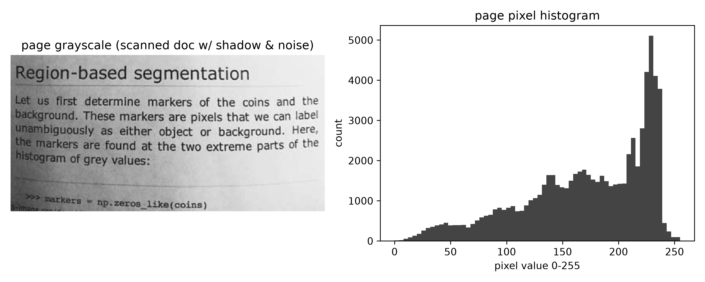
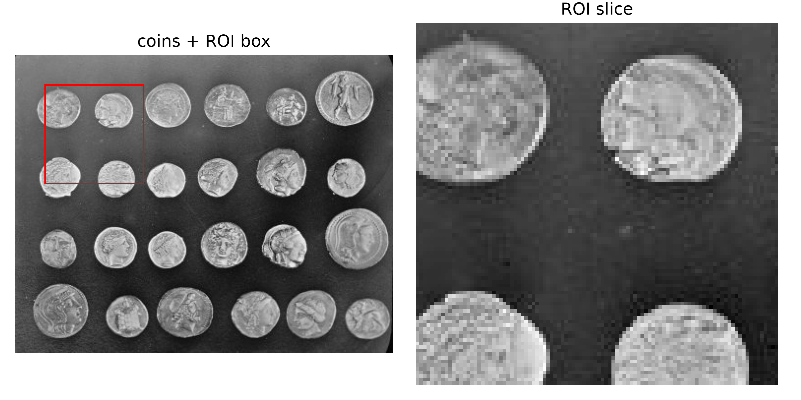
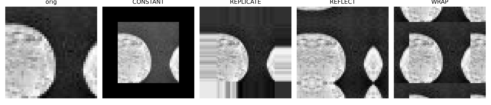
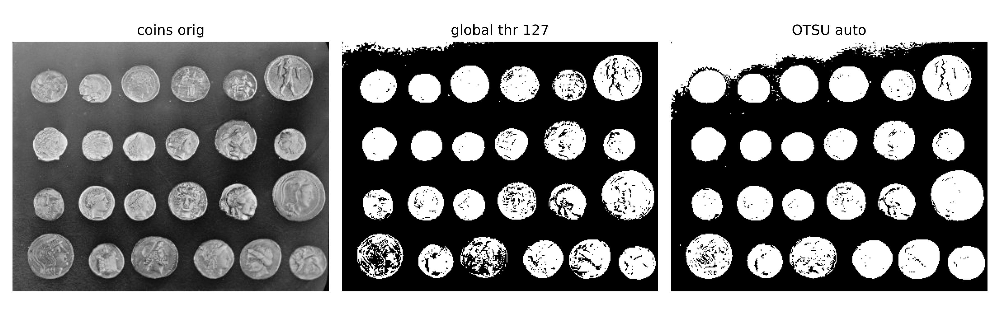
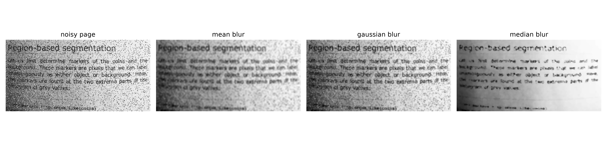
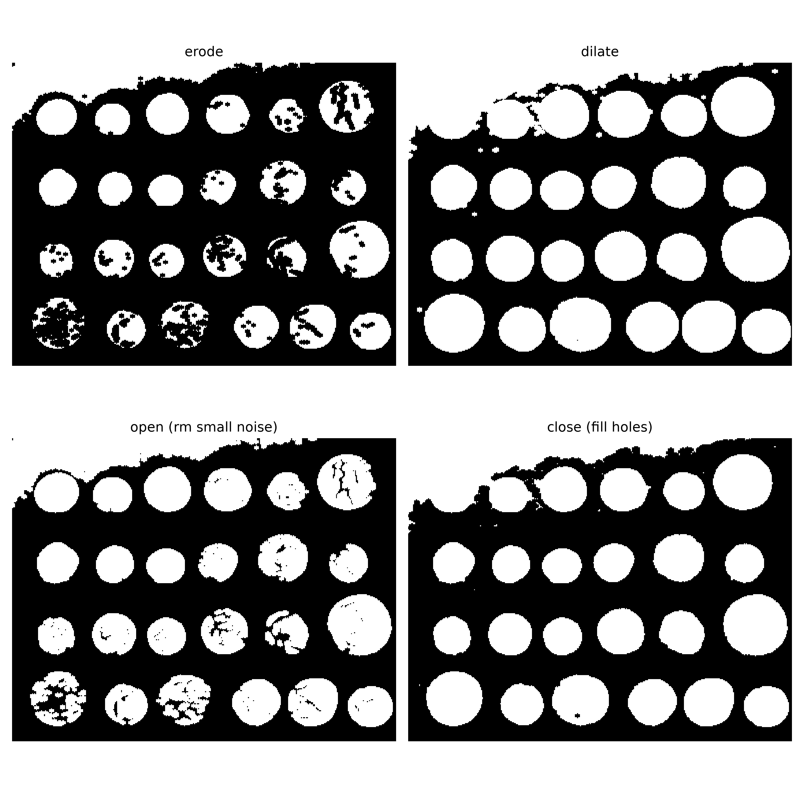
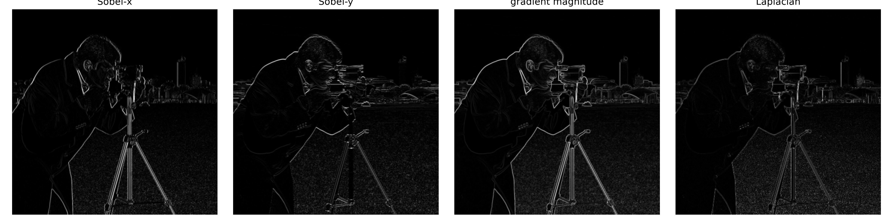

# 你拍的纸为什么总有阴影和噪点？扫描 App 的"一键清晰"，背后是 OpenCV 把图像当矩阵做了 7 件事

上个月报销，我拿着手机拍一张发票。拍完一看，纸是歪的，右上角有台灯阴影，画面里还有一层细碎的噪点。扫描 App 点了"一键清晰"之后，纸变正了、阴影淡了、字也锐了。我盯着屏幕想，它到底对这张图做了什么？

答案不神秘：它把这张图当成一个三维数组，也就是一个矩阵，然后按顺序做了若干基本操作。这些操作都很基础，但组合起来就是计算机视觉里最常见的"预处理流水线"。这篇文章是 CV 系列的第一篇，我会用一组公开数据集把这些操作一个一个拆开，让你看到每一步在矩阵上留下的痕迹。

这组图用的是 scikit-image 自带的经典公共测试图。其中 `page` 就是一张带阴影和噪点的扫描文档页，`coins` 适合演示阈值和形态学，`camera` 适合演示边缘，`astronaut` 能演示 OpenCV 最容易踩的一个坑：BGR 通道顺序。我本地跑了代码，所有数字都来自同一个脚本 `code/cv1_opencv_basics.py`，不是编造的。

本文覆盖 OpenCV 入门最核心的 7 件事：读取与预处理、ROI 切片、边界填充、数值计算、阈值与平滑、形态学、梯度。每一节都会交代数据从哪来、公式怎么算、代码怎么写，最后再把它们串回"扫描 App 一键清晰"这个具体场景。

## 1. 图像在计算机里到底是什么？一个三维数组

我们先回答最基础的问题。你眼睛看到的是一张图，计算机看到的不是。

计算机看到的是一串数字。一张彩色图可以被表示为一个三维数组，形状写成 `(H, W, C)`：高度 H、宽度 W、通道数 C。RGB 彩色图有 3 个通道，分别存红、绿、蓝的亮度。每个像素用一个无符号 8 位整数保存，取值范围是 0 到 255。灰度图只有一个通道，形状退化成二维 `(H, W)`。

我这次用的几张图，形状分别是：扫描文档页 `page` 是 `191×384` 的灰度图，`camera` 是 `512×512` 的灰度图，`coins` 是 `303×384` 的灰度图，`astronaut` 是 `512×512×3` 的彩色图。这些数字来自脚本打印出来的 `shape`。



图 1 左边是 `page` 的灰度图，右边是它的像素直方图。横轴是像素值 0 到 255，纵轴是每个值出现的次数。这张图的整体亮度偏高，均值 `171.54`，标准差 `56.81`，像素值覆盖了 0 到 255 的全范围。阴影区域对应直方图左边的暗部，文字和纸张背景对应右边偏亮的部分。

直方图本身也是数值计算的结果。它的纵坐标等于落在某个区间内的像素个数，横坐标是区间端点。OpenCV 里可以用 `cv2.calcHist` 算，也可以直接用 numpy 的 `np.histogram`。两种算法得到的结果本质上一样，都是先给 0 到 255 分桶，再统计每个桶里的像素数量。

这就是一切图像处理的起点：先承认"图就是数组"。后面所有操作，阈值、平滑、形态学、梯度，本质上都是对数组做加减乘除、切片、卷积。

既然图是数组，那我能不能直接把数组打印出来看？可以，但肉眼看一堆数字没有意义，得画出来。OpenCV 读进来的是 BGR 排列的 numpy 数组，用 matplotlib 显示时要记得转回 RGB，否则颜色发蓝；显示灰度图还要指定 `cmap='gray'`，不然 matplotlib 会用默认的彩色映射，把亮度错当成颜色，反而看不清。另一个容易忽略的点是格式：JPG 在磁盘上是有损压缩，PNG 是无损压缩，两者文件大小差很多，可一旦读进内存，它们都变成同一个 uint8 数组，后面的处理完全不在乎它原来是哪种格式。还有一个细节是 alpha 通道，也就是透明度，它有时会作为第四个通道出现，但绝大多数扫描文档和照片只有 RGB 三个通道，OpenCV 默认把它们装进三通道数组，所以你做形状判断时不用先担心透明度。

记住形状和通道这件事不是凑数。后面每一步操作能不能做、做成什么样，都取决于它。`page` 是灰度图，所以能直接算直方图、做阈值；`astronaut` 是彩色图，做这些之前必须先转灰度，否则 `cv2.threshold` 会直接报错。先把形状说清楚，是为了让你在后面每一步都能对得上号。

### 1.1 为什么像素值被压到 0 到 255？

0 到 255 来自 8 位无符号整数的取值范围。`2^8 = 256`，所以一个像素只能取 256 个离散值。uint8 的好处是省空间：一张 1920×1080 的彩图，如果每个像素 3 字节，总共约 6 MB；如果用 32 位浮点数存，就要 24 MB。

uint8 的代价是精度有限。两个 uint8 图像直接相加会溢出，例如 200 + 100 的结果在 uint8 里不是 300，而是 300 对 256 取模得到的 44。所以做图像加法时，OpenCV 和 numpy 都建议先转成 float32 或 int16 运算，再裁剪回 0 到 255。

```python
import numpy as np
A = np.array([[100, 150], [200, 50]], dtype=np.uint8)
B = np.array([[120, 120], [100, 200]], dtype=np.uint8)
C = np.clip(A.astype(np.int16) + B.astype(np.int16), 0, 255).astype(np.uint8)
```

举个具体例子。`A` 左上角两个值是 100 和 150，`B` 对应位置是 120 和 120。100 加 120 得 220，没超范围，保持 220；但 150 加 120 得 270，超过 255，裁剪后变成 255，而不是 270。如果你偷懒不转 int16，直接让两个 uint8 相加，150 加 120 会先溢出成 (150+120) 对 256 取模得到的 14，结果完全错乱。这就是为什么几乎所有图像处理教程都反复强调：做加减乘除之前先提升数据类型。扫描 App 里做亮度、对比度、曝光补偿时，底层就是这一套流程。

这行代码看起来简单，但它已经演示了"图像处理就是矩阵运算"：加法是逐元素相加，裁剪是逐元素限制范围。扫描 App 里常用的"亮度提升""对比度拉伸"，底层都是这种操作。

### 1.2 视频也不过是逐帧的图像流

OpenCV 对视频的读取也是同样的思路。`cv2.VideoCapture(path)` 打开一个视频文件或摄像头，然后循环调用 `.read()`，每次读出一帧，每一帧都是一个 `(H, W, C)` 的数组。

```python
import cv2
cap = cv2.VideoCapture("demo.mp4")
frame_count = 0
while True:
    ok, frame = cap.read()
    if not ok:
        break
    frame_count += 1
    # frame 就是一个 numpy 数组 (H, W, 3)
    gray = cv2.cvtColor(frame, cv2.COLOR_BGR2GRAY)
    # 对每一帧做你想要的预处理...
cap.release()
print("总帧数:", frame_count)
```

处理视频和处理单张图片没有本质区别，只是多了一层"按时间顺序读取"的循环。扫描 App 里的"连拍取最清晰的一帧"、行车记录仪的"运动检测"，都是在这个循环里加判断。

视频还有一个绕不开的现实问题：帧率。30fps 意味着每秒 30 张图，一分钟就是 1800 帧。如果逐帧都做复杂的卷积，计算量会迅速膨胀。所以工程上处理视频时，常会先抽帧，每隔几帧取一张，或者只在画面有变化时才处理。这也解释了为什么实时视频处理对算力格外敏感：同一个算法跑单张图很快，跑三十张每秒就未必吃得消。你在手机上用到的实时滤镜、实时美颜，背后都在和这个每秒三十次的时间预算较劲。

### 1.3 第一个坑：OpenCV 默认读的是 BGR，不是 RGB

这是新手最容易翻的船。多数图像库，比如 matplotlib、PIL，读取彩色图时默认按 RGB 排列通道；OpenCV 从诞生起就用 BGR。同一张图，如果用 OpenCV 存再用 OpenCV 读，没问题；但如果你用 matplotlib 生成一张 RGB 图，存成 PNG，再用 `cv2.imread` 读回来，红和蓝就颠倒了。

我做了个验证：把 `astronaut` 按 RGB 存盘，再用 `cv2.imread` 读回，比较第一个通道的总和，确实不相等，`bgr_channel_swapped` 这个字段是 `true`。解法很简单，OpenCV 提供了 `cv2.cvtColor(img, cv2.COLOR_BGR2RGB)` 来转换。牢记这一点，后面看颜色才不会自我怀疑。

BGR 这个设计有历史原因。早期摄像头和显示设备的通道顺序常用 BGR，OpenCV 为了兼容就沿用了下来。今天虽然 RGB 更主流，但 OpenCV 的默认行为改不了了，只能每次读彩图时多留个心眼。

### 1.4 ROI：矩阵切片就是"抠图"

ROI（Region of Interest）在 OpenCV 里不是什么高深概念，就是 numpy 切片。你想从 `coins` 里抠出一枚硬币，直接写 `coins[30:130, 30:130]` 就行，得到的数组形状是 `100×100`。

```python
coin = coins[30:130, 30:130]
print(coin.shape)  # (100, 100)
```



图 2 左边是原图加一个红框，右边是切出来的区域。没有黑魔法，就是矩阵切片。这个操作在后面会经常用到，比如从一个扫描文档里切出需要处理的局部，或者从一张大图里抠出一个小目标。

切片时还要注意 numpy 的索引顺序：第一个维度是行（y），第二个维度是列（x）。所以 `img[y1:y2, x1:x2]`，而不是 `img[x1:x2, y1:y2]`。写反了是常见 bug。

ROI 的价值在于只算该算的部分。一张 4000×3000 的手机照片，如果你只关心右下角签字的位置，把全部像素都拿去跑卷积纯属浪费。先切出 ROI 再处理，计算量能小好几个数量级。还有一个容易被忽略的性质：numpy 的切片返回的是原数组的视图，不是拷贝，改 ROI 会连带改动原图。如果不想动到原图，记得先 `.copy()` 一份再操作。这个小坑我在处理发票时真踩过，切出来的区块调了亮度，结果整张原图也跟着变了。

## 2. 边界填充：图像边缘外的像素从哪来？

很多操作需要在图像边缘也能正常计算，比如卷积核扫到边界时，中心贴着边，核的一半会悬空。这时必须假设边界外有像素，这就叫边界填充（padding）。OpenCV 里用 `cv2.copyMakeBorder` 实现。

```python
p = cv2.copyMakeBorder(img, top=10, bottom=10, left=10, right=10,
                       borderType=cv2.BORDER_REPLICATE)
```

常见的填充策略有四种：

- `BORDER_CONSTANT`：用固定值（通常是 0）填充，看起来像加了一圈黑边。适合需要明确"外部不存在"的场景。
- `BORDER_REPLICATE`：复制最边缘的像素，向外平铺。适合保持边缘的连续性，是图像滤波时最常用的默认选择。
- `BORDER_REFLECT`：以边缘为对称轴镜像反射。它和 REPLICATE 的区别是反射后的图案有对称感。
- `BORDER_WRAP`：把图像首尾相接，从另一边取像素。适合纹理周期性很强的图像，但普通照片用得少。

为什么边界填充这么重要？回到卷积。卷积核是一个小矩阵，在图像上滑动，每个位置把核和它覆盖的像素做加权求和。当核的中心滑到图像最左边那一列时，核的左半部分已经伸到了图像外，没有像素可以相乘。如果不补像素，这部分只能算 0，或者用残缺的邻域凑合，结果在边缘就会留下一圈黑边或锯齿。边界填充就是给这个悬空的邻域一个合理的默认值。OpenCV 的 `cv2.copyMakeBorder` 专门做这件事，numpy 也有 `np.pad`，两者在数学上等价，区别只是接口风格。工程里如果后面直接接卷积，很多人会先给图补一圈边再送进去。说到底，你并不知道图像外的世界长什么样，只能编一个假设，而不同的编法对应不同的 `borderType`，编得好不好，直接决定边缘那一圈的质量。论文里常提到的"边缘 artifact"，根源往往就在这里。



图 3 最左边是原图小块，后面四张分别是四种填充结果。可以看到 CONSTANT 是黑边，REPLICATE 是把边缘像素往外复制，REFLECT 是镜像，WRAP 则是把对面像素卷过来。

这里要插一句：M3 讲卷积神经网络时也出现过 padding，名字一样，目的却不同。卷积里的 padding 是为了控制输出尺寸；这里的边界填充是为了让边缘处的滤波、梯度计算也能拿到完整的邻域。后面 CV4 讲深度学习视觉时，CNN 会被当成黑盒用，不会再重复推导卷积，但这里的邻域概念是它的根基。

## 3. 阈值：把"字"和"背景"一刀切开

扫描 App 要处理阴影和噪点，第一步往往是把图像变成纯黑白的二值图：字是白，背景是黑，或者反过来。这叫阈值化。二值化的好处是一目了然，后续只要处理 0 和 255 两种值，逻辑简单、速度快。代价是丢掉了灰度信息，所以阈值选得好不好，直接决定你丢了什么、留了什么。

最简单的规则是：给定一个阈值 T，像素值大于 T 就设成 255，小于等于 T 就设成 0。

```
g(x, y) = 255,  if f(x, y) > T
g(x, y) = 0,    otherwise
```

问题在于 T 怎么选。很多人会拍脑袋选 127，因为 0 到 255 的中间值看起来"公平"。但在真实图片里，阴影会让背景变暗，固定 127 可能把背景当成字，也可能漏掉暗部的字。

我拿了 `coins` 这张图做实验。如果用全局阈值 127，前景占比只有 29.62%（原始数值 0.2962）；而用 OTSU 自动阈值，T 被算出来是 107，前景占比变成了 38.78%（原始数值 0.3878）。107 比 127 低，说明这些硬币里有不少像素的亮度其实没那么高，用 127 会漏掉一部分硬币区域。



图 4 最左边是原图，中间是全局阈值 127 的结果，右边是 OTSU 自动阈值的结果。可以明显看到，127 漏掉了一些亮度偏低的硬币，而 OTSU 把它们保留了更多。这就是阈值选得对不对的直接后果。

### 3.1 OTSU 到底怎么算？

OTSU 的做法并不复杂。它遍历 0 到 255 每一个候选阈值，把像素分成两类（前景/背景），然后计算两类之间的类间方差。最终选让类间方差最大的那个阈值。

具体步骤可以写成：

1. 算直方图 `hist[k]`，也就是每个像素值 k 出现的次数。
2. 对每一个候选阈值 t，把 0 到 t 的像素当成背景，t+1 到 255 的像素当成前景。
3. 计算背景类的像素总数 `N_0`、均值 `μ_0`；前景类的像素总数 `N_1`、均值 `μ_1`。
4. 计算类间方差：

```
σ_b²(t) = ω_0(t) · ω_1(t) · [μ_0(t) − μ_1(t)]²
```

其中 `ω_0 = N_0 / (N_0 + N_1)`，`ω_1 = N_1 / (N_0 + N_1)`，也就是两类像素占总像素的比例。OTSU 选择使 `σ_b²` 最大的 `t`。

有人会问，既然要让两类分开，直接把均值差 `|μ_0 − μ_1|` 最大化不就行了，为什么前面还要乘 `ω_0·ω_1`？原因是均值差没有考虑两类各自占多少像素。设想一种极端情况，某一类只剩一个像素，它的均值会被这个孤点带跑，均值差看起来很大，可这一类根本不能代表任何真实区域。乘上 `ω_0·ω_1` 之后，只有两类都占相当比例、又都分得开时，乘积才会大。这是一种平衡，既要分得开，又不能让某一类太小。这也解释了为什么 OTSU 在双峰直方图上表现最好：双峰意味着两类像素数量都不算少，各自又足够集中。

为什么选类间方差最大？因为类间方差大，说明两类像素的均值差距大、分得很开，不容易把背景错当成前景。这个准则没有用到任何外部参数，只看图像自己的直方图，所以叫"自动阈值"。

为了让这个"最大值"不是空中楼阁，我们用一张极简的图走一遍。假设某张小图只有 4 个像素，值分别是 50、120、180、200。如果选 T=100，那么 50 落在背景类，120、180、200 落在前景类，背景均值 50，前景均值约 166.7，两类差得很开，算出来的类间方差大。如果换成 T=190，只有 200 进前景，前景均值 200，背景均值约 116.7，两类反而挤在一起，类间方差小。OTSU 做的就是拿 0 到 255 每一个候选 T 都试一遍，挑出让两类拉得最开的那个。回到 `coins`，全图像素被分成两类，一类是偏暗的硬币，一类是偏亮的桌面，最优的 T 落在 107，恰好是这两类亮度的分水岭。

我在 `page` 上也跑了 OTSU，算出的阈值是 157。`page` 整体偏亮，文字比背景暗，157 这个值正好把文字区域从纸张背景里切出来。这就是阈值操作在扫描 App 里的作用：先不要让算法去识别字，先把"可能是字的区域"和"背景"分开。

### 3.2 全局阈值不够用时怎么办？

全局阈值假设整幅图只有一个最佳分割点，但扫描文档里经常有这种情况：左上角亮、右下角暗，用一个 T 无法同时兼顾。这时可以用自适应阈值（adaptive threshold），它把图分成若干小窗口，每个窗口算自己的阈值。OpenCV 提供 `cv2.adaptiveThreshold`。这个方法在扫描 App 里也很常见，但我们这篇文章先把全局和 OTSU 吃透，自适应阈值留到 CV2 再展开。

自适应阈值的核心思路是因地制宜。它把图切成很多小块，每块根据自己的局部直方图单独算一个 T，所以亮的地方和暗的地方各有各的门槛，不会再出现左上角切干净了、右下角却糊成一团的情况。OpenCV 提供两种算法，均值法用窗口内像素的平均亮度减一个常数当阈值，高斯法用窗口内的高斯加权和当阈值，后者在光照不均匀时更稳。这个方法在拍摄光照不均的文档时几乎是标配，但它也带来一个新麻烦：块与块的交界处可能出现不连续的接缝，切出来的二值图看起来像打了补丁。所以工程上常常先用它粗分，再用形态学把接缝修合。这些细节我会在 CV2 里专门展开。

## 4. 平滑去噪：椒盐噪点该怎么擦干净？

threshold 能分前景背景，但它对付不了噪点。噪点会让二值图里到处都是小白点或小黑点。扫描 App 在 threshold 之前通常要先做"平滑"，也就是用一个局部窗口把像素值平均一下。

噪声并不是一种东西。图像里最常见的两类，一类叫高斯噪声，像素值在真实值附近小幅随机波动，像照片在暗光下那种均匀的颗粒感；另一类叫椒盐噪声，个别像素直接跳到 0 或 255，像扫描件上的墨点和白斑。两者性质完全不同，对付它们的方法也不同：高斯噪声适合用均值或高斯模糊把波动平均掉，椒盐噪声则适合中值这类看排序、不理极值的方法。先搞清楚你面对的是哪种噪声，比盲目调参数重要得多。下面我都用椒盐噪声演示，因为它最直观，去噪前后的差别一眼就能看出来。

为了演示，我在 `page` 上人为加了 6% 的盐和 6% 的胡椒：每个像素有 6% 的概率被改成 255，6% 的概率被改成 0。加噪后图像的标准差从原来的 56.81 上升到了 70.52。

```python
import numpy as np
rng = np.random.default_rng(42)
salt = rng.random(page.shape) < 0.06
pep  = rng.random(page.shape) < 0.06
page_n = page.astype(np.int16)
page_n[salt] = 255
page_n[pep] = 0
page_n = np.clip(page_n, 0, 255).astype(np.uint8)
```

这里有个小插曲。我最开始把椒盐比例设成了 50%，心想噪点越多效果越明显。结果中值滤波的标准差和加噪后几乎一样，数字直接告诉我这个 demo 失败了。原因是噪声太密，中值滤波也救不回来。我把噪声降到 6% 后，图和数字才对上。这也说明一个道理：实验数字会替你打假，遮不住。

### 4.1 均值模糊

均值模糊用一个 `k×k` 的窗口把里面所有像素求平均，替代中心像素。

```
g(i, j) = (1 / k²) · Σ f(i+m, j+n)
```

5×5 均值模糊后，噪声标准差从 70.52 降到了 43.74。但它有个副作用：会把文字边缘也一起抹平。均值模糊假设窗口内所有像素"都差不多"，遇到边缘这种突变区域就会糊掉。

均值模糊的核长这样：

```
        [1  1  1  1  1]
        [1  1  1  1  1]
K_mean = (1/25) [1  1  1  1  1]
        [1  1  1  1  1]
        [1  1  1  1  1]
```

每个位置权重一样，所以它对所有方向一视同仁，不会偏爱水平或垂直。

均值模糊为什么会把字抹糊？看一维就明白。假设一行像素是 `[10, 10, 200, 10, 10]`，中间那个 200 是一个笔画点。用 1×3 的均值窗扫过去，三个权重各是 1/3，中间点会变成 (10+200+10)/3 ≈ 73，原本尖锐的 200 被两边拉低了。笔画的尖被削平，这就是糊。窗口越大，削得越狠。但反过来，如果 200 是一个孤立的椒盐噪点，这种削平反而是好事，噪点被邻居的平均值淹没。所以均值模糊是一把双刃剑：压均匀噪声有效，保边缘能力差。

### 4.2 高斯模糊

高斯模糊和均值模糊类似，但窗口里的权重按高斯分布来，中心像素权重高，边缘像素权重低。二维高斯核的公式是：

```
G(x, y) = (1 / 2πσ²) · exp(−(x² + y²) / 2σ²)
```

在实际实现里，这个连续公式会被离散化成 5×5 或 7×7 的核。高斯模糊后的标准差是 45.92，介于均值和中值之间。它对高斯噪声效果好，但对椒盐噪点的尖峰不是特别稳，因为极值虽然被加权，但仍然会拉偏加权平均。

### 4.3 中值模糊

中值模糊把窗口里的像素排序，取中位数作为中心像素。这个操作对椒盐噪点特别有效，因为极端值（0 或 255）不会影响中位数，而中位数又能代表窗口里大多数像素的真实亮度。

中值滤波后的标准差是 47.9。单纯看标准差，它比均值模糊高，好像"去噪效果差"；但看图像就知道，它的文字边缘是三者里最锐的。原因是标准差下降太多，往往意味着图像被抹平了。中值滤波后的标准差 47.9 离干净原图的 56.81 更近（差距 8.91），说明它保留了更多原始对比度，只剔除了孤立的噪点。

中值为什么能保边？还是用 `[10, 10, 200, 10, 10]` 这个例子。取三个数的中位数，排序后是 `[10, 10, 200]`，中位是 10，所以中间点变成 10。笔画的 200 被当成异常值直接干掉，周围的 10 保持不变，边缘就保住了。换成椒盐噪点，比如 `[10, 10, 255, 10, 10]`，排序后中位依然是 10，那个 255 被无视。中值不像均值那样把所有邻居平等地拉平均，而是少数服从多数，所以它能把孤立的极值剔掉，却不动连续的边缘。这也解释了为什么本实验里中值滤波后的标准差 47.9 比均值的 43.74 高：它没有把整张图抹平，只是把噪点位置纠正回主流亮度。



图 5 从左到右依次是加噪图、均值模糊、高斯模糊、中值模糊。均值和高斯虽然看起来"干净"，但文字边缘发虚；中值在去掉椒盐点的同时，文字的笔画依然清晰。这个对比很能说明问题：评价去噪不能只盯着一个指标，要看它保住了什么。

扫描 App 在"一键清晰"时，对椒盐噪点这类拍摄瑕疵，往往会优先选用中值类或双边滤波类的方法，而不是简单的均值模糊，原因就在这里。

## 5. 形态学：修二值图的两把刷子

经过阈值和平滑，我们得到了二值图。但二值图往往不完美：前景里可能有小白洞，背景里可能有小黑点。形态学就是专门修二值图的。它源自数学形态学，本质是用一个结构元素在图上滑动，根据局部像素的极值来改造图像。听起来抽象，落到工程里其实就是四个动词：腐蚀、膨胀、开运算、闭运算。下面我把这四个动词一个一个演示，你会看到它们把一张满是毛刺的二值图收拾得服服帖帖。

形态学有两个基本操作：腐蚀和膨胀。

- 腐蚀：用一个结构元素在图上滑动，取窗口内的最小值。结果会让白色区域收缩，小黑点消失。
- 膨胀：取窗口内的最大值。结果会让白色区域扩张，小白洞被填上。

这里说的"结构元素"就是一个形状模板，常见的是矩形、椭圆、十字。它决定了腐蚀和膨胀的"笔刷形状"。OpenCV 里用 `cv2.getStructuringElement` 创建。

```python
kernel = cv2.getStructuringElement(cv2.MORPH_ELLIPSE, (5, 5))
eroded = cv2.erode(bin_img, kernel, iterations=1)
dilated = cv2.dilate(bin_img, kernel, iterations=1)
```

由这两个操作可以组合出更有用的操作：

- 开运算：先腐蚀，再膨胀。用于去掉前景周围的小噪点。
- 闭运算：先膨胀，再腐蚀。用于填上前景内部的小洞。

### 5.1 用连通域数看效果

我用 `coins` 的 OTSU 二值图做了实验。原始二值图里数出了 154 个连通区域。这不可能是 24 枚硬币的真实数量，说明阈值后的图里有很多背景噪点被错误地连成了小点。做一次开运算后，连通区域数降到了 38；做一次闭运算后，降到了 58。



这个数字变化很直观：154 到 38，开运算把大量细小的噪声块干掉了。闭运算降到 58，说明它合并和填充了一些孔洞，但不会像开运算那样激进地去掉小结构。扫描 App 里如果要把文字块连在一起、去掉孤立的噪点，通常就是形态学的功劳。

连通域本身也是数值计算。 scipy 里用 `ndimage.label` 实现：从左上角开始扫描二值图，遇到白色像素就给它一个标签，如果它挨着已经标记过的像素，就继承同一个标签。最后数一数有几种不同的标签，就知道有几个独立的前景块。

这里要补一个细节：什么叫"挨着"。两种常见规则，4 连通只算上下左右四个方向相邻，8 连通把对角线也算相邻。规则不同，数出来的连通域数量会不一样。比如两个硬币斜着贴边，4 连通会数成两个，8 连通会数成一个。OpenCV 的 `cv2.connectedComponents` 默认用 8 连通。我这里数出的 154、38、58 都是基于同一条规则，所以它们之间的对比才有意义。如果你自己复现时发现数字对不上，先检查连通规则是不是和我一致。

### 5.2 什么时候用开，什么时候用闭？

这是实际调参时最常遇到的问题。基本规则是：

- 如果前景里有很多小黑点（孔洞），用闭运算。
- 如果前景外面有很多小白点（孤立噪点），用开运算。
- 如果两者都有，可以先开后闭，或者先闭后开，但顺序不同结果也不同，需要试。

扫描文档里，纸张纤维、墨点不均匀经常会产生小洞，闭运算比较常用；如果拍摄环境光很脏，背景有很多小白点，开运算更常用。

我用 `coins` 做过直接对比：原始 OTSU 二值图里数出 154 个连通区域，开运算之后只剩 38 个，说明大量细碎的背景噪点被"先腐蚀再膨胀"这一套清掉了；闭运算之后是 58 个，比原始少、但比开运算多，因为它主要是把每个硬币内部的小孔填上、把挨得近的两块连起来，而不是清掉孤立小块。同一张图、同一个结构元素，仅因为运算顺序不同，连通域数量就从 154 分别落到了 38 和 58。这也是为什么调形态学时，第一步永远是先搞清楚，你要解决的是多余的小块，还是块里的洞。

形态学的思想和神经网络里的池化也有点像：腐蚀像 max-pooling 的反面，膨胀像上采样，但这里我们不需要训练，核是固定的。

## 6. 梯度：让边缘站出来说话

threshold 能分块，形态学能修块，但要想让字"挺"起来，还要靠梯度。梯度的物理意义很简单：相邻像素差值大的地方，就是边缘。

在数学上，图像可以看成离散函数 `f(x, y)`，梯度就是它对 x 和 y 的偏导。连续世界里：

```
∂f/∂x ≈ f(x+1, y) − f(x, y)
∂f/∂y ≈ f(x, y+1) − f(x, y)
```

OpenCV 里最常用的梯度算子是 Sobel。它分别计算水平方向和垂直方向的近似偏导，使用两个 3×3 的核：

```
        [−1  0  1]               [−1 −2 −1]
Sobel-x [−2  0  2]    Sobel-y  [ 0  0  0]
        [−1  0  1]               [ 1  2  1]
```

这两个核可以看成在 3×3 窗口内做加权差分。Sobel-x 的右列减左列，衡量水平方向变化；Sobel-y 的下列减上列，衡量垂直方向变化。中间行/列的权重是 2，边缘是 1，这样中心像素的邻居对结果影响更大。

梯度为什么能找边缘？还是一维最直观。一行像素 `[10, 10, 200, 200, 200]`，从左到右做相邻差分，得到 `[0, 190, 0, 0]`。那个 190 出现的位置，正是亮度从暗跳到亮的地方，也就是边缘。差分越大，跳变越猛，边缘越强。Sobel 不过是把这个一维差分推广到二维，再用 3×3 核给中心邻居更大权重，让结果更平滑稳定。算完 `g_x` 和 `g_y` 之后，除了幅值 `G`，还可以算方向 `θ = arctan(g_y / g_x)`。幅值回答"这里是不是一条边"，方向回答"这条边朝哪走"。扫描 App 勾边时，正是靠这两个量，把横竖撇捺的轮廓一笔一笔描出来。

对图像分别做 x 方向和 y 方向的卷积，得到 `g_x` 和 `g_y`，再算梯度幅值：

```
G = sqrt(g_x² + g_y²)
```

我在 `camera` 图上跑了 Sobel。梯度幅值的最大值是 930.11。如果以最大值的 15% 为阈值，有 8.37%（原始数值 0.0837）的像素被判定为强边缘。这就是图 7 中间那幅"白色轮廓"的来源。



Laplacian 是二阶导数，对边缘的响应更强，但对噪声也更敏感。图 7 最右边那幅 Laplacian 结果可以看到更细的双边轮廓，其梯度的极端峰值达到 1110.0，比 Sobel 的 930.11 更尖锐。Sobel 和 Laplacian 都是传统图像处理里做边缘检测的常用工具，也是后面卷积神经网络的先声：CNN 里的卷积核本质上就是可以学习的 Sobel、Laplacian 或其他局部滤波器的集合。

讲到这里你大概能感觉到，边缘检测其实是这一整篇的暗线。阈值把块分出来，形态学把块修干净，梯度把块的轮廓勾出来。三者合起来，一张杂乱的扫描图就被拆成了"哪里是字、字的边界在哪"。这恰恰是 OCR、文档矫正、表格识别这些上层应用的共同起点。CV 系列后面会顺着这条暗线，从边缘走到轮廓，再走到识别。

### 6.1 从 Sobel 到 Canny

实际扫描 App 里，单靠 Sobel 得到的边缘会比较粗，还需要非极大值抑制（NMS）把边缘变细，再用双阈值去掉假边缘。这套完整流程就是 Canny 边缘检测。OpenCV 里一行代码 `cv2.Canny` 就能跑，但它背后的每一步，Sobel、NMS、双阈值，都是我们这节讲的概念。理解了 Sobel，再学 Canny 就容易多了。

顺便把 NMS 和双阈值讲透一点。非极大值抑制做的事情是，沿梯度方向只保留幅值最大的那个点。梯度方向告诉我们边缘朝哪走，沿着这个方向比较相邻两个像素的幅值，如果当前点不是最大的，就把它压成 0。这样一条粗边就被削成一条细线。双阈值则设一个高阈值和一个低阈值，幅值高于高阈值的点确定为强边缘，低于低阈值的直接丢弃，介于两者之间的点，只有当它和强边缘相连时才保留。这套流程把边缘检测从"哪里的梯度大"升级成了"哪些点连成一条真正的边"。你会发现，传统视觉里每一步都在做同一个判断：局部范围内谁更像特征，就留下谁。

## 7. 把这 7 件事串回扫描 App

现在可以回答开头的问题了：扫描 App 的"一键清晰"背后，通常不是某一个神奇算法，而是一连串基本操作的组合。

1. 读取图像：`cv2.imread` 把 PNG/JPG 变成数组，同时注意 BGR 顺序。
2. 转灰度：`cv2.cvtColor(img, cv2.COLOR_BGR2GRAY)` 丢掉颜色，减少计算量。
3. ROI 切图：如果用户只想处理某个区域，先 `img[y1:y2, x1:x2]` 切出来。
4. 平滑去噪：`cv2.medianBlur` 或 `cv2.GaussianBlur` 去掉拍摄时产生的噪点。
5. 阈值分割：`cv2.threshold` 或 OTSU 把文字和背景分开。
6. 形态学修图：开运算去噪点，闭运算填字内小洞。
7. 梯度勾边：Sobel 或 Laplacian 让边缘变清晰，字看起来更"挺"。

至于"纸歪了怎么变正"，那是透视变换（perspective transform）的内容，不在 OpenCV 基本操作的范畴里，我会放到 CV2 或 CV3 再讲。这篇文章先解决"清楚"的问题，"方正"的问题留作一个引子。

这个流水线里如果跳过某一步会怎样？跳过平滑直接阈值，噪点会变成二值图里的白点；跳过形态学，文字可能缺笔画或带噪点；跳过了梯度，边缘不够清晰，放大后显得肉。扫描 App 的"一键"其实就是按一个固定顺序跑完这些步骤，再根据图像类型微调参数。

我拿自己的发票复现时，跳过平滑那一步，二值图里立刻冒出一片白点；把闭运算去掉，几个数字和字母中间的横杠就断了，OCR 直接认错。这些不是理论，是实打实的后果。所以"一键清晰"看着是一键，背后是一串有先后、有取舍的流水线。理解了这一步步，你下次看到某个 App 处理得不好，就知道该怪哪一步，而不是笼统地骂算法笨。

这个顺序和直觉不太一样。很多人以为应该先锐化，让字先清楚，再处理别的。但锐化会同时把噪点放大，先去噪再锐化，结果要干净得多。工程上的顺序不是随便排的，每一步都在替下一步创造条件：转灰度是为了降维，去噪是为了让阈值不误判，阈值是为了给形态学一份干净的输入，形态学是为了让梯度只勾到真正的轮廓。环环相扣，动一环就会牵动后面每一环。这也是为什么同样是"一键清晰"，做得好的 App 和做得差的 App，差别往往就在这些顺序和参数上。

### 7.1 顺序容易踩的三个坑

动手写代码前，我把新手最容易翻车的三个顺序问题先说清楚，免得你复现时踩坑。第一，先转灰度还是先去噪？通常先转灰度再处理，因为彩色图三个通道各自带噪点，单通道处理更快也更稳。第二，阈值和形态学的先后，一定先阈值拿到二值图，再做形态学，腐蚀膨胀只对二值图或灰度图有意义，拿原始彩色图直接腐蚀会得到一团糊。第三，平滑放在哪一步？它要在阈值之前，先把噪点压住，阈值才不会产生满屏白点；但平滑又不能太狠，太狠会把细笔画一起抹掉，得不偿失。这三个顺序任意错一个，出来的图和数字都会和你预期不符。

## 8. 这和卷积神经网络有什么关系？

讲到这里，你可能会问：这些手工设计的操作，在神经网络时代还有什么用？

答案是：它们是所有视觉任务的底层积木。

阈值、形态学、Sobel 都是"人设计规则"的预处理方法；卷积神经网络则让网络自己从数据里学习这些规则。但网络学到的卷积核，和 Sobel、Laplacian 干的其实是同一件事：看局部邻域，提取某种模式。有些研究者可视化过浅层 CNN 的卷积核，会发现它们确实长得像边缘检测器、纹理检测器。

所以你可以这么理解：Sobel 是一个人手工写好的"边缘滤波核"，CNN 第一层卷积核是一组被数据训练出来的"边缘滤波核"。OpenCV 里的这些基本操作，让你看清楚卷积核在做什么；M3 讲卷积神经网络时，我们已经从"自动学习"的角度看过这个问题。两篇合起来，才算把视觉的前世今生串起来。

你可能会问，既然 CNN 能自动学，为什么还要花力气学这些手工操作。一个很现实的理由是可解释、可控。手工操作每一步你都看得见输入和输出，参数 T、核大小、结构元素的形状都由你定，出了问题能定位。神经网络是黑盒，调参往往靠经验。当你知道 Sobel 在做什么，你就能理解为什么浅层卷积核对边缘敏感；当你知道中值能保边，你在去噪前就会先想一想，我的噪声到底是椒盐还是高斯。这些底层直觉，是区分"会调包"和"真懂视觉"的分水岭。CV 系列后面会讲 CNN，但我会反复回扣这一篇，因为这一篇是地基。

这也是为什么我在 CV 系列里坚持先讲 OpenCV 基础再讲 CNN。如果直接跳到神经网络，你只会调参；如果先看过 Sobel、中值滤波、形态学，你会知道网络底层在学什么，调参时也有方向感。

## 9. 三个值得记住的点

1. 图像不是"画"，是三维数组。每个操作都是数组运算，理解了这一点，后面的 threshold、卷积、池化都不会再让你觉得神秘。

2. 阈值和形态学是二值图的两把刷子。阈值负责"分"，把前景和背景切开；形态学负责"修"，去掉不该有的、补上该有的。开运算去小噪点，闭运算填小洞。

3. Sobel 梯度就是相邻像素之差。它是所有边缘检测和 CNN 卷积的共同祖先。你今天手写的 Sobel 核，和神经网络里第一层卷积核，骨子里是同一个东西。

## 10. 互动钩子

你手机里最常用的扫描或 PDF App 是哪个？你觉得它"一键清晰"时，最该先处理的是阴影、歪掉的纸，还是噪点？评论区告诉我，点赞最高的那个场景，我把它写进 CV2 的开篇做对比。

代码和数据都已跑通，文中的数字都能在 `stats.json` 里找到对应。完整代码与仓库地址：

- 代码目录：https://github.com/beverlyLee/ai-guanxingji/tree/main/CV1_opencv_basics
- 实验脚本：https://github.com/beverlyLee/ai-guanxingji/blob/main/CV1_opencv_basics/code/cv1_opencv_basics.py
- 实验数据（stats.json）：https://github.com/beverlyLee/ai-guanxingji/blob/main/CV1_opencv_basics/stats.json

数据来源说明：本文用的是 scikit-image 自带的公共测试图（`skimage.data` 里的 `page` 扫描文档、`coins` 硬币、`camera` 相机、`astronaut` 宇航员），不需要下载任何外部数据集，也不涉及政治或敏感内容，装好库直接就能跑。如果你在自己的机器上复现，只需要 `pip install opencv-python-headless scikit-image numpy matplotlib scipy`，然后跑一遍脚本即可，7 张图和 `stats.json` 会重新生成。
