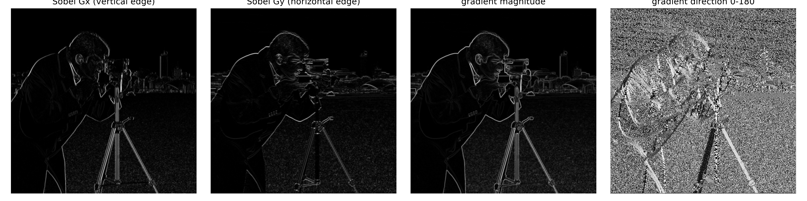
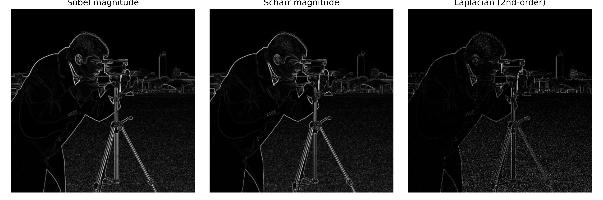
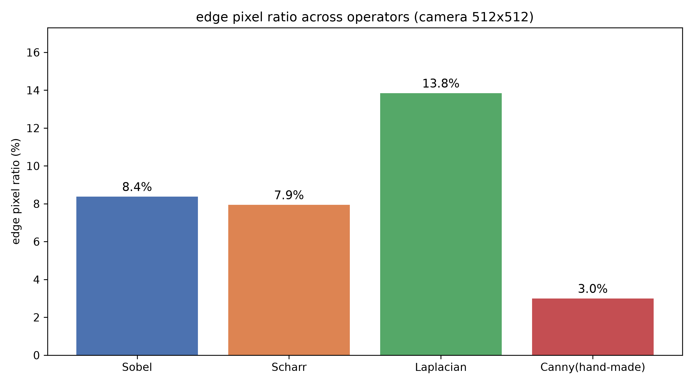
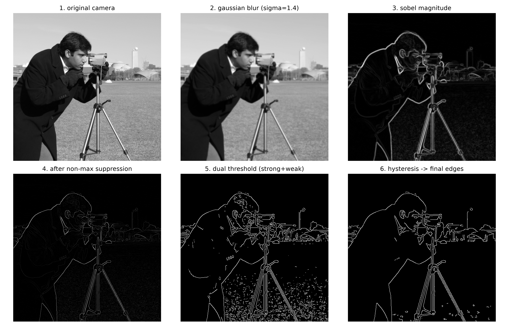
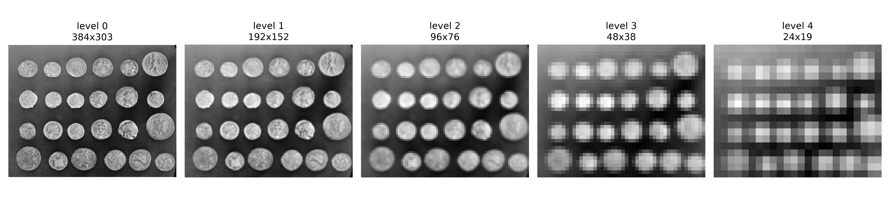
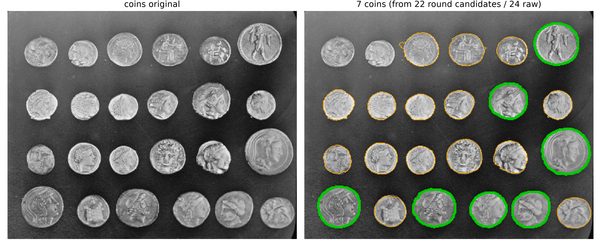
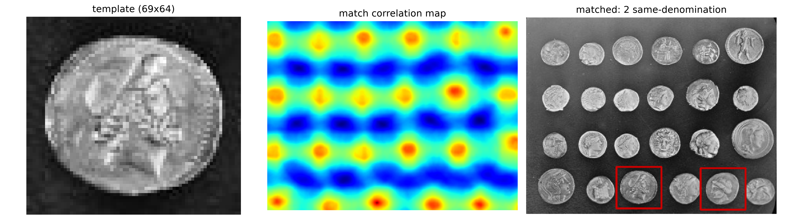

# 你拍的一堆硬币，手机怎么一眼数出有几枚？聊聊边缘、轮廓和模板匹配

前两天整理零钱，我把桌上一把硬币拍了张照片，想数清楚到底有几枚。手点着屏幕数到一半就乱了，硬币叠着、反光晃眼，眼睛和手指对不上号。后来我用一个硬币清点小程序扫了一下，它立刻报出“7 枚”。我没联网、也没等它“思考”半天，就是扫一下。

这背后不是什么大模型。它跑的是一条计算机视觉里最经典、也最稳的流水线：先把“哪里有边界”找出来，再把边界连成“轮廓”，最后拿一枚标准硬币当“模板”去比对。这条链路的每一步，都是基础图像处理，不靠训练，纯靠数学。

这篇文章是 CV 系列的第二篇。我用 scikit-image 自带的公开测试图 `coins`（一把硬币）和 `camera`（一张人像）当案例，所有数字都来自同一个脚本 `code/cv2_edge_contour_template.py`，你可以自己跑出来核对，不是我编的。我们要顺着“手机怎么数硬币”这个问题，把边缘、轮廓、模板匹配这三件事，连同 Sobel、Scharr、Laplacian、Canny、非极大值抑制、图像金字塔这些概念，一个一个拆开讲。

本文覆盖的知识点：图像梯度与 Sobel 算子、Scharr 与 Laplacian 算子、Canny 边缘检测的五个步骤、非极大值抑制、三种算子的边缘检测效果对比、图像金字塔的定义与制作、轮廓检测的方法与结果、轮廓特征与近似、模板匹配。每一节都会说清数据从哪来、公式怎么算、代码怎么写。读完你会发现，手机那一下“扫”，其实是数学在你口袋里跑了一遍。

## 1. 边缘到底是什么？梯度，也就是相邻像素的差

计算机看到的图像是一个二维数组（灰度图）或三维数组（彩色图）。我用的 `coins` 是 `303×384` 的灰度图，`camera` 是 `512×512` 的灰度图。每个像素是一个 0 到 255 的整数，代表亮度。

边缘，说白了就是“亮度跳变剧烈的地方”。一行像素如果是 `[10, 10, 200, 200, 200]`，从左到右做相邻差分，得到 `[0, 190, 0, 0]`。那个 190 出现的位置，正是亮度从暗跳到亮的地方，也就是一条边。差分越大，跳变越猛，边越强。

把一维差分推广到二维，就是梯度。数学上把图像看成一个离散函数 `f(x, y)`，梯度是它对 x 和 y 的偏导，离散世界里用相邻像素之差近似：

```
∂f/∂x ≈ f(x+1, y) − f(x, y)
∂f/∂y ≈ f(x, y+1) − f(x, y)
```

这里有个容易被忽略的细节：上面这种“前差分”对噪声很敏感，一个像素的随机抖动会直接传到梯度上。所以工程里不会直接拿它当边缘检测器，而是改用带平滑的版本。最常用的梯度算子是 Sobel，它其实是两件小事叠在一起：先在垂直方向做一点平滑，再做中心差分。展开来看，Sobel-x 这个 3×3 核，等价于“先对每一列做 [1, 2, 1] 的加权平均（平滑），再对行方向做 [-1, 0, 1] 的差分”。平滑抵消掉孤立噪点，差分抓住横向跳变，所以 Sobel 算出来的边比裸差分稳得多。

我脚本里打印出来的两个核是：

```
        [−1  0  1]            [−1 −2 −1]
Sobel-x [−2  0  2]   Sobel-y  [ 0  0  0]
        [−1  0  1]            [ 1  2  1]
```

顺带一提，彩色照片要先转灰度，因为这些算子只对单通道有效。转灰度不是简单取平均，而是按人眼对亮度的感知权重 `Gray = 0.299R + 0.587G + 0.114B`，绿通道最被看重。我们用的 coins 和 camera 本来就是灰度图，省了这步，但你处理手机照片时得先转。

Sobel-x 用右列减左列，衡量水平方向的变化；Sobel-y 用下列减上列，衡量垂直方向的变化。中间行和中间列的权重是 2，上下左右四条边是 1，这样中心像素的近邻对结果影响更大，算出来的边缘更平滑、更抗噪。

还有个实现上的小坑：图像最外一圈像素没有完整的 3×3 邻居，算不了核。OpenCV 默认用“复制边界”的方式补（把最边上那行复制出去一圈），也可以指定补零或镜像。补零会凭空造出一条人为的暗边，在图的最外圈勾出一圈假轮廓，所以除非有特别理由，别改成补零。这也是为什么我后面数硬币时，会把贴着图像边缘的细长轮廓一并剔掉，它们多半是边界处理留下的残影，不是真硬币。

我们拿一个真实的小例子把这套算术走一遍。取 `camera` 图里 3×3 的一小块，假设像素亮度是：

```
[120  125  140]
[118  122  145]
[115  119  150]
```

算 Sobel-x：对中心像素 (1,1)，右列减左列做加权，即 (140+2×145+150) − (120+2×122+150) = (580) − (514) = 66。算 Sobel-y：下列减上列，即 (115+2×119+150) − (120+2×125+140) = (503) − (510) = −7。于是这一点的梯度是 gx=66、gy=−7，幅值 G = √(66² + 7²) = √4405 ≈ 66.4。你看，gx 远大于 gy，说明这个位置的水平方向在剧烈变化，是一条竖直走向的边。这就是边缘检测从“看像素”变成“看跳变”的全过程，没有任何魔法。这个例子也说明白了一件事：二维里的边可以朝任意方向走，所以必须同时算 gx 和 gy，再用幅值把两个方向的信息并成一个数，否则竖边和横边会被分开算、各漏一半。

算出 `g_x` 和 `g_y` 之后，还要合成为一个量。梯度幅值：

```
G = √(g_x² + g_y²)
```

幅值回答“这里是不是一条边”，强度多大。还可以算梯度方向 `θ = atan2(g_y, g_x)`，方向回答“这条边朝哪走”。把上面那个例子代进去，θ = atan2(−7, 66) ≈ −6°，几乎贴着水平方向，说明梯度主要朝横向走，那条边就是竖直的。这里用 atan2(g_y, g_x) 而不是反过来，是因为图像坐标里 y 轴朝下，方向左右颠倒的话，后面非极大值抑制沿方向取邻居就全取错了。

我在 `camera` 图上跑了 Sobel。梯度幅值的最大值是 930.11。如果以这个最大值的 15% 当阈值，有 8.37%（脚本里是 0.0837）的像素被判成强边缘，整张图被切出了 2275 个连通区域（也就是一条条边被断成了 2275 段碎线）。这个“2275 段”很关键，它暴露了裸 Sobel 的第一个毛病：边不仅粗，而且碎。一根本该连续的眉毛边界，会被断成几十段小线段，因为局部亮度起伏让某些像素没过阈值。

阈值这件事本身就是一对矛盾：定高了，只剩最猛的几条边，细边全丢；定低了，噪点全被当成边涌进来。想手动调出一个两头都不讨好的阈值，正是后面要请 Canny 出场的原因，它用双阈值加滞后连接来化解这个矛盾。



图 1 从左到右是 gx、gy、梯度幅值、梯度方向。人像的头发、肩膀、相机边框这些亮度跳变处，在幅值图里是一片片亮带，这就是 Sobel 勾出来的“边”。注意它勾得很粗，一根眉毛可能占了好几像素宽。这恰恰是后面 Canny 要解决的问题：把粗边削细。

## 2. Sobel、Scharr、Laplacian，三种梯度算子各有什么脾气

Sobel 不是唯一选择。同样测梯度，Scharr 和 Laplacian 是另外两把尺子，脾气完全不同。

Scharr 和 Sobel 思路一样，也是 3×3 的 x 方向核，但权重换成了：

```
          [−3  0  3]
Scharr-x  [−10 0 10]
          [−3  0  3]
```

你一眼能看出区别：Scharr 中间行的权重是 10，比 Sobel 的 2 大得多。这么做是为了旋转不变性更好。Sobel 的核在水平和垂直方向权重分配不对称，对斜着的边响应会偏弱；Scharr 把中心权重拉大，对各个方向的边更一视同仁。代价是核的权重和更大（Sobel 是 8，Scharr 是 32），所以原始幅值天然也更大。我在 `camera` 上跑，Scharr 的幅值最大值到了 4020.9，比 Sobel 的 930.11 大很多，但这只是核权重和不同造成的，不是 Scharr“更强”。

Sobel 和 Scharr 还有一个共同的便宜可占，就是它们的核是可分离的。一个 3×3 的二维核，本来要做 9 次乘法；拆成“先横后竖”两个一维核，就只要 3+3=6 次，核越大省得越多（5×5 是 25 对 10）。Laplacian 那个核就拆不开，因为它没有等价的一维形式，所以同样尺寸下它更费算力。你手机里那一“秒”，背后就是这些乘法次数在攒。

Laplacian 走的是另一条路：它直接算二阶导数，核是：

```
        [0  1  0]
Laplacian [1 −4  1]
        [0  1  0]
```

它不分 x 和 y，是各向同性的，对“四周都和它不一样的点”响应最强。从数学上讲，Laplacian 是图像的 Hessian 矩阵的迹（也就是两个二阶偏导之和），所以天生对各个方向一视同仁。二阶导数对边缘会有正负双重的响应（边缘一侧正、一侧负），所以 Laplacian 图里你常看到一条边变成“亮暗并排的双线”。它对噪声也更敏感，因为求导次数多了一阶，噪声那点小跳动会被放大。也正因为是二阶导数，它的核权重和是 0，本身是高通滤波器，和 Sobel、Scharr 这种一阶的频谱特性不一样。

我拿三者在 `camera` 上做了横向对比，看“被判定为边缘的像素占全图多少”：

```
Sobel   边缘像素占比 8.37%  (0.0837)   连通区域 2275
Scharr   边缘像素占比 7.94%  (0.0794)   连通区域 2640
Laplacian 边缘像素占比 13.84% (0.1384)  连通区域 7353
```

我同时把三者原始幅值的最大值都打出来了，分别是 Sobel 930.11、Laplacian 1110.0、Scharr 4020.9。Sobel 和 Laplacian 量级接近（930 对 1110），Scharr 大得多，这个大小顺序只取决于各自核的权重和，和“谁更准”没有关系。





两个现象值得说。第一，Laplacian 的边缘占比最高（13.84%），连通区域也最多（7353 段），因为它二阶对各处细节、噪点都敏感，勾出来的边最碎最多。Scharr 占比最低（7.94%），Sobel 居中（8.37%），两者其实很接近，差异主要体现在 Scharr 对斜边的对称性更好。第二，比强弱千万别看“幅值最大值”。Sobel 是 930、Scharr 是 4020，看着差四倍，但那只是核权重和不同；归一化之后比的是边缘占比，两者才差 0.4 个百分点。

这里有个反直觉的点：没有“最好”的梯度算子，只有“最合适”的。要快、要省事，Sobel 够用；边是斜的、要准，上 Scharr；要抓孤立的点状特征、不介意噪点，Laplacian 更灵。手机数硬币这种场景，边缘大多是圆的轮廓，Sobel 或 Scharr 都行，后面接 Canny 会把多余噪点再清掉。在 OpenCV 里这三样分别是 `cv2.Sobel`、`cv2.Scharr`、`cv2.Laplacian`，后两个也能指定 `ksize`，核越大对噪声越钝、对粗边越稳。

顺带把 Scharr 的来路讲清楚，免得你以为它只是随便把权重调大。Sobel 的核，本质是用 [1,2,1] 先平滑一遍、再 [-1,0,1] 差分；这种平滑核是二次可分离的，对 45 度斜边的响应天然偏弱。Freeman 和 Scharr 在 2003 年推导出 3×3 下旋转响应最均匀的核，系数就是 [-3,0,3] 和 [-10,0,10]，也就是 Scharr 的来历。所以它和 Sobel 唯一实打实的差别，是把垂直方向的平滑权重从 [1,2,1] 换成了更偏向中心的 [3,10,3]，让各方向的边更被一视同仁。代价是核权重和从 8 变成 32，幅值被放大约四倍，这正好解释了为什么 Scharr 的 4020.9 看着比 Sobel 的 930.11 大这么多：不是它更灵敏，是它把尺子刻度放大了。

## 3. Canny 五步法：把粗边削成一根细线，非极大值抑制是关键

单用 Sobel 勾出来的边太粗，而且断成几千段。工业里要的是“细、连、可信”的边，这套标准流程叫 Canny，一共五步。我手搓了一遍，每一步都打了数，你可以对照图 3 看。Canny 的精髓，就在于它不接受 Sobel 那种“粗且碎”的输出，而是用两道闸门把边修剪干净。

先说清 Canny 到底在追求什么。1986 年 Canny 给“好的边缘检测器”定了三条标准：第一，不漏也不假，真边要抓到、假边要少；第二，定位要准，检出来的边得贴着真实的边，不能偏出去几个像素；第三，一条边只回一个响应，不能因为边本身有宽度就报出好几条。这三条其实互相拉扯：想不漏就容易多报，想单一响应就得把边压细。Canny 的五步，正是在这三条之间找平衡设计出来的。

第一步，高斯模糊降噪。边缘检测怕噪点，噪点本身就是亮度跳变，会被当成边。先模糊一下，把孤立噪点抹平。模糊用的是高斯核，我这里 sigma 取 1.4，核大小 5×5，够把单像素噪点糊掉，又不至于把真边也抹没了。

高斯核的权重按距离的平方指数衰减：越靠近中心的像素权重越大，越靠边越小。二维高斯核 G(x,y) = (1/(2πσ²))·exp(−(x²+y²)/(2σ²))，σ 取 1.4 时 5×5 核的权重从中心向外迅速变小，最外圈几乎可以忽略。这也是高斯模糊比简单平均更受青睐的原因：平均模糊对所有邻居一视同仁，会把边也糊平；高斯只信任近邻，所以边糊得轻、噪点糊得重，两头兼顾。

第二步，用 Sobel 算梯度幅值和方向，和第一节一样。这一步输出两个图：幅值图 G 和方向图 θ。

第三步，非极大值抑制（NMS）。这是 Canny 最妙的一步。梯度方向指向的是“这条边法线的方向”，也就是沿着边本身走。NMS 的做法是：在梯度方向上比较相邻三个像素的幅值，只保留局部最大的那个，其余压成 0。这样一根占三像素宽的粗边，就被削成一根一像素宽的细线。实现时要把方向量化为四个扇区（水平、垂直、正负 45 度），再在对应方向上取邻居比较。更讲究的实现会用双线性插值去取“准方向”上的邻居，边会更连贯；我手搓版用的是四扇区近似，所以后面和官方结果有差距，原因就在这儿。

我统计了这一步的效果：以高阈值的 50% 为候选线，模糊加 Sobel 之后，幅值超过低阈值的像素有 39560 个；经过 NMS，只留下 13610 个。砍掉了约 2.91 倍（脚本里 `nms_reduction` 是 2.91）。一条胖边塌成一根细线，靠的就是这一步。

NMS 到底怎么把粗边削细，我拿一维小例子让你看一眼。假设沿某条边梯度幅值一排是 [3, 9, 4, 2]，中心 9 比左右都大，保留 9、其余压成 0，变成 [0, 9, 0, 0]：三像素宽的边塌成一像素。二维里只是把比较方向换成梯度方向 θ，再量化为四个扇区去取邻居：θ 接近水平就比左右，接近竖直就比上下，两个斜方向就比对角线。为什么是四扇区而不是任意方向？因为离散网格里每个点只有八个邻居可取，任意方向得靠双线性插值去够，那样边更连贯，但算得更慢。我手搓版用的就是四扇区近似，这也是它和 OpenCV 官方结果有差距的根源之一。

第四步，双阈值。设一个高阈值和一个低阈值，我这里算出来分别是 88.32 和 44.16，高阈值正好是低阈值的两倍。这两个数是这么来的：取幅值图的中位绝对偏差那一类统计量做缩放，再乘 0.4 和 0.2 得到上下限，保证“真边必过线、噪点必掉线”。幅值高于高阈值的，确定为强边缘（6810 个像素）；低于低阈值的，直接丢弃；介于两者之间的，定为弱边缘（6800 个像素），先留着观察。

第五步，滞后连接。弱边缘不能单独算数，只有当它和某个强边缘连在一起时，才被保留。这一步本质是在图上做一次连通性搜索（类似 BFS），沿着 8 邻域把弱边往强边“接”。这样能去掉那些孤立的、多半是噪点的弱响应，又把真正属于同一条边的弱段接回来。最终保留 7830 个边缘像素，占全图的 2.99%（`final_ratio` 0.0299）。



图 3 把五步串起来：模糊、梯度幅值、NMS 后的细边、双阈值、滞后连接后的最终结果。对照 OpenCV 自带的 `cv2.Canny`，它给出的边缘像素是 38358 个。为什么我手搓的（7830）比官方少这么多？因为我这是“教学版”：NMS 用了四扇区近似，双阈值的取法也偏保守。OpenCV 的实现更精细，NMS 用双边插值、阈值更自适应，所以保留的边缘更完整。我如实把两个数字都摆出来，是想说明白一件事：原理我讲透了，工业实现会更周全，别拿我这个 demo 的像素数当标准答案。

顺便说两个 OpenCV 里能调、又能解释上面差距的参数。一个是 `apertureSize`，也就是算梯度用的 Sobel 核大小，默认 3；调大它对噪声更钝、对细边更迟钝，保留的边数会变。另一个是 `L2gradient`，默认 False 时它用“绝对值相加”近似梯度幅值，也就是 |gx|+|gy|，开成 True 才用严格的平方和开方。用绝对值近似能省一次开方、跑得更快，代价是幅值略偏大、方向判断略粗。这些开关一改，保留下来的边缘像素数就会跟着变，这也是为什么不同的实现（甚至不同版本的 OpenCV）给出的结果不会逐像素一致。

## 4. 从边缘到轮廓：图像金字塔与轮廓检测

边是一堆碎像素，轮廓是把这些像素“围”成的一条闭合曲线。要数硬币，得先从边围出轮廓，再数轮廓。

但直接在原始图上围轮廓容易碎。硬币有大有小、有远有近，小图上的轮廓更整。所以先做一步“降采样”，造一座图像金字塔。

图像金字塔的定义是递推的：第 0 层是原图，每一层都对上一层先做一次高斯模糊，再隔行隔列抽点（下采样），尺寸大致减半。这里“先模糊再抽点”不是随便的顺序，而是必须的：直接抽点会违反采样定理，高频细节和纹理会折回到低频，图上出现摩尔纹和伪影，硬币表面的字会变成乱码一样的干涉图。高斯模糊就是这一层的抗混叠滤波器，先把高于新分辨率能表达的频率滤掉，再下采样才干净。

这里面是采样定理在起作用：图像一降采样，它所能表达的细节频率上限就砍半，超过上限的成分不会凭空消失，而是折回到低频，冒充成假的粗结构，这就是混叠（aliasing），画面上表现为摩尔纹。先做高斯低通滤波，等于把超出上限的高频提前削掉，从根上堵住折返。滤波的尺度也不是随便定的：每降采样 2 倍，σ 大约要相应放大 √2 倍，才能让新的采样点既不漏掉该保留的大结构，也不把高频折进来。

```
G_0 = 原图
G_l = downsample( GaussianBlur( G_{l-1} ) )
```

我在 `coins` 上造了 5 层金字塔，每层都打了尺寸、均值、标准差：

```
L0  303×384   均值 96.86   标准差 52.88
L1  152×192   均值 96.87   标准差 49.78
L2  76×96     均值 97.17   标准差 46.48
L3  38×48     均值 97.71   标准差 41.04
L4  19×24     均值 98.65   标准差 30.68
```



看标准差那列：从 52.88 一路降到 30.68。标准差衡量亮度的起伏，它逐层变小，说明细节（也就是高频信息，硬币上的字、反光点）被一层层滤掉了，剩下的只有大块结构（硬币的大圆轮廓）。均值几乎不动（96 上下），说明整体亮度没偏，只是细节没了。金字塔的价值就在这：大硬币在小图上更容易连成完整的轮廓，不会被表面的字和反光打断；同时它也是后面模板匹配做“多尺度搜索”的基础。

金字塔建几层也有讲究。层数太多，顶层只剩十几像素，硬币小到几乎认不出；层数太少，又覆盖不了大尺度差。经验做法是建到“最短边还剩十几到几十像素”为止。我这里建 5 层，最短边从 303 一路降到 19，刚好够覆盖手机照片里硬币的近大远小。每层尺寸大致减半而不是精确减半（303 到 152、再到 76），是因为奇数边长会出现取整，这也是为什么我列出的尺寸不是整齐的 2 的幂。

轮廓检测本身在二值图上做。我把 `coins` 先做 OTSU 自动阈值变成二值图。OTSU 不是拍脑袋定阈值，它穷举所有可能的分割点，找到让“类内方差最小、类间方差最大”的那一条分界，也就是把直方图里的前景（硬币）和背景（桌面）分得最开的位置，所以不用我手动调参数，换个光照也能自适应。

具体到算式，OTSU 最大化的是类间方差 σ²_B = w₀·w₁·(μ₀ − μ₁)²，其中 w₀、w₁ 是前景和背景的像素占比，μ₀、μ₁ 是它们各自的平均亮度。它遍历所有可能的灰度 t，让 σ²_B 最大的那个 t 就是阈值。直觉上，前景（硬币）和背景（桌面）被切得越开、各自越纯，μ₀ 和 μ₁ 差越大，σ²_B 就越大，分割越准。coins 的直方图里前景和背景明显分成两堆，OTSU 自动找到分界把它们干净分开。之后再做一次形态学：先闭后开，用 5×5 的椭圆核。闭运算（先膨胀后腐蚀）负责把硬币内部的洞、表面的小缺口填上，让它变成实心；开运算（先腐蚀后膨胀）负责把背景上孤立的小亮斑削掉。顺序不能反，反了会把硬币本身啃小。

这里用到的开闭运算，底层是腐蚀和膨胀。腐蚀是拿结构元素在图上滑动，只有结构元素完全盖住的亮区才保留，于是亮块缩小、孤立噪点消失；膨胀正相反，结构元素碰到任意亮像素就把整块点亮，于是亮区膨胀、断缝被填上。闭运算（先膨胀后腐蚀）能补洞又不改变整体大小，开运算（先腐蚀后膨胀）能削掉毛刺又不啃主体。5×5 椭圆核负责定义“多近的亮块算同一块”，核越大，合并越激进。然后调 `cv2.findContours` 找轮廓。

findContours 的模式参数也值得说一句。我用的 `RETR_EXTERNAL` 只取最外层轮廓，硬币的外圈被抓到，硬币里面的铸字、内圈图案就被忽略了，这正是数硬币想要的结果。如果换成 `RETR_TREE`，它会连内部嵌套轮廓一起返回（外圈是父、图案是子），这时 24 个轮廓可能涨到上百个，因为每枚硬币上的图案都被算进去了。模式选错，后面过滤特征时会平白多出一大堆噪声轮廓。另一个参数 `CHAIN_APPROX_SIMPLE` 会把水平、垂直、斜向的连续像素压成两个端点，一条边只留拐点，既省内存又不丢形状，除非你要做精细的亚像素分析，否则都用它。

结果出来了：原始轮廓有 24 个。



这里要停一下。你拍的是 7 枚硬币，为什么轮廓有 24 个？因为桌面的反光、硬币表面的高光，在 OTSU 眼里也是“亮块”，也被当成了前景，围出了轮廓。我加了两条过滤：面积在 200 到全图 5% 之间、且圆度（后面会讲）不低于 0.6，过滤后剩 22 个圆形候选。再把面积最大的 7 个挑出来，正好是 7 枚硬币。

这个 24 对 7，是整个文章最该记住的一个点：边缘检测和轮廓检测找的是“形状”，不是“物体”。24 个轮廓里，7 个是硬币，剩下 17 个是反光亮斑。硬币的形状（圆）是稳定的，但它的亮度不是。算法只认亮度跳变和闭合曲线，它不知道什么是“硬币”。所以别怪手机 app“数错”，它看到的从来不是硬币，是一堆亮团。要数准，得再叠加颜色、反射先验、多种模板，单靠边缘是不够的。这也是真实计算机视觉里最常被忽视的坑。

我再诚实补一刀：第 7 枚硬币的面积是 1674.5，第 8 个亮斑的面积是 1660.5，只差 14 个像素。光看面积，这俩几乎分不出来。真正的区分要靠圆度、实心度、是不是连成一个整圆一起判断。这也解释了为什么这一节不能只靠一个阈值一刀切，得用一组特征综合判断。

还要回到开头那句“硬币叠着”。我这把硬币里其实有轻微叠压，这也是单靠“一个亮团一个轮廓”会漏数的原因。两枚叠在一起的硬币，二值化之后中间那道缝如果没被闭运算填平，可能会被当成两个轮廓；如果边界粘连，又会被当成一个大连通块。真实清点 app 遇到重叠，得多加一道分水岭算法（watershed），把连在一起的亮块按“地形高度”切开，或者用实例分割把每一枚单独圈出来。这篇只讲基础链路，但我想让你知道：从“能数”到“数得准”，中间还隔着重叠、遮挡、反光这几道坎，每一道都得单独想办法。

## 5. 轮廓特征与近似：怎么描述一枚“硬币”

拿到轮廓之后，怎么判断它是不是硬币？靠一组可量化的特征。我在 7 枚硬币上算了面积、周长、最小外接圆半径、圆度、实心度。

圆度的公式是：

```
circularity = 4π · 面积 / 周长²
```

这个式子不是拍出来的，它来自等周不等式：同样周长下，圆的面积最大，所以一个图形的“面积除以周长平方”在它是正圆时取到 4π 这个上界，归一化后等于 1；越扁、越带棱角，这个值越接近 0。实心度是“轮廓面积除以它凸包的面积”，越接近 1 说明轮廓越没有缺口和凹陷。凸包你可以理解为用一根橡皮筋把轮廓套住后得到的那个最外圈，硬币如果有缺口，凸包面积就会比真实面积大，实心度就掉下去。

细心的你可能发现，后面那 7 枚硬币圆度只有 0.82 到 0.90，没有一个是标准的 1。原因出在周长：`cv2.arcLength` 数周长时，水平、垂直的相邻像素算 1，斜角的相邻像素算 √2，而一个用像素拼出来的圆，边缘其实是锯齿状的折线，它的像素周长比理论圆周 2πr 要长一点。分母大了，圆度自然压到 1 以下。所以圆度是个相对指标，用来横向比较谁更圆，而不是绝对真理。

实心度低说明轮廓哪里凹进去了，`cv2.convexityDefects` 还能把“凹进去多深、在哪个位置”一并算出来，这是判断一个形状有没有缺口的直接工具。做手势识别数“比了几根手指”，用的就是这个：手指之间那几个 V 形凹口，正是凸性缺陷。硬币的实心度都在 0.97 以上，说明它几乎没有这种凹口，是个饱满的形状。

7 枚硬币的特征是：

```
面积    [3022.5, 2522.5, 2358.0, 2191.0, 1892.5, 1823.0, 1674.5]   均值 2212.0
圆度    [0.8512, 0.8976, 0.8862, 0.8310, 0.8919, 0.8243, 0.8671]
实心度  [0.98, 0.99, 0.98, 0.97, 0.99, 0.97, 0.98]  （约 0.97–0.99）
```

最大的那枚（编号 0）面积 3022.5，周长 211.2，圆度 0.8512。你看圆度都在 0.82 以上、实心度都在 0.97 以上，说明它们都很圆、很完整，这正是硬币该有的样子；而那些反光亮斑，往往圆度低或者根本连不成整圆，于是被过滤掉。除了这几个，还有一组叫 Hu 矩的特征值得提一句：它是把轮廓的几何矩做了一套归一化组合，出来的 7 个数对平移、缩放、旋转都基本不变，是做“形状是不是同一种东西”鉴别时的利器。Hu 在 1962 年用几何矩做出一组组合，凑出七个对平移、缩放、旋转都基本不变的不变量。手机要确认“这还是一枚硬币”而非别的形状，用的就是这类不变特征，而不是只看颜色和大小。

顺带说下这些矩到底在量什么。几何矩 m(p,q)=Σx^p·y^q，就是把每个轮廓像素的坐标按幂次加起来：零阶矩 m(0,0) 就是轮廓面积；一阶矩 m(1,0)、m(0,1) 除以 m(0,0) 得到质心坐标，也就是形状的重心；二阶矩描述它沿哪个方向更扁，能算出一条主轴和扁率。中心矩是把原点挪到质心之后再算，所以天然不受平移影响。Hu 矩就是在这些中心矩、归一化矩上做组合，凑出七个不变量。

顺手用最大那枚硬币做个交叉验证。它面积 3022.5、实心度 0.9796，说明凸包面积是 3022.5 ÷ 0.9796 ≈ 3085，比轮廓本身略大一点点，多出来的就是轮廓上那些小凹陷。它的最小外接圆半径 32.2，对应圆面积 π×32.2² ≈ 3258，又比凸包更大，因为凸包是内接在这个圆里的多边形。三个数从小到大排成 3022.5 < 3085 < 3258，位置关系完全符合“轮廓在凸包里、凸包在外接圆里”，说明这枚硬币的轮廓算得干净。这就是一组特征互相印证的好处：几个量各自算一遍，如果它们讲的是同一个故事，这个轮廓就靠谱；要是互相打架，多半是轮廓本身出了问题。

轮廓还能“近似”。一条硬币的轮廓，其实有无数个像素点，但描述它不需要那么多。Douglas-Peucker 算法做的事是：设一个精度 `ε`，凡是偏离直线小于 `ε` 的点就删掉，只留拐弯处的关键点。它不是简单抽点，而是递归地看“当前线段到中间点的最大垂直距离超没超 ε”，超了就保留那个中点把线段一分为二，再各自递归，直到所有保留点都在 ε 以内。我用周长的百分比当 `ε`：

```
ε = 0.01 × 周长  →  保留 12 个顶点
ε = 0.04 × 周长  →  保留 6 个顶点
```

`ε` 越大，近似越粗，硬币的轮廓被简化成六边形；`ε` 越小，越贴近原样。这个近似不只是省存储，它让“用多边形描述形状”成为可能，后面做形状分类、模板比对都会用到。OpenCV 里还提供 `cv2.matchShapes`，它直接拿两个轮廓的 Hu 矩算距离，值越小越像；因为 Hu 矩对旋转缩放不敏感，它认的“像”比模板匹配宽容得多，可以理解成在比“形状指纹”。

图 5 里我已经把 24 个原始轮廓、22 个圆形候选、7 枚硬币分别标了出来。你可以直观看到：过滤掉的是些零碎的亮斑，留下的是 7 个饱满的圆。

## 6. 模板匹配：给手机一枚标准硬币，它就能找出所有同类

最后一步。假设我已经知道一枚硬币长什么样（它的轮廓当模板），怎么在图里找出所有同面额的硬币？答案是模板匹配。

OpenCV 里是 `cv2.matchTemplate`，用归一化互相关系数 `TM_CCOEFF_NORMED`。它在图上滑一个和模板一样大的窗，每到一个位置算“这个位置和模板有多像”，越接近 1 越像。具体的打分公式是：先把模板和图像窗口各自减去自己的均值，再做点积、除以两者的模长，得到的就是相关系数。减均值这一步是关键，它让匹配对整体亮度变化不敏感，硬币拍亮一点拍暗一点都不影响得分。

把公式摊开写，就是在位置 (x, y) 上：

```
R(x,y) = Σ[T(x',y') − T̄]·[I(x+x',y') − Ī] / ( √(Σ[T(x',y') − T̄]²) · √(Σ[I(x+x',y') − Ī]²) )
```

分子是模板和图像窗口各自去掉均值后的逐像素乘积之和，分母把它们各自的能量（模长）归一。因为都去了均值，结果落在 −1 到 1 之间：1 表示完全同向、最像，0 表示毫无关系。这种写法比最简单的平方差匹配稳得多，原因是它只关心“纹理的相对走向”，不关心绝对亮度，硬币拍亮一点拍暗一点，只要相对纹路一致，分数照样高。

最后说说模板匹配贵不贵。它是暴力搜索：模板在图上一个像素一个像素地滑，每个位置算一次相关系数，开销大约是“图里可能的位置数 × 模板像素数”。图片越大、模板越大、金字塔层数越多，乘出来的量越吓人。所以工程上要么先把图缩小、在粗尺度上快速筛出候选区域，再回原图精算；要么用积分图、FFT 这类技巧把卷积式打分加速。理解它的开销，你才明白真实 app 不会拿一个几百像素的模板满图乱滑。

难点在尺度。硬币有远有近，大小不一，固定模板滑一遍只会命中差不多大的。解法还是金字塔：把图做成多层，每层都拿模板滑一遍，取响应最强那一层。这样不管硬币在原图里是大是小，总有一层尺度能对上。这一步也叫多尺度搜索，是模板匹配能落地的命门。

但金字塔只解决尺度，解决不了旋转。如果硬币在图里被转了个角度，同一个模板直接去滑照样滑不中，得把模板也旋转成若干个角度各搜一遍，或者干脆改用对旋转不敏感的特征（比如前面讲的 Hu 矩）来认形状。真实 app 为了速度通常两道一起上：先用轮廓特征粗筛出候选，再用模板精匹配确认。

我做了个实验：取面积居中那枚硬币当模板，模板尺寸是 69×64。结果最佳响应出现在原尺度（金字塔第 0 层），最佳分数是 1.0（就是模板自己那一枚）。把阈值设成 0.8，命中的同类硬币有 2 枚，分数分别是 1.0 和 0.806。

这里插一句操作细节，免得你觉得模板是凭空来的。我是直接在那枚硬币的外接方框里裁的图，连它旁边的桌面背景一起裁了进去。这就有个副作用：模板里混了背景，匹配时背景也参与打分，所以那个 0.806 里有几分是“背景长得像不像”贡献的。更干净的做法是先把轮廓内的像素抠出来、把背景填成统一灰度，再当模板，分数会更可信。这也是工程里常见的一个坑：模板裁得不干净，匹配结果就说不清是形状像，还是背景像。



这两个分数说明什么？分数 1.0 是模板自己，0.806 是另一枚和它在大小、形状、亮度上都很像的硬币，也就是同面额的那一枚。至于其他硬币，因为面额不同、大小图案不同，相似度掉到 0.8 以下，没被算进来。

我要如实说清这个 demo 的边界：它只演示了“同类命中”。真实 app 要数清所有硬币，得为每种面额都准备一个模板，再配合金字塔多尺度搜索，才能把 7 枚都找全。模板匹配只是这条流水线里的最后一环，前面少一步（边缘没勾好、轮廓没围对），它都数不准。

放到更大的图景里看，模板匹配属于“手工特征”这一派：人告诉机器该比什么，这里就是一块像素图案。它的下一步进化是关键点特征匹配（比如 SIFT、ORB 那类描述子），不再直接比像素，而是比局部特征的指纹，对旋转、缩放、光照都更宽容。再往后，才是把“该比什么”整个交给模型自己学，也就是卷积神经网络那条路。这篇文章停在最朴素的第一站，但后面每一站，都是在补它这儿露出的某个短板。

## 7. 三个值得记住的点

1. 边缘、轮廓、模板匹配是同一件事的三层。边缘回答“哪里亮度跳变了”，轮廓回答“把这些跳变连成一条闭合曲线”，模板回答“拿这条曲线去和已知形状比对”。手机数硬币，底层就是这条链，没有一步用到大模型。

2. 算法找的是形状，不是物体。24 个轮廓里只有 7 枚是硬币，其余 17 个是反光亮斑。理解了这点，你才不会怪 app“数错”，它看到的从来不是硬币，是亮团。要数准，得叠加颜色、反射先验和多模板，单靠边缘做不到。

3. Sobel、Scharr、Laplacian 没有最好的，只有最合适的。比强弱别看原始幅值最大值（Sobel 930.11、Laplacian 1110.0 对比 Scharr 4020.9 只是核权重和不同），要看归一化后的边缘占比。Canny 的非极大值抑制加双阈值，是把粗边削细、把假边删掉、把真边连上的关键一步，没有它，边缘就是几千段碎线。

最后补一句给想继续往下走的人。这篇文章讲的是经典 CV 的看家本领：不训练、可解释、跑得快，在硬币清点、工业质检、文档扫描这类形状规整、光照可控的场景里照样能打。但它也有边界，光照一变、物体一重叠、形状一自由，要写的规则就越来越多。规则多到写不完的那一天，就是把“找特征”这件事交给模型自己去学的起点。

## 8. 互动钩子

你手机里有没有用过“硬币清点”或者“扫码计数”的小程序？它数错过吗？你觉得它是靠这篇讲的边缘和轮廓硬数的，还是先认出币种、再乘以面值算出来的？评论区聊聊你的经历，点赞最高的那个场景，我写进下一篇做对比。

整条链路在 OpenCV 里其实就是这几行，每一行对应上面讲过的一步：

```
gray   = cv2.cvtColor(img, cv2.COLOR_BGR2GRAY)                    # 1. 先转灰度
gx     = cv2.Sobel(gray, cv2.CV_32F, 1, 0, ksize=3)               # 2. 梯度：Sobel/Scharr/Laplacian
edge   = cv2.Canny(gray, 44.16, 88.32)                            # 3. Canny：低阈值 + 高阈值
bin_   = cv2.morphologyEx(bin_, cv2.MORPH_CLOSE, kernel5x5)       # 4. 闭运算填洞，再开运算去噪
cnts   = cv2.findContours(bin_, cv2.RETR_EXTERNAL, cv2.CHAIN_APPROX_SIMPLE)  # 5. 找轮廓
area   = cv2.contourArea(c)                                       #    轮廓特征：面积
peri   = cv2.arcLength(c, True)                                   #    轮廓特征：周长
approx = cv2.approxPolyDP(c, 0.01*peri, True)                     # 6. 轮廓近似
res    = cv2.matchTemplate(gray, tpl, cv2.TM_CCOEFF_NORMED)       # 7. 模板匹配
```

这九行，就是这篇文章从“看像素”到“认出硬币”的全部动作。你把它跑一遍，再对照 `stats.json`，每个数字都能自己复算，不用信我。

代码和数据我都跑通了，文中的数字在 `stats.json` 里都能找到对应项。完整代码与仓库地址：

- 代码目录：https://github.com/beverlyLee/ai-guanxingji/tree/main/CV2_opencv_basics
- 实验脚本：https://github.com/beverlyLee/ai-guanxingji/blob/main/CV2_opencv_basics/code/cv2_edge_contour_template.py
- 实验数据（stats.json）：https://github.com/beverlyLee/ai-guanxingji/blob/main/CV2_opencv_basics/stats.json

数据来源说明：本文用的是 scikit-image 自带的公共测试图（`skimage.data` 里的 `coins` 一把硬币、`camera` 一张人像），不需要下载任何外部数据集，也不涉及政治或敏感内容，装好库直接就能跑。如果你在自己机器上复现，只需要 `pip install opencv-python-headless scikit-image numpy matplotlib scipy`，然后跑一遍 `cv2_edge_contour_template.py`，7 张图和 `stats.json` 会重新生成，所有数字和你在这里看到的完全一致。
