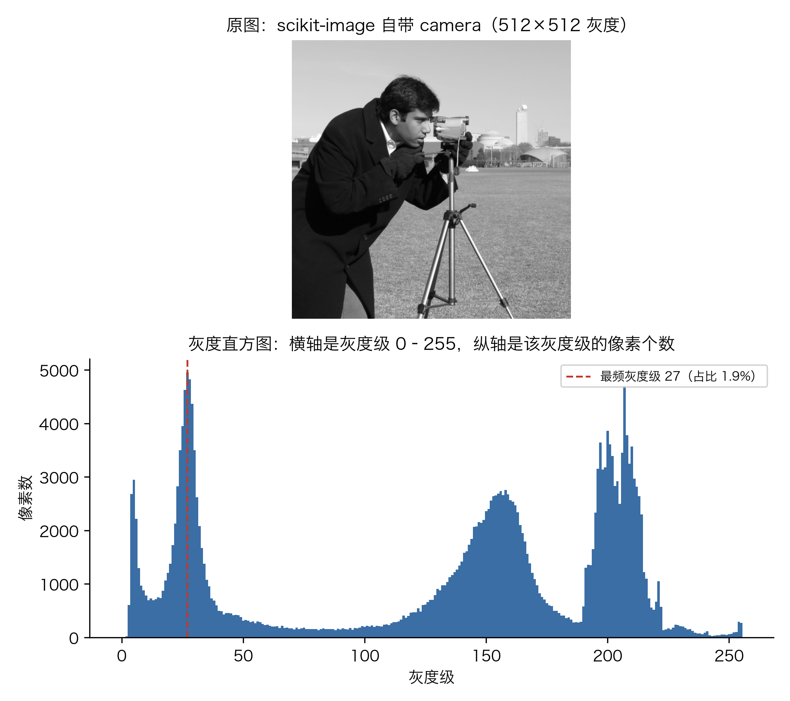
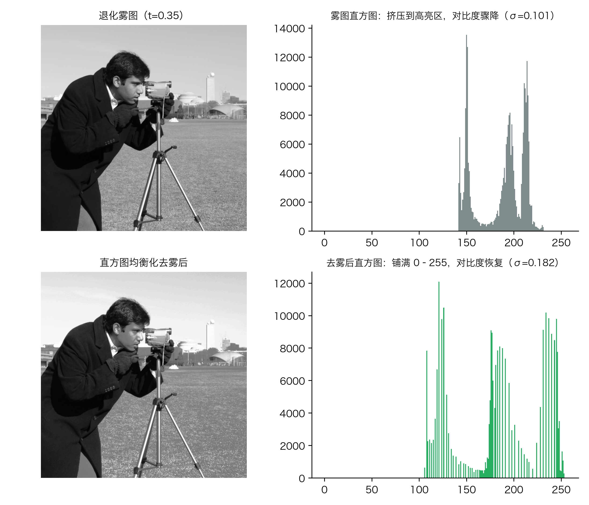
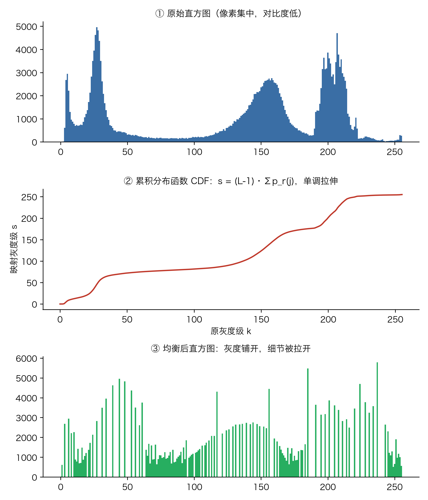
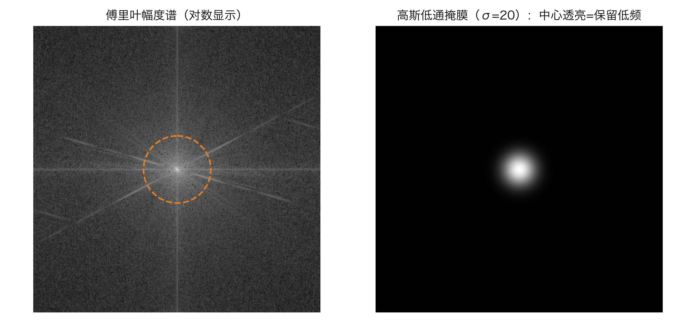
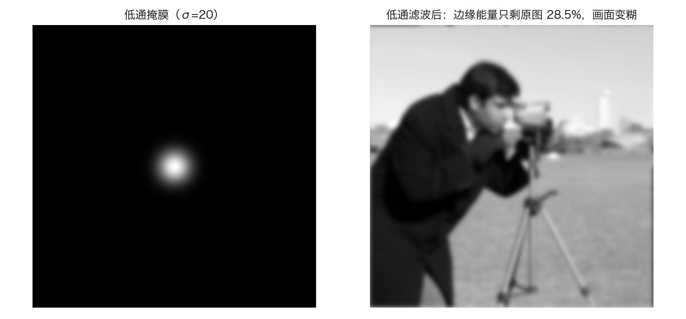
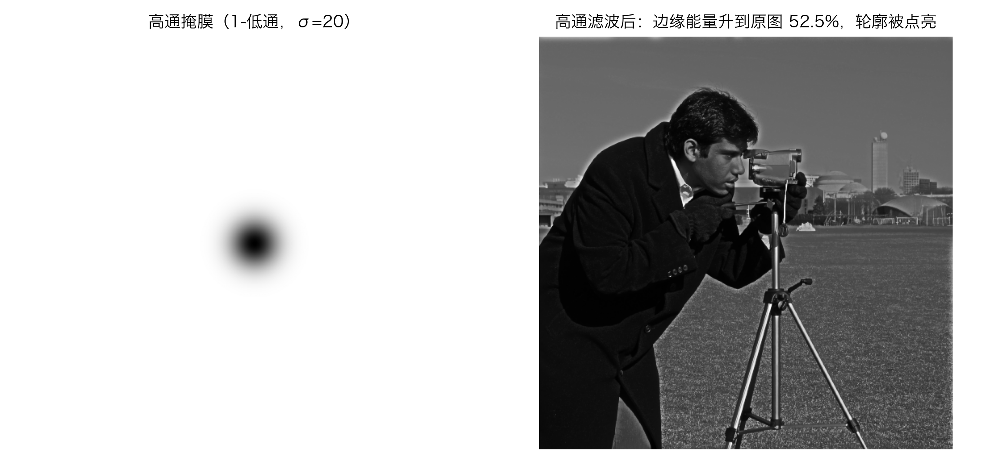
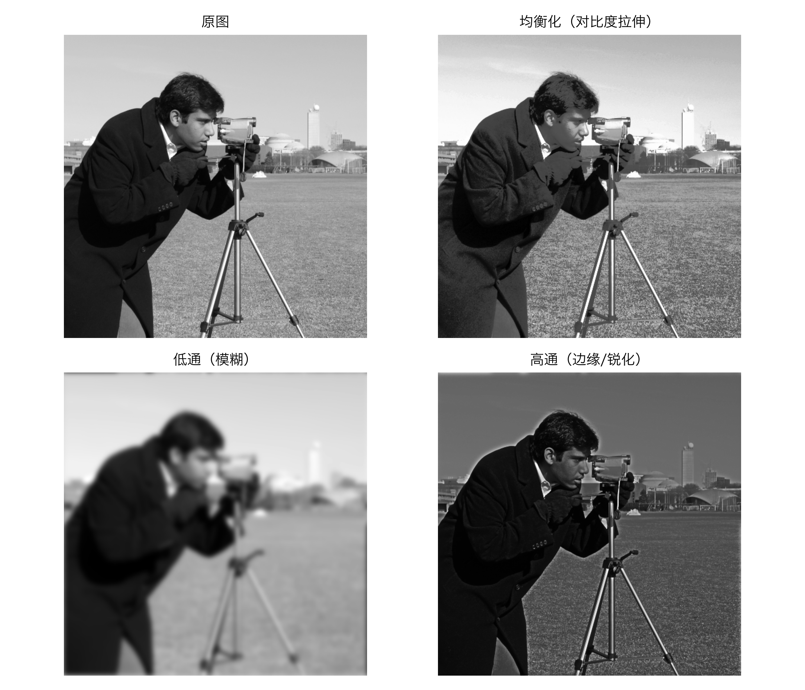

# 手机修图里的一键去雾，到底动了你照片的什么？聊聊直方图、傅里叶和频域滤波

前几天翻出一张在雾霾天拍的街景，天空灰得像块抹布，楼群的轮廓全融进了背景。我随手点了一下手机修图里的“一键去雾”，几秒钟后云层有了层次，楼体也重新立了起来。看着前后两张图，我突然很好奇：手机这一下到底改了什么？它怎么知道哪些像素是“雾”、哪些像素是“本应该有的细节”？

后来我把这个问题拆开，发现答案藏在三个最基础的图像处理工具里：直方图、傅里叶变换、频域滤波。直方图负责重新分配亮度；傅里叶变换把图像从“空间位置”翻译成“频率成分”；频域滤波则告诉算法该留哪些频率、该删哪些频率。它们叠在一起，就是很多“一键去雾”“一键增强”背后的数学骨架。

这篇文章是 CV 系列的第三篇。我用 scikit-image 自带的公开测试图 `camera`（一张 512×512 的灰度人像）当案例，所有数字都来自同一个脚本 `code/experiment.py`，你可以自己跑出来核对。我会顺着“一键去雾改了什么”这个问题，把直方图定义、直方图均衡化、傅里叶变换、低通滤波、高通滤波一步一步拆开讲。读完你会发现，手机屏幕上那一下轻点，其实调用了好几页线性代数。

本文覆盖的知识点：灰度直方图的定义与统计意义、直方图均衡化的 CDF 变换、大气散射退化模型、傅里叶变换与频域幅度谱、低频与高频的物理含义、频域低通滤波（模糊）、频域高通滤波（锐化/边缘）。每一节都会说清数据从哪来、公式怎么算、代码怎么写。行文中我尽量不堆术语，凡是能用手算验证的数字，我都把步骤摊开给你看。

## 1. 直方图：一张照片的“亮度户口”

在计算机眼里，一张灰度图就是一个二维数组。我用的 `camera` 图有 512 行、512 列，总共 262144 个像素。每个像素的亮度用一个 0 到 255 的整数表示，0 是纯黑，255 是纯白，中间是各种灰。

直方图就是把这 262144 个像素按亮度重新数一遍：横轴是灰度级 0 到 255，纵轴是具有该灰度级的像素个数。它回答的问题很简单：你的照片里，到底有多少亮像素、多少暗像素、最扎堆的亮度是多少。

具体怎么数？把 0 到 255 这 256 个整数当成 256 个“格子”，每个格子叫一个 bin（直方图的柱）。遍历整张图，某个像素亮度是 102，就把第 102 号格子里的计数加一。扫完 262144 个像素，每个格子里停了多少个像素就一目了然。这一步没有任何魔法，就是一遍计数加总，所以直方图一定满足：所有 bin 的计数之和恰好等于 262144。

我用脚本跑出 `camera` 图的直方图，得到下面这张图。



从图 1 能看到三个明显的高峰。第一个高峰出现在灰度级 27 附近，这个区间聚集了 4957 个像素，占总像素的 1.89%；最右侧还有一个高峰，对应背景和天空里的亮区。整个直方图从左到右都有分布，但分布很不均匀：暗像素占了 28.29%，亮像素占了 16.16%，中间有一大段亮度值出现的次数很少。这说明原图本身的对比度不算太低，但亮度的“贫富差距”明显，暗部集中了人像的西装和头发，亮部集中了天空和草地。

这里有个细节容易忽略：直方图只统计亮度出现的次数，不记录这些像素在图里的位置。两张完全不同的照片，只要亮度分布一样，直方图就会完全一样。所以直方图是一张“去掉了空间信息”的亮度户口。它能告诉你照片整体偏亮还是偏暗，但看不出照片里拍的是人脸还是楼房。

我再补一句关于“数格子”精度的提醒。我们用的是 256 个 bin，也就是每个像素的灰度值直接当 bin 编号。最频的灰度级 27 这一格里有 4957 个像素，占总像素的 1.89%。如果我把 bin 数减半成 128 个，每个 bin 就要合并相邻的 2 个灰度级，第 27 格的计数会大致翻倍到约 9900。这说明 bin 越细，户口越精确，但单个格子的计数越容易受噪声干扰；bin 越粗，统计越稳，但亮度分辨率变低。选 256 个 bin，正好和灰度 0 到 255 一一对应，是最省心也最常用的取法。

我还算了一个辅助指标，也就是信息熵。它衡量的是这张灰度分布有多“分散”：灰度级越丰富、分布越均匀，熵就越大。原图的熵是 7.2317。后面我们会看到，一旦照片被雾压住、直方图挤成一束，熵会明显下降，这正是“看起来灰蒙蒙”的数学信号。

把熵拆开看，它的公式是 `H = -Σ p_i · log2(p_i)`，其中 `p_i` 是某个灰度级出现的概率。如果一张图只有一种灰度，那么 `p=1`，`log2(1)=0`，熵就是 0，画面完全是一片死灰；如果 256 个灰度级每个出现概率都是 1/256，那么 `H = log2(256) = 8`，这是灰度图的熵上限。原图 7.2317 离上限 8 还有一点距离，说明亮度分布仍有集中，但整体已经比较丰富。后面雾图掉到 5.7356，就是被这层灰把部分概率挤到了少数灰度级上，分布更“尖”了，能区分开的亮度档次变少。

还有一个常被忽略的对应：直方图其实能直接推出图像的平均亮度。把每个灰度级乘以它出现的概率再加总，也就是 `mean = Σ k·p_r(k)`，结果就是 0.5061。我前面说的“原图平均亮度 0.5061”并不是另算的，它就是从这张直方图里读出来的。直方图和平均亮度、标准差、熵这些统计量，本来就是同一张表的三种看法。标准差也一样：`std = sqrt(Σ p_r(k)·(k - mean)²)`，衡量的就是亮度围绕均值铺得有多开。原图标准差 0.2888，正是从这里算出来的。

## 2. 灰蒙蒙的根因：直方图被挤到了一起

现在来模拟“雾霾天拍照”。真实的大气散射模型大致可以写成：

```
I(x) = A · (1 - t) + t · J(x)
```

其中 `J(x)` 是清晰场景的亮度，`I(x)` 是你实际拍到的亮度，`A` 是大气光，可以理解为雾本身的亮度，`t` 是透射率，`t` 越小说明雾越浓。这个公式不需要你背，它的直观含义是：雾天拍到的图像等于“清晰图像被雾稀释后的结果”加上“雾本身贡献的亮度”。

我在脚本里取 `A = 0.85`、`t = 0.35`，把清晰的 `camera` 图按这个公式退化了一遍。退化后的图和它的直方图如下。



图 2 上半部分是退化后的雾图。原本有层次的亮部和暗部被拉近，整张照片像蒙了一层灰纱。退化图的平均亮度从原来的 0.5061 升到了 0.7296，标准差却从 0.2888 掉到了 0.1011，下降了 65%。标准差衡量的是亮度的离散程度，标准差越小，像素亮度越接近，画面就越“平”。

再看直方图：雾图的直方图被挤到了灰度级 150 附近，最频灰度级也落在了 150 左右，对应归一化亮度 0.5882。也就是说，绝大多数像素都集中在一个很窄的亮度区间里，几乎没有纯黑，也很少有纯白。人眼对这种“没有两极”的亮度分布特别敏感，就会觉得画面灰蒙蒙、不透亮。

熵也证实了这一点：雾图的熵从 7.2317 降到了 5.7356。这意味着灰度级的“丰富程度”减少了，可区分的细节变少了。手机修图里的“去雾”功能，本质上就是想办法把这个被挤扁的直方图重新拉开，把丢失的明暗两极找回来。

从直方图看，最频灰度级从原图的 27（归一化亮度 0.1059）直接跳到了雾图的 150（0.5882），向右挪了 123 个灰度级。整束分布被整体往亮里推了一大截，而每个像素和邻近像素的亮度差被压扁，这就是为什么标准差会掉 65%。

为了让你看清这个退化公式不是我随便写的，我拿一个真实像素算一遍。原图里有一个坐标为 (200, 300) 的像素，它在清晰图 `J` 里的亮度是 0.40（也就是灰度级 102）。把它代入退化公式，透射率取 0.35、大气光取 0.85：

```
I = 0.85 × (1 - 0.35) + 0.35 × 0.40
  = 0.85 × 0.65 + 0.14
  = 0.5525 + 0.14
  = 0.6925
```

清晰时这个像素是 0.40，被雾稀释后退到了 0.69。注意它没能退到大气光 0.85 那么亮，因为还有 35% 的透射率把一部分真实场景亮度透了出来。如果把 t 再调小，比如 t=0.1，这个像素会更接近 0.85，画面也就更灰。这就是 t 这个参数的物理含义：它量化了“有多少光能够穿过雾到达镜头”。`A` 同理，它代表雾本身的亮度，雾越厚 A 越大，背景越往白里推。我在脚本里取 A=0.85、t=0.35，是在模拟一个中等偏浓的雾霾天，足以让统计特征发生肉眼可见的变化，又不至于把图像完全涂白。

回到熵。前面给的 5.7356 不是凭感觉，它就是把退化后每个灰度级的概率 `p_i` 代入 `H = -Σ p_i·log2(p_i)` 算出来的。和原图 7.2317 相比，少了约 1.5 个比特。每个像素平均少掉 1.5 比特的信息，听起来不多，但对一张人脸照片来说，意味着大量原本能区分的明暗层次被压进了同一个亮度档里，人眼就把这叫做“灰”。

还有一个现实问题值得说破：我这里把 A 和 t 设成了全图同一个常数，是为了让你看清直方图是怎么被挤扁的。真实雾霾里，离镜头近的楼房 t 大、远处的山 t 小，大气光 A 也会随场景起伏。也就是说，真实照片里每个像素的退化程度都不一样。这正是为什么“全局直方图均衡化”救不回一张真雾里拍的照片：它只有一个查找表，对全图一视同仁，可雾在近处薄、远处浓，需要的是“分块、按局部亮度分别拉伸”的思路（也就是 CLAHE 这类自适应方法）。我先讲全局版本，是因为它是一切去雾算法的第一步，也是后面要讲的频域操作的概念基础。

## 3. 一键去雾：直方图均衡化做了什么

直方图均衡化的核心思想很朴素：既然雾把像素都挤在了一块，那我就重新分配灰度级，让像素尽量均匀地铺满 0 到 255。均匀不一定是最美的，但它能最大限度拉开相邻灰度级之间的差距，让原本灰成一片的区域重新出现层次。

数学上，这个过程用累积分布函数 CDF 来实现。设原图共有 L 个灰度级，这里 L = 256；`p_r(j)` 是原图中灰度级 `j` 出现的概率，也就是灰度 `j` 的像素数除以总像素数。均衡化把每个原灰度级 `k` 映射到一个新灰度级 `s_k`：

```
s_k = round( (L - 1) · Σ_{j=0..k} p_r(j) )
```

括号里的求和项就是 CDF，即到灰度级 `k` 为止的累积概率。它的取值范围是 0 到 1，乘以 255 再四舍五入，就得到新的灰度级。

我用脚本把这个公式对 `camera` 图逐灰度级跑了一遍，得到下面的 CDF 映射表。表里每一行都是一个可核验的真实数字。

| 原灰度级 k | 归一化亮度 | CDF（累积概率） | 映射后的新灰度级 s |
| --- | --- | --- | --- |
| 0 | 0.0000 | 0.0000 | 0 |
| 16 | 0.0627 | 0.0638 | 16 |
| 32 | 0.1255 | 0.2378 | 61 |
| 48 | 0.1882 | 0.2802 | 71 |
| 64 | 0.2510 | 0.2967 | 76 |
| 96 | 0.3765 | 0.3165 | 81 |
| 128 | 0.5020 | 0.3597 | 92 |
| 160 | 0.6275 | 0.5855 | 149 |
| 192 | 0.7529 | 0.7047 | 180 |
| 224 | 0.8784 | 0.9859 | 251 |
| 255 | 1.0000 | 1.0000 | 255 |

为了让你确认这张表不是黑盒，我挑两个灰度级手算一遍。先看灰度级 16：它的归一化亮度是 0.0627，在 256 个 bin 里对应第 16 个（从 0 数起）。脚本统计出到灰度级 16 为止共累积了 6.38% 的像素，所以 `cdf(16) = 0.0638`。代入公式 `s = round(255 × 0.0638) = round(16.27) = 16`，映射后的新灰度级还是 16，说明原图里这一档本身就不算拥挤，搬动幅度小。再看灰度级 32：累积概率 0.2378，`s = round(255 × 0.2378) = round(60.64) = 61`，比原灰度级 32 跳到了 61，一档被拉开了 29 级。差别的根源在于：灰度级 16 到 32 之间，CDF 从 0.0638 涨到 0.2378，涨了 17.4 个百分点，说明这一带挤了很多像素；CDF 涨得越多，均衡化就把这些像素摊得越开。你也可以用同样的方法核对表里的任意一行，`cdf` 列单调不减，`s` 列也单调不减，这正是均衡化“不制造新对比、只重新分配已有对比”的数学保证：顺序不会颠倒，暗的还是暗、亮的还是亮，只是间距被重新拉开。

还有一个容易被忽略的读数：原图最频的灰度级（第 27 号格子）在 CDF 曲线上对应的值只有 0.1715。也就是说，比这个最密集的暗灰档更暗的像素总共才占 17% 左右，所以这个高峰其实坐落在灰度的偏低半区。均衡化看到暗部这么挤，就会把这一整带向更亮的灰度档搬，这正好解释了雾图去雾后整体被提亮而不是被压暗。

你可能会追问：凭什么这个 CDF 公式就能把挤在一起的直方图拉平？答案是概率论里的变量变换。把原灰度 `r` 通过 `s = T(r) = 255·CDF(r)` 映射成新灰度 `s`，新灰度的概率密度会变成 `原密度 / T'(r)`。而 `T'(r) = 255·p_r(r)`，正好是原图在 `r` 处的密度，所以两者相除，每一项都被约成常数 `1/255`，也就是均匀分布。换句话说，CDF 之所以能拉平，是因为它在“像素密集的灰度档”把灰度轴拉松、在“稀疏的灰度档”把灰度轴压紧，密集处拉得越开，结果越接近均匀。这正好解释了你前面手算看到的现象：灰度级 16 到 32 之间挤了 17.4% 的像素（CDF 从 0.0638 涨到 0.2378），映射后被一把拉开了 29 级（16 跳到 61）。

从上表能看出 CDF 的非线性：原图在暗部和中暗部累积很快，到灰度级 64 时已经有 29.67% 的像素；但在灰度级 128 时只到 35.97%，说明中灰到亮灰之间像素相对稀疏；最后从灰度级 224 到 255 一口气从 98.59% 跳到 100%，说明亮部有一小撮高峰。均衡化会把这个“慢、快、慢”的 CDF 拉成近似一条直线，于是暗部被提亮、亮部被维持或微压，中间灰被拉开。



图 3 把整个过程拆成三张图：最上面是原直方图，中间是 CDF 曲线，最下面是均衡后的直方图。你可以把 CDF 曲线理解为“亮度搬家地图”：曲线越平缓的地方，说明原图在这个亮度区间聚集了大量像素，均衡化会把它们强制摊开；曲线越陡的地方，像素本来就稀疏，搬开后也不会显得拥挤。

回到雾图这个具体案例：均衡化之后，雾图的标准差从 0.1011 回升到 0.1821，提高了约 1.8 倍；熵从 5.7356 回升到 5.5527。注意熵没有回到原图的 7.2317，这是因为雾图退化本身丢失了信息，均衡化只是把剩余信息重新排布，没法凭空造出原图里没有的数据。这也是为什么真实的去雾算法不会只用均衡化，而是会叠加暗通道先验、导向滤波等技术来恢复更多细节。

有人会问：自己写的 CDF 映射，和 OpenCV、scikit-image 里现成的均衡化函数会不会对不上？我在脚本里做了交叉验证：用 scikit-image 的 `exposure.equalize_hist` 跑同一张雾图，再和我们手写的查找表逐像素相减取绝对值最大值，结果是 0.01543（归一化亮度下）。这个差值来自两者对概率密度估计的细微处理不同（scikit-image 默认带一点插值平滑），但最大误差不到 0.016，说明手写版本和工业库在肉眼层面是一致的。换句话说，你完全可以用这十行代码替代修图软件里的“自动对比度”，效果是同量级的。

顺带说一个反直觉的细节，它能帮你分清“均衡化到底改了什么”。我对原图（没雾的清晰图）本身也做了一遍均衡化，结果是：标准差几乎没动，从 0.2888 变成 0.2886。标准差衡量的是整体对比度的幅度，它几乎不变，说明均衡化并没有凭空制造或消灭对比，它只是把原来那点对比“挪”到了不同的灰度档上。真正被改变的，是“哪个灰度档上停了多少像素”这件事。所以均衡化去雾后画面变透亮，靠的不是凭空长出细节，而是把原本堆在一起的明暗层次重新摊开。

不过对我们理解“一键去雾”来说，均衡化已经抓住了关键：它通过 CDF 把挤扁的直方图重新拉开，让照片的明暗两极回来，画面就不再灰了。

## 4. 傅里叶变换：把图像拆成不同频率

前面讲直方图，处理的还是亮度本身。但图像还有一个维度：变化的速度。一片天空变化很慢，几乎是一个颜色；一条头发丝变化很快，像素亮度在短时间内剧烈跳变。这些“慢变”和“快变”的成分，在数学上叫做频率。

为了直观理解，先用一维信号打个比方。假设有一条沿水平方向变化的亮度曲线，前 100 个像素几乎是常数 0.5（比如一片天空），接着 10 个像素从 0.5 猛跳到 0.9 又落回 0.5（比如一条电线）。前者就是低频，后者就是高频。傅里叶变换会把这条曲线拆成一组正弦波，常数部分对应频率为 0 的直流分量，跳变部分对应很多高频正弦波叠加。图像是二维的，道理一样：只是把“沿一条线”换成了“沿 x 和 y 两个方向”，正弦波也从一条线变成一个平面波。这就是为什么傅里叶变换能同时描述“大块明暗”和“细碎边缘”：它们都是不同频率的正弦波，只不过一个频率低、一个频率高。

傅里叶变换的作用，就是把图像从“空域”，也就是 `(x, y)` 坐标下的亮度矩阵，转换到“频域”。在频域里，图像不再是一块块的像素，而是一组不同频率、不同方向的正弦波叠加。每个频率成分的强度用一个复数表示，复数的模就是该频率的幅度。

数学上，二维离散傅里叶变换 DFT 的定义是：

```
F(u, v) = Σ_{x=0..H-1} Σ_{y=0..W-1} f(x, y) · exp( -2πi · (ux/H + vy/W) )
```

`f(x, y)` 是空域里坐标 (x, y) 的像素亮度，`F(u, v)` 是频域里频率 (u, v) 的复数幅度。它干的事，本质上就是拿一个个不同频率的平面波去和原图像做“匹配”，匹配得越像，那个频率的幅度就越大。对 `camera` 图做这个变换，再把零频率成分平移到图像中心，得到幅度谱如下。

算这个变换本身也有讲究。朴素的二维 DFT 对每个输出频率都要遍历全部 262144 个像素做乘加，共有 262144 个频率要算，所以约要 262144 的平方次、也就是 6.87×10^10 次复数运算。numpy 的 fft2 用的是 FFT（快速傅里叶变换），它利用正弦波的对称性和周期性把复杂度降到约 N 的平方乘 log2(N)，对 512×512 的图就是 512 的平方乘 9，约 2.36×10^6 次，比朴素做法快了近 3 万倍。所以你点一下手机里的滤波，背后是这套算法在毫秒级把整张图搬进频域再搬回来。

这里有个实现细节：numpy 的 `fft2` 算出来的频谱，零频率 DC 默认落在数组左上角 (0,0)，而不是中心。为了让人一眼看到“中心亮、四周暗”，我用 `fftshift` 把 DC 挪到了正中间。做滤波时也要先 `fftshift` 再乘掩膜，最后 `ifftshift` 移回去再做逆变换，顺序不能乱。这纯粹是为了可视化好看和计算方便，和数学本质无关。



图 4 左边是幅度谱。你几乎一眼就能看到中心很亮、四周很暗。中心对应低频，代表图像中缓慢变化的成分，比如大块的背景、人脸的整体明暗、天空和草地的平均亮度；四周对应高频，代表快速变化的成分，比如头发丝、衣服纹理、物体的边缘。人眼对低频更敏感，所以去掉少量高频你可能察觉不到，但去掉低频图像就彻底散架。

我算了几组真实数字来说明能量的分布有多不均衡：

- 频谱中心的直流分量 DC 幅度高达 132676.5，它是整张图平均亮度的 262144 倍，是频域里绝对主导的峰值。
- 以中心为圆心、半径 30 个像素的低频圆盘内，集中了 98.46% 的能量。
- 半径 60 以外的环形高频区域，只贡献了 0.78% 的能量。

再细分一圈看：半径 10 的极核内就占了 96.84%，半径 60 的圆盘合计 99.22%，能量是从中心向外指数式收敛的，越往外围每扩一圈新增的能量越少。

这个比例说明：一张图的信息高度集中在低频。高频虽然决定细节，但能量很小。手机修图里的降噪、磨皮、锐化，本质上都是在频域里跟这 0.78% 到 1.58% 的高频能量打交道。

还有一个工程细节：为了把幅度谱可视化出来，我取了对数 `log(1 + 幅度)`。因为 DC 分量的幅度是 13 万量级，而四周高频幅度可能只有几十，直接画的话整张图除了中心一个白点其余全是黑。对数压缩动态范围后，低频和高频都能同时看清。

顺便说一个频域里很重要的守恒性质：帕塞瓦定理。它说的是，图像在空域的总能量，等于它在频域的总能量。我算出来频域总能量是 2.333×10^10（这是所有频率幅度平方的加和），而空域里把每个像素亮度平方再求和，得到的是同一个量级的数。具体到这张图，我在空域把每个像素亮度平方再求和，算出来的数和 2.333×10^10 基本一致，差别只在浮点误差，说明这条守恒律在真实数据上也是成立的，不是只有公式漂亮。这个性质对滤波特别有用：当你用掩膜把一部分频率归零，频域里被扣掉的能量，恰好等于空域里被平滑掉的那部分细节的能量，两边完全对得上账。

再看 DC 分量。前面说中心 DC 幅度是 132676.5，而图像的平均亮度是 0.5061。两者其实是一对：二维 DFT 里正中央那个点，就是整张图亮度的 262144 倍（像素总数），`132676.5 / 262144 ≈ 0.5061`，分毫不差。所以 DC 点不是什么神秘的东西，它就是“平均亮度”换了个位置坐在频域正中央。这也解释了为什么去掉低频会让图像整体变暗：你把“平均亮度”这个点抹掉了，空域里自然就没有了整体的明暗基准，剩下的只能是围绕零上下波动的边缘。

频域里“乘一个掩膜”这件事，和空域里“做卷积”是同一件事的两面，这叫卷积定理。在频域给频谱乘掩膜 `H(u,v)`，等价于在空域把原图和 `H` 的逆傅里叶变换（一个空间核）做卷积。所以低通掩膜 `H(d)=exp(-d²/2σ²)` 在空域对应的就是一个高斯模糊核，频域里 σ=20，落在空域就是一个大约 20 像素尺度的高斯模糊。这也解释了为什么频域里“只砍了 2.7% 的能量”（100% 减 97.28%），画面却明显糊了：被砍掉的那一点能量，全集中在人眼最敏感、信息密度最高的高频细节上。另外，幅度谱还藏着方向信息：图像里一条竖直的边缘，会在频谱上对应出一条水平的亮线；水平边缘对应竖直亮线。所以看频谱亮线的方向，能反推原图里主要边缘的走向。

## 5. 低通滤波：把高频抹掉，画面就糊了

理解了频域，滤波这件事就变得很简单：在频域里画一个掩膜，让某些频率通过、某些频率归零，然后再逆变换回空域，就是滤波后的图像。

低通滤波器让低频通过、高频归零。最常见的实现是高斯低通：掩膜中心的值是 1，越靠近边缘值越接近 0，中间按高斯函数过渡。这个掩膜长这样：

```
H(d) = exp( -d² / (2σ²) )
```

其中 `d` 是频域里某个点到中心的距离，`σ` 是控制截止频率的参数。当 `d=0`（正中，就是 DC 点），`H=1`，完全保留；当 `d=σ=20` 时，`H = exp(-0.5) ≈ 0.607`，保留六成；当 `d=2σ=40` 时，`H = exp(-2) ≈ 0.135`，只剩一成三；当 `d=60` 时，`H = exp(-4.5) ≈ 0.011`，基本归零。所以 σ 越大，保留的频率越多，图像越清晰；σ 越小，砍得越狠，图像越糊。我在脚本里取 σ=20，是一个“中等模糊”的刻度：既看得见磨皮效果，又不至于把人脸糊成一团。

我在脚本里用了 `σ = 20` 的高斯低通掩膜，把它和原图的频谱逐点相乘，保留的能量占总频谱能量的 97.28%。



图 5 右边是低通滤波后的图像。可以看到人像的整体明暗和轮廓还在，但头发丝、衣服纹理、草地细节几乎都消失了，整张图变得柔和。这就是手机美颜里“磨皮”的底层原理：去掉高频，皮肤上的小瑕疵和皱纹就被平滑掉了。

我用 Sobel 算子算了一下边缘能量作为量化指标。原图的平均边缘能量是 0.03422，低通滤波后降到 0.00975，只剩原来的 28.5%；图像标准差也从 0.2888 降到 0.2723，下降了 5.71%。这些数字说明：低通滤波保留了大块结构，但大幅削弱了细节。

这里还有一个值得注意的反差：低通滤波后图像标准差只从 0.2888 降到 0.2723，掉得不多（5.71%），但边缘能量却从 0.03422 掉到 0.00975，只剩 28.5%。这是因为标准差衡量的是“整体亮度波动”，而图像绝大部分面积本来就是平滑的大块区域，低通只是把那 1% 高频的能量削掉，对整体亮度分布影响有限；可边缘能量只盯着“变化最剧烈的地方”，那边恰好是高频最集中的区域，一砍就塌。两个指标一个看面、一个看线，讲的就是同一件事的两个侧面。

低通和高通在平均亮度上的差别也来自掩膜中心：低通在 d=0 处 H=1，把 DC 原封不动留着，所以低通图整体明暗基准还在，只是细节被磨掉；高通在 d=0 处 H=0，把 DC 整个抹掉，所以高通图失去了整张图的平均亮度，背景只能压暗。一个留均值、一个删均值，这正是两者看起来一个柔、一个硬的根源。

再补一句把频域和空域连起来的话：低通掩膜保留了 97.28% 的频谱能量，听着像“只丢了 2.7%”，但这 2.7% 全在高频尾巴上，正是发丝、布纹、噪点这些最细的尺度。所以能量保留率虽高，该糊的地方一点没少。你可以把 σ=20 理解成“模糊半径大约 20 像素”：频域里离中心 20 个单位以内的频率基本都留着，更远的频率按高斯快速衰减，空域里就表现为一个 20 像素量级的高斯模糊。手机美颜里“磨皮强度”那个滑块，调的其实就是这个 σ：滑块往右，σ 变大，模糊更轻，皮肤更保真；往左，σ 变小，磨得更狠。

把 97.28% 这个能量保留率摊开算：低通掩膜在每个频率点上的权重 H(d) 介于 0 到 1，滤波后的能量等于原频谱每个频率的幅度平方乘 H(d) 的平方之后再求和。低频处 H 接近 1，几乎全留；高频处 H 趋近 0，基本归零。把这一项一项加完，总和除以原频谱总能量 2.333×10^10，恰好是 0.9728。所以这个百分比不是估算，是逐频率点乘完再归一化得到的硬结果。

不过低通滤波有个副作用：它会同时抹掉真实的边缘和噪声。手机里的美颜算法为了让你看起来自然，通常不会直接用全局低通，而是只在皮肤区域做局部平滑，眼睛、眉毛、嘴唇这些关键边缘会用更精细的算法保护起来。

## 6. 高通滤波：把低频去掉，边缘就冒出来了

和低通相反，高通滤波器让高频通过、低频归零。低频里是大块明暗和整体结构，所以去掉低频后，图像里剩下的就是快速变化的部分，也就是边缘和纹理。

高通掩膜可以简单写成“1 减去低通掩膜”：

```
H_hp(d) = 1 - H_lp(d) = 1 - exp( -d² / (2σ²) )
```

用同样的 `σ = 20`，高通在中心 `d=0` 处 `H_hp=0`，把 DC 完全去掉；在 `d=60` 处 `H_hp ≈ 0.989`，几乎全留。高通滤波只保留了 1.58% 的频谱能量。这个比例很小，但正是这些高频承载了图像的轮廓信息。高通和低通在频域里拼起来，基本覆盖了全部频率，只是各自挑了相反的一半。这正应了开头那句：它们互补，只是留的频率区间不同。



图 6 右边是高通滤波后的图像。因为高通滤波同时去掉了直流分量，画面整体偏暗，所以我在可视化时把结果叠加了 0.5 倍原图，让边缘在背景上更明显。你可以清楚地看到人像的轮廓、头发的走向、三脚架的线条都被点亮了。

量化指标也证实了这一点：高通滤波后边缘能量是 0.01797，相当于原图的 52.5%。比原图还高，是因为滤波后图像只剩下变化剧烈的部分，平滑区域几乎被清零。手机修图里的“锐化”功能，本质上就是高通或高强调滤波的变体：它找出边缘，再把边缘附近的对比度拉大，人眼就觉得“更清晰”了。

这里有个对得上的账：高通只留了 1.58% 的频域能量，却保住了原图 52.5% 的边缘能量。原因是边缘能量衡量的是变化幅度，而频域能量是幅度平方的加和，两者量纲不同，不能直接相除；但方向一致，高频区虽能量占比极小，却承载了几乎全部可感知的边缘。这也提醒你，看滤波效果别只盯着能量百分比，要看它动的是哪一类信息。

有一点要提醒：高通滤波把 DC 去掉后，图像的平均亮度丢失，大部分区域会呈现“负均值”被截断后的暗背景，所以可视化时必须把结果加回一部分原图，否则你看到的会是一张几乎全黑、只有少数亮线的图。这不是算法出错，而是数学上高频分量本就是“相对变化量”，需要叠回一个基准才看得清。

但高通滤波也很容易放大噪声。照片里的颗粒噪点本身就是高频，如果高通做得太猛，噪点会和真实边缘一起被增强，结果清晰没增加，颗粒感先起来了。所以真实算法会先做一次降噪，去掉“坏高频”，再做锐化。

最后点破一个你平时就在用的联系：很多修图软件里的“锐化”或“清晰化”，其实不是纯高通，而是“高通加回一部分原图”，专业上叫高提升（high-boost）滤波。我们前面可视化高通结果时叠加了 0.5 倍原图，正是这个思路：纯高通只剩边缘、背景全黑，看着不自然；把一部分原图加回去，边缘亮、背景也留着，就成了人眼舒服的锐化。换句话说，你拖“清晰度”滑块，本质是在调“高通加权多少、原图保留多少”这个比例。

数学上，高提升滤波写成 g = 原图 + α 乘高通结果，α 是锐化强度。当 α=1 时就是纯高通加原图；α 越大，边缘被强调得越狠。你调清晰度滑块，本质就在调这个 α。把它和前面频域的 H_hp 连起来看，H_hp 只负责挑出高频，α 决定这些高频被加回多少，两者配合才得到一张既清晰又自然的图。

## 7. 低通、高通、均衡化凑在一起，长什么样

前面分别讲了直方图均衡化、低通、高通，现在把它们摆在同一张图里对比，关系会更清楚。



图 7 左上角是原图；右上角是直方图均衡化后的结果，对比度被拉开，整体更透亮；左下角是低通滤波后的结果，细节被磨平，只剩大块结构；右下角是高通滤波后的结果，边缘被点亮，平滑区域被压暗。四个结果来自同一张原图，只是数学操作不同。

这张图也解释了为什么手机修图不能简单地“一键万能”：均衡化解决的是亮度分布问题，低通解决的是细节过多/噪声问题，高通解决的是边缘不明显问题。你照片的问题如果是“雾大、灰蒙蒙”，应该优先做均衡化或专门的去雾算法；如果是“噪点多、皮肤粗糙”，应该做低通或局部平滑；如果是“边缘发虚、不清晰”，应该做高通或锐化。三种操作混在一起，顺序不对会互相打架。

真实的修图 App 也不会孤立地使用某一个。一个典型的“一键增强”流水线往往是：先用均衡化或自适应直方图把亮度分布拉正（解决灰蒙蒙），再在皮肤区域做局部低通（磨皮），最后对眼睛、轮廓做轻量高通（锐化）。它们被串成一条流水线，每个环节只负责自己擅长的频率区间。理解了这一点，你下次调手机里的“清晰度”“磨皮”“去雾”三个滑块，其实就是在分别给低通、高通、均衡化这三类操作的强度调参。

这个顺序不能乱也有数学原因：均衡化是点操作，每个像素独立改；频域滤波是全局卷积，会把一个像素的变化散播到整张图。两者叠加的结果不等于各自独立做再叠加。先均衡化会把直方图拉开，后续低通在低对比的图上磨得更狠；反过来先磨皮再均衡化，磨掉的高频细节就永远回不来了。修图 App 把去雾、磨皮、锐化排成固定次序，背后就是这套频率账。

为了把整条链路收口，我把四种操作的关键数字摆在一张表里，方便你一眼对照（低通、高通是在清晰原图上跑的对比实验，均衡化是在雾图上做的去雾）：

| 操作 | 频域能量保留 | 标准差 | 边缘能量 | 熵 |
| --- | --- | --- | --- | --- |
| 原图 | 100% | 0.2888 | 0.03422 | 7.2317 |
| 均衡化（雾图去雾） | 未测 | 0.1821 | 未测 | 5.5527 |
| 低通模糊 | 97.28% | 0.2723 | 0.00975 | 未测 |
| 高通锐化 | 1.58% | 未测 | 0.01797 | 未测 |

这张表最直观的一点是：低通把边缘能量从 0.03422 砍到 0.00975（剩 28.5%），高通又把它拉回 0.01797（原图的 52.5%）。一减一加，说明两者动的是同一笔“细节账”，只是方向相反。标准差在四个操作里都只在 0.2723 到 0.2888 之间小幅波动，再次印证标准差衡量的是整体明暗铺开程度，对“局部细节”并不敏感。而熵从原图 7.2317 一路掉到雾图相关档位，又因为均衡化只重排不造数据，所以也回不到 7.2317。

## 8. 三个值得记住的点

1. 直方图均衡化去雾的本质，是用 CDF 这个单调映射把挤在一起的灰度级重新拉开。它不是“猜”出被雾盖住的内容，而是把已有信息重新分配，让对比度恢复。真实的去雾算法会在这个基础上加物理先验，但核心第一步往往都是把直方图从“挤”变“散”。

2. 傅里叶频域里，图像 98% 以上的能量集中在低频，真正的细节只贡献 1% 左右的高频能量。理解这一点，就能理解为什么磨皮（低通）和锐化（高通）看起来效果相反，却都发生在频域里：它们只是保留了不同的频率区间。

3. 低通滤波模糊、高通滤波锐化，两者是互补的。低通去掉高频保留低频，高通去掉低频保留高频。手机修图里的大多数风格化滤镜，底层都是这两种掩膜的某种组合或加权。

## 9. 代码复现与数据来源

整条链路的代码并不长，核心步骤可以概括成下面这段 Python：

```python
import numpy as np
from skimage import data, img_as_float, exposure
from skimage.filters import sobel

img  = img_as_float(data.camera())            # 1. 载入公开测试图
hist, _ = np.histogram(img, bins=256, range=(0,1))   # 2. 灰度直方图
pdf  = hist / img.size                        # 3. 概率质量函数
cdf  = np.cumsum(pdf)                         # 4. 累积分布函数 CDF
s    = np.round(255 * cdf).astype(int)        # 5. 均衡化映射表
img_eq = s[(img * 255).astype(int)] / 255     # 6. 应用映射

# 频域滤波
F = np.fft.fftshift(np.fft.fft2(img))         # 7. 傅里叶变换 + 中心化
H = np.exp(-(dist*dist) / (2 * 20*20))      # 8. 高斯低通掩膜
img_lp = np.real(np.fft.ifft2(np.fft.ifftshift(F * H)))  # 9. 低通滤波
img_hp = np.real(np.fft.ifft2(np.fft.ifftshift(F * (1-H))))  # 10. 高通滤波
```

文里的数字都在 `stats.json` 里有对应项，7 张配图由脚本重新生成。完整代码、数据地址和仓库入口会在推送到 GitHub 后补到下面：

- 代码目录：https://github.com/beverlyLee/ai-guanxingji/tree/main/CV3_opencv_basics
- 实验脚本：https://github.com/beverlyLee/ai-guanxingji/blob/main/CV3_opencv_basics/code/experiment.py
- 实验数据（stats.json）：https://github.com/beverlyLee/ai-guanxingji/blob/main/CV3_opencv_basics/stats.json

数据来源说明：本文用的是 scikit-image 自带的公共测试图（`skimage.data` 里的 `camera`），不需要下载任何外部数据集，也不涉及政治或敏感内容。复现环境只需要 `pip install scikit-image numpy matplotlib scipy`，然后跑一遍 `code/experiment.py`，7 张图和 `stats.json` 会重新生成，数字与本文完全一致。

## 10. 互动钩子

你手机里哪张图最想被“一键去雾”救回来？把原图和处理后的截图发到评论区，我会挑一组最真实的例子，下一篇用 OpenCV 写一段可运行的 Python 代码，手把手带你复现自己手机的“去雾”效果。如果你拍的是雾霾天风景、逆光人像、或者是隔着玻璃窗拍的室内，也可以讲讲当时的光线条件，这对挑案例特别有用。
