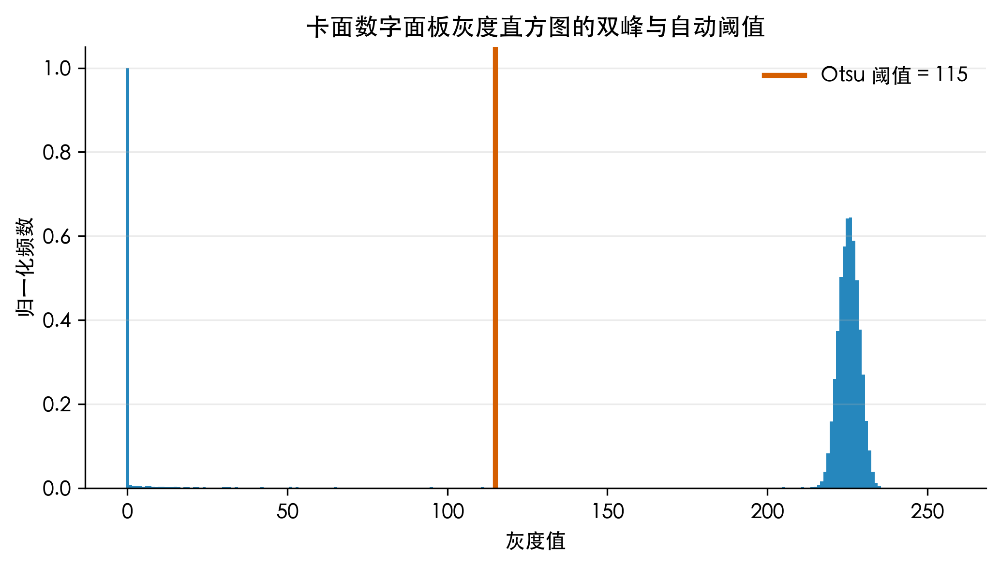
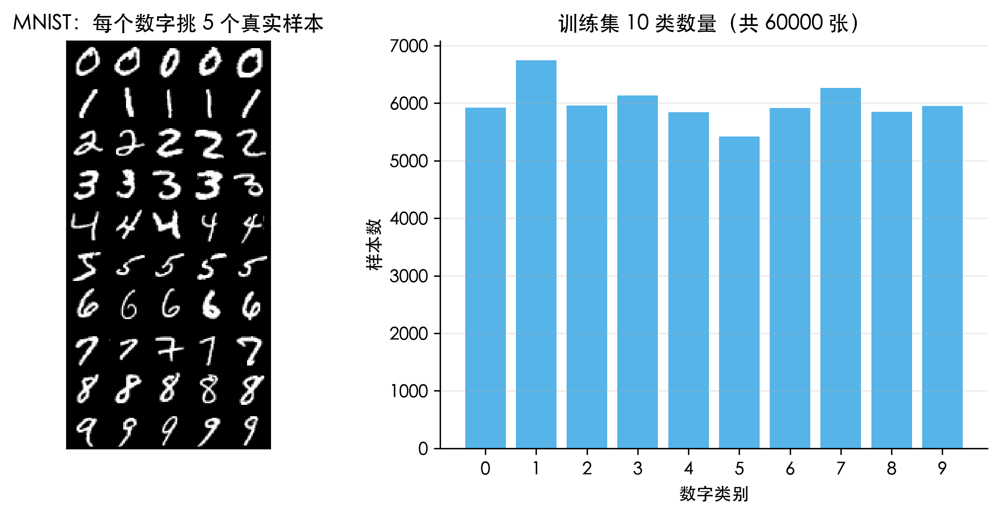
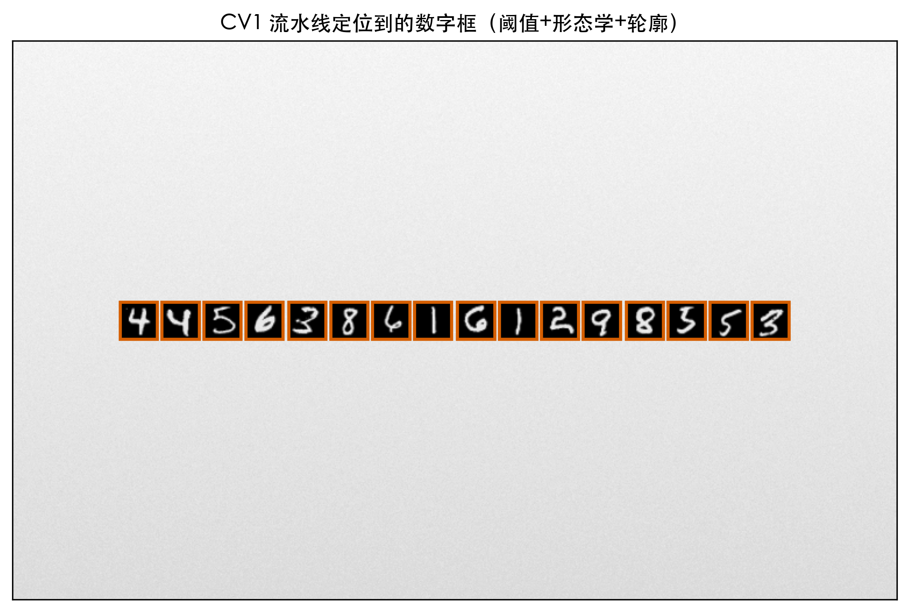
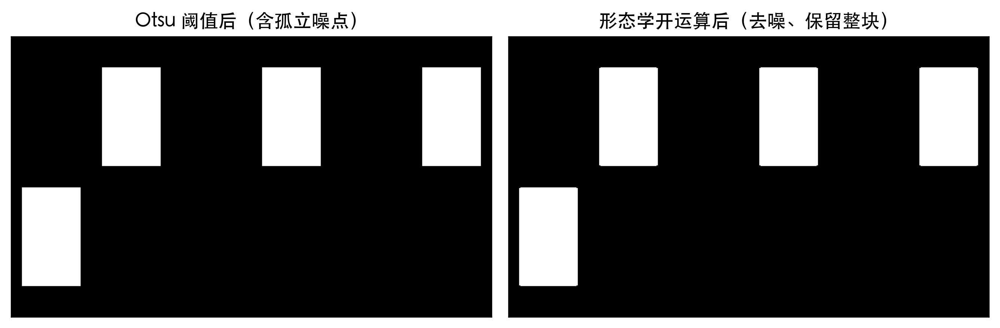
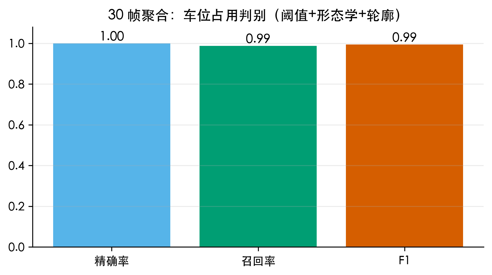
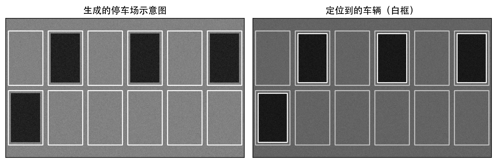
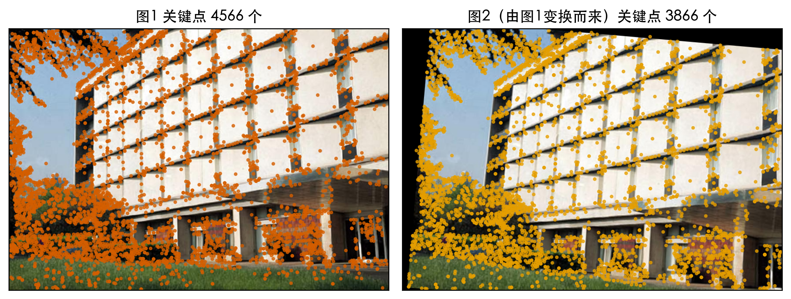
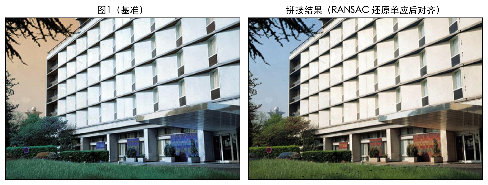

# 阈值、形态学、轮廓、特征点：同一套 OpenCV 基础，为什么换个场景就从全中变全错？

上周三在便利店排队，前面那人把信用卡往自助结算台的扫描区一放，嘀一声卡号就上屏了。出便利店路过地下车库入口，LED 屏显示剩余车位 12。回小区停好车翻相册，翻到去年拍的一张全景照，接缝处有一道淡淡的鬼影。

三件事，本来在我脑子里是分开的。后来我把它们各写了一遍脚本跑通，发现底下是同一批零件：先把彩色压成一个亮度通道，再用阈值把关心的像素和不关心的分开，然后用形态学和轮廓把散落的像素拢成目标，需要跨视角时再用特征点把两个视角对上。

这篇不按课本章节顺序讲，按这条链子的三层讲。每层用一个场景把基础摊开说清楚，数据全用公开的：手写数字用 MNIST，拼接底图用 OpenCV 官方示例的 building.jpg，停车位那一段用脚本生成示意图，原因在那一节说明。

先把结论放出来：图像处理里没有更先进的方法，只有对某类成像条件成立的方法。同一条流水线，中间选错一步，结果不是掉几个百分点，是直接掉到零。后面有具体反例。

## 第一层：像素级的判决，用阈值把数字和背景分开

### 问题得先拆成两半

读卡号这件事人眼一扫就完成，机器不行。它得先回答数字在哪，再回答这是几。

这两件事性质完全不同。前者是像素级判决，不需要任何语义；后者是分类，必须先见过大量样本才知道 3 长什么样。前一半不用训练，后一半必须靠数据。这个分工贯穿全篇。

### 先做减法：颜色在这里没有信息量

红底上的黑字和白底上的黑字，对识别是一回事。所以先灰度化，OpenCV 读进来是 BGR 三通道，转灰度用加权求和：

Y = 0.299·R + 0.587·G + 0.114·B

三个系数不同，是因为人眼对绿最敏感、对蓝最不敏感，权重来自亮度感知的实测曲线。丢掉颜色是主动做减法，少两个通道，后面每一步的运算量都少一截，也不会引入颜色偏差这种多余变量。

### Otsu：把切得开写成一个可以穷举的式子

阈值的作用是定一条线：比线暗的算数字，比线亮的算背景。问题是线定在哪。

我第一版拍了个 128，右半边整个坏掉。因为卡面从上到下有个从 238 渐降到 150 的亮度渐变，还叠了标准差 2.5 的噪声，右半边背景像素掉到 128 以下，被整片判成数字。手调阈值在固定场景能凑合，光照一变就废。

Otsu 让阈值自己算：把 0 到 255 每个灰度值都当一次候选，每试一个就按它把像素切成暗亮两类，算这两类分得开不开，分得越开说明切得越准。衡量分得开的量叫类间方差：

σ²_B(t) = w0(t) · w1(t) · [ μ0(t) − μ1(t) ]²

t 是候选阈值，w0、w1 是两类各占的比例，μ0、μ1 是两类各自的平均灰度。扫完 256 个候选，取让 σ²_B 最大的那个。

这个式子能工作，是因为它由两个因子相乘，而两个因子都必须大。w0·w1 在两类各占一半时最大、某类几乎不存在时趋近 0，它否决掉把 99% 像素划到一边这种没意义的切法；(μ0 − μ1)² 是两类平均灰度的距离平方，两类拉得越开它越大。

两者同时要大，阈值就得落在两堆像素中间。所以 Otsu 实际是在直方图上找两个峰、把线放在峰之间的谷底。它不是碰运气，是把切得开写成了一个能穷举的式子。

为什么最大化类间方差就等于切得好，可以再补一层。一幅图的像素总方差能拆成两部分，一类内部各自的方差，加上类与类之间的方差，两者之和恒等于总方差。总方差是这幅图自己的性质、跟怎么切无关，那么类间方差取最大，等价于类内方差取最小。类内方差小，意思是每一类内部很整齐；类间方差大，意思是两类之间离得远。所以 Otsu 表面上在挑两个峰之间的谷底，实际是在同时做两件事：让每一类内部尽量纯，让两类之间尽量分开。

代价是它有前提：直方图得是双峰。峰在，谷就在；峰不在，或者两峰高度差得太悬殊，Otsu 会给出一段很奇怪的位置，而它不会报错，只会安静地切坏。

所以用之前有个很便宜的动作：把直方图画出来看。256 个 bin 铺开，两个峰和中间的谷一眼就能认。不方便看图的话，退一步可以看 Otsu 扫过的类间方差曲线有没有一个明显的尖峰，曲线平缓就说明这一刀怎么切都差不多，阈值不可信。

我这里是标准双峰。下图是卡面数字面板的灰度直方图，左边一堆是黑色笔画，右边一大片是浅色卡面，中间的谷很清楚，Otsu 给出的阈值是 115。



顺便记一个坑：OpenCV 5.0 里带 Otsu 标志时，取阈值函数返回的第一个值不是标量，是长度 1 的数组。我第一版直接 int() 就报了 TypeError，得先 ravel 再取第一个。这种小事不记下来下次还会踩。

### 闭运算补断口，开运算去噪点

二值化后数字形状基本出来了，但笔画上可能有 1 像素的断口。

这一步用形态学闭运算，定义是先膨胀再腐蚀。膨胀是：结构元在图上滑一遍，只要覆盖范围内碰到任何一个白色像素，中心点就变白。腐蚀反过来：结构元必须完全落在白色区域里，中心点才保留。

闭运算先膨胀，让每个白区向外长一圈、断口接上；再腐蚀缩回去、外边界回到原位。结果是缝补掉了，整体尺寸不变。跟它成对的开运算先腐蚀后膨胀，做的是相反的事：消掉碎小噪点，大块基本不动。

选哪个取决于你要解决的是少了东西还是多了东西。笔画断口是少了，用闭。下一层遇到噪点是多了，用开。

### 面积阈值同时是一条形状假设

findContours 抽出每块的外边界，我只要外轮廓，不要孔洞。然后按面积过滤：小于 60 丢掉，大于 3500 也丢掉。

上限这里我踩了个真坑。第一版把数字尺寸设成 40×40，但按我的排版，两个数字中心间距只有 36.25 像素。40 大于 36.25，相邻数字重叠粘在一起，16 个数字连成一整块，面积算出来 22698，远超上限被整个扔掉。检测结果是 0 个数字，程序不报错，就是安静地什么都没找到。改成 32 之后 16 个框全部正常分开。

这件事让我记住：面积阈值不只是滤噪点，它同时假设了一个数字应该多大。假设错了，好的目标也会被当垃圾扔掉。筛完再按左上角坐标排序，识别出来的字符顺序才是人读的顺序。

顺带说一句这套定位的硬伤：它假设数字之间有空隙。如果字体连笔，或者拍得糊导致相邻数字粘在一起，轮廓就分不开，16 位可能只数出 12 个框。真实产品在这里要么改用垂直投影做切分，要么干脆上序列识别模型让网络自己学切分点。我这里排版可控，先绕开了这个问题。

### 分类这一步没有技巧，必须靠数据

定位给我 16 个框，接下来回答这是几。我用 MNIST：60000 张训练图加 10000 张测试图，每张 28×28 灰度，标签 0 到 9。十类数量不均，最少的 5 有 5421 张，最多的 1 有 6742 张，差一千三百多张，幅度不大够用。下图左边是每个数字抽 5 个真实样本，右边是十类数量分布。



我抽了 20000 张，用单隐层 128 个神经元的 MLP 训 20 轮，测试集上 95.57%。为什么只抽 20000、只训 20 轮？因为这是演示，不想等太久。代价是停在这个数，训练日志里还有一条警告说 20 轮到了没收敛。先记住这个数字，后面它会变成一个伏笔。

识别流程：把框裁出来、缩放到 28×28、像素除以 255 压到 0 到 1、拉平成 784 维向量。缩放这一步不能省，分类器只见过 28×28 的输入，尺寸不一致直接报错。

还有个容易搞错的细节。卡面数字我贴的是深色笔画加浅色底，而 MNIST 原图是黑底白字。要不要反相取决于模型怎么训的：我训的时候没反相，贴图时也不能反相，两边必须一致。一边反一边不反，分类器看到的输入分布跟学过的完全相反，准确率会掉到接近随机，而且不报错，只会让你觉得模型怎么这么差。

### 结果，和一个我不想含糊的地方

16 位数字全部定位到，识别对 15 位，卡面准确率 93.75%。下图是定位结果，框是流水线自己找出来的。



错的那一位是最后一位，真值 3，读成了 9。我不想轻轻带过，因为它的解释恰好说明问题：16 位错 1 位，跟分类器本身的水平是吻合的。测试准确率 95.57% 意味着每 16 位平均该错 0.71 位，我错 1 位不是流水线出毛病，是分类器就这个水平。换成训练更充分的模型这个错会消失，代价是我要多等时间，这是个明确的交换，不是疏忽。

至于为什么 3 认成 9，看一眼形状就知道：上半都是往右的弯弧，区别在下半是开口还是闭合。手写体尤其如此。这类形近字混淆是所有字符识别系统的共同难点，不是我这个实现的特例。另外 16 个框的宽高比全部是 1.0，排除了长宽比失真导致笔画压扁这种可能，所以这次的错纯粹是分类的错。

### 这一层的隐含要求

读卡号用到的全是基础操作：灰度化、Otsu、闭运算、轮廓加面积筛选、缩放、一个浅层分类器。

但它有个隐含要求：数字和卡面必须在亮度上分得开。我的卡面浅、数字深，两个峰拉得很远，Otsu 一找一个准。如果卡面是深色、数字是烫银的、还顶着反光呢？双峰会塌，Otsu 就靠不住了。真实的银行卡识别产品里，定位之后还有透视矫正，识别之后还有校验位核对，整条流水线还有置信度兜底。演示和产品差的不是算法，是这些兜底。

## 第二层：从判决到目标，把散落的像素数成一个个物体

### 换掉前提，问题就变了

数车位，原理上是数画面里有几辆车。但车不是文字，没有固定笔画结构，也没有十类封闭字符集可以分类。上一层那套定位加分类走不通，因为没有类别可训。

换个角度：车停在柏油路面上，车顶车身一般比路面暗。所以这一格有没有车，可以翻译成这一格有没有一块比周围暗的整片区域。问题从字符识别变成了区域提取。同一个数一数有几个东西的需求，目标不同，方法就得整个换掉。

### 数据上的取舍说清楚

公开的停车场数据集是 PKLot，二十多万张俯拍停车位图，标注了占用与空闲。我没用它：官方下载地址在我试的时候已经打不开，镜像也不稳定，而且下载解压后量很大。

所以改成脚本生成示意图：2 行 6 列共 12 个车位边框，每格以 0.5 的概率填一块均匀变暗的区域当占用，然后跑检测。

代价得说明白。合成图没有光照变化、没有车辆形变、没有车位线被压得看不清的情况，所以这里跑出来的指标会比真实场景漂亮。它的价值在于把每一步都摊开、每个数字都能复现；它不能替你证明这套方法在真实停车场里也行。想换成真数据，把生成那一步的读图换成读 PKLot 的图片、把标签换成数据集给的标注，后面几步不用改，脚本里留了注释。

### 阈值这一步，先进的方法反而输了

这是全篇我最想讲的反例。

二值化我第一版用的是自适应阈值。直觉很顺：上一层 Otsu 是给整张图算一个全局阈值，画面光照不均时肯定照顾不过来；自适应阈值给每个像素单独算，看它周围一小片邻域的均值，比邻域均值暗就算前景。局部对局部，应该更稳。

跑出来精确率和召回率都是 0，一个都没找对。

原因就在它自己的定义里。它判决的是这个像素比它周围一小片暗吗。我的占用块内部是整片均匀变暗的，块内随便取一个小邻域，邻域自己也全是暗的，均值跟中心像素差不多，对比度接近 0。局部对局部的问法，在这里问不出东西。

换成全局 Otsu，配合反相让暗区域变成白色前景，立刻就对了。全局阈值问的是另一个问题：这个像素比整幅图算出来的那条线暗吗。占用块整块都在线以下，一次全抓出来。

所以选哪个不是先进对落后，是前提对不对。自适应阈值擅长的是亮度不均匀、但目标和背景在局部仍有对比度的图，比如手机拍的文档、阴影里的招牌、票据扫描。对一块均匀的整片目标，它反而输给最朴素的全局阈值。

我复盘时有点后怕：如果第一版就跑通、没去看为什么，我会一直以为自适应阈值更好，然后在某天遇到均匀目标时完全找不到原因。

### 开运算是一个尺度判决

阈值之后，路面纹理的散点噪声（我加了标准差 6 的高斯噪声）也被判成前景，图上到处是小白点。

开运算是先腐蚀后膨胀。一个孤立小白点如果比结构元小，结构元怎么摆都会碰到旁边的黑像素，于是被整个抹掉；而一整块大区域，结构元放得进去，只是外边界被啃掉薄薄一圈，膨胀再补回来。结果是噪声没了、大块还在。

下图是这一步前后：左边是阈值后带散点噪声的二值图，右边是开运算之后，噪点清掉了，12 个占用块形状完整。



关键参数是结构元大小，我用 5×5 椭圆核。为什么是 5，可以算一下。噪声是像素级散点，尺度就几个像素；目标是车位框 104×164，占用块再往里缩 8 像素后是 88×148，面积 13024 像素。目标比噪声大了三个数量级。

结构元只要大于噪声尺度、又远小于目标尺度，就能只吃噪声不吃目标，5×5 落在很宽的安全区间里。核改成 3×3 去噪不干净；改成 15×15，目标边界被啃掉明显一圈，细窄的占用块可能就断了。这不是调参玄学：你选的核，代表你认为多大算噪声、多大算目标。两边尺度差得越远，这个选择越不敏感，越安全。

### 面积阈值和结果

开运算之后剩下干净的白色连通块，findContours 抽外轮廓，面积大于 600 才算一个占用车位。

600 这个数也要交代。理论占用块面积是 13024，600 只有它的 4.6%，所以这是个很宽松的下限，作用只是滤掉面积明显不合理的碎块，不是在贴合目标尺寸。想更严可以按理论面积的一半设，也就是 6500 左右。我留宽松，是不想让这个门槛本身成为误差来源。这是个取舍，不是最优解。

这里也能看出，这一层有两个参数是同一类东西：结构元大小和面积阈值，它们都在描述尺度。调的时候心里要有个数，我是在告诉程序多大算噪声、多大算目标。心里有尺度概念，这两个参数就不神秘；心里没有，就只能在验证集上盲调，换个场景还得重调一遍。

结果：30 帧、每帧 12 个车位，共 360 个车位样本，其中 164 个占用，占 45.6%。没到正好一半，是因为每格独立掷 0.5，随机下来不会刚好平分。检测下来判对 162 个，误报 0 个，漏报 2 个。

判对、误报、漏报分别叫 TP、FP、FN，由它们组成三个指标。精确率是报出的占用里有多少是真的，P = TP / (TP + FP) = 162 / 162 = 1.0000；召回率是真占用里被抓到多少，R = TP / (TP + FN) = 162 / 164 = 0.9878；F1 是两者的调和平均，F1 = 2PR / (P + R) = 0.9939。为什么用调和平均而不是算术平均，因为算术平均会放过短板：一个 P 为 1、R 为 0.5 的系统，算术平均给 0.75 看着还行，调和平均只给 0.67，更接近真实感受。

为什么要 30 帧聚合而不是报单帧准确率：单帧只有 12 个车位，一次误判就让精确率掉到 0.92 以下，波动太大说明不了方法好坏。30 帧把样本量放大到 360，指标才稳。这也是个通用习惯，评估一个检测流程时先问样本量够不够，别拿十几个样本的准确率下结论。

下面两张图，第一张是 P、R、F1 三个数的柱状图，第二张是某帧的原图与检测叠加，白框是系统找出来的车辆。





误报为零值得一提。误报和漏报对用户的影响完全不对称：进场看到剩余 12 其实只剩 10 个，你会觉得系统不靠谱；反过来漏报几个，你顶多白跑一趟。让我在两个错之间选，我宁可多漏报。所以阈值上我倾向保守，宁可把模糊的块判成背景。600 这个宽松阈值和 0 误报是一致的取向。

### 这一层的边界

这一层用到的工具跟上一层高度重合：阈值、形态学、轮廓、面积筛选。区别只在于，上一层的阈值后面接了个分类器，要区分 0 到 9；这一层的阈值后面直接就是答案，有还是没有。

适用范围比停车位大。凡是目标表现为一块和背景有整体亮度差的区域都能用：工业质检的暗斑、路面裂缝、医学影像的病灶、板材污渍。名字不同，流程一样。

边界也清楚。如果车是白色的、停在浅色水泥路面上，车和路面在亮度上就分不开了，全局阈值立刻失效。这时候得换问法：不看亮度，看边缘和纹理。车再白，轮廓线和路面纹理也是两回事。这就是开头那句话的前半。

## 第三层：从单图到双图，算出两个视角之间的关系

### 这一层是新问题

前两层都在一张图上做判决，像素之间是独立的。手机的自动摆正、答题卡的位置校正、全景拼接，本质是同一个数学问题：已知两张照片里若干对对应点，求一个变换，把其中一张照片上的点准确送到另一张照片的对应位置。

这一层要求我知道照片1 的这个角在照片2 里跑到了哪，是整幅图之间的关系，不能再靠单个像素的亮度去问。

### 找对应点：为什么要用局部结构

两张照片拍摄的曝光、光照、角度都不同，同一块砖的亮度可能差很多，亮度这条路断了。需要一种描述局部结构、对亮度尺度旋转都不敏感的东西，这就是特征点，我用 SIFT。过程四步，公式不全推，但每一步为什么这么做讲清楚。

第一步构造尺度空间：用一族不同标准差 σ 的高斯核逐个模糊同一张图，得到一堆越来越糊的版本，再把相邻两层相减得到高斯差分图。目的是让特征点自带一个尺度。同一座楼，十米外和五十米外拍，占的像素数完全不同，但在多个模糊层级上都找特征，总有一层正好跟它的尺寸对上。

这族模糊版本具体怎么搭，有个省事的做法。同一个尺寸下连续模糊几层，层与层之间标准差按等比放大，比例是 2 的 s 分之一次方，s 一般取 3；一组做完就把图缩小一半进入下一组，因为缩小一半等效于把标准差翻倍。这样层数够密，任何尺寸的目标都能在某一层跟核的尺度对上。至于为什么把相邻两层相减，是因为高斯差分是拉普拉斯高斯的近似，而带尺度归一化的拉普拉斯响应，在目标尺寸和核尺寸匹配时取极值。推导省掉，记住结论：相减这一步是为了让响应在正确的尺度上跳出来。

第二步找极值：高斯差分空间里，一个像素比周围 26 个邻居都亮或都暗，就当成候选关键点。26 的来历是同一层 8 个邻居、上一层 9 个、下一层 9 个。这个判断是三维的，既要跟同一层比也要跟相邻尺度层比，选出来的点同时具备位置和尺度两个属性。

第三步定方向：统计关键点邻域的梯度方向做成直方图，取峰值方向作为主方向。之后描述子按这个方向旋转，所以图转了角度，同一个地方的描述子还是差不多。

第四步造描述子：以关键点为中心取 16×16 区域，分成 4×4 子块，每块统计 8 个方向的梯度累加，拼起来 4×4×8 等于 128 个数，组成 128 维向量。这个向量就是这个地方的指纹，匹配比的就是它。

这里有个容易忽略的细节：128 维描述子用之前会做归一化。因为局部对比度一变，所有梯度幅值会跟着整体放大或缩小，把整体尺度除掉，描述子就只跟梯度的相对分布有关，对光照变化才稳。归一化之后还会把超过 0.2 的分量截断再归一化一次，目的是压住个别特别大的梯度方向，别让单个方向的噪声主导整个距离。少了这两步，两块内容一样但对比度不同的区域，描述子会差很远。

下图是同一场景两张照片各自找出的关键点，左边 4566 个，右边 3866 个。它们都集中在有结构的地方：窗框、柱子、边角、纹理边界，大片平坦墙面几乎没有。这符合直觉，平坦的地方到处都一样，没有特别可言，也就没法用来认位置。个数不同也正常，照片2 是我把照片1 做了一次变换得来的，变换会让一部分内容移出画幅或变模糊。



### 挑出真的一对：比值检验

有了描述子就能配对。最直接的是暴力匹配：拿照片1 每个 128 维向量去照片2 的所有向量里找距离最近的那个，距离用欧氏距离。这么配出来的结果一定混着错的，照片2 里总有一个点跟照片1 的某个点最像，哪怕它们不是同一个地方。

Lowe 的比值检验用来干掉这些错配：不只看最近的那个，还看第二近的。设最近距离 d1、次近距离 d2，只保留满足

d1 < 0.8 · d2

的配对。

为什么有效：如果照片1 这个点是唯一确定地存在于照片2 的，它跟最像那个点的距离会明显小于跟第二像那个点的距离，比值很小；反过来，如果这个点在照片2 里好几个地方都跟它差不多像，比如重复的窗格、周期性砖墙、大片草地，最近和次近的距离会接近，比值趋近 1。

阈值 0.8 是折中。0.6 会筛得太狠，常常只剩几十对，后面算变换就不稳；0.95 等于没筛，错配全进来。这一步筛完，4566 和 3866 个关键点变成 2972 对匹配。

### 要拟合的是什么：3×3 矩阵和它为什么需要 4 对点

2972 对里还有错的，没法直接相信。在讲怎么挑掉之前，先说要拟合的是什么。

我要的是一个单应矩阵 H，一个 3×3 矩阵，作用是给一个点 (x, y) 算出它在另一张照片上的位置：

x' = (h11·x + h12·y + h13) / (h31·x + h32·y + 1)
y' = (h21·x + h22·y + h23) / (h31·x + h32·y + 1)

h11 到 h32 是那八个待求的数。分母就是透视的来源：点离得越远分母越大，映射过去的位置被压得越近，这就是近大远小。

为什么单应能描述一个平面从不同角度看？成像过程可以拆成两步：世界上的点先投到我关心的那个平面上，再做一次透视投影落到像平面。这两步在齐次坐标下都是线性的，乘起来还是一个矩阵。所以只要我关心的是一个平面，墙面也好、地面也好、桌上的纸也好，不管相机怎么摆，两个视角之间的关系就是一个单应。

数一下未知数：3×3 有 9 个数，但齐次坐标的整体缩放不影响结果，可以把右下角那个固定为 1，剩 8 个。每对点给 2 个方程，x' 一个、y' 一个，所以 8 个未知数需要 4 对点。这就是 findHomography 至少需要 4 对点的原因，不是随手定的门槛。

凑够 4 对点之后，解方程这一步是标准的最小二乘。把每对点代进上面两个式子，整理成关于 8 个未知数的线性方程，一对点给两行，4 对点凑出 8 行，写成 A h = b，h 是排成一列的 8 个数。点对数超过 4 时方程比未知数多，一般没有精确解，最小二乘解是 h = (AᵀA)⁻¹Aᵀb，先算 A 的转置乘 A、求逆，再乘 Aᵀb。这一步把 2972 对点的意见折中了一次，而错配点的意见同样会被折中进去。后面必须先上 RANSAC，原因在这里。

这也划出了单应的边界：如果场景不是平面，比如镜头前同时有近处的桌子和远处的楼，一套单应就描述不了了，得换成基础矩阵 F，它描述的是两个相机之间的对极几何，常规解法是 8 点法。

不过这里有个反直觉的地方：如果相机只是绕着光心纯旋转、没有平移，那不管场景是平面还是立体的，两个视角之间的关系反而还是一个单应。所以该用单应还是基础矩阵，取决于场景结构和相机运动的组合，不是看场景有多复杂。手机拍全景辅助大多在纯旋转附近工作，这也是它敢直接用单应的底气。

### RANSAC：从 2972 对里挑出 2841 对

直接拿 2972 对做最小二乘，问题在于最小二乘要让所有残差都尽量小，也就是每个错配都会贡献一点拉力，数量一多就把结果整体带偏。

RANSAC 换个思路：不迁就所有点，赌一次抽到全对的。循环是：随机抽 4 对解出一个 H；拿这个 H 检验所有点，把照片1 的点投影过去看跟照片2 配对的点差多远，这个距离叫重投影误差；误差小于 5 像素的算同意这个 H 的，叫内点，数一下有多少个。重复很多轮，每轮记内点数，最后保留内点最多的那个 H，再只用内点重新拟合一次。

下图是拼接结果，左边基准图，右边拼接后的画面，接缝处基本看不出错位。跑下来：2972 对里 2841 对被判为内点，内点率 0.9559，这 2841 对的平均重投影误差是 0.141 像素。



顺便把拼接的后半段补上，因为算出 H 还不算拼完。拿到 H 之后，把照片2 的像素按它算出在照片1 坐标系里的位置，落到一块足够大的公共画布上；重叠区域有两个来源的像素，得决定信谁。简单做法是按到各自边界的距离做线性加权，离哪张照片的边界近就多信哪张，过渡是渐变的，不会出现一条硬边。这一步必要，是因为两张照片的曝光和自动白平衡总有点差别，硬贴上去接缝会显出一条亮度跳变。我这张照片2 是从照片1 变换出来的，亮度本来就一致，加权融合带来的改善很小，但流程里留着。

### 迭代多少次才够，这里有个划算的数

很多轮到底是多少轮，可以算。设内点率 w，每次抽 4 个点，一次抽全是内点的概率是 w 的四次方，至少混进一个错配的概率是 1 减 w 的四次方。抽 N 次全都至少含一个错配的概率是这个数的 N 次方。我希望它不超过 0.01，也就是有 99% 把握至少抽到一次全对的，解出：

N = log(1 − 0.99) / log(1 − w⁴)

代入 0.9559：四次方约 0.835，1 减 0.835 等于 0.165，log(0.01) 除以 log(0.165) 约 2.56，向上取整是 3。3 轮就有 99% 把握。

真正有意思的是这个数对内点率多敏感。同一公式算几档：0.8 要 9 轮，0.6 要 34 轮，0.5 要 72 轮，0.4 要 178 轮，0.3 要 567 轮。内点率从 95.6% 掉到 30%，轮数从 3 涨到 567，差近 190 倍。

这就是特征匹配质量和几何估计代价之间的定量关系。它解释了一件工程里很常见的事：为什么大家宁可花力气提高匹配质量，换个更好的描述子、加个几何预筛选，也不愿意无脑把迭代次数调大。因为轮数按内点率的四次方级别往上飙，而每轮都要把 2972 个点全验一遍。

RANSAC 自己也不是没有弱点。上面那个公式依赖一个前提：我事先知道内点率 w。真实场景里 w 是不知道的，所以工程实现通常不直接算 N，而是跑固定轮数，或者用自适应策略边跑边更新 w 的估计。另外那个 5 像素的内点阈值也很敏感：设小了会把正确的点判成外点，内点率被低估、迭代次数暴涨；设大了又会把错配也收进来，H 被带偏。我这里是理想条件，5 像素正好把误差 0.141 像素的内点和错配分得很开，换到真实照片上这个数是要重新试的。

### 一个必须说清楚的诚实问题

0.9559 这个内点率看起来漂亮，但得说明它的来源。

照片2 不是我真去拍的第二个视角，是我把照片1 用人指定的单应变换出来的：旋转 5 度、缩放 1.03 倍、平移 50 和 25 像素。两张照片的成像条件完全一致，同样的曝光、光照、清晰度，没有遮挡，没有场景里移动的物体。这种条件下对应区域几乎逐像素对应，匹配质量天然极高。所以 0.9559 不是这方法在真实场景里的水平，是这次实验条件下的上界。

真实拍两张照片，内点率通常在 30% 到 60%。按上面的公式，0.4 要 178 轮，0.6 要 34 轮，都比这次高一个量级。相机有自动曝光和白平衡，两次拍摄的亮度和色温会飘；手持拍摄有运动模糊；行人车辆在动，同一块地方第二次拍的时候内容都变了。这些都会让匹配变差。

我用变换出来的照片2，是因为这样手里有已知的正确答案。用真实照片我能算出一个 H，但不知道它对不对，只能看接缝顺不顺眼。有了真值，我才能说这套流程在理想条件下能恢复到 0.03 像素的精度。

这也解释了为什么脚本里同时存了两个数：内点重投影误差 0.141 像素，和与真值的差距 0.03 像素。它们不是一回事。前者衡量内点自己跟拟合出的 H 有多一致，是自洽性；后者衡量拟合出的 H 离正确答案有多远，是正确性。一个模型可以很自洽但偏离正确答案，所以两个都得看。

## 把三层摞起来看

先摆一张表，把三层的区别压缩到四列：

| 层 | 处理单位 | 判决依据 | 失效条件 |
| --- | --- | --- | --- |
| 第一层 | 单个像素 | 跟一条全局阈值线比暗亮 | 直方图塌成单峰 |
| 第二层 | 连通的像素块 | 亮度加尺度、面积两个约束 | 目标和背景整体亮度接近 |
| 第三层 | 整幅图 | 局部结构（梯度分布）的对应关系 | 场景非平面且相机有平移 |

三层回答的是三个递进的问题。

第一层，这个像素算不算我要找的东西。Otsu 把这个问题写成可穷举求解的式子，代价是默认直方图双峰。切错了，后面全错。

第二层，这些碎像素块里哪些能算一个目标。开运算去噪点、闭运算补断口，选哪个取决于物理上多了还是少了东西。轮廓加面积筛选把像素块变成带边界框的对象，同时把一个目标该多大这个假设编了进去，假设错了会安静地丢掉正确目标。

第三层，两个视角之间是什么关系。这一层跳出单个像素，处理整幅图之间的映射，靠的是局部结构而不是亮度。

所以标题那个问题的答案是：这几招能适配多少场景，取决于成像条件有多干净。光照均匀、目标与背景亮度差得开、只在一个视角内做事，前两层就够了。需要跨视角，或者目标在亮度上分不开，就得往第三层走。反过来，抛开成像条件谈哪个方法更好没有意义。自适应阈值在文档扫描里是常规武器，在停车位那个场景一个都找不出来，这不是它的缺陷，是我把它用在了前提不成立的地方。

如果要把这些落成一条能照做的判断顺序，我会这么走。第一步看直方图，双峰明显就用 Otsu，双峰塌了就先做光照校正，或者换局部方法。第二步看目标和背景的局部对比度：目标是一整块均匀区域，就老老实实用全局阈值加形态学；局部还有对比度，才轮到自适应阈值。第三步看要不要跨视角：要就再上特征点和单应。这个顺序的价值在于每一步都在确认上一个方法的前提还成不成立，而不是先把代码写完再回头找原因。

三件事还有个共同点：每个环节都有假设，而每个假设都有反面。Otsu 假设双峰，形态学假设噪声和目标的尺度差得开，面积阈值假设目标大小在某个范围里，单应假设我关心的东西在一个平面上，比值检验假设正确匹配比错误匹配明显更近，RANSAC 假设错配是少数。把这些假设列出来，比记住函数名有用。因为出问题的时候，都是假设先破的。

## 三个值得记住的点

1. Otsu 的前提是直方图双峰，不是总能自动找到好阈值。它把切得开写成了类间方差 w0·w1·(μ0 − μ1)² 的极大化问题，峰在就准，卡面给出 115 切得干净；峰不在就会安静地切坏。用之前先看一眼直方图。

2. 先进不等于适合。自适应阈值这种局部对局部的方法，在均匀的暗色占用块上精确率和召回率都是 0，换成最朴素的全局 Otsu 立刻全中。选阈值的判据不是方法的档次，是目标与背景的局部对比度到底存不存在。

3. 单应需要 4 对点，难的是找出那 4 对。RANSAC 迭代次数按 N = log(1 − p) / log(1 − w⁴) 走，对匹配质量极其敏感：内点率 0.9559 时 3 轮就够，掉到 0.3 要 567 轮，差了近 190 倍。提高匹配质量比调大迭代次数划算得多。

## 怎么验证（🏃）

数字和配图都由两个脚本从原始数据长出来，没有一个是手抄的。

仓库：https://github.com/beverlyLee/ai-guanxingji
本篇目录：https://github.com/beverlyLee/ai-guanxingji/tree/main/CV4_opencv_basics
实验脚本：https://github.com/beverlyLee/ai-guanxingji/blob/main/CV4_opencv_basics/code/experiment.py
配图脚本：https://github.com/beverlyLee/ai-guanxingji/blob/main/CV4_opencv_basics/code/figures.py

```
git clone https://github.com/beverlyLee/ai-guanxingji.git
cd ai-guanxingji/CV4_opencv_basics
python code/experiment.py    # 产出 stats.json 与 figures_data/*.npz
python code/figures.py       # 从上面两个产物重生 figures/*.png
```

依赖 numpy、scikit-learn、opencv-python、matplotlib。MNIST 四个文件从 ossci 镜像自动下载，拼接底图 building.jpg 从 OpenCV 官方仓库自动下载，停车位那部分是现场生成的、不需要下载。脚本会先检查文件在不在，在就跳过，所以第一次慢、之后快。MLP 那步要十来秒，是整条流程里最慢的一段；只想验证阈值和形态学的话，把训练那段注释掉即可。

为什么选这几个数据源：MNIST 是字符识别里最没有争议的公开基准，六万加一万的规模几分钟就能跑完一轮，适合演示；building.jpg 是 OpenCV 官方源码仓库里自带的示例图，随源码分发，不需要注册也不需要申请授权。两个下载地址都直接写在脚本里，clone 完就能跑，不用再去别的地方找文件。

## 最后想问你

这三个场景里，我刻意没做的是识别之后怎么校验（卡号的校验位、车牌的地区字符集约束）和识别失败时怎么兜底。这两块恰好是演示和产品之间真正的距离。

接下来我想挑一个继续：文档 OCR 的透视矫正（跟拼接是同一套单应，但多了文字行的版式约束）、答题卡判卷（位置固定，难点在涂卡浓度阈值和误涂判定）、或者目标追踪（要从这一帧有车走到这个车在连续帧里是同一辆）。

你想看哪个？另外，如果你手边有两张有重叠区域的照片，把它们丢进实验脚本的 panorama_experiment 换成自己的图跑一下，把内点率贴在评论区。我很想知道真实拍摄条件下这个数能到多少，我猜落在 40% 上下，也可能低得多，猜错了我改文。
