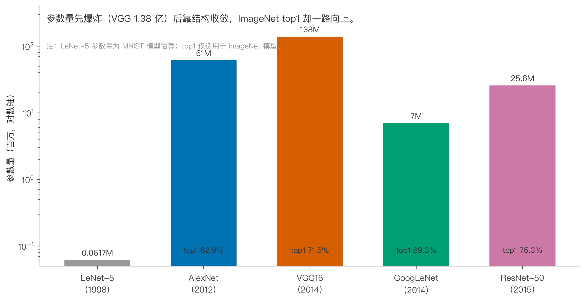
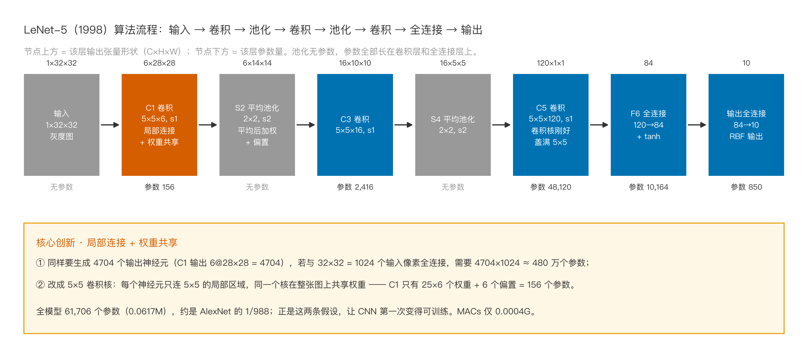
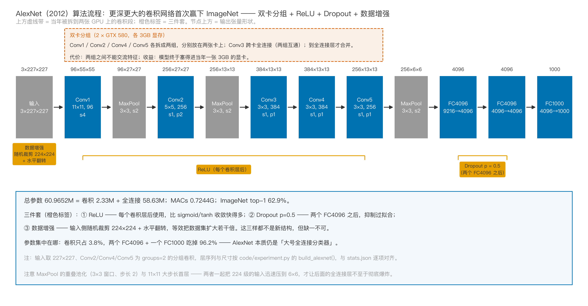
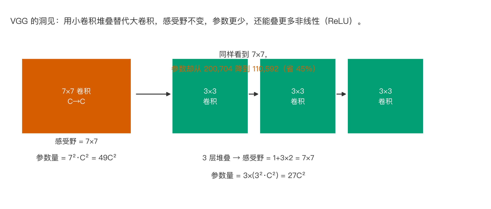
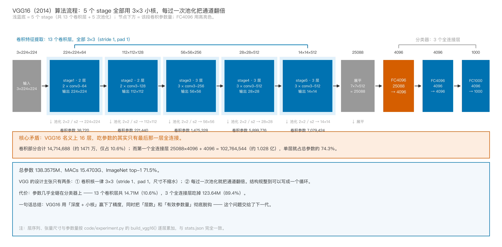
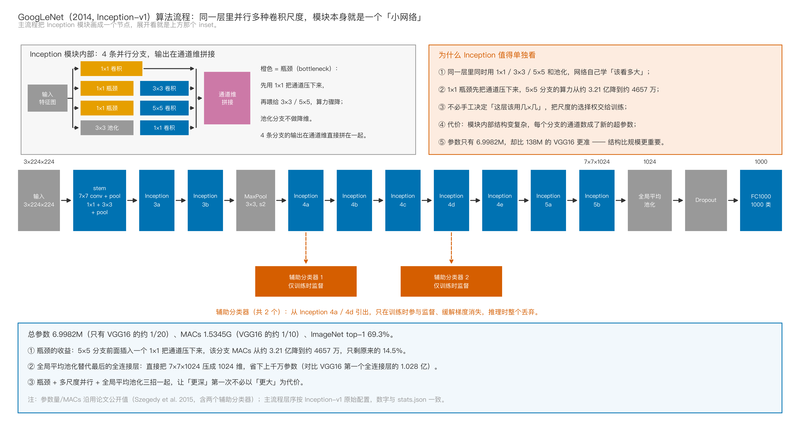
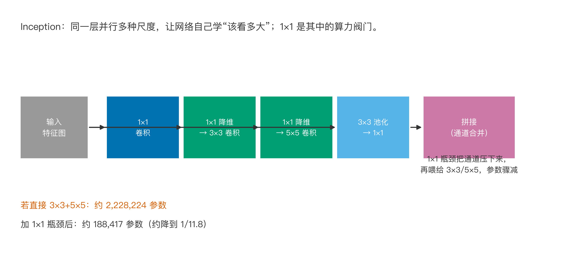
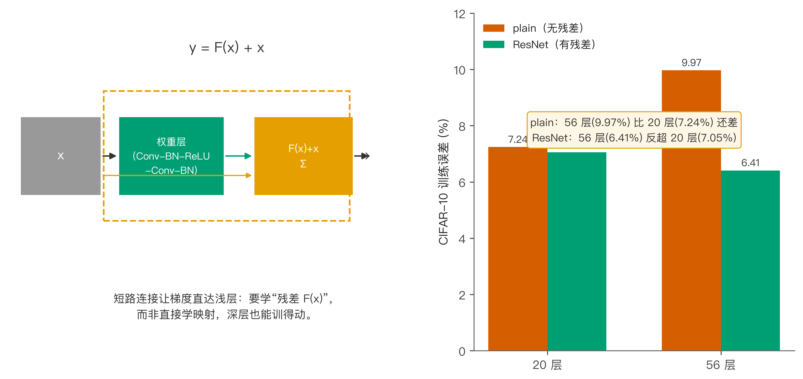
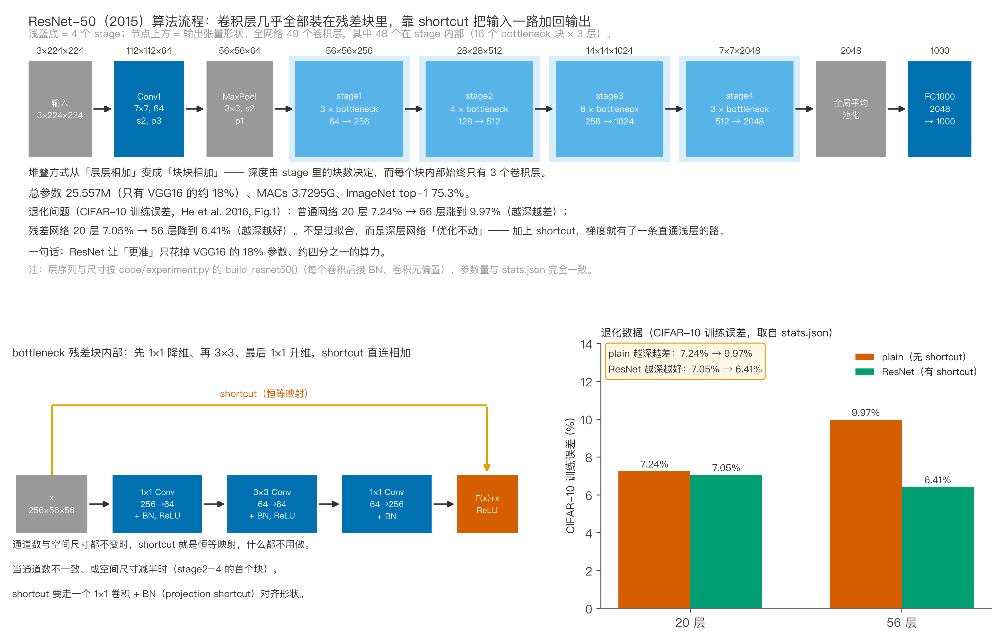
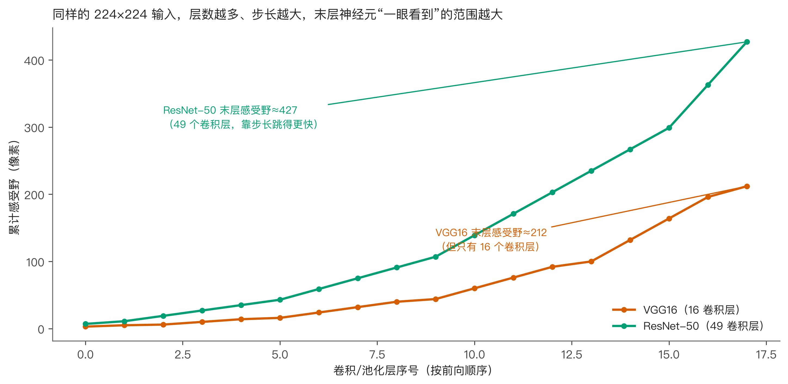

# 从手写数字到ImageNet冠军：CNN架构20年，为什么越深越难训？

手机相册能自动把猫和狗分开，门禁能认出你是谁，医学影像里的结节也能被算法标出来。这些应用看起来各不相同，背后其实共用同一套基础结构：卷积神经网络，也就是 CNN。

这些名字你可能在教程里见过：LeNet-5、AlexNet、VGG、GoogLeNet、ResNet。它们常被排成一张时间表，旁边标着参数量和准确率，像一串不断变大的数字。但有意思的不是数字本身，而是背后的取舍：同一个问题，20 年里为什么会反复换解法？故事可以从一张很小的灰度图说起。1998 年，Yann LeCun 的 LeNet-5 把这套方法固定下来：卷积提特征、池化降采样、全连接分类。

可并不是越深就越强。2015 年 ResNet 的论文里有个让人意外的发现：在 CIFAR-10 上，56 层的普通网络训练误差反而比 20 层高。这不是过拟合，因为训练集本身都没学好。

我把这 20 年看成 CNN 架构的五次“换脑”，每一代都在回答同一个问题：卷积之后，怎么堆叠才更好？LeNet-5 定义了模板，AlexNet 证明了大数据的威力，VGG 把小卷积核堆到极致，GoogLeNet 用多尺度并行压缩参数，ResNet 用一条短路连接解决了深层网络训练不动的难题。

下面按时间线拆解这五代：用手算参数量的方式讲清“数据从哪来”，再用论文数据说明它们在应用上的差别。你会看到为什么 VGG16 有 1.38 亿参数，ResNet-50 却只有 2555 万，后者反而更准；为什么 3×3 小核比 7×7 大核更划算；为什么网络变深会出现退化，残差连接又是怎么破解的。文里的卷积层参数、MACs 和感受野都给了公式，结果不是从教程里抄的，而是 code/experiment.py 从每层架构定义里逐项累加出来的。



## 一、LeNet-5：CNN 的原始模板

1998 年的 LeNet-5 不是第一个神经网络，但它是第一个把 CNN 的核心操作固定成完整 pipeline 的模型。输入很小，32×32 的灰度图，输出 10 个数字类别；整张网络只有 7 层：2 个卷积层、2 个池化层、3 个全连接层。

它第一次明确告诉我们：局部连接和权重共享能大幅减少参数。全连接层想把 32×32 的图映射到 6 个 28×28 的特征图，需要 32×32×6×28×28 这个量级的参数；卷积层用 5×5 的核在图上滑动，只要 6×5×5×1 个权重再加 6 个偏置，就能完成同样的空间特征提取。整张网络的走法是这样的：



### 1.1 为什么卷积比全连接更省参数

全连接层的每个输出神经元都和所有输入神经元相连。输入是 32×32=1024 个像素，输出是 28×28×6=4704 个神经元，参数就有 1024×4704 个权重再加 4704 个偏置，总共接近 480 万。

卷积层完全不同。它用同一个 5×5 的核扫过整张图，每个输出位置共享同一组权重，权重只和核大小、输入输出通道有关：6 个核，每个 5×5×1=25 个权重，总共 150 个，再加 6 个偏置，只有 156 个参数。

同样是生成 4704 个输出神经元，全连接层要 480 万参数，卷积层只要 156 个，这就是局部连接和权重共享的威力。

### 1.2 层与层之间的尺寸怎么变

第一层卷积 C1 用 6 个 5×5 的核，无填充，步长 1，从 32×32 得到 6 个 28×28 的特征图，计算方式是 (32 - 5) + 1 = 28。

第二层 S2 是 2×2 平均池化，步长 2，把 28×28 降到 14×14。池化层没有参数，只有下采样操作。

池化看着简单，作用却不小：它把特征图尺寸砍半，后面的计算量降到四分之一，同时给网络一点“位置容忍度”。笔画挪一个像素，卷积输出的激活值也会挪一个像素，但 2×2 池化取的是小区域里的最大值或平均值，轻微位移不改变结果，这种平移不变性正是 CNN 能认出手写数字的原因之一。

第三层 C3 用 16 个 5×5 的核，输出 16 个 10×10；第四层 S4 再次池化，得到 16 个 5×5。

第五层 C5 用 120 个 5×5 的核，输入特征图正好也是 5×5，输出 120 个 1×1，实际作用已经和全连接很接近。

之后接两个全连接层：F6 是 120→84，输出层是 84→10，最后的 10 个神经元对应 0 到 9 十个数字。

### 1.3 参数量怎么手算

卷积层的参数由权重和偏置两部分组成。若输入通道数为 c_in，输出通道数为 c_out，卷积核尺寸为 k×k，则权重有 c_out × k × k × c_in 个，偏置有 c_out 个，总参数为：

$$
P_{\text{conv}} = c_{out} \cdot k^2 \cdot c_{in} + c_{out}
$$

全连接层更简单：输入神经元 n_in，输出神经元 n_out，参数为 n_in × n_out + n_out。

按这个公式，LeNet-5 的参数可以逐项列出：

- C1：6 × 5 × 5 × 1 + 6 = 156
- C3：16 × 5 × 5 × 6 + 16 = 2416
- C5：120 × 5 × 5 × 16 + 120 = 48120
- F6：120 × 84 + 84 = 10164
- 输出层：84 × 10 + 10 = 850

需要说明一点：C3 层在原论文里并不是全连接卷积，而是用固定连接表把前一层 6 个特征图的子集连到这层 16 个特征图，这里按全连接卷积近似，是为了让手算公式通用。最终总参数量约 61706，也就是 0.0617M。

这个数量级今天看微不足道，但当时已经能在 MNIST 上做到 99% 以上的准确率。LeNet-5 验证了三件事：卷积层能省参数，池化层能降维度，反向传播能端到端训练整个网络。

### 1.4 计算量怎么手算

卷积层的乘加次数（MACs）等于每个输出位置要做的乘加次数乘以输出位置总数：

$$
\text{MACs}_{\text{conv}} = c_{out} \cdot k^2 \cdot c_{in} \cdot h_{out} \cdot w_{out}
$$

以 C1 为例：6 × 5 × 5 × 1 × 28 × 28 = 117600。把所有卷积层和全连接层的 MACs 加起来，LeNet-5 的总 MACs 约为 416520，折算 FLOPs 约为 8.3×10^5。现代手机 NPU 每秒可以做 10^9 次运算，所以 LeNet-5 放在今天几乎是一瞬间的事。

LeNet-5 之后，CNN 沉寂了十几年：不是它不好，而是数据和算力都不够。MNIST 只有 6 万张手写数字，真实世界的图片却千变万化，用灰度图训出来的网络换成彩色实拍图就失灵；1998 年的 CPU 训这么小的网络都要好几天，更大的网络根本不现实。

真正卡住 CNN 的是三件事同时不够：数据不够大、算力不够快、算法技巧不够好。它们到 2012 年才凑齐，AlexNet 用 ImageNet 大赛的结果证明：只要数据够多、GPU 够快，CNN 可以远远超过传统方法。

## 二、AlexNet：大数据时代的第一次爆发

2012 年，Alex Krizhevsky、Ilya Sutskever 和 Geoffrey Hinton 的 AlexNet 在 ImageNet 大规模视觉识别挑战赛上把 top-5 错误率从 26% 一下子拉到 15.3%，比第二名高出 10 个百分点以上，整个领域重新开始关注 CNN。

先说清楚这个比赛的分量。ImageNet 有 1000 个类别、120 万张训练图、5 万张验证图，全是网上收集的真实照片：同一类狗有几十个品种，同一品种在不同照片里姿态、光照、背景都不一样。在 AlexNet 之前，最好的传统方法 top-5 错误率在 26% 左右，很多年进展缓慢。AlexNet 一次把误差砍掉四成，这个差距大到无法忽视。

AlexNet 的输入是 227×227 的彩色图。论文正文里写的是 224×224 的裁剪块，但 11×11 的卷积核配步长 4 要除得尽，真实实现吃进去的是 227×227，本文的 MACs 也是按 227 算的。它比 LeNet-5 的 32×32 大了近 50 倍。网络共有 8 层：5 个卷积层 + 3 个全连接层。总参数量 60,965,224，也就是 60.9652M，约 6097 万，是 LeNet-5 的 1000 倍。它这 8 层是怎么走的，以及那三件新东西分别装在哪个位置，看这张图：



### 2.1 为什么 AlexNet 能赢

它做了三件当时很新、现在很基础的事。

第一件是用 ReLU 代替 sigmoid 或 tanh。sigmoid 的导数在输入很大或很小时接近 0，梯度会消失，深层网络极难训。ReLU 的公式是 f(x)=max(0,x)，梯度在正区间恒为 1，训练速度比 tanh 快好几倍。

第二件是用 Dropout。全连接层训练时随机把 50% 的神经元输出置零，相当于每次训练都换一个子网络，网络没法过分依赖某几条路径，过拟合被抑制住。

第三件是数据增强。AlexNet 对 256×256 的原图随机裁剪到 224×224，再做水平翻转，每张原图能生成几十张训练样本，等效把数据集扩大了几十倍。

### 2.2 GPU 与双卡训练

AlexNet 还有一个容易被忽略的细节：它用了两块 GTX 580 训练。当时单卡显存只有 3GB，放不下整个网络，他们把卷积层分成两组分别放在两张卡上，这也解释了为什么某些卷积层的通道数是偶数。GPU 的并行能力把训练时间从几个月缩到几天。

### 2.3 参数量分布：大头在全连接

AlexNet 的总参数约 60.9652M，其中卷积层只有 233 万左右，全连接层占了 5863 万左右。中间两个全连接层 F6 和 F7 每个都是 4096×4096，各含 1678 万参数。

AlexNet 看起来深，但“胖”主要胖在最后几层。它的前两个卷积层用了 11×11 和 5×5 的大核，步长也大（4 和 1），可以在早期快速扩大感受野。卷积后面接局部响应归一化（LRN），这个技巧后来被 Batch Normalization 取代。

为什么要用大核？第一层直接面对原始像素，感受野太小的话，每个神经元只能看到很小一片颜色和亮度，形不成有意义的特征。用 11×11 的核、步长 4，第一层就能覆盖 11×11 的局部纹理；后面几层特征已经抽象，3×3 或 5×5 就够了。

### 2.4 计算量、准确率与感受野

AlexNet 的总 MACs 约为 724,406,816，也就是 0.7244G。FLOPs 约 1.45G。它在 ImageNet 上的 top-1 准确率达到 62.9%，top-5 达到 82.3%。

AlexNet 的意义不只是准确率：它证明了只要数据和算力够，把网络加宽加深就能显著提升效果。但它也埋下一个隐患，全连接层占了绝大多数参数，而这些参数对位置依赖很强，泛化能力有限。

举个例子，AlexNet 的第一个全连接层要把 6×6×256=9216 维特征压成 4096 维，光这一层就有 9216×4096+4096 约 3775 万参数，比整个卷积部分还大，而这 3775 万参数里很多只是在记住训练图里物体出现的位置，换个位置就认不出来。

接下来 VGG 把这个隐患推到了极致。

## 三、VGG：用小卷积核堆出“深度”，也堆出参数爆炸

2014 年，牛津大学的 Karen Simonyan 和 Andrew Zisserman 提出了 VGG。他们的核心观点是：与其用 7×7 或 11×11 的大核，不如只用 3×3 的小核，多堆几层。

### 3.1 三个 3×3 等效一个 7×7

两层 3×3 卷积（无填充）的感受野是 5×5，三层是 7×7。一个 7×7 卷积层能“看”到的范围，用三个 3×3 也能做到。

但参数更省。假设输入输出通道数都是 C：一个 7×7 核有 49C^2 个权重，三个 3×3 核只有 27C^2 个权重，相当于用 55% 的参数覆盖同样的感受野。



更深的网络还有个好处：非线性次数更多。每层卷积后面都接 ReLU，三个 3×3 就有三次 ReLU，一个 7×7 只有两次，非线性更多，网络能表达的函数更复杂。

假设输入输出都是 64 通道，用一个 7×7 核，权重是 7×7×64×64=200704；用三个 3×3 核，每个权重是 3×3×64×64=36864，三个加起来 110592，前者是后者的 1.81 倍。这笔账就是 VGG 敢全用 3×3 的底气。

### 3.2 VGG16 的架构

VGG16 有 13 个卷积层和 3 个全连接层，共 16 层。卷积层分成 5 个 stage，每个 stage 后面跟 2×2 最大池化，步长 2：

- stage1：2 个 conv3-64，输出 224×224×64
- stage2：2 个 conv3-128，输出 112×112×128
- stage3：3 个 conv3-256，输出 56×56×256
- stage4：3 个 conv3-512，输出 28×28×512
- stage5：3 个 conv3-512，输出 14×14×512
- 之后展平成 25088 维，接 FC4096、FC4096、FC1000

这五个 stage 每段的输出尺寸和参数量差别很大，把它们并排放在一起看，就能明白 VGG16 的参数到底堆在哪一层：



### 3.3 参数爆炸：1.38 亿

按公式逐项累加，VGG16 的总参数量为 138,357,544，也就是 138.3575M，约 1.38 亿，其中卷积层约 1471 万，全连接层约 1.24 亿。

具体到最大的那一层：stage5 输出是 7×7×512=25088 维，第一个全连接层把它映射到 4096 维，参数是 25088×4096+4096 约 1.028 亿。光是这一层就占了 VGG16 总参数的 74.3%，真正吃参数的只有最后那一层全连接，这就是后来网络都想把全连接层干掉的原因。

它的总 MACs 达到 15,470,264,320，即 15.4703G。FLOPs 约 30.94G。ImageNet top-1 准确率提升到 71.5%，比 AlexNet 高出 8.6 个百分点。

### 3.4 感受野的累计增长

VGG16 的卷积核虽然小，但池化层不断把特征图缩小，后面几层的感受野会变大。按逐层公式：

$$
\text{RF}_{l} = \text{RF}_{l-1} + (k-1) \cdot \prod_{i=1}^{l-1} s_i
$$

其中 s_i 是前面所有层的累计步长。从 224×224 输入开始，经过 5 次池化和 13 次卷积，VGG16 最后一层的感受野达到 212×212 像素，输出层每个神经元已经能看到几乎整张输入图。

VGG16 证明了两件事：小核堆叠能做大感受野，但参数和计算量也双双爆炸，训练它需要很大的显存和时间。于是人们开始想：能不能在保持准确率的同时把参数砍下来？

VGG 团队还提出了更深的 VGG19，把每个 stage 的卷积层数从 2、2、3、3、3 加到 2、2、4、4、4，总层数变成 19，参数量约 1.44 亿，ImageNet top-1 大约 72.4%，只比 VGG16 高不到 1 个百分点。继续加深度收益已经递减，想再往上走就得换结构，这也是 GoogLeNet 和 ResNet 出现的背景。

## 四、GoogLeNet：多尺度并行 + 1×1 瓶颈

2014 年同一年，Google 的 GoogLeNet 给出了另一个答案：不是把层堆得更深，而是在同一层里并行多种尺度的卷积，然后用 1×1 卷积做“瓶颈”。它的整体长相和 VGG 完全不同，串起来的不是一串卷积，而是九个 Inception 模块：



### 4.1 Inception 模块长什么样

Inception 模块有 4 个分支：1×1 卷积、3×3 卷积、5×5 卷积、3×3 最大池化。4 个分支的输出在通道维度上拼接起来，形成下一层的输入。

好处是网络能自己决定“该看多大”的区域：小物体只需要局部信息，大物体需要全局信息，多种尺度并行比强制只选一种核更灵活。



但直接这样做通道数会爆炸。上一层的输出是 28×28×256，如果 4 个分支都保持 256 通道，拼接后会变成 1024 通道，计算量翻两番。

### 4.2 1×1 卷积是算力阀门

GoogLeNet 的办法是在 3×3 和 5×5 分支前面先加一层 1×1 卷积，把通道数压下来，比如从 256 压到 64，再做 3×3。1×1 卷积的参数和计算量都小，却能显著降低后续大核卷积的通道数。

一个 1×1 卷积把 c_in 个通道映射到 c_out 个通道，本质上是在每个空间位置做一次全连接，参数为 c_in × c_out。它改变通道数但不改变空间尺寸，所以叫“瓶颈层”。

为什么叫瓶颈？因为它像沙漏：先把通道数收窄，做完昂贵的卷积再放开。假设输入是 28×28×256，直接做 5×5 输出 64 通道，MACs 是 256×5×5×64×28×28 约 3.21 亿。如果在 5×5 前面先加一个输出 32 通道的 1×1，MACs 分成两段：256×1×1×32×28×28 约 643 万，加上 32×5×5×64×28×28 约 4014 万，合计约 4657 万。计算量降到原来的 14.5%，这就是 1×1 卷积被称为“算力阀门”的原因。

### 4.3 参数量与辅助分类器

GoogLeNet 只有 22 层，但用 Inception 模块堆叠，总参数量只有 6,998,216，即 6.9982M，约 699.8 万，是 VGG16 的 1/20。ImageNet top-1 准确率 69.3%，只比 VGG16 低 2.2 个百分点，模型却小得多。

它的总 MACs 约为 1,534,464,704，即 1.5345G。FLOPs 约 3.07G，是 VGG16 的 1/5 左右。结构设计得好，用更少的参数也能达到接近的精度。

GoogLeNet 还有个独特设计：网络中间插了两个辅助分类器，从中间层输出预测结果，和最终分类器一起参与训练，用来缓解梯度消失，让中间层也能拿到监督信号，思路和后来的深度监督网络一脉相承。

### 4.4 GoogLeNet 的应用定位

模型体积小，让 GoogLeNet 很适合部署在资源受限的环境，比如 2014 年的移动设备、嵌入式相机、早期的自动驾驶感知模块。它的设计理念影响了后来的 MobileNet、EfficientNet：与其堆参数，不如在结构上“精打细算”。

Google 后来迭代出了 Inception-v2、v3、v4。v3 把 5×5 卷积拆成两个 3×3，把 n×n 卷积拆成 1×n 和 n×1 两个非对称卷积，一个 7×7 卷积拆成 1×7 和 7×1，参数从 49 降到 14。Inception 这条线贡献的是一整套“把大卷积拆小”的方法论。

但 GoogLeNet 解决的是“参数多”的问题，还没解决“网络深了训练不动”的问题。真正把这个难题捅破的，是 2015 年的 ResNet。

## 五、ResNet：短路连接与退化问题

2015 年，何恺明团队在 CVPR 发表了 ResNet。它的核心发现是：对于普通网络，56 层在 CIFAR-10 上的训练误差反而比 20 层高。这不是过拟合，他们把这种现象叫做“退化”（degradation）。

### 5.1 退化不是过拟合

过拟合是训练误差低、测试误差高，退化是训练误差本身变高：网络深了以后连拟合训练数据都困难。这说明深层网络的优化有问题，不是容量不够，而是梯度传不下去。

这里有个思维实验能帮我们想明白。假设一个 20 层的网络已经训得不错，我把它加深到 56 层。理论上只要让新增的 36 层全部做恒等映射，也就是输出等于输入，56 层网络至少应该和 20 层一样好，因为它至少能退化成浅网络。但实验结果里深网络反而更差，说明问题不在“表达能力”，而在“优化能力”：网络明明有这能力，训练过程却找不到这个解。恒等映射看着简单，让一堆卷积层加非线性去逼近它反而困难。

ResNet 的论文给出了 CIFAR-10 上的对比数据：

- plain 20 层：训练误差 7.24%
- plain 56 层：训练误差 9.97%
- ResNet 20 层：训练误差 7.05%
- ResNet 56 层：训练误差 6.41%

普通网络越深越差，残差网络越深越好。



### 5.2 残差块：y = F(x) + x

ResNet 的解决办法是在每个卷积块旁边加一条“短路”：输出不是 F(x)，而是 F(x) + x。用公式写：

$$
y = \mathcal{F}(x, \{W_i\}) + x
$$

这里的 F(x) 是两层或三层卷积组成的残差映射。如果最优映射接近恒等映射，网络只需要让 F(x) 趋近于 0，这比直接学恒等映射容易得多。

反向传播时，短路连接让梯度可以跳过中间层直接回传。假设损失对 y 的梯度为 ∂L/∂y，那么对 x 的梯度为：

$$
\frac{\partial L}{\partial x} = \frac{\partial L}{\partial y} \cdot \left(1 + \frac{\partial \mathcal{F}(x)}{\partial x}\right)
$$

即使中间层 F(x) 的梯度很小，短路项里的 1 也能保证梯度不会消失。

### 5.3 Bottleneck 与 ResNet-50

ResNet-50 用了一种叫 bottleneck 的块：1×1 降维 → 3×3 卷积 → 1×1 升维。中间 3×3 的通道数被压到输入的 1/4，计算量大幅下降。比如输入输出都是 256 通道，bottleneck 中间只有 64 通道。

ResNet-50 有 49 个卷积层 + 1 个全连接层，总参数量 25,557,032，即 25.557M，是 VGG16 的 18%，却比 VGG16 深得多。总 MACs 约 3,729,522,688，即 3.7295G。FLOPs 约 7.459G，ImageNet top-1 准确率 75.3%，比 VGG16 高出 3.8 个百分点。

49 个卷积层不可能一层层画出来，它的组织方式是四个 stage，每个 stage 里叠若干个 bottleneck 块，块与块之间靠那条短路连起来：



ResNet 家族很容易扩展：ResNet-18、ResNet-34 用基本块，ResNet-50、ResNet-101、ResNet-152 用 bottleneck 块。最深的 ResNet-152 在 ImageNet 上继续提升，没有退化，说明残差连接把“可训练深度”的上限提高了很多。

还有个细节：残差连接有两条路，一条是主路上的卷积，另一条直接把输入加过去。当输入输出通道数不一致或者空间尺寸要减半时，直接相连的短路也要做一次 1×1 卷积来调整，这叫 projection shortcut，否则两个张量形状对不上，加法就没法做。这也是为什么算 ResNet 参数量时，下采样的残差块会比普通块多出一小部分参数。

ResNet 的思想后来也被用到其他领域：Transformer 里的残差连接、循环网络的跳层连接，本质上都是同一件事，给梯度修一条高速路，让深层网络能训得动。

### 5.4 感受野与步长

ResNet-50 早期用 7×7 大核、步长 2，并在 stage2、stage3、stage4 的残差块里用步长 2 下采样，感受野增长得比 VGG16 快得多。最终 ResNet-50 的感受野达到 427×427，已经超出 224×224 的输入尺寸。



这意味着 ResNet-50 的顶层神经元能看到整张图，甚至能看到图外的“零填充区域”。感受野不是越大越好，但足够大是理解全局上下文的前提。

不过感受野很容易被误解：它说的是“理论上能影响这个神经元输出的输入像素范围”，不代表网络真的用到了这个范围内的所有信息，中间的有效权重往往更大。所以看到很大的感受野数值，也要结合层数、步长和任务一起判断。后来有人专门提出“有效感受野”，研究的就是实际影响范围。

## 六、五代架构的对比与应用差异

### 6.1 参数与计算量对比

| 网络 | 年份 | 参数量 | MACs | ImageNet top-1 | 核心创新 |
|------|------|--------|------|----------------|----------|
| LeNet-5 | 1998 | 0.0617M | 0.42M | — | CNN 模板 |
| AlexNet | 2012 | 60.9652M | 0.72G | 62.9% | ReLU/Dropout/数据增强 |
| VGG16 | 2014 | 138.3575M | 15.47G | 71.5% | 3×3 小核堆叠 |
| GoogLeNet | 2014 | 6.9982M | 1.53G | 69.3% | Inception + 1×1 瓶颈 |
| ResNet-50 | 2015 | 25.557M | 3.73G | 75.3% | 残差连接 |

从上表能读出三件事。参数先爆炸再收敛：VGG16 的 138.3575M 是峰值，之后的 GoogLeNet 和 ResNet 用更巧妙的结构把参数打了下来，准确率反而更高。计算量和准确率也不完全成正比：AlexNet 的 MACs 只有 0.72G，top-1 只有 62.9%；VGG16 花了 15.47G 才把 top-1 提到 71.5%；ResNet-50 用 3.73G 就达到 75.3%，结构效率比单纯的“更大更深”更重要。最后，“深度”本身不是目的：ResNet-50 比 VGG16 深得多，靠残差连接才训得动，没有这个结构创新，50 层根本训不动。

### 6.2 应用差异

LeNet-5 如今更多作为教学示例，真正落地的手写数字识别会用更深的网络。

AlexNet 开启了深度学习在计算机视觉里的应用浪潮，它验证的三件套（ReLU、Dropout、数据增强）至今仍是标准操作。

VGG16 结构简单、特征提取能力强，常被用作迁移学习的 backbone，很多早期目标检测、语义分割网络（比如 Faster R-CNN、FCN）都用它。缺点是模型大、推理慢。

GoogLeNet 模型小，适合移动端和嵌入式部署，Inception 思想也影响了后来的 MobileNet、EfficientNet。

ResNet 及其变体（ResNeXt、DenseNet、ConvNeXt）是工业界最主流的 backbone，从 18 层到 152 层都能稳定训练，广泛用于图像分类、目标检测、人脸识别、医学影像分析等任务。

选哪个网络，本质上是在回答三个问题：算力预算多少？数据量多大？部署在服务器还是手机？这比记住“ResNet 最先进”实用得多。

### 6.3 一个具体的案例

假设你要做一个手机端的“拍照识花”应用。

方案 A：用 VGG16 做 backbone。准确率可能不错，但模型 500MB 以上，推理慢、耗电快。

方案 B：换成 ResNet-18 或 MobileNetV2，参数少一个数量级，推理速度提升几倍，准确率只低一点点。

方案 C：数据量很小的话，可以用 ImageNet 上预训练的 ResNet-50 做特征提取，只训练最后一层分类器，这就是迁移学习。

更贴近生产的是工业质检：流水线要在几十毫秒内判断零件有没有划痕，VGG16 基本不可能入选，它单次推理就要 15G MACs。常见做法是用 ResNet-18 或更小的 MobileNet，把输入分辨率降到 224 甚至 128，再配合 TensorRT 之类的推理优化框架。准确率可能从 95% 掉到 93%，但单帧延迟从 200 毫秒压到 10 毫秒，产线节拍才跟得上。

这两个例子说明同一件事：真实项目里准确率从来不是唯一指标，延迟、显存、功耗、部署成本往往比多出来的一两个点更重要。CNN 架构这 20 年的演化，就是在这些约束下找更优解。

### 6.4 为什么深度本身值得追求

有人会问：既然 GoogLeNet 用 22 层就能拿到 69.3%，那何必非要堆到 50 层、152 层？

答案是特征的层次性。浅层卷积学到的是边缘、颜色、纹理，中层是局部形状，深层是物体部件甚至整个物体，层数越多，能表达的抽象层级越高。区分猫和狗这种简单任务，浅层就够了；区分 200 种鸟这种细粒度分类，就需要更深的层次来捕捉喙、羽毛、尾巴的差别。

所以深度的价值不在深度本身，而在于它给了网络更多“逐级抽象”的机会。ResNet 的贡献就是把这个机会从“理论上可行”变成“工程上可训”，这才是它被引用十万次以上的根本原因。

## 七、三个值得记住的结论

第一，CNN 架构的进化不是简单的“越深越好”，而是“怎么让深网络能训动”。LeNet-5 定义了模板，AlexNet 证明了数据和算力的价值，VGG 探索了小核堆叠的极限，GoogLeNet 用多尺度并行压缩参数，ResNet 用短路连接解决了退化问题。

这五代不是简单的替代关系：VGG 的 3×3 堆叠至今还在很多小网络里用，GoogLeNet 的 1×1 瓶颈成了现代卷积块的标配，ResNet 的残差连接被写进了几乎每个视觉 backbone。这些部分拼在一起，才是今天 from torchvision import models 能一行调出来的那些网络。

第二，参数量不等于准确度。VGG16 有 138.3575M 参数，ResNet-50 只有 25.557M，但 ResNet-50 的 top-1 准确率更高。结构设计的效率，比参数数量更能决定最终性能。

这个结论在实际工作里很有用。很多人做模型会觉得“参数越多越厉害”，随手挑一个最大的网络，结果显存爆了、推理慢得没法上线，准确率也没比小模型高多少。该先问的是这个任务需要多大的感受野、多深的层次、多少通道。

第三，感受野和计算效率需要权衡。小核堆叠省参数但感受野增长慢，大核和 stride 下采样增长快但容易丢细节。不同任务需要不同的感受野：细粒度分类要局部细节，场景理解要全局上下文。选网络时先把这两件事想清楚，比背下每一代的参数量更有用。

这三点合起来，就是 CNN 架构设计的核心矛盾：想提高表达力就得加深加宽，加深加宽又会带来参数膨胀和训练困难。五代架构的每一次突破，都是在想办法绕开这个矛盾。

还有一点值得提：Batch Normalization。它和 ResNet 同期出现在 2015 年，把每层输入重新标准化到均值 0、方差 1，再学两个缩放平移参数拉回合适的分布，训练时就能用更大的学习率，对初始化也没那么敏感。

## 八、自己动手复现

本文所有数字都来自两个本地脚本：code/experiment.py 从架构定义手算参数量和 MACs，code/figures.py 用 matplotlib 重绘配图，不依赖外部图片或数据下载。

code/experiment.py 的做法是：先定义每个网络的层序列，再逐层模拟前向传播时特征图尺寸的变化，同时按公式累加参数和乘加次数。卷积层参数是 c_out × k × k × c_in + c_out，MACs 是 c_out × k × k × c_in × h_out × w_out，池化层只改变空间尺寸，所有数字最后写进 stats.json。

容易踩的坑是：不同网络的卷积层参数结构不一样。LeNet-5、AlexNet、VGG 的卷积层带偏置、不带 BN，参数是 c_out × k × k × c_in + c_out；ResNet 的卷积层带 BN、不带偏置，参数是 c_out × k × k × c_in + 2 × c_out，多出来的两项是 BN 的缩放和平移。脚本里如果对所有卷积层用同一个默认值，ResNet 的参数量就会算错。

运行命令如下：

```bash
cd CV5_cnn_architectures/code
python experiment.py   # 生成 stats.json
python figures.py      # 生成 figures/*.png
```

想把 ResNet-50 改成 101 层，或者改动感受野公式，改 experiment.py 里的 stage 定义就能重新生成所有数字。ResNet-101 的瓶颈块数量是 [3, 4, 23, 3]，把 ResNet-50 的 [3, 4, 6, 3] 换掉，参数量会从 25.557M 涨到大约 44.5M，其余数字自动重算。配图字体用 STHeiti，配色用 Okabe-Ito 色盲安全方案。

文中的论文数据都能在原文里查到：退化的四个训练误差来自 He et al. 2016 的 ResNet 论文图 1，GoogLeNet 的参数量来自 Szegedy et al. 2015 的 CVPR 论文，各网络的 top-1 准确率来自对应原论文。手算参数和这些公开值吻合，说明脚本的层定义没写错。

---

看到这你可能会问：如果 ResNet 解决了退化问题，那后来的 ConvNeXt、Swin Transformer 又在解决什么问题？下一篇 CV6 会从 CNN 转向视觉 Transformer，聊聊注意力机制是怎么重新画“感受野”这张地图的。你会继续追吗？在评论区留下你的判断：未来三年，纯 CNN backbone 还会是工业主流吗？
