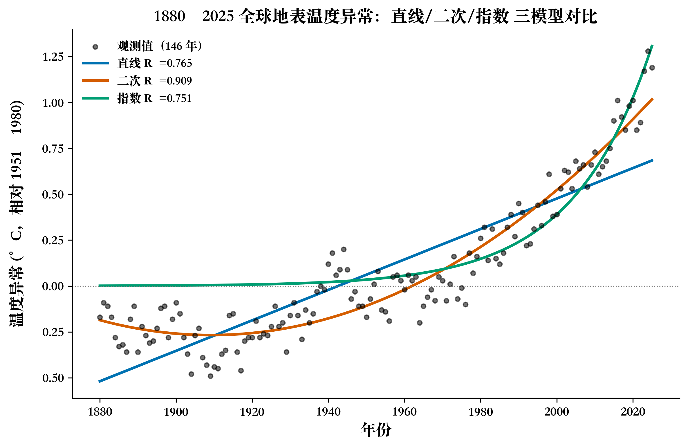
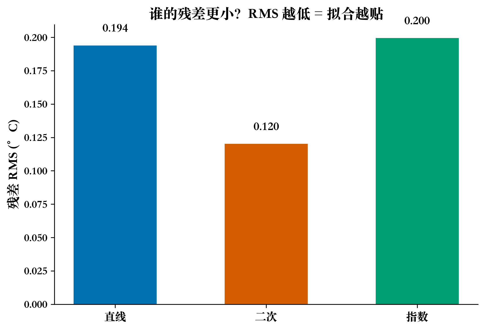
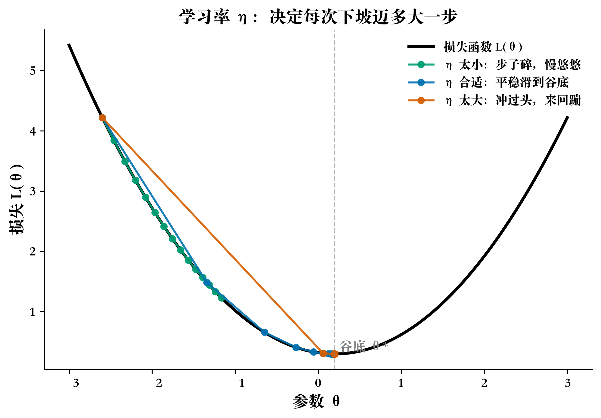
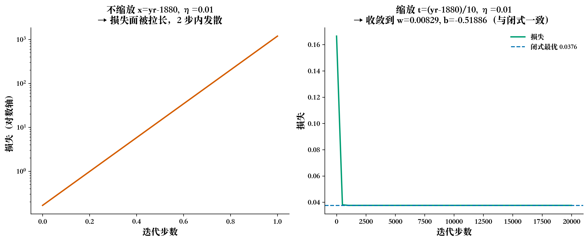
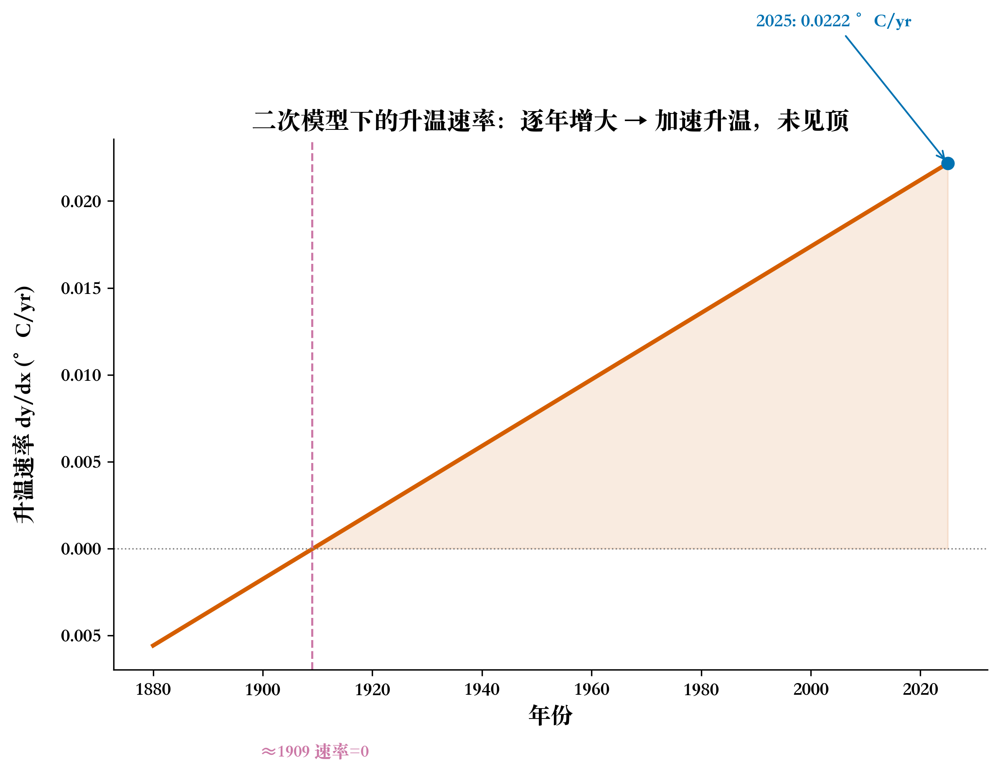

# 地球越来越热，还是已经热到头了？

> 数据：NASA GISS Surface Temperature Analysis（GISTEMP v4），1880–2025，共 146 年
> 工具：Python / NumPy
> 这篇文章想做的事很朴素：拿一份公开的温度数据，用几行最小二乘，把"地球是不是在加速变热"这件事算个清楚。

## 这事是怎么来的

每年夏天，热搜上总冒出几条"史上最热一天""今年又破纪录"的新闻。朋友圈里一半人在喊热，另一半人翻出十年前的旧文，说当年不是还预测要变冷吗。吵来吵去，真正的问题其实就一个：

地球到底是在持续地、越来越快地变热，还是已经热到了头、要往下走了？

靠感觉答不了这个。新闻标题会说"今年最热"，但它不会告诉你，这种热是稳稳地往上爬，是越爬越快，还是已经拐了弯。要分得清这三种走向，得先有一份长得足够久、口径足够稳的温度记录，再把它塞进数学里，让模型替我们量一量它的斜率和曲率。

NASA 恰好有一份从 1880 年一直记到今天的全球地表温度数据，146 年，年年可比。下面我就拿它当尺子，把上面那个问题老老实实算一遍。

## 先拆问题

把 1880–2025 这 146 年的全球温度异常扔进数学里，能不能判断它是在加速升温、还是已经到顶？

这个问题不能一口吞，我把它切成四块，每块都给实打实的数据或数学证据，最后再拼回去：

1. 数据：用哪份、取哪一列、截哪一段，才算"全球年度温度"。这一步定错了，后面全歪。
2. 模型：直线、二次、指数，选哪个来拟合最合适，谁的证据更硬。
3. 参数：拟合出的 w、b 是怎么算出来的，换一种算法还能对上吗。
4. 判断：模型只是画了条线，怎么从这条线读出"在加速"还是"到顶"。

下面逐块来。

---

## Q1：数据从哪来，怎么对齐

先解决"量什么"。公开数据里，NASA GISTEMP 几乎是"全球年度温度"的代名词，1880 年至今不断更新，口径一致，原始 CSV 直接能下载。我从 GISS 官网拿到表，表头长这样：

```
Year, Jan, Feb, Mar, Apr, May, Jun, Jul, Aug, Sep, Oct, Nov, Dec, J-D, D-N, ...
```

有个坑先说：别拿 Dec 那一列当年度值。Dec 是 12 月单月，`J-D`（Jan-Dec 全年平均）才是真正的年度值，在 CSV 里是第 13 列（0 索引为 13）。要是一不小心用了 12 月，拟合结果会整个跑偏。

我的处理：

- 用 `J-D`（年度均值，列索引 13）作为年度温度异常，单位 °C，相对 1951–1980 基线。
- 剔除 2026（当年只有部分月份，NASA 用 `***` 占位），保留 1880–2025 共 **146 个数据点**。
- 解析时把 `.-0.17` 这种记法转成浮点数（NASA 用 `.` 表示整数部分为 0）。

存成 `gistemp_1880_2025.csv`（`year,anomaly_C` 两列，146 行），这就是后面所有计算的输入。

最后 6 行原始值，你可以用眼睛核一下：

| 年 | 温度异常 (°C) |
| --- | --- |
| 2020 | 1.01 |
| 2021 | 0.85 |
| 2022 | 0.89 |
| 2023 | 1.17 |
| 2024 | 1.28 |
| 2025 | 1.19 |

(数据来源：NASA GISTEMP v4，2025 数值为该机构发布口径。)

数据定下来了。接下来才是重头戏：拿一条什么样的曲线去套它。

---

## Q2：选哪种函数拟合最合适

模型选错，后面判断"加速还是到顶"全白搭。我列了三个都有物理或数学动机的候选，不是凑数，用同一份数据各自拟合，再用 R² 和 AICc 横着比。

| 模型 | 函数形式 | 动机 | 参数量 k |
| --- | --- | --- | --- |
| 直线 | y = w·x + b | 最朴素的"随时间线性变化"，没有额外假设 | 2 |
| 二次 | y = a·x² + b·x + c | 允许升温速率随时间变化，能捕捉加速或减速 | 3 |
| 指数 | y = a·exp(c·x) | 假设"升温按比例放大"，对应正反馈的直觉 | 2 |

x = 年份 - 1880（这样 x=0 对应 1880 年，量级在 0–145）。

表里的 w、b、a、c 都是模型里要"拟合"出来的未知数：整篇文章的算术目标就是把它们求出来，让曲线最贴近数据点。以直线为例：w 是斜率，即"每过一年全球温度异常平均升多少（°C/yr）"；b 是截距，即直线在 1880 年（x=0）处的落点。下一节会一步步算它们。

拟合都用最小二乘：直线和二次直接 `np.linalg.lstsq`（闭式解），指数用 Levenberg–Marquardt 跑非线性最小二乘（自己写的 30 行 LM，不依赖 scipy）。

实跑结果（🏃 用 `verify_all.py` 重现）：

| 模型 | R² | 残差 RMS (°C) | AICc |
| --- | --- | --- | --- |
| 直线 | 0.7647 | 0.1939 | -474.94 |
| **二次** | **0.9094** | **0.1203** | **-612.26** |
| 指数 | 0.7508 | 0.1995 | -466.58 |

怎么看这张表：

- R² 越大越好。二次 0.91 大于直线 0.76，也大于指数 0.75。二次把接近 91% 的方差都解释了。
- AICc 越小越好，它比 R² 多带一项"参数惩罚"，专治"复杂模型硬赢"。二次 −612 比直线 −475、指数 −467 都低一截，说明在 n=146 这个样本量上，二次是真正最优，不是靠着多一个参数赢的。
- 指数最差（AICc −466，连直线都不如）。原因很硬：1880–1920 这 40 年的温度异常是负值，大约在 −0.17 到 −0.30 之间，而 `a·exp(c·x)` 永远大于等于 0，根本拟合不了这一段。指数模型天生和"先降温后升温"的真实数据不兼容。

所以结论是：三个候选里，二次最合适，R² 最高、AICc 最低，早期那段负值它也能接住。

不过有件事得说清：二次最优，不代表直线不能用。直线 R²=0.76 也算有 76% 的解释力，而且它最简单，最好跟读者解释（每十年升温多少度）。我下面先拿直线把"参数怎么算"这件事讲透，再用二次去真正回答加速还是到顶，是因为二次的导数是一个常数（加速度 = 2a），天生就是干这个的。


*图 2：146 个观测点加三条模型曲线。二次（橙）几乎贴着数据点走，指数（绿）早期对不上负值，直线（蓝）整体偏低、末端偏低估。*


*图 3：残差 RMS 柱图。二次 RMS=0.12，比直线 0.19、指数 0.20 都低。*

---

## Q3：w、b 是怎么算出来的

Q2 结尾我留了一句话：先用直线把"参数怎么算"讲透，再用二次去回答加速还是到顶。这么做有实在的理由：直线只有 w、b 两个未知数，最小二乘能一步给出闭式解，还能拿梯度下降独立验证一遍；把这套算法先在直线上学扎实，等下套到二次、指数上才不会发懵。

这一节就只盯着直线模型 y = w·x + b，把它的两个参数求出来，而且用两种方法对一遍答案。

### 先说怎么"闭式"算出 w、b

前面提到直线有一招闭式解。闭式这两个字的意思很简单：不用一遍遍试错，套一个公式就能一步把答案拿到手。

最小二乘的目标也很直白：找一组 (w, b)，让 146 个数据点各自到直线上的竖直距离的平方加起来最小。这其实就是 Q2 里算残差 RMS 时那些"偏差"的平方和，只不过这里不除 N、也不开方，只看总和最小的那个 (w, b)。

把 N 个观测排成矩阵，就长这样：

$$
A = \begin{bmatrix} x_1 & 1 \\ \vdots & \vdots \\ x_N & 1 \end{bmatrix}, \quad
\theta = \begin{bmatrix} w \\ b \end{bmatrix}, \quad
A\theta \approx y
$$

每个点写成一行 [x, 1]，整堆数据叠成矩阵 A，温度值堆成向量 y。用 Aθ 去逼近 y 这件事，数学上正好有一个一步到位的解法，叫正规方程：

`θ* = (AᵀA)⁻¹ Aᵀy`

做一次矩阵乘法、求一次逆，w 和 b 直接就出来了。落到 NumPy 里，其实就一行：

```python
A = np.vstack([x, np.ones_like(x)]).T
w, b = np.linalg.lstsq(A, y, rcond=None)[0]
```

在 146 个点上跑一遍（x = 年份减 1880，y 取 `gistemp_1880_2025.csv` 里的温度异常），得到：

> w = 0.00829 °C/yr，b = −0.51886

读起来就是：每过一年，全球温度异常平均往上走 0.00829 °C，差不多十年升 0.083 °C。b 是这条直线外推回 1880 年那个点的截距，代表那一年的基准偏离，主要作用是把整条线的位置摆正，单独说没什么物理含义。

### 用梯度下降再算一遍

闭式解成立的前提是矩阵可逆、算术稳定。我想确认这两条都成立，于是用梯度下降独立求一遍。

损失用均方误差的 1/2（方便求导）：

$$
L(w, b) = \frac{1}{N}\sum_{i=1}^{N}(wx_i + b - y_i)^2
$$

梯度：

$$
\frac{\partial L}{\partial w} = \frac{2}{N}\sum_i (wx_i + b - y_i)\,x_i, \quad
\frac{\partial L}{\partial b} = \frac{2}{N}\sum_i (wx_i + b - y_i)
$$

更新规则：θ ← θ − η · ∇L。

这里有个真实的坑，也是我画了图 4 的原因。如果直接用 `x = yr - 1880`（值域 0–145），学习率 η = 0.01 在 2 万步内数值发散，w 滚到 1e4 量级再溢出成 NaN。原因是 x 太大，损失面被拉得很扁，步子一下跨过谷底来回蹦。

解决方法是把 x 特征缩放成 `t = (yr - 1880) / 10`（值域 0–14.5）。同样的 η=0.01，2 万步后：

> 缩放后梯度下降：`w_t = 0.082923`，`b = −0.51886` → 反算回原尺度 `w = w_t / 10 = 0.00829` °C/yr，b 不变。

跟闭式解完全一致，差值 1.13e-16，已经到机器精度。这就把"闭式对、梯度下降也能到"两端都对上了。


*图 1：凸损失函数上的三种学习率轨迹。η 太小磨蹭，η 合适滑到谷底，η 太大来回蹦。*


*图 4：左，不缩放，损失迅速发散；右，缩放后平稳收敛到与闭式相同的损失。*

🏃 想自己跑一遍，把下面这段贴到 Python：

```python
import numpy as np
y, x = np.loadtxt("gistemp_1880_2025.csv", delimiter=",", skiprows=1, unpack=True)
x = x - 1880  # 距 1880 的年数

# 1) 闭式
A = np.vstack([x, np.ones_like(x)]).T
w, b = np.linalg.lstsq(A, y, rcond=None)[0]
print(f"闭式: w={w:.5f} b={b:.5f}")

# 2) 梯度下降 + 特征缩放
t = x / 10
wt, bg, eta = 0.0, 0.0, 0.01
for _ in range(20000):
    e = wt*t + bg - y
    wt -= eta * (2/len(y)) * np.sum(e*t)
    bg -= eta * (2/len(y)) * np.sum(e)
print(f"梯度下降: w={wt/10:.5f} b={bg:.5f}")
```

---

## Q4：怎么读出"加速"还是"到顶"

参数和方法都验过了，现在用二次模型去回答那个最初的问题。

"到顶"的意思，是温度异常不再上升。翻译成数学，就是拟合函数在某处出现极大值，也就是导数等于 0，而且过了那点之后变负。光盯着"2025 年 = 1.19 °C"这种数字没用：1.19 本身高不高不重要，重要的是升温速率（每年还在涨多少）和加速度（这个速率本身在不在变）。

对二次模型 `y = a·x² + b·x + c`：

- 一阶导 `dy/dx = 2a·x + b`，这是升温速率，单位 °C/yr。
- 二阶导 `d²y/dx² = 2a`，这是加速度，单位 °C/yr²。本数据 2a = **+0.0001914 °C/yr²**，大于 0，意味着升温在加速。

把 1880–2025 几个节点的升温速率列出来：

| 年份 | 升温速率 dy/dx (°C/yr) |
| --- | --- |
| 1880 | −0.0056（轻微降温） |
| 1950 | +0.0078 |
| 1980 | +0.0136 |
| 2000 | +0.0174 |
| 2025 | +0.0222 |

速率从负翻正，之后单调往上，到 2025 年还没有到顶。按这个二次模型，速率等于 0 的点在 1909 年，之前略冷、之后越来越热，那之后还没出现过极大值。


*图 5：二次模型的升温速率曲线。1909 年穿过 0，之后单调上升，到 2025 年仍 +0.0222 °C/yr，且还在增大。橙色填充是加速升温区间。*

说句实在话：2025 年"是否到顶"是模型和数据共同给出的回答。二次模型假设加速度恒定（2a 是常数），在 146 年数据上拟合得很好，但不能据此外推未来 50 年。温度系统涉及海洋、植被、气溶胶等复杂反馈，加速度不会永远是正的常数。这篇文章只回答 1880–2025 这 146 年的事实，不做长期预测。

---

## 汇总：标题的答案

把四块的结论拼回去：

- 数据（Q1）：NASA GISTEMP 1880–2025 共 146 年，取 J-D 列年度均值。
- 模型（Q2）：三个候选里，二次 R² 最高、AICc 最低，最合适。
- 参数（Q3）：闭式最小二乘和梯度下降（需特征缩放）都给出 w = 0.00829 °C/yr，b = −0.51886，互相验证。
- 导数（Q4）：二次模型加速度 2a = +0.0001914 °C/yr²，大于 0，升温在加速；2025 年升温速率 +0.0222 °C/yr 仍在增大，没有到顶迹象。

回到开头那个问题：

> **地球越来越热，还是已经热到头了？**
> 基于 1880–2025 这 146 年的 NASA GISTEMP 数据，用二次模型（146 点中 R²=0.91、AICc 最小）拟合，升温加速度为正，2025 年升温速率仍在增大。目前没有到顶迹象，地球是在加速变热。

## 三个值得记住的点

1. 模型选择要双指标（R² 加 AICc）。单看 R² 会让复杂模型硬赢，AICc 加了参数惩罚才公平。本数据 n=146，AICc 完全有效，二次 R² 0.91 对直线 0.76、AICc −612 对 −475，差距显著，不是噪声。
2. 梯度下降必须做特征缩放。x 在 0–145 的量级时，η=0.01 直接发散成 NaN；缩放到 t=(yr-1880)/10，同样的 η 收敛到机器精度。数据尺度不对，再好的算法也跑不出来。
3. "是否到顶"看的是导数，不是数值。2025 年温度异常 1.19 °C 高不高是次要的，关键是 dy/dx = +0.0222 °C/yr 还在增大，这个升温速率才回答到没到顶。

## 数据与代码

- 数据：`data/gistemp_1880_2025.csv`（146 行，year, anomaly_C）
- 原始下载：`https://data.giss.nasa.gov/gistemp/tabledata_v4/GLB.Ts+dSST.csv`
- 数值验证脚本：`code/verify_all.py`（一行实跑三模型 + R²/AICc + 导数）
- 配图脚本：`code/gen_gistemp_figures.py`（5 张图皆从 CSV 重现）

---

## 代码与数据（GitHub）

本文所有数字与配图均由可复现脚本生成，代码、原始数据与配图已整理上传至 GitHub 仓库：

- 仓库地址：`https://github.com/beverlyLee/ai-guanxingji`
- 本篇目录：`https://github.com/beverlyLee/ai-guanxingji/tree/main/H1`
- 复现脚本：`fit_exp_lm.py`
