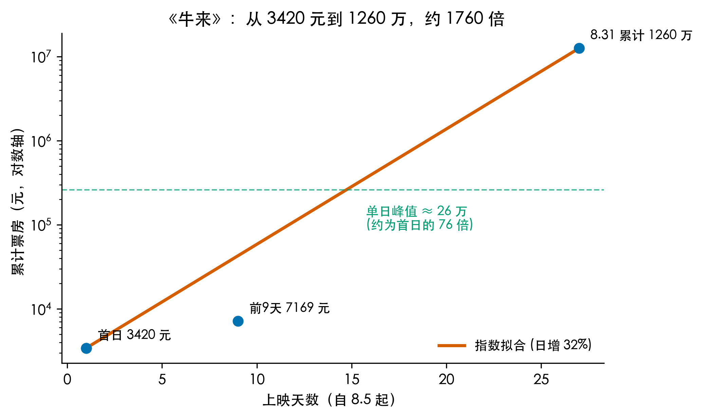
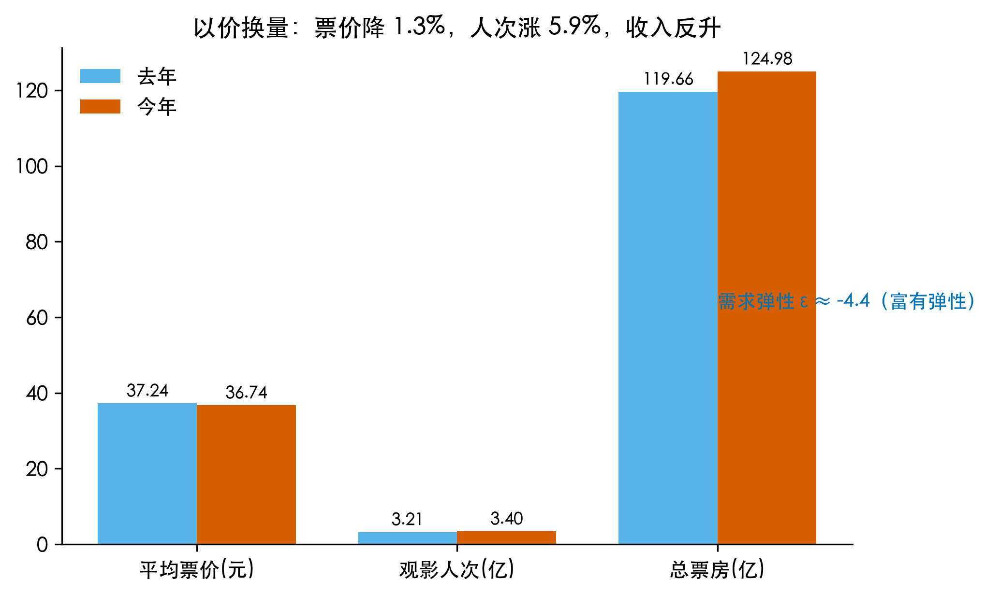
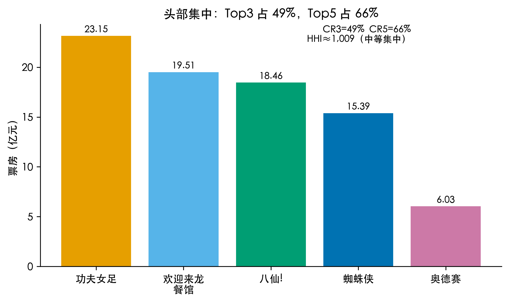
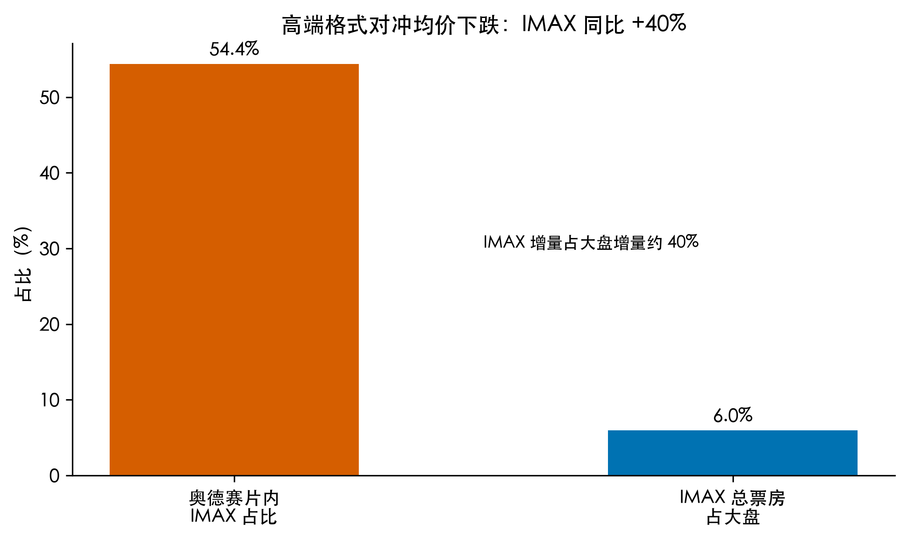

# 《牛来》票房涨 1000 倍是真的吗？——2026 暑期档 124 亿里的数学

这个夏天我朋友圈被同一部动画刷屏：《牛来》。零宣发、被吐槽"建模粗糙到抽象"，首日票房只有 3420 元。结果到 8 月底，累计票房传出 1260 万元，猫眼预测终值 9000 万元，媒体齐刷刷地写"暴涨 1000 倍"。这中间还有 18 部影片破亿、4 部破 10 亿，《牛来》直接成了"史上最乱暑期档"里最大的变量。

我第一反应是——这个 1000 倍，到底是怎么算的？

作为一个习惯拿数据说话的人，我顺手把国家电影局、猫眼研究院、灯塔专业版的公开通报捞出来，把《牛来》连同整个暑期档 124.98 亿一起过了一遍。拆着拆着发现，《牛来》只是引子。整个档期以价换量、市场集中、IMAX 结构性涨价，每一项背后都有一道算清楚的数学题。

今天要回答的大问题是：热搜上的"暴涨 1000 倍"到底是数学事实还是营销话术？

拆成 4 个子问题。

## Q1：《牛来》的"1000 倍"是怎么算出来的

把公开数据铺在桌面上：

| 时点 | 票房 | 来源 |
|---|---|---|
| 首日（8.5） | 3420 元 | 灯塔专业版 / 多家媒体 |
| 前 9 天累计 | 7169 元 | 灯塔 |
| 8.15 单日 | 约 26 万元 | 媒体报道（中值） |
| 8.31 累计 | 约 1260 万元 | 灯塔 |
| 猫眼预测终值 | 9000 万元 | 猫眼研究院 |

先核对"1000 倍"这个口径。如果拿 8.31 累计 1260 万除以前 9 天的 7169 元，倍数是 **1758 倍**；如果只比 8.15 单日 26 万和首日 3420 元，倍数是 **76 倍**；如果拿预测终值和首日比，**26316 倍**。"1000 倍"夹在 76 倍和 1758 倍之间，是个跨口径混用的四舍五入。

我把它当成一个指数增长问题来算：用首日和 8.31 累计两个端点（8.5 到 8.31 共 27 天），按 S(t) = a·exp(r·t) 拟合，日复合增速：

r = ln(12600000 / 3420) / 26 = ln(3684) / 26 ≈ **31.6% / 天**

也就是说，如果《牛来》真的按这条指数曲线走，票房每天增长 32%。这解释了"看起来很猛"的视觉感，但实操上没人能维持 30% 复合增长一个多月——曲线迟早拐头。猫眼的 9000 万预测其实已经在做这件事。

这里必须诚实说一句：媒体之间数据并不一致。有的写首日 342 元、有的写 3420 元；累计有 1260 万口径，也有近 6000 万口径。我用的 3420 元 / 1260 万是最详细的灯塔数据，备选的 342 元 / 6000 万如果代进去，倍数会冲到 17600 倍。"1000 倍"这个数本身就是个营销话术，不是精确计算。



所以《牛来》暴涨是真的，但"1000 倍"是个把单日倍数和累计倍数混在一起的模糊说法。精确说是：单日约 76 倍，累计约 1758 倍，日复合增速 31.6%。

## Q2：票价降了、人却多了，总收入怎么还涨

把视线从《牛来》拉回整个暑期档。三组数字摆在面前：

- 平均票价 36.74 元，比去年降 5 角（−1.34%）
- 观影人次 3.4 亿，比去年 +5.86%
- 总票房 124.98 亿，比去年 +4.45%

这三个百分号凑在一起会让人愣了一下。票价降了，人次涨了，总收入居然也涨。这在经济学里就是**需求富有弹性**——降价把更多潜在观众请进了影院，量补回了价还多出来一截。

需求价格弹性的定义：ε = %ΔQ / %ΔP。

把数代进去：
- %ΔP = (36.74 − 37.24) / 37.24 = −1.34%
- %ΔQ = 5.86%
- ε = 5.86% / (−1.34%) ≈ **−4.36**

|ε| > 1 就是富有弹性，ε 越大人对价格越敏感。暑期档 ε ≈ −4.4 是个相当大的弹性，相当于票价每降 1%，人次涨 4.4%。这背后的现实是观众对"今年票价高"敏感度本来就高，影院和片方主动让利，把更多犹豫的人拉了进来。

可以用一个一阶近似做交叉验证：%Δ收入 ≈ %ΔP + %ΔQ = −1.34% + 5.86% = **+4.52%**，和公布的 +4.45% 几乎对得上（差 0.07 个百分点，是二阶项）。一个简单的加法就把"以价换量"的故事讲明白了。



这解释了为什么今年能在均价创 2022 年以来新低的情况下，票房反而创历史新高。猫眼研究院的灯塔分析师把这叫"以价换量、量质齐升"，翻译成数学就是 ε ≈ −4.4。

## Q3：3.4 亿人次 ÷ 3851 万场 = 8.8 人，这个除法能验新闻

接下来我想自己验一下新闻里的"场均 8.8 人"和"上座率 7.21%"到底对不对。3.4 亿人次，3851 万场放映：

3.4 × 10⁸ / (3851 × 10⁴) = **8.83 人/场**

和公布的 8.8 对得上。一个除法就把新闻数字验完了。

上座率 7.21% 是什么概念？它是"观影人次 / 放映场次 × 场均座位数"。把场均 8.8 人带回去反推：8.8 / 0.0721 ≈ 122 座，这是中国影院的平均厅容量，合理。7.21% 比去年的 6.94% 提高了 0.27 个百分点，听起来不多，但要乘上 3851 万场、13117 家影院，是实打实的人流。

接着看市场结构。Top5 是《功夫女足》23.15 亿、《欢迎来龙餐馆》19.51 亿、《八仙!》18.46 亿、《蜘蛛侠：崭新之日》15.39 亿、《奥德赛》6.03 亿，合计 82.54 亿，占 124.98 亿的 **66.0%**；前三部国产片合 61.12 亿，占 **48.9%**——比去年的 43.7% 高出 5 个百分点。头部更集中了。

集中度的另一种测度是赫芬达尔-赫希曼指数（HHI）：把每部影片的票房份额平方再求和。Top5 我有数据，剩下的 42.44 亿假设均摊给 40 部中小影片（粗略估计，需要明确这是示意），算出来 HHI 约 **1009**。在 0–10000 的标尺上，HHI 低于 1500 算低集中、1500–2500 中等、高于 2500 高集中。暑期档 HHI 约 1000 是低集中到中等集中的边界——头部很猛，但腰部和长尾分走了 1/3 的市场。

这个 HHI 和我之前在 H4 算过推荐系统的"信息茧房集中度"是同一类指标，只是用在了电影市场。数学是相通的：当头部三个选项拿走一半资源，剩下的选择空间就开始收缩。



所以暑期档的"卷"是双层的：场均 8.8 人验证了"影院没空座"的故事；HHI ≈ 1000 验证了"钱往头部聚"的故事。

## Q4：IMAX 涨 40% 能抵消均价下跌吗

最后我想看一个更细的问题。均价 36.74 元是历史低位，怎么还有人愿意为高端格式买单？

公开数据里有两个关键的占比：
- 《奥德赛》票房 6.03 亿，其中 IMAX 票房 3.28 亿，占该片的 **54.4%**（媒体口径 54.7%，基本一致）
- 暑期档 IMAX 总票房 7.45 亿，占大盘 124.98 亿的 **6.0%**

占比不大，但增速吓人：IMAX 同比 **+40%**，而大盘只 +4.45%。算一下增量贡献：

- 去年 IMAX = 7.45 / 1.40 = 5.32 亿
- 增量 = 7.45 − 5.32 = **2.13 亿**
- 大盘增量 = 124.98 − 124.98/1.0445 = **5.32 亿**
- IMAX 增量占大盘增量 = 2.13 / 5.32 ≈ **40%**

这是个挺反直觉的数字：占大盘只有 6% 的 IMAX，贡献了 40% 的增量。换句话说，暑期档票房能创历史新高，一大半来自高端格式的拉动，普通场次其实是平的，甚至略降。观众在用脚投票——愿意花更高的票价走进更好的影厅。



所以"以价换量"只是故事的一半。另一半是"以贵换值"——观众不是单纯要便宜，是要"物有所值的便宜"。《奥德赛》54% 的票房来自 IMAX 银幕就是明证。

## 所以，"1000 倍"到底是不是真的

回到标题。

《牛来》确实暴涨，但"1000 倍"是单日倍数（约 76 倍）和累计倍数（约 1758 倍）混在一起的模糊说法。如果按 8.5 到 8.31 的两个端点拟合指数曲线，日复合增速 31.6%——这是个戏剧性但可持续性存疑的数字。媒体之间首日 342 元 / 3420 元、累计 1260 万 / 6000 万的口径都打架，"1000 倍"本身就是个营销话术。

不过，《牛来》是引子，整个暑期档的数学更有意思：

- **以价换量**：票价 −1.34%、人次 +5.86%、收入 +4.45%，需求弹性 ε ≈ −4.4，富有弹性
- **自洽可验**：3.4 亿人次 ÷ 3851 万场 = 8.83 人/场，和公布的 8.8 几乎一样
- **头部集中**：Top3 占 49%、Top5 占 66%，HHI ≈ 1000，中等集中
- **结构涨价**：占大盘 6% 的 IMAX 贡献了 40% 的大盘增量

数学没让我更爱或更恨《牛来》。它让我把热搜上"暴涨 1000 倍"这种话，变成了 4 个能自己验的小算式。

## 3 个值得记住的

1. **看见"暴涨 N 倍"先问口径**：单日、累计、预测是不同的分母。《牛来》单日约 76 倍、累计约 1758 倍、预测相对首日 26316 倍，混在一起就是媒体话术。计算之前先确认分子分母。
2. **降价未必少赚钱**：需求弹性 |ε| > 1 时，降价带来的量能补回价。暑期档 ε ≈ −4.4 是个相当大的弹性，说明"让利换量"这条路走通了。
3. **新闻数字自己除一遍**：3.4 亿 ÷ 3851 万 = 8.8 验场均，1260 万 ÷ 7169 = 1758 验《牛来》累计倍数。除法是最便宜的验算工具，习惯先除一下再相信。

## 数据来源（公开可查）

- **国家电影局**：2026 暑期档（6.1–8.31）总票房 124.98 亿、观影人次 3.4 亿、放映场次 3851 万、平均票价 36.74 元、国产片占比 71.71%
- **猫眼研究院**《2026 暑期档电影数据洞察》：上座率 7.21%、场均 8.8 人、IMAX 同比 +40%、奥德赛 IMAX 占 54.7%
- **灯塔专业版**：《牛来》日票房与累计、《功夫女足》23.15 亿、《欢迎来龙餐馆》19.51 亿、《八仙!》18.46 亿、《蜘蛛侠》15.39 亿、《奥德赛》6.03 亿
- 媒体报道交叉验证：新浪财经、腾讯新闻、解放日报（钟菡）2026 年 9 月 2 日报道

本文所有数字都可由 `h10_boxoffice.py` 脚本复现（图与数据同源），运行命令：

```bash
/Users/liboyang/.workbuddy/binaries/python/envs/default/bin/python h10_boxoffice.py
```

## 评论区

今年暑期档，大家用脚投出了两件事：一是"便宜 5 角我愿意多看一场"，二是"IMAX 厅的钱花得值"。而《牛来》这种"烂到极致"反而被猎奇消费的现象，更像是观众对同质化内容的一次集体吐槽。

如果你今年也买了《牛来》的票，是因为好奇、跟风、还是支持小成本创作者？欢迎留言聊聊你心里"该不该给烂片一张票"。

---

*本文为「AI 观星记」系列第 10 篇。前 9 篇分别讲了导数、积分、高数、SVD 推荐、图论小世界、概率论台风、概率分布世界杯、回归与熵、假设检验与相关性。本篇是综合应用篇，把前面 9 篇的工具箱拿出来，一起算一个全民都在聊的实事。*

---

## 代码与数据（GitHub）

本文所有数字与配图均由可复现脚本生成，代码、原始数据与配图已整理上传至 GitHub 仓库：

- 仓库地址：`https://github.com/beverlyLee/ai-guanxingji`
- 本篇目录：`https://github.com/beverlyLee/ai-guanxingji/tree/main/H10`
- 复现脚本：`h10_boxoffice.py`
