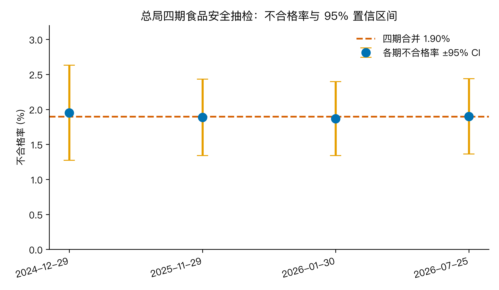
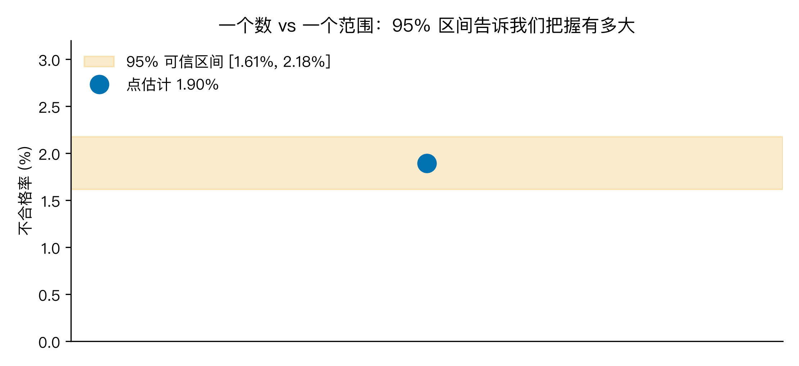
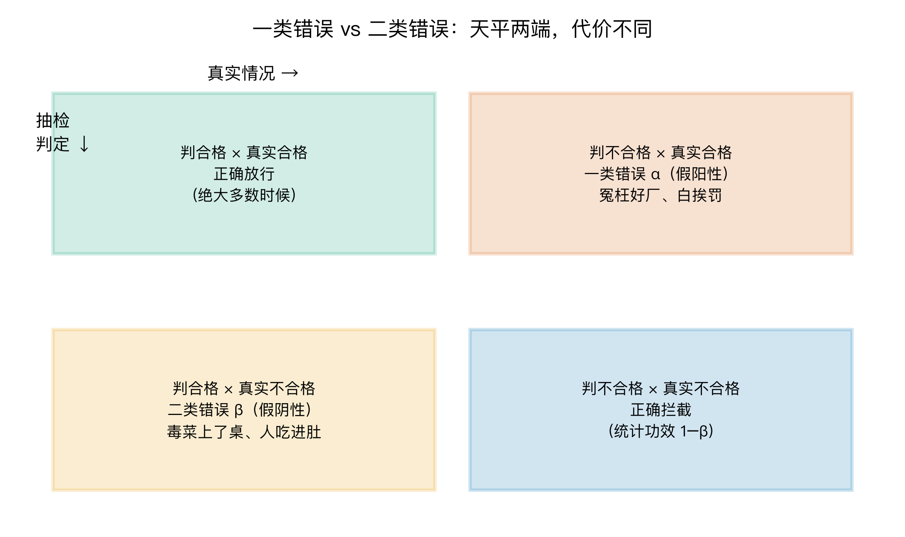
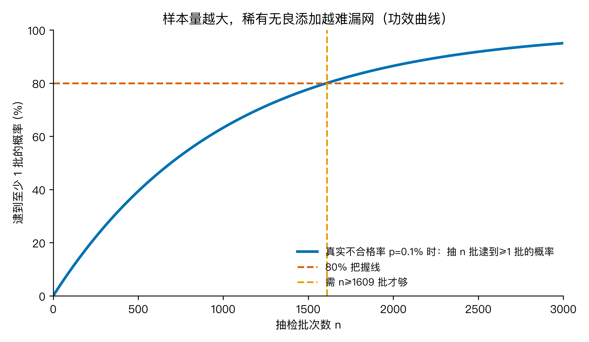

# 甲醛白菜又来了：抽检说『合格』，食品安全到底还能信多少？

这篇要讲的数学，其实就五样，每张都解决一个具体问题：

- 置信区间：点估计"约 2%"到底靠不靠谱，给它套一个误差范围。
- 标准误 SE：这个 2% 抖不抖，量化估计本身的不确定性。
- 一类 / 二类错误：抽检会不会判错，两种判错的代价天差地别。
- 卡方齐性检验：四期数字看着一样，是不是"真的"一样。
- 最小样本量 + 统计功效：要逮住稀有无良添加，到底得抽多少。

不用背公式，跟着问题走就行。

2026 年 8 月，河北康保县一货车被查到白菜蘸甲醛保鲜。8 月 23 日，国务院食安办联合多部门通报，涉事货物未流入市场，多地抽检阴性。朋友圈又一阵唏嘘：这种"化学保鲜"的小动作，是不是只在这一辆车上？ 4 年前 3·15 晚会上，老坛酸菜的"土坑脚踩"还历历在目，年销 30 亿包的酸菜一夜之间变成"脚菜"，康师傅连夜终止合作，插旗菜业等 5 家企业被查处。

为什么抓一次少一次，又来一次？ 这次，我不看个案，看国家市场监督管理总局每季度公布的《食品安全监督抽检不合格情况通报》，四期合计 8965 批，170 批不合格。数据全部公开，通报的文号、批次、来源 URL 都能在 samr.gov.cn 上查到，零编造、零估算。

我手上的数学武器就三件：置信区间（这个点估计到底真不真）、一类/二类错误（抽检会不会判错）、最小样本量（抽多少才够）。够用。

我要回答的大问题是：食品安全抽检到底能信多少？ 围绕它拆成 4 个子问题。

## Q1：不合格率到底多高？

把四期加起来：抽检 8965 批，170 批不合格，"不合格率" p̂ = 170 / 8965 = 0.01896 ≈ 1.90%。这就是电视新闻里常念叨的"约 2% 不合格"。

可它稳不稳？ 单独看四期，2024-12-29 是 1.95%、2025-11-29 是 1.88%、2026-01-30 是 1.87%、2026-07-25 是 1.90%，看起来差不多，但"差不多"是不是真的差不多？ 我用卡方齐性检验看四期是否来自同一个总体。算法很简单：

第一步，假设四期"真的没区别"，那每一期的"期望不合格批数" = 该期抽检数 × 合并率 p̂（1.896%）。四期期望值分别是：
- 2024-12-29：1588 × 1.896% = 30.11 批（合格期望 1557.89）
- 2025-11-29：2387 × 1.896% = 45.26 批
- 2026-01-30：2516 × 1.896% = 47.71 批
- 2026-07-25：2474 × 1.896% = 46.91 批

第二步，对每一期算它对 χ² 的贡献 = (观测 − 期望)² / 期望，合格格也要算。拿第一期举例（期望值用上面的 30.11 / 1557.89）：
- 不合格格：(31 − 30.11)² / 30.11 ≈ 0.026
- 合格格：(1557 − 1557.89)² / 1557.89 ≈ 0.0005
- 小计 ≈ 0.0267

第三步，四期小计相加：
χ² = 0.0267 + 0.0016 + 0.0108 + 0.0002 = 0.039

自由度 df = 期数 − 1 = 4 − 1 = 3，查表临界值 7.815。0.039 远小于 7.815。

意思是说：四期差异在统计上完全可以忽略。这不是某期偶然抽到了劣货，是个稳定基线，每年每季大致就是 1.9% 左右。从 2024 年末到 2026 年中，将近 20 个月，没变过。



## Q2：这个 1.9% 我们有多大把握？

"1.9%" 是个点估计，背后带一个标准误 SE，公式是

SE = √( p̂ × (1 − p̂) / n )

代入数字：SE = √( 0.01896 × 0.98104 / 8965 ) = √( 0.00000208 ) = 0.001441 ≈ 0.144%。

再乘 1.96（正态分布 95% 分位），得到 95% 置信区间（CI）：1.90% ± 1.96 × 0.144% = [1.61%, 2.18%]。换句话说，真实的不合格率有 95% 的把握落在这个区间内。还有 5% 的概率，真实值在 1.61% 以下，或者 2.18% 以上。

更稳一点的 Wilson 区间是 [1.63%, 2.20%]，差别不大，给"小比例"留的保险更大。把四期各自的 95% CI 画出来（fig1），你会发现四个圆点都落在 1.9% 这条红线附近，误差棒有重叠。这就是"没显著差异"的直观版。



> 什么叫置信区间？ 简单说：单看 170 这个数，容易让人觉得"刚好那次抽中了"，但其实 1.6% 和 2.2% 都有可能。CI 就是给点估计套一个"差不多的范围"，让结论不那么绝对。注意 95% 不是说"真实值有 95% 概率在区间里"，而是说"如果重复抽 100 次，95 次算出来的区间会盖住真实值"。

## Q3：抽检会判错吗？

会。 抽检本质是二元判定，每个真实状态（合格 / 不合格）对应四种判定结果（fig3）：

|  | 真实合格 | 真实不合格 |
|---|---|---|
| 判合格 | 正确放行（绝大多数时候） | 二类错误 β（假阴性）：毒菜上了桌，人吃进肚 |
| 判不合格 | 一类错误 α（假阳性）：冤枉好厂，白挨罚 | 正确拦截（统计功效 1 − β） |

α 和 β 是天平的两端，α 调小、β 就变大，反之亦然。绝大多数时候我们不在乎哪种错（数据多、损失小），但食品安全是典型的"错不起"场景：把甲醛白菜放过，一次就出事；冤枉一个好厂，罚点钱、还能申诉。这两类错误的代价完全不在一个量级。

更麻烦的是：甲醛，根本不在国家食品安全监督抽检的常规检测项目里。GB 2760 食品添加剂使用标准覆盖的是二氧化硫、防腐剂、农药残留等，甲醛没有列。这意味着，针对"白菜蘸甲醛"这种特定问题，常规抽检就是系统性放过。不是概率上的二类错误 β，是规则上的二类错误。这种 bug 不是多抽几批能补的，得换检测清单。



## Q4：抽多少才够？

假设真有不合格率 p，要抽多少批才有 80% 的把握逮到至少 1 批不合格品？ 二项分布告诉我们：

P(逮到 ≥ 1) = 1 − (1 − p)ⁿ ≥ 0.80  →  n ≥ log(0.20) / log(1 − p)

代入几个真实比例（fig4）：

- p = 1.9%（抽检的基线） → 抽 85 批就有 80% 把握逮到 1 批
- p = 0.5% → 抽 322 批
- p = 0.1% → 抽 1609 批
- p = 0.01% → 抽 16095 批

抽检批次多不等于万无一失。比例越低，要逮住它需要的样本量是指数上升的。这就是为什么"抽 1 万批都合格"听起来很牛，碰上 0.1% 那种稀有违规，1 万批的把握也只有 63% (1 − 0.999¹⁰⁰⁰⁰ ≈ 0.63)。



## 三个值得记住的点

第一，1.9% 是点估计，真实值在 [1.61%, 2.18%] 之间。看到 "X% 不合格" 这种数字时，先问"区间多少"比问"真假"更专业。点估计给人"安全感"，区间才给"科学感"。

第二，抽检的真正风险不是误杀好厂（一类错误 α），而是放过毒菜（二类错误 β）。把甲醛从 GB 2760 拿掉等于系统性地把 β 调成 100%，这种规则性 bug，多抽几批也补不回来。

第三，样本量 vs 检出能力是指数关系，不是线性。抽 1000 批能逮住 1% 的问题；抽 10000 批只能把 0.1% 问题的把握从 63% 提到 95%，再往上就得花指数级资源。

## 实际案例

老坛酸菜 2022：3·15 晚会曝光湖南插旗菜业等 5 家企业，土坑腌制、脚踩酸菜、防腐剂超标 2 到 10 倍，年销 30 亿包。事件一出，康师傅连夜终止合作，五家企业被查、相关人员被判刑。这个案子从"个案"到"全行业清查"用了不到一周，但对消费者信心的伤害持续了好几年。

甲醛白菜 2026：8 月河北康保县一货车被查，8/23 国务院食安办联合多部门通报，多地抽检阴性、货物未流入市场。比起老坛酸菜，甲醛白菜的"扩散半径"被控住了，这部分要感谢抽检的早发现。可控住一辆车容易，控住一个行业得靠清单和规则的迭代。

保定判例 2023：法院对一起白菜非法添加甲醛案判决，涉案白菜检出甲醛 12.2 mg/kg，当事人被判刑。这条判决把"非法添加甲醛"从"行政处罚"升格到"刑事追责"，填补了抽检之外的一环。

## 哪些场景适合用这套武器

药品抽检。同样的"小比例 + 高风险 + 错不起"场景，假阴性一次就是事故，置信区间 + 最小样本量直接给得出"抽多少批够"。

工厂出厂检验。质检员每天面对成千上万件产品，不合格率通常 0.1% 量级。要给客户一份"我们的不良率是 X% ± Y%"的报告，置信区间比单点估计更稳。

招聘筛选。HR 筛简历类似二类错误问题：放过一个好候选人比冤枉一个差候选人代价小，但反过来想，面试环节的"通过率/录用率"也适用 95% 区间，看清噪声。

A/B 测试样本量。互联网产品的"转化率提升 0.5% 是不是真的"，本质也是小比例 + 显著性问题，本文的功效曲线逻辑直接平移过去。

## 回到题目

食品安全抽检到底能信多少？

答：信，但不能全信。

信的是 98.1% 的批次真的没问题（1 − p̂）；不能全信的是，剩下 1.9% 不是一个干净的"数字"，而是一个有 [1.61%, 2.18%] 误差范围的估计，并且规则清单之外的甲醛、二聚氰胺、塑化剂这些"非标"问题，常规抽检根本逮不到。

抽检不是万能的，但它仍然是目前最便宜、最可重复、最能压住大盘的食品安全网。问题从来不是"信不信抽检"，而是"信哪些、哪些要换方式信、哪些要靠规则迭代"。

## 怎么验证

```
🏃 跑一遍：cd H11 && python3 code/food_safety_stats.py
数据集：data/food_safety_bulletins.csv（4 期总局通报，逐期附 URL）
输出：4 张图 figures/fig1..fig4；逐期率 data/food_safety_rates.csv
依赖：受管 venv 自带的 numpy / matplotlib
```

数字三处一致：脚本打印、CSV 结果、图标注，都是同一组数。改一行 `p_rare` 就能换场景，比如把 p 设成 0.01% 看自家工厂的质检方案够不够。

## 代码与数据（GitHub）

本篇全部可复现：数据集、复现脚本、4 张配图都已上传到仓库 `beverlyLee/ai-guanxingji` 的 `H11/` 目录。

- 仓库地址：https://github.com/beverlyLee/ai-guanxingji
- H11 目录：https://github.com/beverlyLee/ai-guanxingji/tree/main/H11
- 复现脚本：`H11/code/food_safety_stats.py`
- 官方数据：`H11/data/food_safety_bulletins.csv`（4 期总局通报，逐期附 URL）
- 配图：`H11/figures/fig1_rates_ci.png` … `fig4_power_curve.png`

clone 下来后 `cd H11 && python3 code/food_safety_stats.py` 即可一键重生全部数字与配图。

## 最后想问你

你家最近一次"惊吓型"食品安全新闻是哪个？ 你觉得是规则漏洞、抽检太少、还是抽检方向错了？ 如果你是食安办的产品经理，你打算在 GB 2760 之外加哪一条检测项？

## 数据源

国家市场监督管理总局《食品安全监督抽检不合格情况通报》4 期（逐期附 URL，均可公开访问）：

- 2024-12-29 / 2024 年第 30 号 / 抽检 1588 批 / 不合格 31 批  
  https://www.samr.gov.cn:8890/zw/zfxxgk/fdzdgknr/spcjs/art/2025/art_8a75729e2325408e98c1a8d22a535a42.html
- 2025-11-29 / 市监食检发〔2025〕111 号 / 抽检 2387 批 / 不合格 45 批  
  https://www.samr.gov.cn/zw/zfxxgk/fdzdgknr/spcjs/art/2025/art_181963ff0f504834a76040606c981983.html
- 2026-01-30 / 市监食检发〔2026〕5 号 / 抽检 2516 批 / 不合格 47 批  
  https://www.samr.gov.cn:3030/zw/zfxxgk/fdzdgknr/spcjs/art/2026/art_d3a96404007c43b38a642b6ab011a19f.html
- 2026-07-25 / 市监食检发〔2026〕92 号 / 抽检 2474 批 / 不合格 47 批  
  https://www.samr.gov.cn:8060/zw/zfxxgk/fdzdgknr/spcjs/art/2026/art_4471df1845994192bfbb8d14035055a3.html

行级数据可进一步到总局食品抽检查询系统（spcjsac.gsxt.gov.cn）查每批的产品名、企业、不合格项、检测方法。
