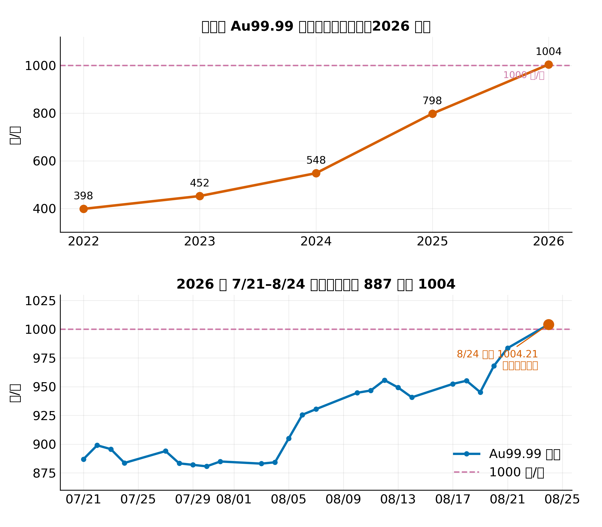
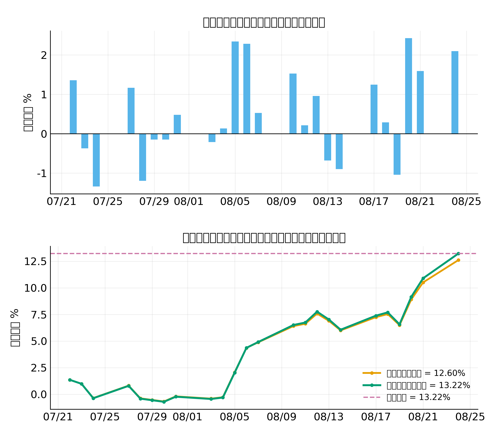
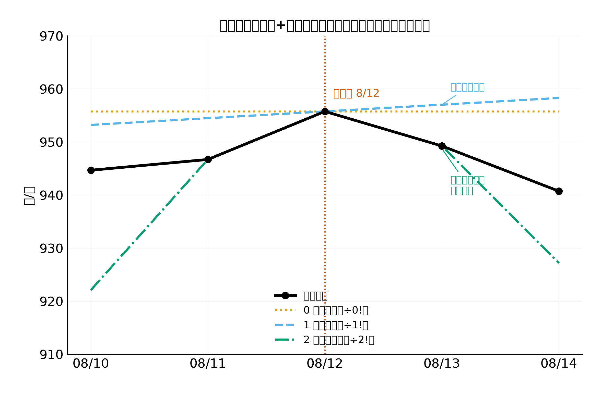
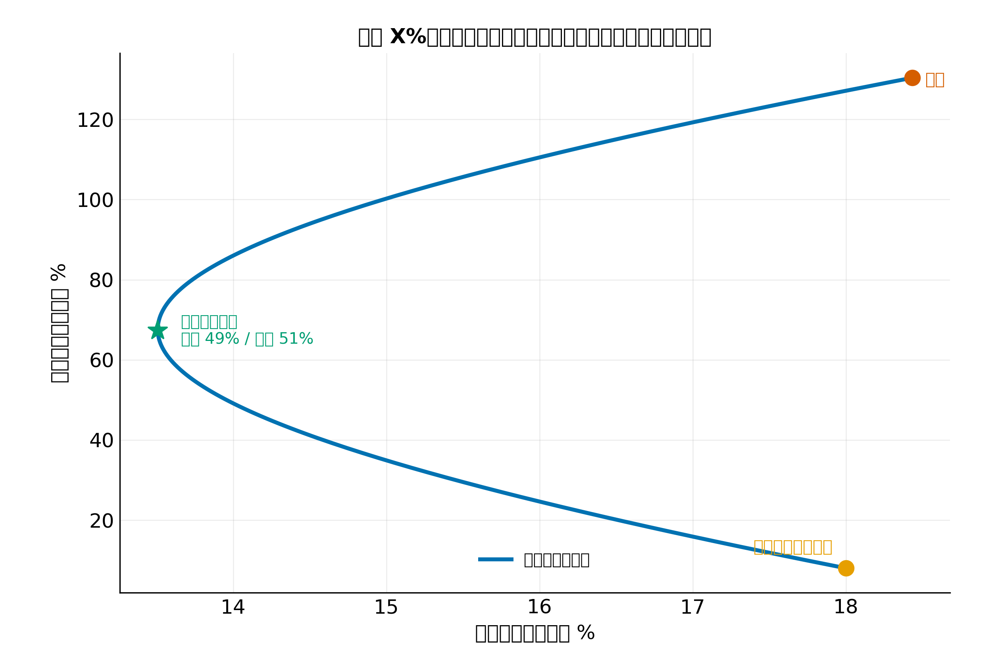

# 国内金价刚破 1000 元/克，但「涨了多少」和「该买多少」是两门数学

> 数据来源：上海黄金交易所 Au99.99 收盘价（2026-07-21 至 2026-08-24，共 25 个交易日，逐日公开），以及过去几年的年均价（约）。每张图都用 Python 从 CSV 重新画，可复现。

---

## 一条朋友圈，把我们领进三门数学

8 月 24 日那天，我刷朋友圈看到三件事：

第一条是「国内金价首次破 1000 元/克」的推送，配图是上海黄金交易所的收盘截图，显示 1004.21 元/克。

第二条是同事在群里说「黄金这么猛，我加仓了」。

第三条是另一个人在底下回：「涨了这么多，要不要追？买多少合适？」

这三个问题不是同一个问题。第一个问的是「涨了多少」，第二个问的是「明天还会涨吗」，第三个问的是「我该买多少」。第一个是积分的活儿，第二个是泰勒展开的活儿，第三个是带约束优化的活儿。三个问题背后站着的是三门成形的数学。

下面我就拿真实数据，一门一门地把它们拆开。

---

## 第一门：算「涨了多少」

### 数据先把背景铺好

我从上金所拉了 7 月 21 日到 8 月 24 日共 25 个交易日的逐日 Au99.99 收盘价（数据见 `data/au99_daily_2026.csv`）。长周期的对照锚点用过去几年的年均价（约，来自公开多源交叉）。先看一眼全貌：



上半张是 2022 → 2025 的年均价，外加 2026 年截至 8 月 24 日的收盘快照。四年前均价 398，今年冲到 1004，整整翻了 2.5 倍。下半张是这一个多月的逐日线，前两周在 880 上下晃，从 8 月初开始加速，8 月 24 日收盘终于破千。

### 别把每天的涨幅简单加起来

我们最关心的问题是「这段时间到底涨了多少」。最直觉的算法是把每天的日收益（今天除以昨天减 1）一路加总。

我跑了一遍（图见 fig2）：

- 7/21 收盘 886.95 元，8/24 收盘 1004.21 元。真实累计涨幅 = 1004.21 ÷ 886.95 − 1 = 13.22%。
- 但如果把每天的日收益简单相加，得到的是 12.60%。
- 差了 0.62 个百分点，看上去不大，可方法上是错的。

为什么错？因为「加日收益」忽略了一件小事：今天赚的 1%，明天也是按今天涨完之后的本金再算的，也就是常说的复利。把每一天的收益真正"攒"起来，得用对数收益：每天算一个 `ln(今天 ÷ 昨天)`，一路累加。



图里那两条线，简单相加是 12.60%，对数收益求和转回来恰好是 13.22%，和真实累计一模一样。

这就是牛顿-莱布尼茨公式的离散版本。连续微积分里有一条 `∫ (P'/P) dt = ln P + C`：累计量等于「相对变化率」的积分。换成离散，就是「每天的相对变化」= 对数收益 `ln(P_t / P_{t-1})`，一路加总 = ln(真实累计比)，再 `exp` 回来 = 真实累计涨幅。三百年这条公式解决的就是这类「把变化攒成总量」的问题。黄金的逐日涨跌，只是它最新的一份应用题。

所以结论 1：算累计收益，先把每天的涨幅取对数再相加，再取指数。这才是精确版本。

---

## 第二门：猜「明天还会涨吗」

### 你能用的信息其实很少

每天收盘，你会拿到三个数：今天的价格、昨天到今天的涨幅、过去几天的趋势。朴素做法是"昨天涨了 X%，明天大概也涨 X%"，也就是用一个固定斜率往明天平推。

数学上有个更体面的写法，叫泰勒展开。挑一个「展开点」 t₀ = 8 月 12 日，在那一点附近，把价格 P(t) 写成：

$$P(t_0 + h) \approx P(t_0) + P'(t_0)\,h + \tfrac{1}{2!}P''(t_0)\,h^2 + \tfrac{1}{3!}P''(t_0)\,h^3 + \cdots$$

每一阶项的分母里都藏着一个阶乘 `n!`。0 阶是常数，1 阶是线性，2 阶开始抓曲率，3 阶抓曲率的变化。阶越高，分母的阶乘越大，远处那一项衰减得越快。这就是为什么"阶越多、展开点附近越准，但远距离不一定更稳"。

我拿真实的 8 月 12 日算了一下（图见 fig3）：

- 当天收盘 P₀ = 955.75 元。
- 一阶斜率 P′ = (949.24 − 946.70) / 2 ≈ 1.27 元/天（轻微上行）。
- 二阶曲率 P″ = 949.24 − 2 × 955.75 + 946.70 ≈ −15.56（轻微下凹，也就是拐弯朝下）。

把这三个数代回去，看 8 月 12 日往后 ±2 天，0/1/2 阶泰勒分别说什么：



- 0 阶是一条平直的黄点线：明天还是 955.75 元。
- 1 阶是一条倾斜的蓝虚线：明天 957.02 元，后天 958.29 元，直线往上爬。
- 2 阶是一条带弯曲的绿点划线：在 8 月 13 日几乎完美贴合实际（绿点和黑点重合在 949.24），但到 8 月 14 日就被拉到了 927 元附近，跟实际 940.72 元明显脱钩。

真相是：8 月 13 日金价小幅下跌，8 月 14 日又继续小幅下跌，和朴素"线性外推往上走"的方向完全相反。一阶泰勒在拐弯处立刻走偏；二阶在展开点附近贴合得很好（这是泰勒的本性），但远离展开点就开始飘了。

### 这件事的实操启示

我并不打算用泰勒来预测明天金价。但它告诉我两件事：

第一，"看斜率就押方向"的朴素预测，遇到拐弯就翻车，一周前的趋势不是后一周的剧本。

第二，越靠近今天的信息越值钱，越远越贬值。这正好就是阶乘 n! 替我们做的事，它把远处的不可靠悄悄压低了。

---

## 第三门：定「该买多少」

### 把"追涨"翻译成一个数学题

光知道涨了 13% 不够用，到底买不买、买多少？直觉的回答是"涨了加仓、跌了减仓"。但这个直觉没法对抗一个事实：你永远不知道明天是涨是跌。

一个更稳的思路是把"买多少"当成一道带约束的优化题：

> 在「我想赚 X%」的目标下，把波动压到最小。

波动（风险）用什么量？两个资产组合的方差有现成公式：

$$\sigma_p^2 = w^2\sigma_g^2 + (1-w)^2\sigma_s^2 + 2w(1-w)\rho\,\sigma_g\sigma_s$$

我们要做的，是在「收益达到某个目标」的约束下，让 σₚ² 取最小。这正是拉格朗日乘子法登场的地方：给约束乘一个系数 λ，再联立求导，最后写出闭式解。

我用真实黄金数据算了一次（图见 fig4）。先把每个参数摆清楚（这两类资产我只演示方法，不构成任何投资建议）：

- 黄金：用 7/21 到 8/24 这 25 个交易日折算出年化收益 ≈ 130.4%、年化波动 ≈ 18.4%。注意这是把一个月出头当一年来年化，现实中不会持续，仅作示例。
- 股票指数：用一组假设参数：年化收益 8%、年化波动 18%、与黄金的相关性 0.1（低相关，避险资产的常见设定）。



蓝色那条弯成"香蕉形"的曲线就是两资产有效前沿，把权重 w 从 0 调到 1，每一个组合在「年化波动 σₚ」和「年化收益 μₚ」平面上都对应一个点，能取到的最优组合连起来就是这条曲线。绿星标的就是最小方差组合点，黄金权重 w* ≈ 0.487，约一半黄金、一半股票。

把这条曲线翻译成大白话：

- 想要更高的年化收益，就得接受更大的波动，没有"高收益低风险"的免费午餐；
- 想把波动压到最小，就得到绿星那个组合，约五五开；
- 黄金和股票相关性低（ρ = 0.1），意味着两个资产的涨跌不太同步，这就是黄金在组合里值钱的原因，它让你能拿到"同样的收益、更低的波动"，或"同样的波动、更高的收益"。

拉格朗日乘子法并不是帮你预测金价，而是帮你回答一个更实际的问题：在不知道明天涨不涨的前提下，手里这点钱该按什么比例放进不同资产。它不能让你不亏钱，但能让你的风险结构变得清楚。

---

## 把三门数学再串回标题

标题里我问了两个问题：

- 「涨了多少」，答案是 13.22%，但更关键的是怎么算：把每天的对数收益加总，再取指数。这条路叫牛顿-莱布尼茨的离散版本，原理就是把"每天的变化率"攒成"总累计量"。
- 「该买多少」，答案是没有万能答案，但怎么想：把"想赚多少"翻译成"在某个收益目标下把波动压到最小"，由拉格朗日乘子法给出闭式组合。这条路把"拍脑袋"换成了"算清楚"。

至于中间那个"明天还会涨吗"，我故意没给答案，泰勒展开告诉我的是一件更诚实的事：我们手里的信息越远越贬值，阶乘 n! 已经替我们把那种不可靠悄悄压低了。

黄金破千是个热点，但它把我们领进的这三门数学，是处理任何时间序列、任何不确定未来的通用工具。

---

## 三个值得记住的干货

1. 算累计涨幅，先取对数再相加、再取指数。简单把每天的涨幅加起来会少算（13.22% vs 12.60%）。这背后是牛顿-莱布尼茨公式：累计量等于"相对变化率"的积分。

2. 泰勒展开告诉你：能用的信息越近越值钱。n 阶项的分母有个 n!，阶越高，远处那一项衰减得越快。线性外推在拐弯处立刻翻车，二阶在展开点附近贴合得很好，远离就会飘。

3. 配置多少不能拍，拉格朗日乘子法给一个答案。把"想赚 X%"翻译成"在某个收益约束下把波动压到最小"，代入两个资产的收益、波动、相关性，就能写出最小方差组合的闭式权重。黄金的低相关性，让它在组合里有一席之地，但具体配多少，得算。

---

## 方法与可复现

- 数据：`data/au99_daily_2026.csv`（25 行逐日收盘，来源上金所 Au99.99）+ `data/au_annual_avg.csv`（长周期年均价，多源约）。
- 代码：`make_gold_figures.py`（matplotlib + numpy，受管 venv 跑）。依赖：`matplotlib`、`numpy`。
- 可跑脚本（🏃 标记）：
  ```
  cd AI观星记_H3_高数_黄金
  /Users/liboyang/.workbuddy/binaries/python/envs/default/bin/python make_gold_figures.py
  ```
  会在 `figures/` 下输出 `fig1_gold_break1000.png`、`fig2_newton_leibniz_cum.png`、`fig3_taylor_orders.png`、`fig4_lagrange_frontier.png` 四张图，控制台同时打印关键数字（真实累计涨幅、对数收益和、展开点斜率与曲率、最小方差权重）。

> 图注
> - 图 1：上金所 Au99.99 年均价 2022→2025 + 2026 截至 8/24 收盘；下半为 7/21–8/24 逐日收盘，标出 1000 元/克线和破千点。
> - 图 2：上半为 7/21–8/24 的日简单收益柱状；下半为"简单日收益相加"vs"对数收益求和转回"vs"真实累计"三条曲线。
> - 图 3：在 8/12 处做泰勒展开，向左右 ±2 天展示 0/1/2 阶逼近曲线，分母的 0!/1!/2! 标注在图例里。
> - 图 4：黄金 + 股票指数（示例）的有效前沿，标出黄金、股票、最小方差组合三个点。

---

## 代码与数据（GitHub）

本文所有数字与配图均由可复现脚本生成，代码、原始数据与配图已整理上传至 GitHub 仓库：

- 仓库地址：`https://github.com/beverlyLee/ai-guanxingji`
- 本篇目录：`https://github.com/beverlyLee/ai-guanxingji/tree/main/H3`
- 复现脚本：`make_gold_figures.py`
