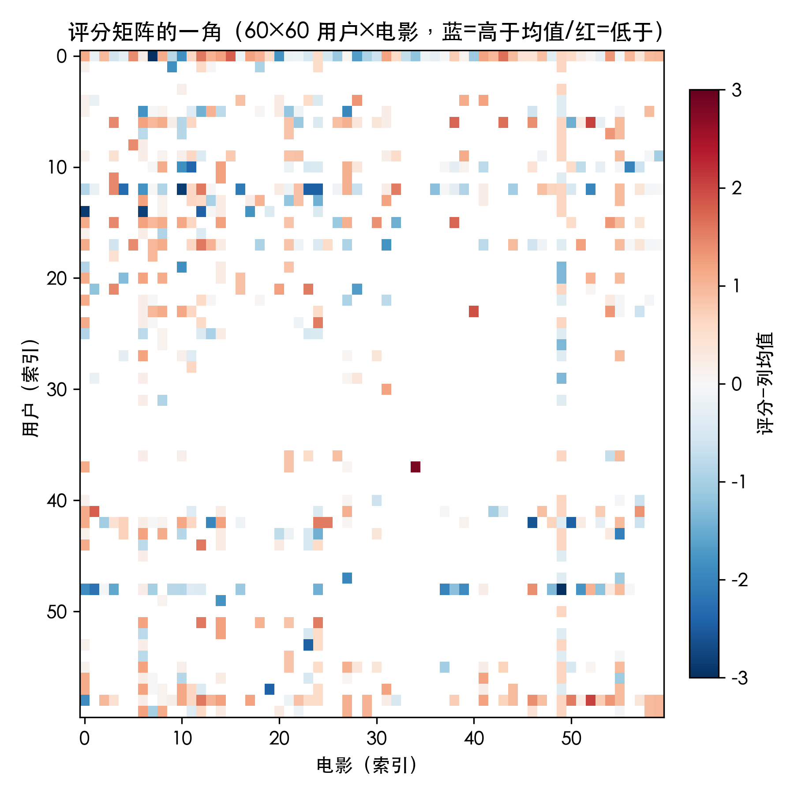
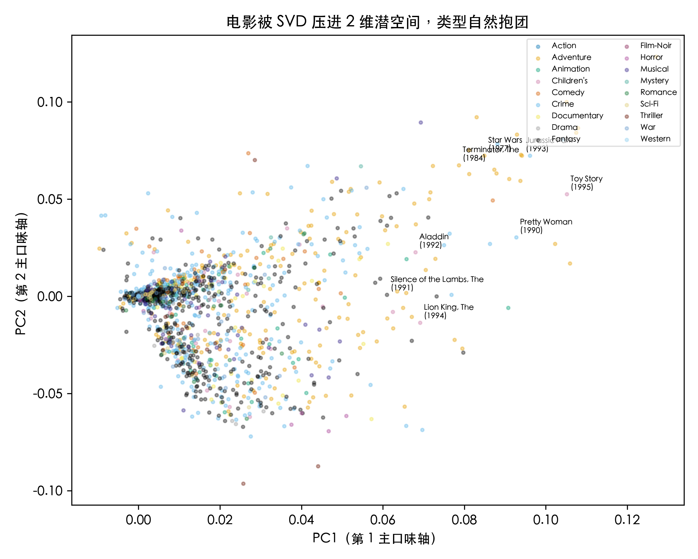
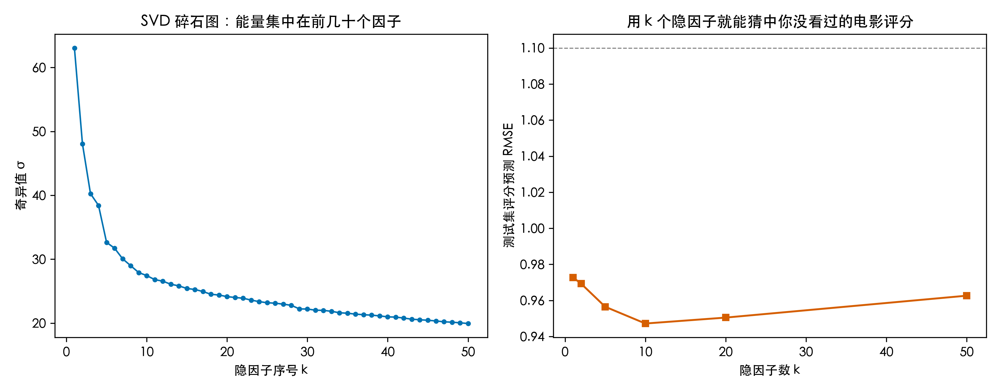
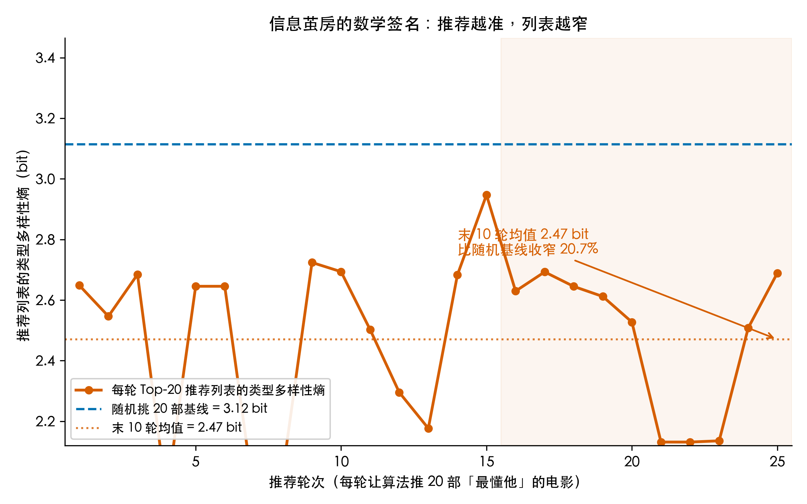

# 刷短视频越刷越窄？SVD 奇异值分解，把 10 万条电影评分拆成你心里的「口味尺子」

## 这事是怎么来的

你大概有过这种体验：昨晚在短视频里刷了个露营的视频，今天一打开，首页就排满了一连串露营装备、露营攻略。你以为平台真的「懂你」，其实背后是一张表，和一次矩阵分解。

说具体一点。有个公开数据集叫 MovieLens 100K，943 个人给 1682 部电影打了 1 到 5 分的评分，加起来正好 10 万条。把这些分数摊平，就是一张 943 行、1682 列的「评分矩阵」。你没看过的电影，那一格就是空的。整张表里 93.7% 的格子是空的，数学上管这叫稀疏。

我要回答的大问题是：推荐系统到底凭什么猜中你想看什么？那个被大家反复讨论的「信息茧房」，又是怎么来的？这两件事，能不能用一次奇异值分解（SVD）一块说清楚。

## Q1：怎么把「用户 + 电影」变成数学对象

先别想算法，先把数据摆正。每行是一个用户，每列是一部电影，格子里是 1 到 5 分的评分，没看过的就是空。943 乘 1682，一共约 158 万个格子，其中只有 10 万个有数，剩下 93.7% 是空的。

这就是一个矩阵，而且是很稀疏的矩阵。稀疏不代表没结构。看下面这张热图，红的一块、蓝的一块，并不是随机散布的，而是局部成团。同一小群人，看过的电影高度重叠，就在图上留下一小片亮区。



所以第一件事很简单：世界上很多数据，天然就是矩阵。用户是一行，电影是一列，空格也是信息的一部分。

## Q2：这些评分是各管各的，还是抱团相关

下一步问，电影之间是孤立的，还是有人一起看。做法很朴素：把每一列减去它自己的平均分（这步叫中心化），再看哪两部电影总被同一拨人一起打高分。

在线性代数里，把所有电影两两这样比一遍，得到的是电影和电影之间的相关结构，中心化之后的 RᵀR 就是它的雏形。爱看《教父》的人，大多也爱看《好家伙》，这两部在相关结构里靠得很近。喜欢科幻的一群，和喜欢儿童动画的一群，是分得开的两坨。

这一步的意义在于，它把「电影和电影之间什么关系」一次性摊开。而 SVD 能从中拆出「主口味尺子」，靠的正是这个相关性基础。

## Q3：能不能把缠在一起的口味，压成少数几把口味尺子

现在上主角，奇异值分解。它把一个矩阵拆成三块：R ≈ UΣVᵀ。U 是每个用户的「口味画像」，Vᵀ 是每部电影的「风格画像」，中间 Σ 是一串从大到小排的奇异值。

奇异值越大,对应的那把尺子就越「主导」。我跑了一次:前 10 来把口味尺子,就已经能相当好地还原你没看过的电影评分。换句话说,把原本 1682 维的「你看没看过什么」,压成了 10 来把口味尺子,大意不丢。

口味尺子听着还是有点绕,其实意思很直白,我用几个你天天见的场面对照一下。

它像 MBTI 那套人格分类。MBTI 用几个维度,把人分进十六型。SVD 干的是同类的事,只是它用的尺子不是四把而是几十把,而且你不用做测试题,模型从你刷过的片子、点过的赞里自己把你量出来。

它又像打《英雄联盟》《王者荣耀》时的「隐藏分 MMR」。你赢一把加的那点隐形分,你肉眼看不见,却一直在背后给你匹配实力相当的对手。口味尺子也一样,你刷得越久,系统对你的「隐藏分」估得越准,推给你的东西就越对味,也越窄。

再像网易云每年甩给你的「年度听歌报告」,也就是你的「听歌 DNA」。报告说你是怀旧派还是新潮党,本质就是把你的听歌习惯压成一个人格画像。

所以「口味尺子」说白了就是:把你这个人,按你消费内容的习惯,悄悄量出几把看不见的尺子。每把尺子代表一种你说不清、但真实存在的偏好——比如你有多吃大场面、多受不了煽情。它们不是谁手动贴的「动作片」「喜剧片」标签,是数学从你的观影记录里自己学出来的。(专业上这叫隐因子,但你就把它理解成「量你口味的尺子」就行。)

最直观的证据在下面这张图。把每部电影按前两把口味尺子投到平面上，按类型上色，你会看到喜剧抱成一团、科幻抱成一团、儿童动画又是另一团。图里还标了《玩具总动员》《星球大战》等八部片子，各自落进对应的团。线性代数不是在空中盖楼，它真的在这堆评分里，找到了「类型」这个结构。



## Q4：这套压缩损失了多少，又省了多少维度；信息茧房又怎么来

拆完了，得回答三笔账。

第一笔是能量账。奇异值衰减得很快，前 50 把尺子（只占全部 5%）就装下了 39% 的能量。这里我要老实说一句：因为原始评分又稀疏又吵，并不是「少数因子装下绝大部分」那种漂亮故事。它和 H1 里温度曲线七成以上的解释率不是一回事，恰恰说明「稀疏矩阵的降维」和「低噪连续曲线的拟合」是两码事，别混。

第二笔是预测账。我留了 10% 的评分当考题，用不同数量的口味尺子去重建、去预测。k 太小，学不到东西；k 太大，反而去背噪声。结果是一条 U 形曲线：k=10 时留出误差最小，约 0.947 分，到 k=50 反而回升到 0.963。多不是好，是过拟合，这是真实的风险。



第三笔，也是这篇最想说的，是茧房账。我挑了一个中等活跃的用户（已经看过 43 部），让算法每轮给他推 20 部「最懂他」的电影，然后看他推荐列表里的类型多样性。用熵来量：随机挑 20 部，多样性熵是 3.12 比特，这是满的；算法推了 25 轮之后，最后 10 轮平均只剩 2.47 比特，比随机基线收窄了 20.7%。



上图把这一段说的事画了出来：橙线每轮往下掉，蓝虚线是「随机挑 20 部」的满多样性基线，橙点线是最后 10 轮的平均。我把这段单独写成了一份可复现脚本 `cocoon_simulation.py`，用户就钉死在那个看过 43 部的 #616 上，跑一遍就能复现上图（3.12 → 2.47，收窄 20.7%）。

故事到这里就收齐了。SVD 让「懂你」成立：只用 10 把口味尺子，就能猜中你还没看过的评分。代价是，它越懂你，就越把你往你已经喜欢的方向推，推荐列表的类型种类越来越少。这个「越推越窄」，就是信息茧房在数学上的签名，不是谁的修辞。

## 三个值得记住的点

1. 数据天然是矩阵：每一行一个样本（用户）、每一列一个特征（电影），稀疏的空格也是结构的一部分。
2. SVD 是在找主方向：奇异值从大到小，前几个就装下大部分主口味；用 k 把口味尺子重建评分，k 太小不行，k 太大过拟合，k 约等于 10 是 MovieLens 100K 的甜点。
3. 信息茧房有数学签名：推荐系统的 Top-N 列表，类型多样性熵会稳定低于随机基线。你越看，算法越往已知方向推，口味被一点点压窄。

## 怎么验证（🏃 可复现）

数据用公开的 MovieLens 100K，下载地址：https://files.grouplens.org/datasets/movielens/ml-100k.zip

跑下面这段就能复现本文所有数字和三张图（需先安装 numpy、pandas、matplotlib）：

```
cd "AI观星记_H4_线性代数_推荐系统"
python recsys_svd_explore.py
```

输出会打印：矩阵规模与稀疏度、奇异值累计方差、留出 RMSE 随 k 的变化、信息茧房熵。诚实说一句局限：MovieLens 是 1998 年前后的数据，结论的「方向」对今天的推荐系统同样成立，思想同源（Netflix Prize 就是同一套矩阵分解）。

## 最后想问你

你最近刷哪个 App 时,感觉被困在同类内容里了?是短视频、购物,还是音乐?评论区聊聊,我看看你的「口味尺子」(也就是你的听歌 DNA、你的隐藏分)大概长什么样。

---

## 代码与数据（GitHub）

本文所有数字与配图均由可复现脚本生成，代码、原始数据与配图已整理上传至 GitHub 仓库：

- 仓库地址：`https://github.com/beverlyLee/ai-guanxingji`
- 本篇目录：`https://github.com/beverlyLee/ai-guanxingji/tree/main/H4`
- 复现脚本：`recsys_svd_explore.py`
