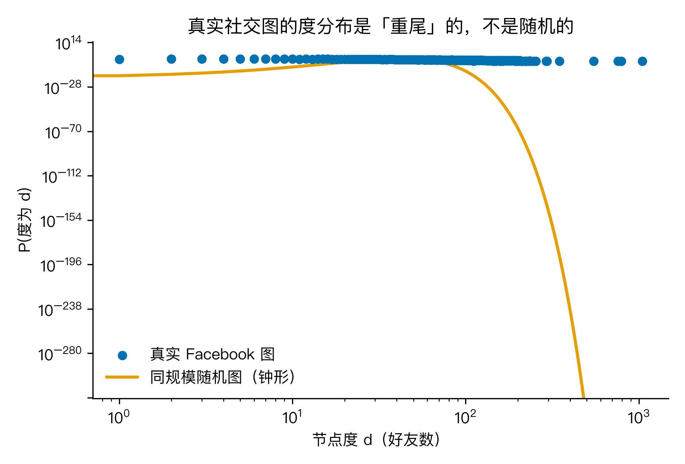
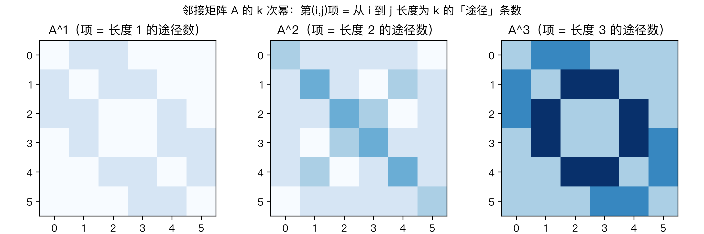
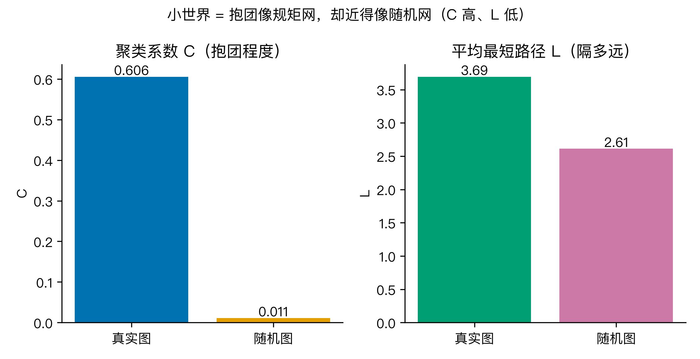
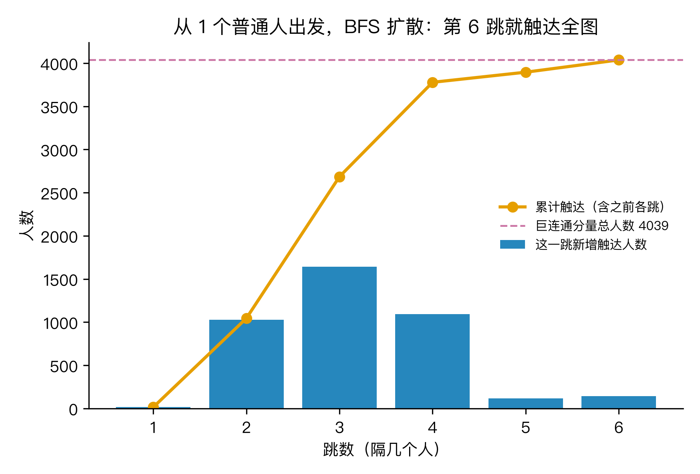

# 一条热搜几小时传遍全网，你认真写的内容却没人看？图论说，这背后是 4000 人好友图里的「小世界」

## 这事是怎么来的

你大概有过这种经历：前脚一条没头没尾的截图在群里疯传，配几句惊悚的话，几个钟头就冲上热搜前三；后脚你花了一下午写的干货，发出去像丢进黑洞，连个水花都没有。你可能会骂算法不公，或者怪自己不会蹭。

但我换个角度想——这事可能跟"你写得好不好""平台偏不偏心"关系没那么大，而是"人跟人怎么连着"这件事的数学本身决定的。

我拿一个真实公开的数据集来验：斯坦福 SNAP 实验室发布的 Facebook 全站好友关系图（facebook_combined），4039 个真实账号、88234 对好友关系。把每个人当成一个点、每段好友关系当成一条线，我们就得到一张有 4000 个节点的大网。我要回答的大问题是：**一条消息为什么能在几小时内绕遍全网，而你认真写的东西却传不出去？** 图论里"小世界网络"和"六度分隔"这两样东西，能不能把这件事讲透。

## Q1：一张好友关系网，怎么变成数学对象

先别想传播，先把网摆正。

图（graph）就两个零件：顶点（vertex）是"一个人"，边（edge）是"一对好友"。4039 个顶点、88234 条边，这就是我们要研究的对象。它天然可以排成一个 4039 行、4039 列的方阵，叫**邻接矩阵 A**：A 的第 i 行第 j 列是 1，表示第 i 人和第 j 人是好友，否则是 0。好友是互相的，所以这个矩阵关于对角线对称。

这个矩阵里能直接读出一件事：某一行里 1 的个数，就是那个人的好友数，数学上叫**度（degree）**。我算了一下——平均每个人有 43.7 个好友，但最"广结人缘"的那一个，好友数到了 1045。

度数怎么分布，决定了网长什么样。下面这张双对数坐标的图，横轴是好友数、纵轴是有这个好友数的人数。如果人人差不多，它该是一条平平的钟形曲线；可它明显向右拖出一条长长的尾巴——绝大多数人好友几十个，但有极个别的人好友上千。这条尾巴叫**重尾**，是后面"消息为什么传得快"的第一个伏笔。



所以第一件事很简单：社交关系网天然就是一张矩阵，好友数就是矩阵里每行的 1 的个数。

## Q2：邻接矩阵的 k 次方，数的是"走 k 步能到的路"

这一步是整篇最妙的地方，也正好接上 H4 讲的"数据天生是矩阵"。

H4 里那张电影评分矩阵，被做了一次奇异值分解（SVD），把"你喜欢什么"压成了几把口味尺子。这里同一类矩阵，我换成另一种玩法：**把邻接矩阵自己乘自己 k 次**。

数学上有个干净的结论：A 的 k 次方，第 i 行第 j 列那个数，正好等于"从 i 出发、走恰好 k 步、一路走到 j"的走法总数。这里"走"允许重复经过节点，专业上叫 walk（途径）。A¹ 是一步直达的好友，A² 是"经过一个中间人"才到的，A³ 是经过两个中间人。

为了让你信这不是我嘴上说的，我挑了一个 6 个人的小网络，把 A¹、A²、A³ 三个矩阵画出来（下图为热力图，颜色越亮代表走法越多），又用最笨的"挨个枚举所有走法"去数了一遍做交叉验证——比如从节点 0 到节点 5、走 3 步，枚举出来正好 2 条路，和矩阵里的数一模一样，校验通过。



这一步把 H4 的"矩阵思维"往前推了一格：H4 把矩阵拆开找结构，这里把矩阵乘方数路径——同一个数学对象，两种用法，本质都是线性代数在你关系网里干活。而"消息传几手到"，刚好就是问 A 的几次方里有没有那条路。

## Q3：什么叫"小世界"——圈子紧，但路很短

有了矩阵，就能量两张网的关键性质。

第一个叫**聚类系数 C**：你的好友里，两两之间也是好友的比例，也就是"你的圈子抱不抱团"。我算出来真实图 C = 0.6055，意思是平均有六成好友互相认识。

第二个叫**平均路径长度 L**：任意两个人之间，最短要隔几个人，再对所有配对求平均。真实图 L = 3.693，也就是说任意两人平均隔着不到 4 个人。

但这两个数单独看没意义，得有个对照。我按同样的 4039 个节点、88234 条边，生成了一张纯粹的随机图（每对节点以相同概率连，谁和谁连全看运气）。随机图的 C 只有 0.0108，L 是 2.611。

把两组一比就清楚了：

- 真实图的聚类系数，是随机图的 **56 倍**（0.6055 vs 0.0108）——圈子紧得多；
- 真实图的平均路径，只比随机图长 **1.4 倍**（3.693 vs 2.611）——路几乎一样短。



高聚类、近似随机的短路径，正是 Watts–Strogatz 那篇论文给"小世界"定的硬指标。它直接回答了开头的问题：**消息几小时传遍，靠的是两层结构——圈子紧（信息在群里被快速确认、互相转发），桥梁多（任意两人只需 3、4 跳就接上）。** 你认真写的内容传不出去，常常不是写得差，而是没接进那些把不同圈子缝起来的"桥"。

## Q4：六度分隔是真的，但有两个容易想反的地方

把全图两两之间的最短距离都算一遍，得到一张很实的分布：中位数和众数都是 4，最远的一对隔了 8 个人（这叫图的直径 D = 8）。更关键的是——**98% 的两人对，彼此距离都不超过 6**。

这就是"六度分隔"在真实全量数据上的实证。米尔格拉姆 1967 年那个著名实验是抽样寄信猜出来的，我这里是把 4000 人每一对都算到了，不用猜。



讲到这，我想补两个反直觉、也最容易想偏的点，否则这结论会误导你。

**第一，平均路径短，不等于"保证能到"。** 这张图恰好是 1 个连通块（100% 的人互通），所以人人可达。但社交图只要被切断成几块——比如那几个上千好友的超级枢纽同时掉线——跨块的两个人距离就变成"无穷"，统计平均再小也救不了"根本到不了"。小世界的"短"是**组内**的统计性质，不是对任意两点的承诺。一个看似"全球互联"的网，删掉少数枢纽会瞬间碎成一堆互不连通的岛。

**第二，病毒式传播靠的不是人人平等，恰恰是少数超级节点。** 回到 Q1 那条重尾：度数分布不是钟形，是幂律 P(d) ∝ d^−2.35，最多的那个人有 1045 个好友、平均才 43.7。少数枢纽像广播塔，一条消息大多先撞上某个枢纽、再被它甩给成千上万人，才传得飞快。反过来的反例是：纯随机图是泊松分布、没有这种枢纽，信息只能靠随机碰，反而又慢又容易断。所以"几小时传遍全网"的真实引擎，是那几个你够不着的超级节点，不是平等的网络。

故事到这就收齐了。一条热搜几小时冲顶，不是玄学，是这张 4000 人好友图"高聚类 + 短路径 + 少数枢纽"叠出来的结构必然；你内容石沉大海，往往只是没搭上那几座桥。

## 三个值得记住的点

1. **关系网天然是矩阵**：邻接矩阵 A 的 k 次方，数的是"走 k 步能到"的路数。H4 把矩阵拆开找口味，这里把矩阵乘方数路径，同一个数学对象的两种用法。
2. **小世界有硬指标**：聚类系数 C 比随机图高几十倍、平均路径 L 只略长一点，这结构才让消息几跳就到；你内容传不出去，常常只是没接进那几个把圈子缝起来的"桥"。
3. **平均短 ≠ 保证可达，重尾才是引擎**：删掉少数枢纽网络会碎成孤岛；度数重尾（少数超级节点）才是病毒式传播的真实动力，不是人人平等的网络。

## 怎么验证（🏃 可复现）

数据用斯坦福 SNAP 公开数据集 Facebook combined，下载地址：https://snap.stanford.edu/data/ego-Facebook.html（文件 `facebook_combined.txt`）

跑下面这段就能复现本文所有数字和四张图（需先安装 numpy、scipy、networkx、matplotlib）：

```
cd "AI观星记_H5_离散数学_小世界网络"
python small_world.py
```

输出会打印：节点数、边数、平均度与最大度、连通分量、聚类系数 C（真实 vs 随机）、平均路径 L（真实 vs 随机）、直径、两两距离分布与"≤6 的比例"、度分布幂律指数 γ，以及那个 6 节点小网络"节点 0→节点 5 长度 3 的途径数 = 2"的邻接矩阵幂校验。诚实说一句局限：这是 2012 年前后匿名去标识的社交图快照，节点是"账号"不是"活人"，且只含好友边、不含转发和关注；结论的**方向**（小世界、重尾、六度分隔）对今天的微博、微信同样成立，但具体数字会变。

## 最后想问你

你最近有没有哪条内容，是"绕了好几手"才到你眼前的？或者，你觉得自己在这张 4000 人的小世界里，离那个"1045 个好友的枢纽"隔了几跳？评论区聊聊，我看看你卡在了哪座桥的另一头。

---

## 代码与数据（GitHub）

本文所有数字与配图均由可复现脚本生成，代码、原始数据与配图已整理上传至 GitHub 仓库：

- 仓库地址：`https://github.com/beverlyLee/ai-guanxingji`
- 本篇目录：`https://github.com/beverlyLee/ai-guanxingji/tree/main/H5`
- 复现脚本：`small_world.py`
