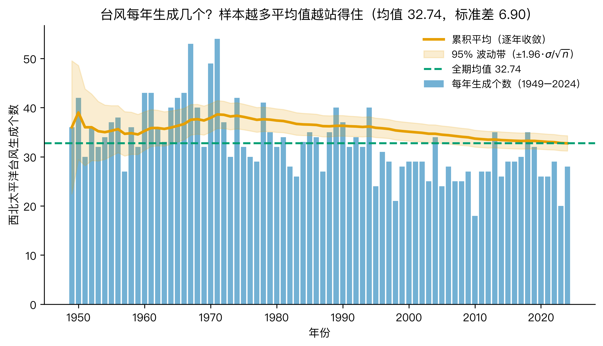
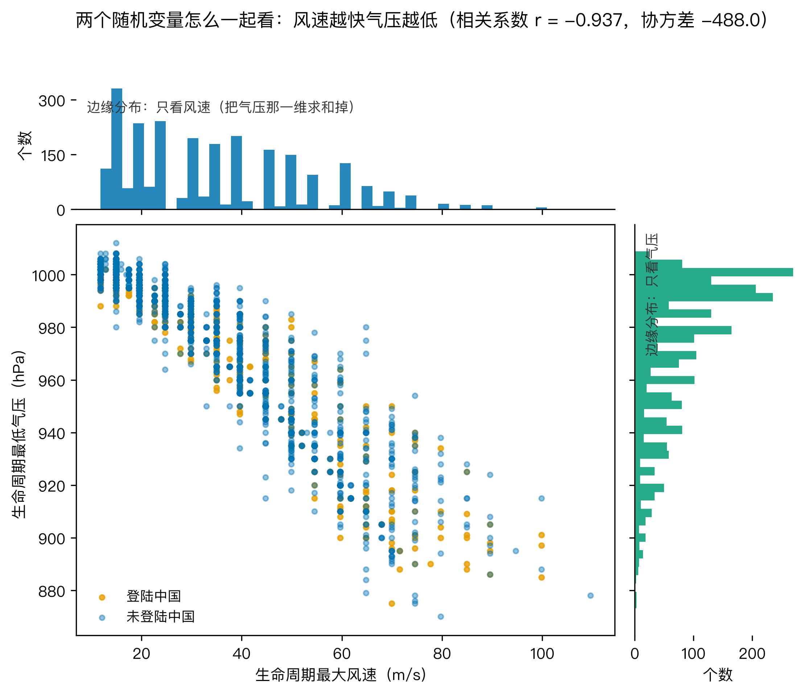
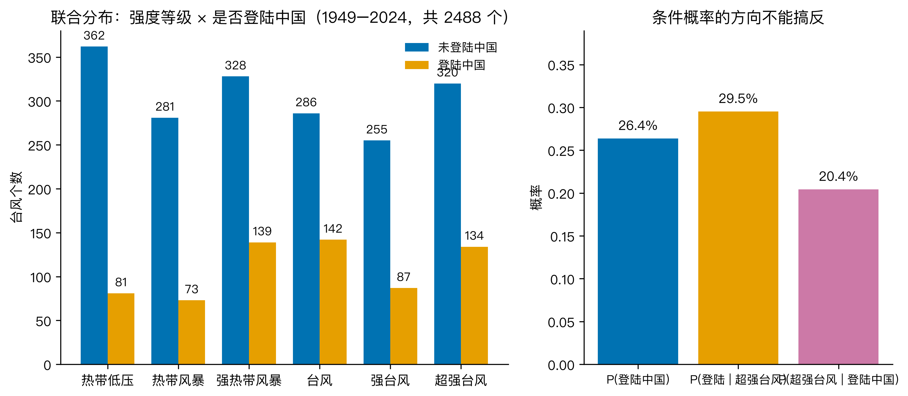
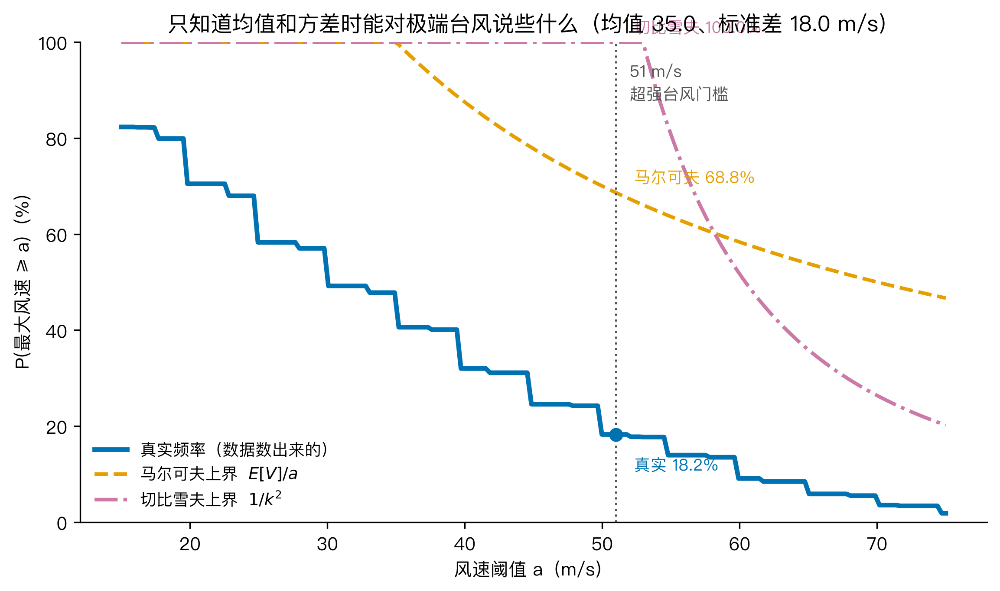
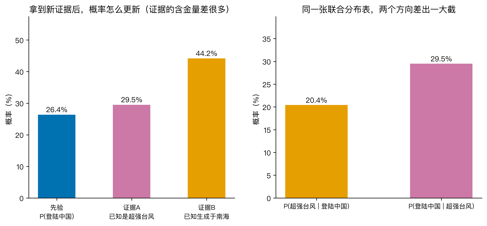
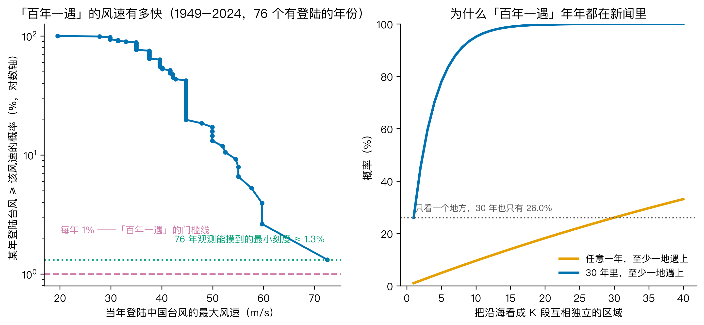

# 「百年一遇」的台风，为什么我这辈子就遇了好几回？概率论把这笔账算给你看

## 这事是怎么来的

8 月那阵子你的朋友圈大概被刷过好几次——9 日台风「白海豚」在浙江玉环登陆，14 级，**浙江过程雨量排到 1949 年以来台风降雨的第一位**；过了几天又有新闻，14 个国家级气象观测站的日雨量同时破了当地建站以来的历史极值。

新闻里十有八九会跟一句"百年一遇"。

我后来在评论区和家庭群里看到最多的吐槽，不是"好可怕"，而是"我活了 30 年怎么就遇了好几回了？"。这种吐槽其实特别在理——"百年一遇"按字面说，每 100 年才该来一次，**一个人 30 年里连着赶上几回，好像不对**。

但这事又确实发生了。所以大概率是**我们对"百年一遇"这四个字的数学含义理解偏了**。我用西北太平洋 76 年（1949–2024）的真实台风数据来验，试着把"百年一遇"里藏着的概率、不等式和贝叶斯一并讲清楚——为什么这四个字一被新闻引用，几乎一定是错的。

## Q1：什么叫"百年一遇"？先从大数定律说起

先把基础摆出来。

"概率"说白了就是**长期频率**。一枚均匀硬币抛 1 次，正面 50%；抛 10 次不一定 5 正 5 反；抛 1 万次，正面比例就死死地往 0.5 靠拢——这就是**大数定律**：试验次数越多，平均值越站得住。我用西北太平洋 1949–2024 这 76 年每年生成多少个台风来验。



我算了三个数：

- 每年平均生成 32.7 个台风，标准差 6.9 个
- 只看 10 年数据，样本标准误 = 6.9/√10 ≈ 2.2 个
- 看 30 年，标准误降到 1.3 个；看 76 年就只有 0.8 个了

**这就是为什么气象学家不肯拿 10 年台风数就跟你说"今年台风变多了"**——你样本太小，方差太大，统计上的"摆动"比你想的大。

"百年一遇"按定义，就是**某事件每年的发生概率是 1%**。换算成"多少年发生一次"叫**重现期**，1% → 重现期 100 年。但这个定义里藏着一个很多人忽略的前提：**它指的是某个具体地点、某个具体事件**——比如"上海徐家汇年最大日降雨 ≥ 200mm"是百年一遇，意思是**徐家汇那个气象站**平均 100 年才有一次。

下个问题就来了：全国有**多少个**这种"具体地点"？

## Q2：两个变量怎么一起看——从一张图到一张表

概率论里有个非常基础、但被科普文章经常跳过的概念：**随机变量往往不止一个，它们之间还可能有关联**。这是后面讲贝叶斯和不等式的地基。

先看**连续型**的一对。我把每个台风的"生命周期最大风速 V"和"最低中心气压 P"放在一起，画了张散点图，外加上下两条边缘直方图。



两个发现：

- **联合分布**：点云呈一条斜向右下延伸的带——风速越大、气压越低。风速从 0 涨到 70 m/s，气压从 1000 跌到 900 hPa。
- **相关系数 r = −0.937**——教科书级别的强负相关（极端地接近 −1）。也就是说，知道风速，你几乎就能反推气压；知道一个，就知道另一个八九不离十。

边缘分布（只看风速 / 只看气压）就是这个 8000 多个点往横轴或纵轴上的"投影"——把另一维累加掉，留下单变量分布。这是后面 Q3 不等式和 Q4 贝叶斯的输入。

再来看**离散型**的一对：**强度等级 × 是否登陆中国**。我把每个台风按 2 分钟平均最大风速，依国标 GB/T 19201-2006 划成六个等级，再看它在生命周期里有没有"中心进入中国陆域"。



联合频数表（行=等级，列=[未登陆, 登陆]，共 2488 个样本）：

| 等级 | 未登陆 | 登陆 | 合计 |
|---|---|---|---|
| 热带低压 | 362 | 81 | 443 |
| 热带风暴 | 281 | 73 | 354 |
| 强热带风暴 | 328 | 139 | 467 |
| 台风 | 286 | 142 | 428 |
| 强台风 | 255 | 87 | 342 |
| 超强台风 | 320 | 134 | 454 |
| **合计** | **1832** | **656** | **2488** |

两个边缘概率：

- 边缘 P(登陆中国) = 656/2488 = **26.4%**
- 边缘 P(超强台风) = 454/2488 = **18.2%**

最关键的——**条件概率**：已知是超强台风，登陆中国的概率 = 134/454 = **29.5%**；已知登陆中国，它是超强台风的概率 = 134/656 = **20.4%**。两个数差出一大截，这就是后面 Q4 要讲的**条件概率方向**。

## Q3：只知道均值和方差时，能对极端事件说什么

实际预测时，我们经常没有完整分布——手里只有"过去几年平均每年生成几个台风""最高风速均值多少、标准差多少"。在这种**信息不足**的情况下，能不能给极端事件一个**保守上界**？可以的，有两个古典不等式。

我设 V = 一个台风生命周期的最大风速（m/s），在我们数据里 E[V] = 35.0，标准差 = 18.0。问：**V ≥ 51（超强台风门槛）的概率是多少？**

- **马尔可夫不等式**（V 非负就够）：P(V ≥ a) ≤ E[V]/a。代入 51：上界 = 35.0/51 = **68.7%**
- **切比雪夫不等式**（要知道均值和方差）：P(|V − μ| ≥ kσ) ≤ 1/k²。这里 k = (51 − 35.0)/18.0 = 0.89，1/k² = **126%**——超过 100% 没意义，等于没给
- **真实频率**（数据数出来的）：**18.2%**

把这三条放一张图：



两个**反直觉**的发现，正是这一节技术深度所在：

**第一，切比雪夫在 a=51 处直接失效了**。原因是 k = 0.89 不到 1，不等式右端超过 100%，数学上等于啥也没说。**切比雪夫只对 k > 1（即 a > μ + σ）的情形才有信息**——本数据 μ+σ = 53 m/s，要问"风速 ≥ 53 的概率"它才有用。这个**边界条件**和**失效模式**是切比雪夫教材里不强调、但工程里天天踩的坑。

**第二，马尔可夫的 68.7% 上界也不算好**——和真实 18.2% 差了三倍多。但它比切比雪夫强，因为它只需要均值、不需要方差，门槛可以取任意 a > 0。

这给工程上的一个明确提示：**只要数据够、分布形状可拟合，就别满足于用不等式**。不等式是"分布未知时的兜底"，不是"默认答案"。这也是为什么保险公司在用极值统计（GEV、GPD）而不是马尔可夫/切比雪夫——前者用到了完整分布的信息，给出的上界就紧得多。

## Q4：贝叶斯、方向陷阱，和"百年一遇"真正的算法

最后这块把开头的疑问收回来。

### 4.1 贝叶斯公式：拿到新证据后，概率怎么更新

设事件 A = "这个台风会登陆中国"，B = "我们刚知道一件事"。贝叶斯公式是：

> **P(A | B) = P(B | A) × P(A) / P(B)**

也就是说，**后验概率 = 先验概率 × 似然比**。我先验 P(登陆) = 26.4%。

我手头数据里可以构造两个截然不同的"证据 B"，看后验怎么动。



**证据 A："这个台风是超强台风"** —— 听起来吓人。后验 P(登陆 | 超强台风) = **29.5%**，相对先验只提高了 1.12 倍。**强度几乎不携带"去哪儿"的信息**。

**证据 B："这个台风生成于南海"**（首点经度 105–121°E、纬度 4–23°N）。后验 P(登陆 | 南海生成) = **44.2%**，相对先验提高了 1.68 倍。**生成海域才携带"去哪儿"的信息**。

为什么？强度由海温和大气能量决定，**路径由副热带高压决定——两套相对独立的机制**。知道一个台风很强，并不告诉你它往哪走；知道它生成在南海，离我国大陆就几百公里，登陆概率就大幅抬升。

这是一个**真正值得记住的"反直觉"**：直观上觉得"越强越危险、越可能登陆"，但数据告诉你——**强度对登陆概率几乎没贡献**。把这两个证据的"含金量"（似然比）放在一起看，差距一目了然。

### 4.2 条件概率的方向不能搞反

很多日常误判的根源，就是把 P(超强台风 | 登陆) = 20.4% 跟 P(登陆 | 超强台风) = 29.5% 混着用。

- 看到"超强台风"就囤菜？只有 29.5% 真的会来。
- 看到"台风登陆了"就觉得大概率超强？只有 20.4% 是。

**条件概率的方向取决于你想问什么问题**，不是同一回事。这是贝叶斯最朴素也最容易被踩的坑。

### 4.3 回到"百年一遇"——空间换时间

最后把这套工具搬回来算"百年一遇"。

我用 1949–2024 共 76 年有登陆中国的台风，每年取登陆时的最大风速，画它的经验超越概率：



左图：风速从 20 m/s 到 75 m/s，"某年登陆台风 ≥ 该风速"的频率从 100% 降到大约 1.3%（即 76 年里发生过）。**两条横虚线非常关键**：

- 红色虚线在 1.0%——"百年一遇"的标准门槛
- 绿色点线在 1.32%——**76 年观测的最小刻度**（76 年数据里"最稀有的事情"也只能精确到 1/76）

**我们的数据够不着 1% 这一行**。也就是说，要严肃地讨论"百年一遇"对应的具体风速值，需要更长的序列（比如 ≥200 年）或者用极值统计模型外推。诚实说一句：**76 年数据不能告诉你"百年一遇"的风速具体是多少，只能告诉你 76 年来最猛那一次大概到了 70+ m/s**。

但这不妨碍讨论"百年一遇的概率"。把沿海按"影响范围约一个纬度（约 100 公里）"粗略分成 K 段互相独立的区域，**每段年发生概率仍是 1%**，则**全国任一地**发生"百年一遇"的年概率 = 1 − (1 − 1%)^K：

| K 段 | 任意一年至少一地遇上 | 30 年里至少一地遇上 |
|---|---|---|
| 1（单点）| 1.0% | 26.0% |
| 8（粗分）| 7.7% | 91.6% |
| 20（细分）| 18.1% | 99.7% |

中国沿海从辽宁到广西跨了 20 多个纬度，如果每个纬度各算一段"互相独立"，**30 年里几乎必然（99.7%）有某地遇上一次"百年一遇"**。这就是为什么"百年一遇"年年都在新闻里——**不是它变得频繁了，是我们观察的口袋变大了**。

故事到这收齐了。

「白海豚」登陆浙江玉环，朋友圈刷屏"百年一遇"——这话本身没错，但需要先回答"在哪、什么指标"。中国海岸线几千公里、上百个地市、上千个气象观测站，**任一地有极端事件就被全国媒体放大成"百年一遇"**。同样，你 30 年遇了好几回，是这几十年你所在/所关注的地点正好赶上其中几次，而不是概率失效。

至于"我该不该囤菜"——按 Q4 的结论，**强度（超强台风）这个证据对登陆概率的信息量很小，反而是"它生成在哪"这种路径信息才值钱**。下次看到台风预警，与其盯着"几级""超强"，不如看看路径图上"它现在在哪、往哪走"。

## Q5：这些公式，其实你天天、每个框架、每个 prompt 里都在用

写完上面四节，你可能会想：这都是气象台和精算师的事，跟我有什么关系。其实不是——这些概率工具早被"封装"进了你每天用的 App、框架和模型里，只是名字不叫"大数定律""贝叶斯"而已。我拆给你看。

### 5.1 生活里：它不是算题，是"别被单次随机骗了"

- **大数定律 = 别被一次结果骗了**。App 评分 4.8，突然冒出一条差评，你不会因此觉得它烂——因为你知道那是"一次"的偶然，真正的口碑要看成千上万条评价的平均。赌场、保险、抽检也都靠这条：单把结果随机，只有把很多次加起来，规律才显出来。一句话：单次是噪声，长期平均才是信号。
- **相关系数高 ≠ 谁导致谁**。夏天冰淇淋卖得多、溺水的人也多，两者强相关，但没人会说"少吃冰淇淋能防淹死"——因为背后有个共同原因：天热。所以看到"喝咖啡致癌""玩手机近视"这类报道，先问一句：是不是有第三个变量在起作用？这跟 Q2 那张"风速×气压"强相关图是同一个提醒：相关只是表象，因果要另外证明。
- **贝叶斯方向别搞反**。体检最容易吓到自己：某病患病率只有万分之五，你筛查阳性了，听着吓人，但真正患病的概率可能只有几个百分点——因为阳性里大部分是误报。判断前要先乘上"这病本来有多罕见"。这跟 Q4"超强台风≠更可能登陆"是同一道算术：基础概率低，后验也高不到哪去。

### 5.2 后端：微服务监控、告警、A/B 全在暗用

- **大数定律 → 监控降噪**。QPS、延迟这种指标你不会盯某一秒，而是看滑动窗口的均值——因为单秒是噪声，窗口拉长是大数定律在干活。样本窗口太短，你会"看见"根本不存在的抖动，半夜被假告警叫醒。
- **联合分布 / 相关系数 → 特征工程与异常检测**。Q2 那张"风速×气压"强相关图，在工程里就是"CPU 和 QPS 的联合分布"：两个指标一起涨是正常的，CPU 涨但 QPS 没动就是异常（机器八成被挖矿了）。这跟 H4 的 SVD 降维是同一个思路——相关的变量能压成一个。
- **切比雪夫 → SLA 的兜底上界**。你只知道 P99 延迟的均值和方差时，切比雪夫能给你"延迟超某阈值的概率上界"。但注意 Q3 讲的边界：它也只在 k>1 时有效，而且很松，所以线上真要算 P99 用的是分位数统计而不是不等式——这正是 Q3 那句"不等式是兜底不是答案"的工地版。
- **贝叶斯 → 告警降噪**。P(故障 | 告警) 和 P(告警 | 故障) 是两回事：一个高敏告警系统"故障必响"（P(告警|故障)高），但"响了就是故障"（P(故障|告警)）可能很低，因为误报太多。先算先验再决定要不要半夜爬起来，跟 Q4 囤菜逻辑一模一样。

### 5.3 前端：埋点、虚拟列表、渲染预算

- **大数定律**在性能上：一个组件首屏渲染耗时你不会测一次就下定论，要跑够帧数取均值——单次卡顿可能只是 GC 抖了一下。
- **联合分布**在埋点里："用户停留时长 × 点击率"就是一张二维表，产品经理拿它给用户分群（高停留低点击=内容好但按钮弱），跟 Q2 那张联合频数表是同一个东西，只是轴换成了行为指标。

### 5.4 大模型：temperature、top_p、RAG 全是概率论

这块最有意思——你调的那些"大模型参数"名字花哨，底层全是 H6 讲的概率。

- **采样本身就是概率分布**。模型输出的是"下一个 token 的概率向量"。你设的 `temperature` 本质是给这个分布"降温"：温度高→分布被拉平→每个词概率接近→更随机更发散；温度低→分布变尖→高概率词更突出→更确定。这直接就是 Q2 在讲"分布的形状决定结果"。
- **`top_p`（核采样）就是按累计概率截断**。它从概率最大的 token 往下累加，累到 p（比如 0.9）就只在这堆里采样——这跟 Q1"重现期/累计频率"是同一个运算：把概率从大到小加总，加到某个阈值就停。
- **RAG 是贝叶斯后验更新**。你给模型塞一段检索到的文档，相当于拿到一个新证据 B；模型"答案正确"的后验 = 先验（训练时学到的频率）× 似然（文档和问题的相关度）/ 证据。检索到的文档越相关（似然越高），答案越靠谱——跟 Q4 里"超强台风 vs 南海生成"两个证据含金量不同，完全同构。
- **幻觉的概率结构 = 先验 + 似然**。一个事实模型"见得多"（先验高）又"检索到佐证"（似然高），才敢肯定地说；两者都低时它就该说"我不确定"。`temperature` 调高相当于人为压低先验的区分度，所以高温度更容易胡说——这跟 Q3 讲的"信息不足时估计会松"本质一样。

所以下次你调 prompt、看监控曲线、或者又被"百年一遇"刷屏，其实都在用同一套工具。数学没离开过你，只是换了个名字。

## 三个值得记住的点

1. **"百年一遇"是单点单指标的口径**：中国沿海 20+ 段"独立区域"任一发生 = 30 年几乎必然 99.7%。年年都有"百年一遇"在新闻里，是观察口袋放大了，不是概率失效。
2. **只知道均值和方差时，不等式给的是兜底，不是答案**：本数据里切比雪夫在 a=51 m/s 处上界超过 100%（k=0.89，失效边界）；马尔可夫的 68.7% 也比真实 18.2% 宽得多。**数据够、分布能拟合时，别拿不等式当默认工具**——这是"边界与失效"的现实例子。
3. **证据的含金量差很多**：知道"超强台风"只把登陆概率从 26.4% 抬到 29.5%（似然比 1.12），但知道"生成于南海"能抬到 44.2%（似然比 1.68）。**强度和路径是两套独立机制**——别被"越强越危险"的直觉骗了。

## 怎么验证（🏃 可复现）

数据：**NOAA IBTrACS v04r01 西北太平洋最佳路径**，NetCDF 单文件约 9MB，公开可下载：

```
https://www.ncei.noaa.gov/data/international-best-track-archive-for-climate-stewardship-ibtracs/v04r01/access/netcdf/IBTrACS.WP.v04r01.nc
```

跑下面这段就能复现本文所有数字和 6 张图（需先安装 numpy / netCDF4 / matplotlib）：

```
cd "AI观星记_H6_概率论_台风"
python typhoon_prob.py
```

脚本会打印：时段内风暴数 / 有效样本数；年均生成个数 + 标准误演化；风速与气压的均值/标准差/协方差/相关系数；强度等级 × 是否登陆中国的联合频数表与边缘、条件概率；马尔可夫与切比雪夫在 a=41.5、51 m/s 处的真实/上界/失效分析；登陆台风年最大风速的经验超越概率；以及贝叶斯两个证据的先验/后验与似然比。还会输出 `results.txt`、`typhoon_storms_1949_2024.csv`，6 张图存到 `figures/`。

诚实承认两点局限：
1. **cma_cat 官方等级与按风速阈值定级的一致率仅 18.7%**（前者系统性偏高一级），按前者推得的年均超强台风约 10.5 个（明显高于 CMA 公开统计），按风速则是 5.97 个（与公开统计同量级），故全篇统一用风速阈值定级。
2. **登陆中国判定 = dist2land==0 且中心落入手绘的中国陆域近似多边形**（大陆+台湾+海南），IBTrACS 是 6 小时间隔，可能漏掉"登陆—出海"的快速过程，多边形是手工近似，边界个案会有 ±50 km 量级误差。

## 最后想问你

你最近一次被台风打乱安排是哪一次？当时看新闻里说"百年一遇"，你心里信了几分？按今天这堆公式去算——你脚下那座城市、那个气象站、平均 100 年才有一次的指标，你活了 30 年里碰上它的概率是 26%；但你 30 年里"听说某地遇上百年一遇"的次数，期望值远不止 1 次。评论区聊聊，看看你卡在了哪条概率链上。再顺手想一个：你今天调过 `temperature`、看过一眼监控曲线、或者因为一条差评划走了某个 App——这里面哪一步，其实已经在用大数定律、贝叶斯或者联合分布了？

---

## 代码与数据（GitHub）

本文所有数字与配图均由可复现脚本生成，代码、原始数据与配图已整理上传至 GitHub 仓库：

- 仓库地址：`https://github.com/beverlyLee/ai-guanxingji`
- 本篇目录：`https://github.com/beverlyLee/ai-guanxingji/tree/main/H6`
- 复现脚本：`typhoon_prob.py`
