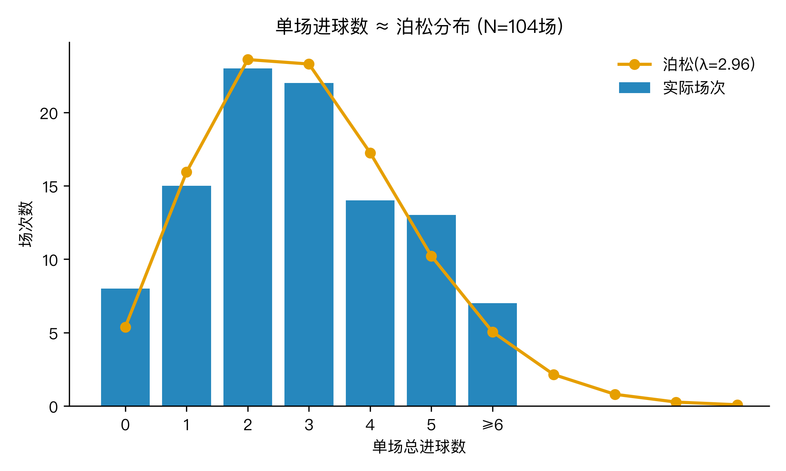
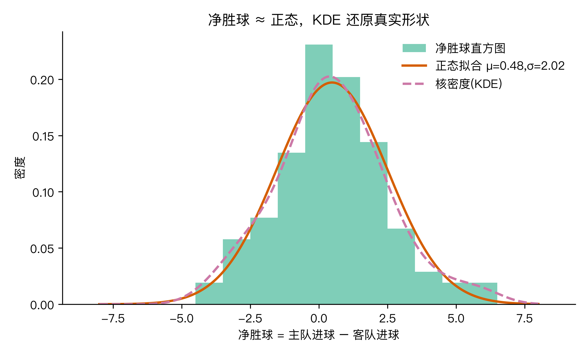
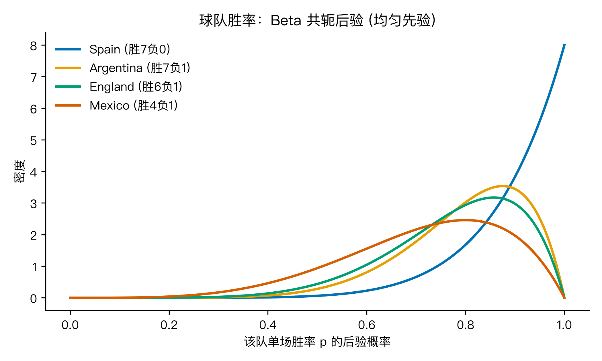
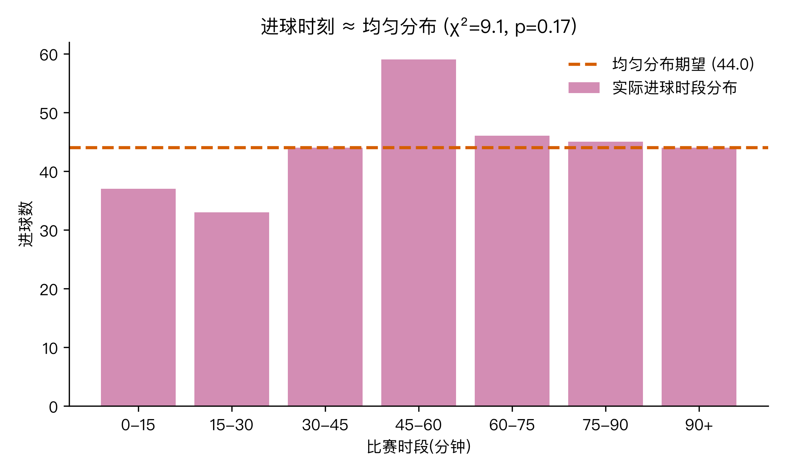

# 一场世界杯的进球，纯随机吗？104 场决赛圈 + 7 种概率分布 (Python 复现)

## 这事是怎么来的

2026 夏天，48 队 104 场闹完，西班牙 1-0 阿根廷加时夺冠，英格兰 6-4 法国拿到季军。朋友圈那阵子两条声音最响：「这球没法算，纯随机」，反方是「强者恒强，开赛前就定好了」。其实两边都说对了一半。整届 308 个进球扔进 7 种概率分布，能拆清楚一场球里哪些是真的随机，哪些只是没看见的规则。

我用了 GitHub 上一份干净的公开数据集（`mominullptr/FIFA-World-Cup-2026-Dataset`），把 104 场比分表（`matches_detailed.csv`）和 602 条事件（`match_events.csv`）拉下来，再用 matplotlib 从同一份 CSV 重生全部图。下面的四个问题，一个问题绑一种或两种分布，所有数字都能在文末的脚本里复现。

## Q1：单场进球数，到底服从什么分布？

**泊松分布** P(X=k) = λ^k · e^{−λ} / k! 是「单位时间里离散事件数」的标配模型，在足球、客服中心电话到达、保险理赔次数里都是同款。

104 场一共进了 308 个球。泊松的参数 λ 用极大似然估计，就是所有场次的进球均值：λ̂ = Σ(每场进球) / 104 = 308 / 104 = 2.962（平均每场不到 3 球）：



观测和泊松(λ=2.96) 几乎贴在一起。具体怎么算：把进球数分成 0、1、2、3、4、5、6+ 共 7 组，每组期望次数 Eₖ = 104 × Poisson(k; 2.96)，实测 Oₖ，**卡方拟合优度** χ² = Σ(Oₖ − Eₖ)² / Eₖ = 2.99，自由度 5（7 组 − 1 总约束 − 1 个估计参数 λ），p = 0.70——0.05 水平根本拒绝不掉泊松。所以「一场比赛进 2 球或 3 球最常见」这件事，不是错觉，是泊松。

但有一个边界值得标出来：方差 3.47 比均值 2.96 大一点点。方差按 Σ(xᵢ − λ̂)² / 104 算出来是 3.47，比 λ̂ 本身还大，统计学里叫「**过离散**」。意思是把所有比赛当一个 λ 拟合时，强队碾压场把均值往上拉，弱队互啄场又压下来，混在一起分布尾巴比纯泊松厚一点。在现实里这就是「为什么我们能分清强队弱队」——如果真的所有比赛都符合同一个泊松，强弱就不存在了。**泊松是「第一近似」，过离散明显时升级到负二项分布**（泊松 + 一个随机强度项）。

## Q2：净胜球（主队进球 − 客队进球）为什么看起来那么像正态？

**正态分布** 之所以万能，靠的是 **中心极限定理 (CLT)**。一场比赛 90 分钟，每一次射门、每一次传球失误、每一次越位都是一次独立的「+1 或 −1」小事件，攻防两边的微效应叠加到一起，宏观上看就是近似正态。

104 场净胜球（主队进球 − 客队进球）：均值 μ = Σ(净胜球ᵢ) / 104 = 0.48，标准差 σ = 2.02（开方自方差 Σ(净胜球ᵢ − μ)² / 104），偏度 0.25、峰度 0.25 都接近 0，说明分布对称、不尖不扁；D'Agostino 正态检验 p = 0.38——不能拒绝正态。



图里叠了三样：绿色直方图是实际分布，橙色是同一均值方差下的**正态曲线**，紫色虚线是**核密度估计 (KDE)**。KDE 不假设任何分布形状，纯靠每个点附近的核函数（这里用高斯核）平滑。

KDE 和正态几乎重合，但仔细看两边尾巴比正态稍微厚一点，对应过离散那点尾巴。这就是核函数的好处：**先不猜分布，让数据自己说形状**。在金融收益密度、风控异常检测里是默认起步工具。

## Q3：一支球队「强」这个字，能用数表示吗？

单场胜负是 **二项分布** B(n, p)：n 场独立比赛里赢 k 场。p̂ = 胜 /（胜+负），但样本量才 7-8 场，把 p̂ 当真实胜率太天真——一个小冷门就翻盘。

贝叶斯处理这事更体面：先给 p 一个均匀先验 **Beta(1,1)**，每赢一次 α 加 1，每输一次 β 加 1，后验就是 **Beta(1+胜, 1+负)**。拿西班牙举例——7 胜 0 负，α = 1+7 = 8、β = 1+0 = 1，后验 Beta(8,1)。四个队一起看：



- 西班牙：7 胜 1 平 0 负（n=7 全胜）→ Beta(**8, 1**)，95% 可信区间 [0.63, 1.00]
- 阿根廷：7 胜 0 平 1 负 → Beta(**8, 2**)，95% CI [0.52, 0.97]
- 英格兰：6 胜 1 平 1 负 → Beta(**7, 2**)，95% CI [0.47, 0.97]
- 法国：6 胜 0 平 2 负 → Beta(**7, 3**)，95% CI [0.40, 0.93]

冠军的后验也只敢说 95% 至少赢 63% 的场，这正是小样本不该自大。**Beta 把「概率」变成分布**，是胜率、转化率、点击率、A/B 实验里「有多不确定」的标准语言，比直接报一个百分比诚实得多。

## Q4：进球在比赛里均匀分布吗？

**均匀分布** U(a, b) 是「连续 a 到 b 等可能」的最朴素假设。整届 308 个进球（去掉点球大战）按 7 个时段分：0-15、15-30、30-45、45-60、60-75、75-90、90+。若均匀，每段期望 = 308 / 7 = 44 球；实际观测 [37, 33, 44, 59, 46, 45, 44]。



**卡方检验**：χ² = Σ(观测ₖ − 44)² / 44 = (37−44)²/44 + (33−44)²/44 + … + (44−44)²/44 = 9.1，自由度 6（7 段 − 1 总约束），p = 0.17——0.05 水平不能拒绝均匀。结论有意思：整届看，进球大致散在各 15 分钟段，没有明显的「开场爆发」或「终场绝杀」聚集。

但 45-60 段多了 15 球（59 vs 44），中场换人调整后 15 分钟有点小尖峰——不是统计显著，但留个心眼。这就引出一个**反直觉点**：**「终场绝杀」是解说词，不是数据事实**。真要验证「终场绝杀多」，得把数据再切细到 1 分钟桶、再看比分胶着场次子集，而那是另一个长篇了。

把这 4 块拼回去：

- **泊松** 说「一场球进几球」是数学上的泊松过程。
- **正态** 说「主客差距」是无数小事件叠加出来的钟形。
- **二项 + 贝塔** 说「一支球队多强」是带不确定性的概率分布。
- **均匀 + 卡方** 说「进球时刻」是「等可能」这个最朴素零模型的检验手段。

## 三个值得记住的点

1. **泊松是「单位时间离散事件」的第一近似**，方差明显大于均值（过离散）时升级到负二项。
2. **正态几乎到处冒出来**，靠的不是数据本身正常，是中心极限定理——很多「总量」类指标默认近似正态，背后都是这条。
3. **贝塔把「概率」变成分布**，是小样本胜率、转化率、点击率、A/B 实验里「有多不确定」的标准语言，比直接报一个百分比诚实得多。

## 这些分布在现实里都用在哪？

实际案例挑三个最典型的：

- **英国国家统计局** 在公布犯罪率、人口结构这类「计数型」区域数据时，用的是**负二项**而不是泊松——因为区域差异本身就是过离散的来源。这事在 ONS 的方法论文档里写得很清楚。
- **Netflix** 2010 年代那篇工程博客把「每部电影被某用户点开的概率」当成一个**贝塔分布**来更新，专门用来解冷启动——新电影没数据时靠全平台先验，一点播放就快速把后验收敛。
- **亚马逊仓储中心** 用**泊松过程**建模包裹到达流，预测需要多少分拣员，避免波峰波谷把整个仓库拖垮。

七种分布的适用场景速查：

- **泊松**：保险公司的车祸理赔次数、客服中心电话到达、服务器每秒请求数、网站 UV 的到达过程。
- **二项**：工厂抽检良品率、临床试验有效比例、A/B 测试里新版本点击提升的显著性——n 次独立伯努利。
- **正态 + CLT**：六西格玛质量控制、用户在线时长的对数、股票日收益（胖尾要切到 t 分布），核心是「大量独立小因素叠加」。
- **卡方**：今天的 Q1 和 Q4 都是它（拟合优度），另外独立性检验（性别 × 吸烟 × 肺癌）也是同款。
- **贝塔**：推荐系统给每条内容的「受欢迎概率」建模、制药临床试验的有效率先验、A/B 实验「哪个版本更好」的不确定区间。
- **均匀**：蒙特卡洛模拟每次要抽样时，均匀分布是基石——再 inverse CDF 转成其它分布。
- **核密度 (KDE)**：不假设分布形状画概率密度，金融收益密度、风控异常检测、用户行为画像都靠它。

## 回到题目：世界杯的进球，纯随机吗？

一句话答案：**不是纯随机，也不是强者恒强那么绝对——是「随机过程，但被球队实力这个参数调了音」**。

开头朋友圈那两派，各自只说对了一半：说「纯随机」的，忽略了过离散和 Beta 后验里实打实的胜率差；说「强者恒强」的，忽略了进球数、净胜球、进球时刻都能被随机模型很好地接住。

## 小结

**问题怎么拆的（一句）**：把「纯随机吗」这个大问题，切成四个能单独检验的小问题——单场进几个球、两队差几个球、一支队有多强、进球在什么时候，分别对应泊松、正态、Beta、均匀 + 卡方。

**结论怎么来的（逻辑）**：每个子问题用「对应分布假设 + 检验」独立判定——卡方 / 正态检验 p 值大、拒绝不掉某个分布，说明这一层「长得像随机」；反过来，泊松出现过离散（方差 > 均值）、Beta 给出队间不同的胜率分布，就说明「纯随机」在这层站不住。四项独立证据拼回去，逻辑链就闭合了：事件层面随机（进球数、净胜球、进球时刻都拒绝不掉随机模型），参数层面不随机（强弱是真实、可测、带不确定性的分布）。所以题目的问号，答案精确说是——**随机，但被实力调过音**。

## 怎么验证 🏃

所有数字和图都从同一份公开 CSV 复现：

```bash
# 装依赖
pip install numpy scipy matplotlib

# 拉数据 (GitHub 原始 + jsDelivr 镜像任一)
curl -sSL "https://cdn.jsdelivr.net/gh/mominullptr/FIFA-World-Cup-2026-Dataset@main/matches_detailed.csv" -o data/matches_detailed.csv
curl -sSL "https://cdn.jsdelivr.net/gh/mominullptr/FIFA-World-Cup-2026-Dataset@main/match_events.csv"   -o data/match_events.csv

# 跑分析 + 出图
python worldcup_dist.py
```

脚本会输出全部统计量（λ̂=2.962、χ²=2.99 p=0.70、D'Agostino p=0.38、Beta 95%CI、χ²=9.1 p=0.17）和 4 张配图。改个 bucket 边界或加个队名，结论立刻出来。

## 最后想问你

你手头的数据里，最想用今天哪种分布解释？

我自己心里有几个候选：

- **网站 UV 到达数** —— 泊松 or 负二项（看方差 vs 均值）
- **广告点击率 / 注册转化率** —— 贝塔（带不确定区间的胜率）
- **客服坐席每天接听量** —— 泊松 + 排队论
- **股票 / 加密货币日收益** —— 正态（但要警惕胖尾）

留言告诉我你的答案，我后面单独写一篇拆。下一个是 H8 描述统计（居民收入五等份），用来收束统计基础篇。

---

## 代码与数据（GitHub）

本文所有数字与配图均由可复现脚本生成，代码、原始数据与配图已整理上传至 GitHub 仓库：

- 仓库地址：`https://github.com/beverlyLee/ai-guanxingji`
- 本篇目录：`https://github.com/beverlyLee/ai-guanxingji/tree/main/H7`
- 复现脚本：`worldcup_dist.py`
