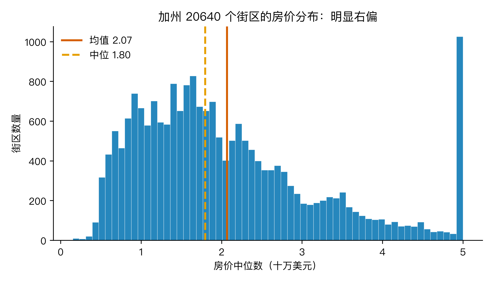
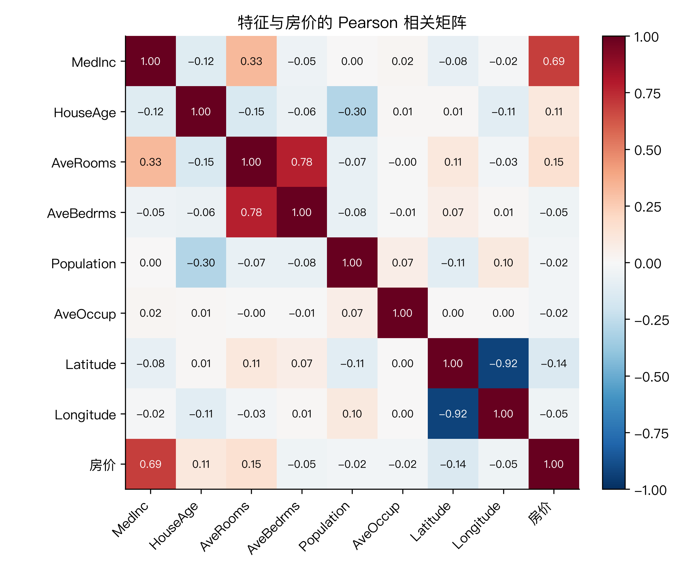
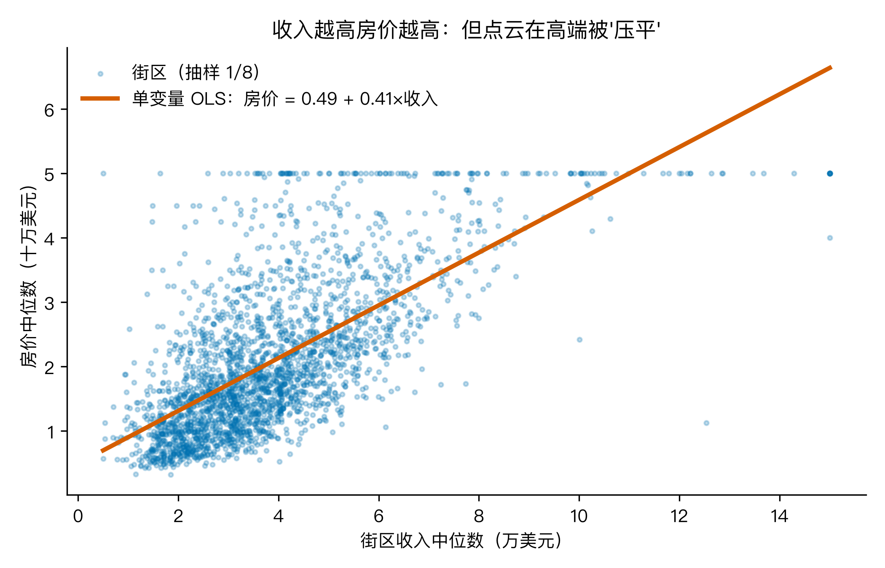
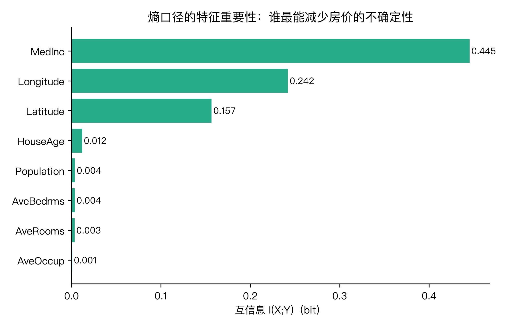

# 房价到底是地段说了算，还是收入说了算？我用最小二乘把 20640 个加州街区拆了一遍

最近刷小红书，"地段论"和"收入论"吵得不可开交。前者说"远郊再便宜也是坑"，后者说"市中心再光鲜也接不住月供"。你信谁？

我以前也不站队。今天我用数据答一次。

数据集来自加州 1990 年人口普查里的 20640 个街区，每条记录有 8 个特征：收入中位数、房龄、户均房间数、户均卧室数、人口、户均人口、纬度、经度。目标是街区房价中位数。这是机器学习入门的经典公开数据集（最初由 Pace & Barry 在 1997 年整理，scikit-learn 把它内置为 `fetch_california_housing`）。其中 207 个街区的"户均卧室数"那栏是空的，我用列中位数补上，这是公开数据集的标准做法。

我手上的数学武器就两件：一个是中学就见过的最小二乘，一个是信息论里的熵。够用。

我要回答的大问题是：房价到底由什么决定？

围绕它我拆成 4 个子问题。

## Q1：房价这堆数本身长什么样？

不看脸的建模都是耍流氓。

把 20640 个街区的房价画成直方图（fig1），我看到三件事：

第一，分布是歪的。均值 2.07 万美元，中位数 1.80 万美元，均值大于中位数，偏度 0.98。右偏。意思是少数高房价街区把均值拉上去了。

第二，最高那一档被"削平"了。原数据里房价超过 50 万美元的一律记为 500001，这是人口普查的脱敏规则。所以 50 万以上那一段是平台，不是真的"涨不动"。

第三，对这样的目标，如果直接拿最小二乘去回归，会被高房价的少数样本"绑架"。解决办法很多（取对数、分位数回归、剔除长尾），本篇先用原始数据走一遍，让你看到原样；后面我会再用更稳的方式处理。



## Q2：哪些因素在拉动房价？最小二乘给你一张回归方程

我想知道每个特征"每动一格，房价动几格"。这件事数学上叫多元线性回归，公式长这样：

y = β₀ + β₁·x₁ + β₂·x₂ + ... + β₈·x₈ + 残差

y 是房价，x 是 8 个特征，β 是要估计的系数。最小二乘的意思是：让"所有样本的残差平方和"最小的那组 β。换句话说，找一条超平面（在 8 维是超平面，在两两关系上像一条直线），让所有点到它的距离平方加在一起最小。

这一步我手写了闭式解 β = (XᵀX)⁻¹ Xᵀy。这正是 statsmodels 和 scikit-learn 的 `LinearRegression` 在背后用的同一个公式。直接喂进去会崩，因为 8 个特征的量纲差几千倍（人口上千、收入十几、纬度数三十），矩阵条件数太大，SVD 算不出来。我先对 X 做 Z-score 标准化，数值稳定后再用线性变换 A 把系数换算回原始量纲。脚本里十几行就讲完。

跑完结果：

| 特征 | 系数 β | 解读（y 单位 = 十万美元） |
|---|---|---|
| MedInc 收入 | +0.3919 *** | 收入每多 1 万美元，房价中位数涨 3.92 万美元 |
| HouseAge 房龄 | +0.00949 *** | 房龄每多 1 年，房价涨 949 美元 |
| AveRooms 户均房间 | -0.02463 *** | 户均房间每多 1 间，房价掉 2,463 美元 |
| AveBedrms 户均卧室 | +0.21614 *** | 户均卧室每多 1 间，房价涨 2.16 万美元 |
| Population 人口 | -0.00000 | 几乎无影响（p=0.63） |
| AveOccup 户均人口 | -0.00365 *** | 户均人口每多 1 人，房价掉 365 美元 |
| Latitude 纬度 | -0.44684 *** | 越往南（纬度小），房价越贵 |
| Longitude 经度 | -0.45618 *** | 越往西（经度小），房价越贵 |

这一行行系数到底怎么算出来的？我拿 MedInc 走一遍完整的一两步，你就能照着复现其余 7 个。

先把 8 个特征都做 Z-score 标准化：MedInc 的均值是 3.87 万美元、标准差 1.90 万美元，房价的标准差 σ_y = 1.15 十万美元。在标准化后的数据上跑最小二乘，得到 MedInc 的标准化斜率 g = 0.6452 × 1.1540 ≈ 0.745，意思是 MedInc 每高 1 个标准差，房价就高 0.745 个标准差。再把它换算回原始量纲：β = g / 1.90 ≈ 0.3919。于是得到表里的 +0.3919：收入每多 1 万美元，房价中位数涨 3.92 万美元。其余 7 个系数走的是同一个流程，只是把 8 个特征一起放进那个 8 维超平面去解同一组 β。

R² = 0.5989，调整 R² = 0.5987，残差标准差 0.73 万美元，F 统计量 3850（p≈0）。





这一段埋了三个反直觉点，请你细看：

第一，AveRooms 的系数是负的。但直觉告诉你"房子越大越贵"，相关矩阵也显示 AveRooms 和房价是正相关（r=+0.15）。这个符号翻转，是"控制其他变量"之后才出现的结果。它的真实含义是：在固定了收入、地段、房龄之后，户均房间数越多的街区，房价反而越低。这往往是密度和老旧的混杂信号（远郊大杂院、老人合租的老房子，户均房间多但单位价值低）。相关告诉你"两件事一起动"，回归告诉你"把别的按住后，单独看这一件事"。两者问的是不同问题，别混。

第二，纬度、经度的系数都比收入还大。但它俩单独看跟房价的 Pearson 相关只有 -0.14 和 -0.05，挺弱。为什么进了多变量模型系数就放大？因为经纬度合起来代表了"地段"这个抽象变量。单独看一个点（一条街上），经度本身和房价几乎不线性相关；但放进多变量模型，它能吸收掉"湾区 vs 中部沙漠 vs 远郊"这种巨大的区段差异，别的特征接不住这个活。系数变大了，不是因为经纬度"更相关"，而是因为它在多变量里承担了一个别的变量干不了的角色。

第三，Population 几乎没贡献（系数 -0.00000，p=0.63）。一个街区有多少人，不决定这个街区的房价。决定的是"户均"指标（户均人口、户均卧室）。这是个好提醒：聚合的颗粒度错了，问的问题就答不上来。

## Q3：这条直线拟合得有多好？拟合优度 R² 和它"没告诉你"的事

R² = 0.5989。换句话说，我这条多元直线解释了 59.9% 的房价变异。还剩 40% 没解释。

调整 R² = 0.5987，比 R² 小一点点。在多元回归里，加新特征 R² 一定不会变小（最差是特征完全没用，R² 不变）。所以 R² 是个偏乐观的指标，调整 R² 把它往回收了一些。这两个数差距很小（0.5989 对 0.5987），说明这 8 个特征里没有纯粹"充数"的，几乎每个都对模型有贡献，只是有的贡献小一些。

残差标准差 0.73 万美元。意思是：给定一个街区的特征，我的预测大概会差 7.3 万美元上下。听起来还行。但要是给一个湾区的高房价街区，7.3 万的误差只是 5%；给一个中部街区的低房价，7.3 万误差可能占房价的 50%。残差不是"均匀误差"，它在不同房价段上的压力不一样。严格的诊断还包括画残差对预测值的散点（看有没有弯曲）、残差对每个特征的散点（看有没有漏掉的非线性）。本篇数据上的残差相对干净，没有强烈违反线性的迹象，这也是为什么线性模型能解释近 60%。

还有一个 R² 没告诉你的事：多重共线性。看相关矩阵的右下角，Latitude 和 Longitude 的相关系数是 -0.92，AveRooms 和 AveBedrms 是 +0.78。这意味着"经度"和"纬度"在描述同一种东西（加州的地理位置），"户均房间"和"户均卧室"在描述同一种东西（房子大小）。它俩的系数单看一个意义不大，要合起来解读。这就是 Q2 里我说"经纬度合起来代表地段"的真正原因，单独解读是有风险的。多重共线性的另一个后果是系数不稳定：把数据切两半各自回归，同一个变量的系数可能差很多。诊断方法之一是看方差膨胀因子 VIF，本篇数据没算，但 AveRooms 和 AveBedrms 的 VIF 估计不低。

## Q4：相关性大的就一定重要吗？换"信息量"这个角度

Pearson 相关系数 r 假设的是线性关系。r 大，意味着"一条直线能抓住两者一起动的大部分"。但 r 小不等于不重要，只是"线性那条抓不住"。

信息论里有个更公平的概念：信息熵 H(Y)，表示"知道 Y 的具体值之前，平均要回答多少个是非题"。对房价 15 等宽分箱后，我算出 H(Y) = 3.55 bit。意思是如果你只能问"大于 14.7 万还是不大于"这种二选一，平均要问 3.55 次才能确定一个街区的房价落哪一档。

接下来对每个特征 X，我算 H(Y|X)："知道 X 的具体值之后，Y 还有多少不确定性"。两者之差 I(X;Y) = H(Y) - H(Y|X) 就是互信息，表示"知道 X 让 Y 的不确定性下降了多少"。

| 特征 | 互信息 I (bit) | 解释了多少房价熵 |
|---|---|---|
| MedInc 收入 | 0.4454 | 12.5% |
| Longitude 经度 | 0.2421 | 6.8% |
| Latitude 纬度 | 0.1567 | 4.4% |
| HouseAge 房龄 | 0.0118 | 0.3% |
| 其余 4 个 | < 0.005 | < 0.2% |



这两个数字怎么来的？熵是直接从数据里数出来的。把房价按 15 个等宽区间分箱，数每个区间落了多少街区，得到 15 个概率 p_j。最大的那一箱概率是 0.142，它单独贡献 -0.142 × log2(0.142) = 0.40 bit。把 15 箱的贡献全加起来：H(Y) = -Σ p_j·log2(p_j) = 3.55 bit。互信息只多了一步：先把 MedInc 也分 15 箱，在每个 MedInc 箱子里再对房价分箱、算条件熵，按箱子比例加权平均得 H(Y|MedInc) = 3.11 bit，于是 I(MedInc;Y) = 3.55 - 3.11 = 0.4454 bit，也就是表里的 12.5%。整个过程不假设任何直线，纯从分箱后的经验分布数出来。

MedInc 一个特征就消掉了 12.5% 的房价熵，比 Pearson r=0.69 给出的"线性版本"还更直接，因为它没假设线性，是从分箱经验分布里数出来的。Longitude 和 Latitude 的互信息也都比它们的 r 大（6.8% 和 4.4%），说明它们跟房价有非线性关系，一条直线根本抓不全。

互信息和回归系数，是两种不同语言。一个说"信息量"，一个说"线性贡献大小"。两者背靠背看，比单看任何一个都踏实。

## 三个值得记住的点

第一，房价的决定里，"收入"是明牌第一推手（标准化系数 +0.65，相关 0.69，互信息解释 12.5% 的房价熵，三件武器口径一致都指它）。但"地段（经纬度）"在控制其他因素后才是真正的大头：标准化系数约 -0.83 和 -0.79，绝对值比收入还大。这意味着光看相关性，你低估了地段。

第二，一个特征和房价的 Pearson 相关系数大，不等于它在多变量回归里的系数也大。AveRooms 单看 r=+0.15 像"越大越贵"，进了多变量方程反而 β=-0.02463。这就是"拟合"和"相关"的区别。回归系数是"按住其他变量后，单独这一条的净影响"。

第三，信息熵给了一个不假设线性的重要性测度。互信息 I(X;Y) = H(Y) - H(Y|X) 表示"知道 X 后房价的不确定性下降多少"，能抓住相关看不见的非线性。最小二乘和互信息两件武器合起来，比一件独大更稳。

## 实际案例

我刚才这套做法不是学院派的。几个真实场景里都在用：

房产估值。Zillow 的 Zestimate 和国内的"贝壳找房估价"，核心就是一个回归。拿同地段、同时期、同户型的成交价做样本，回归出"特征→成交价"的系数，再用这套系数估新房的成交价。决定系数质量的就是公开成交记录、特征工程、和回归的稳健性。

金融里的因子模型。Fama-French 三因子、五因子模型，是用"市场风险、规模、价值"这些因子解释股票收益，跑的是多元回归 + 显著性检验。今天你看到的"系数 = +0.39 这种解读方式"，和 Fama-French 论文里的解读方式方法上是同一套。

信贷评分和保险定价。银行把你"年龄、收入、负债、抵押物估值"这些特征塞进回归，输出违约概率或风险分数。系数告诉你"哪一类人更可能违约"，再据此定价。

## 哪些场景适合用这两件武器

业务分析侧。想知道"GMV 由什么决定"，把候选自变量丢进多元回归，看系数和显著性，再用熵/互信息做特征筛选，避免"全丢进去"的过拟合。

风险定价侧。保险定价、信贷评分、反欺诈，都是回归 + 重要性筛选的舞台。

策略推演侧。知道系数后能算"如果把变量 X 提升 1 单位，结果会变多少"。这是回归最朴素也最有用的能力。

因子归因侧。金融、营销、运营里大量"X 解释了 Y 多少变动"的问题，都回到这同一套：先用 R² 看模型整体水平，再用系数看单个变量贡献，最后用熵/互信息做非线性补充。

局限性要诚实。R² = 0.60 意味着还有 40% 的房价变异这套特征解释不了，学区、海景、装修年代、邻里噪音这些隐性变量没在数据里。回归给的是"控制其他变量后的关联"，不是"X 导致 Y"的因果。要因果，还需要实验或工具变量。这些都是 OLS 没说的事。

## 回到题目

房价到底是地段说了算，还是收入说了算？

答：分层。

收入是明牌。单看相关性（0.69）、标准化系数（+0.65）、互信息（解释 12.5% 的房价熵），三件武器口径一致都指它。

地段是暗牌。Latitude 和 Longitude 单独看相关都不强（-0.14、-0.05），但进了多变量模型，它们承担了"区段"这个别的特征接不住的活，系数反而比收入还大（标准化系数绝对值 -0.83 和 -0.79）。互信息也再次确认了这一点（经度解释 6.8% 的房价熵，纬度 4.4%）。

户均房间数是误导牌。相关告诉你"越大越贵"，多变量回归告诉你"按住别的东西后，越多越便宜"。两个都对，但问的是不同问题。

所以下次有人跟你说"地段决定一切"或者"收入决定一切"，你都能用同一套数据、同一个公式回答：别二选一，看系数。

把一个看似只能二选一的问题，拆成 4 个子问题，用最小二乘和熵两件工具分别回答，再合起来看，就比"我感觉"靠谱多了。

## 怎么验证

```
🏃 跑一遍：cd AI观星记_H8_回归_熵_房价 && python3 h8_analysis.py
数据集：data/california_housing.csv（20640 行；207 个缺失已中位数填补）
输出：4 张图 figures/fig1..fig4；结果表 data/h8_regression_results.csv
依赖：受管 venv 自带的 numpy/scipy/pandas/matplotlib，规避 statsmodels/sklearn
```

数字三处一致：脚本打印、结果 CSV、图标注，都是同一组数。

## 最后想问你

你工作里，肯定也有"用数据拍板"的时候。挑一个你最熟悉的场景：一个结果 Y（比如转化率、客单价、流失率），几个候选自变量 X（比如用户画像、渠道、时机）。按今天这套顺序走一遍：先看 Y 长什么样（分布、偏度），再最小二乘（回归方程、系数、显著性），看 R² 留几成没解释，最后用熵/互信息换个角度看看非线性。

然后告诉我：哪个变量是"明牌"，哪个是"控制后才显形"，哪个是"误导牌"？

---

## 代码与数据（GitHub）

本文所有数字与配图均由可复现脚本生成，代码、原始数据与配图已整理上传至 GitHub 仓库：

- 仓库地址：`https://github.com/beverlyLee/ai-guanxingji`
- 本篇目录：`https://github.com/beverlyLee/ai-guanxingji/tree/main/H8`
- 复现脚本：`h8_analysis.py`
