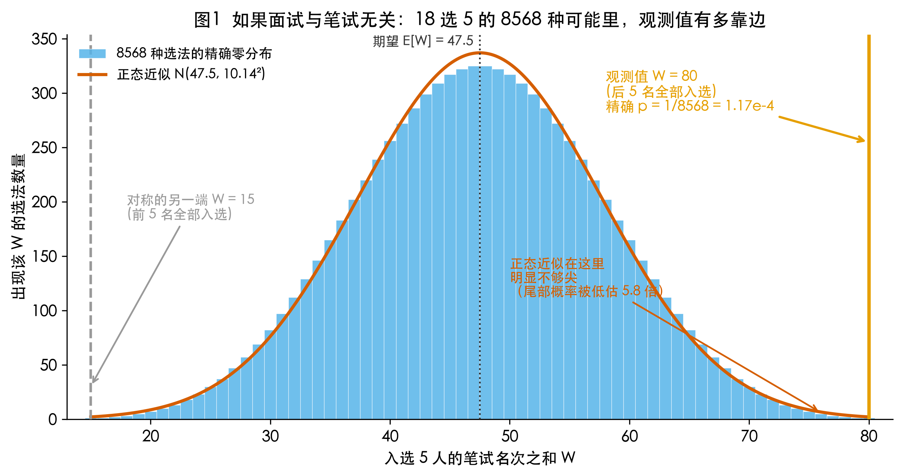
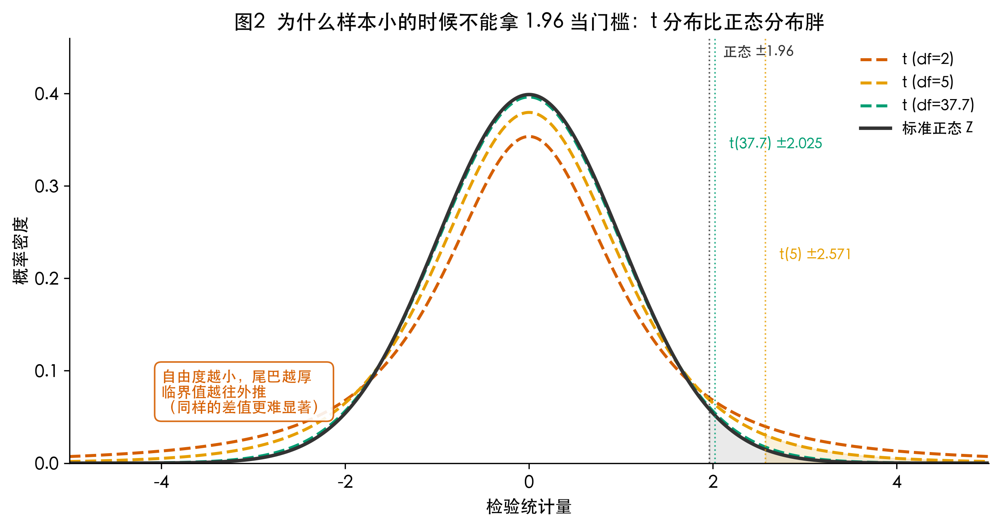
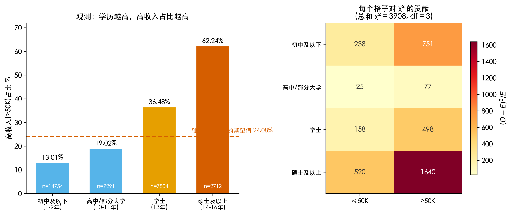
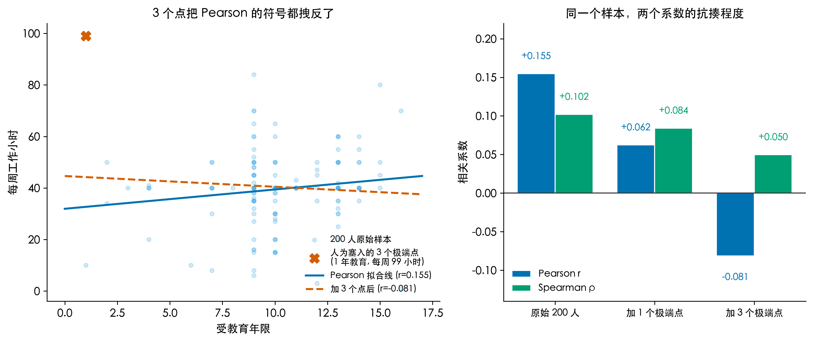

# 笔试前13名全被淘汰，是巧合还是有人动手脚？我把 32561 份收入记录算了一遍

今年 8 月，佛山季华中学的一次教师招聘在网上炸了。8 月 5 日公示的总成绩里，物理岗位进入面试的 18 个人，笔试前 13 名全部落选，反而排名最后 5 名全部进了体检名单。被淘汰那 13 个人的笔试成绩，最高的 99 分，最低的 81 分。

朋友圈分成了两派。一派说"这概率也太低了，肯定有猫腻"，另一派说"面试本来就主观，运气好而已"。

两边争的都是"我觉得"。这件事其实可以算。

8 月 19 日，佛山市联合调查组通报了提级调查结果：查实面试环节存在"将考生毕业院校知名度作为重要筛选条件、提早划出预期录用范围、内部评议"等违规行为，面试成绩无效，重新组织面试；学校党委书记、校长停职立案审查，4 名干部被立案，另有 14 人被追责问责。调查组调阅各环节原始材料 1570 份，回看视频 96 小时，谈话 105 人次。

官方结论有了。我想聊的是另一件事：在通报出来之前，单看那张公示表，我们自己能不能判断"这像不像巧合"？以及它牵出的那个更根本的问题：拿"学校名气"这种标签筛人，到底筛出了什么？

要算清楚，18 个人太少了。它够我判断"像不像巧合"，但没法告诉我"标签到底有多大预测力"。所以我另准备了一份大得多的公开数据：UCI Adult，也叫 Census Income，来自 1994 年美国人口普查，32561 条个人记录。每条有受教育年限、每周工作小时、年龄、资本收益、职业，以及年收入是否超过 5 万美元（1994 年口径）。它是收入与公平性研究里用了三十年的标准基准数据集，谁都能下载。

今天的数学武器是一整套"判断差异是不是真的"的工具：假设检验（单侧与双侧）、Z 检验、T 检验、卡方检验，加上一整个相关系数家族（Pearson、Spearman、Kendall、点二列、φ）。

我要回答的大问题是：一个标签和一个结果之间，我们凭什么说"有关系"？这个关系又有多强？

拆成 4 个子问题。

## Q1：「前13名全被淘汰」到底有多不可能？假设检验的思想

假设检验的想法就一句话：先假设什么都没发生，再看数据有多打脸。

这里"什么都没发生"的意思是，面试打分和笔试名次无关，5 个名额在 18 个人里等可能地分配。这叫原假设 H₀。

在这个假设下，18 选 5 一共有 C(18,5) = 8568 种选法，每种出现的概率相同。我把入选那 5 个人的笔试名次加起来，得到一个"秩和" W。面试公平的话 W 该落在中间；靠后的人被集体捞上来，W 就会偏大。

现实里的 W 是多少？前 13 名全落选、后 5 名全入选，入选者的名次就是 14 到 18，W = 14+15+16+17+18 = 80。

8568 种选法里，W 大于等于 80 的只有 1 种，就是这一组。所以：

p = 1/8568 = 0.000117

这就是 p 值的全部含义：如果面试真的和笔试无关，出现"这么极端或更极端"的结果，概率是万分之 1.17。



我用的是精确检验，把 8568 种可能全枚举了一遍。如果偷懒用大样本的正态近似呢？

W 的期望是 n₁(N+1)/2 = 5×19/2 = 47.5，标准差是 sqrt(n₁n₂(N+1)/12) = sqrt(5×13×19/12) = 10.14。于是 Z = (80-47.5)/10.14 = 3.20，查正态分布表得 p = 0.00068。

比精确值大了 5.8 倍。样本只有 18 个的时候，正态近似在这个尾部已经不准了，真实分布比正态瘦得多。这就是小样本要用精确检验（Fisher 精确检验、Wilcoxon 精确检验都是这个思路）而不是无脑套公式的原因。

顺带把单侧和双侧讲清楚。刚才我只算了"入选者名次异常靠后"这一个方向，这叫单侧检验（W 偏大，所以是右侧）。但如果我事先压根没方向，只是觉得"这种聚集太整齐了"，那对称的另一端"前 5 名全入选"（W = 1+2+3+4+5 = 15）同样算异常，两边概率加起来得 p = 2/8568 = 0.000233。

同一份数据，单侧 0.000117，双侧 0.000233，差一倍。这就是"要不要先验方向"的代价。方向必须在看数据之前定下来，看完再挑小的那个报，是统计学里最经典的作弊手法，Q4 我会用真实数据演一遍它有多容易。

最后要诚实：p = 0.000117 只说明"在公平随机的假设下，这个结果极难出现"，它证明不了有人违规。统计的职责是把"该不该查"从嘴仗变成数字，至于"到底发生了什么"，那是调查组调阅 1570 份材料去回答的事。

## Q2：学历这个标签，真的能预测收入吗？Z 检验与 T 检验

18 个人只能判断"像不像巧合"。要回答"标签有多大预测力"，得换大样本。下面全部改用那 32561 条记录。

我知道你会问：人口普查数据能说明招聘的事吗？说明不了那一次招聘。但它能回答这类问题里更通用的那一半：一个标签和一个结果之间的关联，能有多强、有多可靠。

先问最直接的：本科及以上的人，拿到高收入（年收入超 5 万美元）的比例是不是真的更高？

本科及以上：8067 人里 3909 人，48.46%
本科以下：24494 人里 3932 人，16.05%
差了 32.40 个百分点。

这个差距是真的还是抽样波动？用两比例 Z 检验：

Z = (p̂₁ - p̂₂) / sqrt( p̄(1-p̄)(1/n₁ + 1/n₂) )

p̄ 是合并后的总体比例 24.08%。代进去：

Z = 0.3240 / 0.005489 = 59.04

Z = 59 是什么概念？标准正态在 Z = 3 时尾部只剩 0.0013，Z = 59 时 p 值约 10⁻⁷⁵⁹，双精度浮点数直接记成 0。这种量级的 p 值已经不携带信息了，它只在说一件事：样本量够大时，你不需要靠 p 值下结论，直接看效应量。本科及以上拿到高收入的概率是其他人的 3.02 倍（相对风险 RR = 3.019），优势比 OR = 4.92。

为什么这里用 Z 不用 T？因为样本够大（n₁ = 8067、n₂ = 24494），按中心极限定理，比例的抽样分布趋近正态，样本方差已经把总体方差估得很稳，正态分位数 1.96 就是可靠门槛。

T 检验什么时候上场？样本小、总体标准差只能靠样本去估、而这个估计本身不准的时候。

拿连续变量"每周工作小时"走一遍。本科及以上组平均 43.44 小时，本科以下组 39.45 小时，差 3.99 小时。用 Welch t 检验（两组方差不齐时不假设等方差）：

t = 25.49，自由度 13806，p = 3.95×10⁻¹⁴⁰

自由度一万多的时候，t 分布和正态几乎重合，用哪个都一样。真正的区别在小样本。

为了让这件事看得见，我从两组里各随机抽 20 人（随机种子固定为 42，你照着跑能出一模一样的数）：

两组均值差 5.80 小时，比全样本的 3.99 还大
Welch t = 1.567，自由度 37.7，p = 0.126

不显著。明明差了 5.8 小时，比真实差距还大，却因为只有 40 个样本判不出来。

这时候如果误用正态近似，p = 0.117，看着差不多，但门槛是错的：自由度 37.7 时 5% 的双侧临界值是 ±2.025，不是 ±1.96。t 分布比正态胖，自由度越小胖得越厉害（图2）。df = 5 时临界值推到 ±2.571，df = 2 时推到 ±4.303。

多出来的那块尾巴，就是"用样本标准差代替总体标准差"付出的不确定性代价。样本越小，这个估计越不准，尾巴就得越厚。



选型压成三句话：两组比比例、或者大样本（经验上 n > 30 且方差能稳定估计），用 Z 检验；小样本且总体标准差未知，用 T 检验，自由度是 n-1（单样本）或走 Welch-Satterthwaite 公式（两样本）；两组方差明显不齐，用 Welch 版本，别用合并方差那版。

## Q3：「有关系」和「关系有多强」是两件事。卡方检验与效应量

Z 检验和 T 检验比的是"两组"。如果我想看的是"学历分好几档、收入分好几档，这两件事独不独立"，就该卡方检验上场。

把受教育年限分成 4 档，和收入是否超过 5 万美元做交叉表：

| 学历档 | 人数 | 高收入占比 |
|---|---|---|
| 初中及以下（1-9 年） | 14754 | 13.01% |
| 高中/部分大学（10-11 年） | 7291 | 19.02% |
| 学士（13 年） | 7804 | 36.48% |
| 硕士及以上（14-16 年） | 2712 | 62.24% |

如果学历和收入完全独立，每一档的高收入占比都该等于总体的 24.08%。实际数字离这条水平线差得远。卡方统计量就是把每个格子的偏离平方、再按期望值归一化后加起来：

χ² = Σ (O - E)² / E = 3908.38，自由度 = (4-1)×(2-1) = 3，p 小到记不下来。



右边那张热图是每个格子对 χ² 的贡献。硕士及以上档的"高收入"格单独贡献 1175，"初中及以下"档的"低收入"格贡献 578，χ² 主要由这两个角上的格子撑起来。

但 χ² = 3908 这个数没有单位，它随样本量线性膨胀，没法拿去衡量"关系有多强"。要衡量强度得换成效应量。4×2 表用 Cramér's V：

V = sqrt( χ² / (n × min(r-1, c-1)) ) = sqrt( 3908.38 / (32561 × 1) ) = 0.3465

V = 0.35 是个中等偏强的关联。这才是"标签有多大用"的答案，不是那个 p 值。

把表压成 2×2（本科及以上 × 高收入），χ² = 3485.30，可以算另一个更常见的效应量 φ 系数：

φ = 0.3272

这里有个漂亮的数学关系，我在脚本里验证过：

φ² = χ² / n，也就是 0.3272² = 0.10704，而 3485.30 / 32561 = 0.10704，小数点后 8 位完全一致。

对 2×2 表来说，"是否存在关联"的检验统计量和"关联有多强"的效应量，是同一个东西的两种写法。

再看一个更锋利的用法。上面的卡方检验是无序的，只问"各档占比是不是不一样"，不管方向。但我其实有个明确的方向性假设：学历越高，高收入占比越高。把这个方向用进去，就是 Cochran-Armitage 趋势检验。给 4 个学历档赋分数 1、2、3、4，检验"占比随分数单调上升"，得到 Z = 59.84。

无序卡方要把 3 个自由度摊在各种可能的偏离模式上，趋势检验只花 1 个自由度，全部押在"单调上升"这一种模式上。押注越集中，命中时越有力。在这份数据上两者都显著到没有信息量，看不出差别；但样本只有几百、关联又比较弱的时候，趋势检验能捞回一些本来会被漏掉的结论。

现在说最容易踩的坑。φ = 0.3272 是固定的，可 χ² 和 p 值完全由样本量决定。我在脚本里做了个实验，保持 φ 不变，只改样本量：

| 样本量 n | χ² | p 值 |
|---|---|---|
| 100 | 10.70 | 0.0011 |
| 500 | 53.52 | 2.6×10⁻¹³ |
| 2000 | 214.08 | 1.8×10⁻⁴⁸ |
| 10000 | 1070.39 | 9×10⁻²³⁵ |
| 32561 | 3485.30 | 小于 10⁻³⁰⁰ |

同样的关联强度，在 100 人里只是一点苗头（p = 0.0011），在 32561 人里就成了天文数字。p 值回答"这个关联能不能被噪声解释"，效应量回答"这个关联有多大用"。样本量一大，p 值永远会变得显著，它就不再提供额外信息了。

这就是只看 p 值会翻车的原因。一个 φ = 0.02 的关联，在 10 万人里也能轻松做到 p < 0.001，但它对预测单个人的收入毫无帮助。

## Q4：五个相关系数，到底该用哪个

很多人以为这是五个不同的东西，其实它们是同一套思路在不同数据类型上的变形。

拿"受教育年限"和"每周工作小时"这两个连续变量，在同一份 32561 条数据上算：

Pearson r = 0.1481
Spearman ρ = 0.1672
Kendall τ = 0.1319

三个数不一样，因为它们问的问题不一样。

Pearson 问的是"两个变量能不能用一条直线概括"，等于协方差除以两个标准差的乘积。它对极端值极其敏感，因为公式里有平方项。

Spearman 问的是"两个变量的排序一致程度"。算法特别直白：把两个变量各自换成秩（排名），再对秩算 Pearson。我在脚本里验证过这个恒等式，直接调 spearmanr 得到 0.167215，自己把数据换成秩再算 Pearson 也是 0.167215。因为它只认名次，一个值从 50 变成 5000 对它毫无影响。

Kendall 问的是"随便抽两个人，他们的排序一致的概率比不一致高多少"，也就是 τ = (一致对数 - 不一致对数) / 总对数。这个定义不依赖具体数值，只看两两比较的方向。我从 32561 人里随机抽 3000 人（约 450 万对）验证：一致对 1582366、不一致对 1209992，算出来 τ = 0.1334，和直接调函数的 0.1319 对得上，差异来自抽样。

受教育年限只有 16 个取值，工作小时有 94 个取值，数据里存在大量并列（ties）。Kendall 处理并列的方式和 Spearman 不同，这是两者数值差异的主要来源。样本小、并列多的时候 Kendall 通常更稳，解释也最直接（"两个人排序一致的比例高 13 个百分点"）。

接着是"质量相关"，也就是至少有一个变量是分类的。

一个天生的二分类（比如"是否高收入"，编码成 0 和 1）配一个连续变量（比如受教育年限），用点二列相关。好消息是它不用新公式，直接算 Pearson 就行：

r_pb（高收入, 受教育年限）= 0.3352
r_pb（高收入, 每周工作小时）= 0.2297

更有意思的是它和 T 检验的关系。把 0.2297 代进这个式子：

t = r_pb × sqrt(n-2) / sqrt(1 - r_pb²) = 42.5839

而直接对高收入组和低收入组的每周工作小时做两样本 t 检验，得到 t = 42.5839。一模一样。

"一个二分类标签和一个连续变量的相关系数"，跟"按这个标签分成两组做 t 检验"，是同一件事的两种说法，p 值也必然相同。这条恒等式值得记住，它能帮你在两份口径不同的报告之间自由换算。

两个都是二分类时（比如"本科及以上"和"高收入"），用 φ 系数，就是 Q3 里那个 φ = 0.3272，它和卡方的关系已经验证过了：φ² = χ²/n。

至于"二列相关"，它跟点二列长得像但不是一回事。二列相关处理的是"本来连续、被人为切成两半"的变量（比如把考试分数按 60 分切成及格与不及格），公式要除以正态曲线的纵坐标做修正，数值会比点二列大。区分标准只有一条：这个二分类是天生的（性别、是否患病），还是人为切的（及格线、中位数分割）。天生的用点二列，人为切的用二列相关。

选型可以压成一张表：

| 要比较的两个变量 | 用谁 |
|---|---|
| 都是连续，关系接近直线，没有要命的极端值 | Pearson |
| 都是连续或有序，只要求单调、不要求直线，或有极端值 | Spearman |
| 样本小、并列多、想直接解释成"一致对比例" | Kendall |
| 一个是天生二分类，一个是连续 | 点二列（就是 Pearson） |
| 两个都是二分类 | φ 系数，且 φ² = χ²/n |

极端值那条值得单独看一眼。我从数据里随机抽 200 人（种子固定为 1），受教育年限和每周工作小时的 Pearson r = 0.1549，Spearman ρ = 0.1020。然后人为往里塞 3 个极端观测（1 年教育、每周 99 小时，这种人在真实数据里确实存在，只是这 3 个是我放进去的）：

Pearson 从 +0.1549 变成 -0.0814，符号直接翻转
Spearman 从 +0.1020 变成 +0.0498，方向没变，只是变弱

三个点，200 个样本，就能让 Pearson 从"学历越高工时越长"变成"学历越高工时越短"。Spearman 顶多被打折，不会被骗。



不塞点，只用真实数据也能看到同样的倾向：把每周工作超过 80 小时的那 208 人（占 0.64%）去掉，Pearson 从 0.1481 升到 0.1587（+0.0106），Spearman 从 0.1672 升到 0.1705（+0.0033）。Pearson 的波动是 Spearman 的 3.2 倍。

最后回到单侧和双侧。Q1 里我说过，方向必须在看数据之前定。实践中这件事翻车有多容易？我做了个真实演练。

拿 13 个职业，逐个问"这个职业的每周工作小时和其他人有没有差异"，每个都跑 Welch t 检验。全部用双侧，13 个里 11 个显著。全部改用单侧（一律假设"这个职业工时更长"），13 个里 13 个显著，全中。

有 2 个职业正好卡在门槛上：

| 职业 | 人数 | 工时差 | 双侧 p | 单侧 p |
|---|---|---|---|---|
| Machine-op-inspct（机械操作与检验） | 2002 | +0.34 小时 | 0.0659 | 0.0330 |
| Sales（销售） | 3650 | +0.39 小时 | 0.0933 | 0.0467 |

同样的 t 统计量，双侧说不显著，单侧说显著。差半个小时的工时，在 3650 人的样本里也就是这么点事，换一下口径就能从"没差异"变成"有差异"。

我要坦白一件事：这 2 个是我扫完 13 个职业才捞出来的。如果我只把这两个写进报告、绝口不提另外 11 个，读者会以为我发现了一个站得住的结论。这就是 p-hacking 的日常形态，它通常不是造假，只是"挑好看的那部分报告"。

纠正办法也简单。13 次检验，用 Bonferroni 把门槛收紧到 0.05/13 = 0.0038，再看：还是 11 个显著，那两个擦边的自然被刷掉。所以在这份数据上结论并不脆弱，脆弱的是"挑着报告"这个动作本身。

## 三个值得记住的点

第一，p 值回答"能不能被噪声解释"，效应量回答"有多大用"，样本量一大 p 值必然显著。同一个 φ = 0.3272 的关联，在 100 人里 p = 0.0011，在 32561 人里 p 小到记不下来，可关联强度一步没变。看结论先看效应量（Cramér's V、φ、RR、Cohen's d），再看 p 值。

第二，单侧还是双侧必须在看到数据之前选定，事后挑小的那个报就是 p-hacking。我在 13 个职业里扫出 2 个擦边案例（机械操作双侧 0.0659 对单侧 0.0330，销售 0.0933 对 0.0467），换个口径就能翻转结论。同一批数据跑 k 次检验，用 Bonferroni 把门槛收到 0.05/k。

第三，相关系数不是五件工具，是同一套公式按数据类型换皮。Pearson 管线性连续，Spearman 就是"秩上的 Pearson"（我验证到小数点后 6 位相等），Kendall 数的是一致对减不一致对，点二列是"二分类 × 连续"时的 Pearson（且 t = r_pb·sqrt(n-2)/sqrt(1-r_pb²) 与两样本 t 检验精确相等），φ 是"二分类 × 二分类"（且 φ² = χ²/n）。碰上极端值时 Spearman 远比 Pearson 抗揍：3 个点能让 Pearson 符号翻转（+0.155 变 -0.081），Spearman 只是变弱（+0.102 变 +0.050）。

## 实际案例

这套东西不是考试专用，几个真实场景都在用。

A/B 实验。互联网产品的每次改版，本质就是两比例 Z 检验：对照组转化率 p₁，实验组 p₂，样本量够大时用 Z 检验判断差异是不是噪声。只放 5% 流量跑了两天那种早期实验，就该用 t 检验，把自由度不足的不确定性算进去。效应量在这里是"相对提升百分之几"，它才决定要不要全量。

招聘与合规审计。这次佛山事件就是现成的例子。想知道某个招聘环节的筛选结果和某个标签（院校层次、性别、年龄、户籍）是不是独立，做卡方独立性检验；想知道关联有多强，报 φ 或 Cramér's V。企业内部做公平性审计、监管部门做抽查，用的都是这一套。要注意的是，统计能定位"异常到该查一查"，定不了性，定性得靠调阅材料。

医学筛查与流行病学。疫苗有效率、药物疗效、危险因素与疾病的关联，标准做法是卡方检验（某个格子的期望频数小于 5 时改用 Fisher 精确检验）加上相对风险 RR 和优势比 OR。病例对照研究算出来的 OR，和 Q2 里那个 OR = 4.92 是同一个量。

质量管控。工厂想知道"换了一批原料，不良率是不是变了"，用两比例 Z 检验；想知道"不良率和生产线编号有没有关系"，用卡方独立性检验；想知道"温度和良率的关联有多强、是不是线性"，把 Pearson 和 Spearman 对比着看，两者差得远就说明有非线性或极端值。

金融风控。策略上线前的效果验证、客群差异检验、特征与违约的相关性筛选，跑的都是这些。风控里 Spearman 比 Pearson 常用，因为收入和资产这些变量重尾严重，几个大客户就能把 Pearson 带偏。

## 哪些场景适合用这套知识

比较两组有没有差异，指标是连续值（客单价、停留时长、工时、评分），用两样本 t 检验；方差不齐换 Welch 版本；样本大到几千上万时 t 和 Z 的结论一致。

比较两组有没有差异，指标是比例（转化率、通过率、不良率、及格率），用两比例 Z 检验，同时报相对风险 RR 和优势比 OR。

两个分类变量是否独立（学历档 × 收入档、渠道 × 是否留存、地区 × 是否违约），用卡方独立性检验；有 20% 以上格子的期望频数小于 5 时，卡方近似会失真，改用 Fisher 精确检验。

有明确方向性假设（剂量越高疗效越好、学历越高收入越高），趋势检验比无序卡方更有力，但方向必须在看数据之前写下来。

衡量两个变量的关联强度，按数据类型从 Q4 那张选型表里挑，同时报效应量和 p 值。

局限性也要诚实说。第一，所有相关和关联都不等于因果。学历和收入高度相关，不等于多读一年书就能多赚这些钱，能力、家庭背景、行业选择都混在里面。要因果，得靠随机实验或工具变量。第二，p 值不是"原假设为真的概率"，它是"如果原假设为真，看到这么极端数据的概率"，这两句话经常被搞混。第三，不显著不等于没有差异，也可能只是样本不够，Q2 里那个抽 20 人的例子，5.8 小时的差距都没测出来。

## 回到题目

笔试前 13 名全部被淘汰，是巧合还是有人动手脚？

答：不是巧合。但统计只能说到"该查"为止。

在"面试与笔试无关"的原假设下，18 选 5 一共有 8568 种等可能的选法，而实际发生的那一种（后 5 名全部入选）是最极端的一种，精确 p = 1/8568 = 0.000117。就算按最保守的双侧口径，也是 0.000233。万分之一到万分之二，这个量级足以支撑"必须查一查"，但它证明不了具体是谁做了什么。8 月 19 日的通报给出了真正的原因：把毕业院校知名度当成重要筛选条件，提早划定预期录用范围，内部评议。

而这件事牵出的那个更根本的问题，"用院校名气这种标签筛人，到底筛出了什么"，数据给的答案是：标签确实携带信号，但远没有人们以为的那么满。

在 32561 条记录上，学历和收入的关联强度是 Cramér's V = 0.3465（四档学历对两档收入），压成二分类后 φ = 0.3272。翻译成人话：知道一个人的学历，能显著改善你对他收入的猜测，本科及以上拿到高收入的概率是其他人的 3.02 倍。可 φ = 0.33 也意味着，学历解释掉的收入变异只是很小一部分，剩下那部分由行业、经验、地区、运气和一大堆没被记录下来的东西决定。

这就是统计能给一个标签下的最公允的判断：它有用，所以筛选时看它不算荒谬；它不够满，所以把它当成唯一标准，对那 13 个考了 81 到 99 分的人不公平。

把一个"我觉得有猫腻"的争论，拆成 4 个子问题，用精确检验、Z 检验与 T 检验、卡方与效应量、相关系数家族分别回答，最后合起来看，就比"我感觉"站得住脚得多。

## 怎么验证

```
🏃 跑一遍：cd AI观星记_H9_假设检验_相关性_招聘公平 && python3 h9_analysis.py
数据集：data/adult.data（UCI Adult / Census Income，32561 行）

下载（任选其一，CC BY 4.0 可自由复用，已实测可访问）：
- 官方数据集页（含变量说明、标准引用）：https://archive.ics.uci.edu/dataset/2/adult
- 直接下载 ZIP（605.7 KB，含 adult.data / adult.test / adult.names）：https://archive.ics.uci.edu/static/public/2/adult.zip
- 单文件直链 adult.data：https://archive.ics.uci.edu/ml/machine-learning-databases/adult/adult.data
- 引用：Becker, B. & Kohavi, R. (1996). Adult [Dataset]. UCI Machine Learning Repository. https://doi.org/10.24432/C5XW20

解压后把 adult.data 放到 data/ 下即可（脚本读取路径就是 data/adult.data）；原始 ZIP 也已附在仓库 data/ 下。
输出：4 张图 figures/fig1..fig4；结果表 data/h9_results.csv、h9_contingency.csv、h9_occupation_tests.csv
依赖：受管 venv 自带的 numpy/scipy/pandas/matplotlib，不需要 statsmodels
随机性：抽样演示固定种子（42 / 7 / 1），你跑出来的数和文章里一模一样
```

数字三处一致：脚本打印、结果 CSV、图标注，都是同一组数。

## 最后想问你

你工作里肯定也遇到过"这个差异到底算不算差异"的时刻：改版后转化率高了 0.3 个百分点，新渠道的客单价贵了 8 块钱，两个组的评分差了 2 分。

按今天这套顺序走一遍：先写下原假设和你准备用的方向（双侧还是单侧，现在就定，别等看完数据再改）；再看样本量决定用 Z 还是 t；然后算效应量，别只盯 p 值；变量里有分类的，从 Q4 那张选型表里挑对相关系数；最后问一句，这个效应量放到业务里到底值不值得动手。

然后告诉我：你手上那个差异，双侧和单侧分别跑到多少？效应量是多少？它值得动手吗？

---

## 代码与数据（GitHub）

本文所有数字与配图均由可复现脚本生成，代码、原始数据与配图已整理上传至 GitHub 仓库：

- 仓库地址：`https://github.com/beverlyLee/ai-guanxingji`
- 本篇目录：`https://github.com/beverlyLee/ai-guanxingji/tree/main/H9`
- 复现脚本：`h9_analysis.py`
