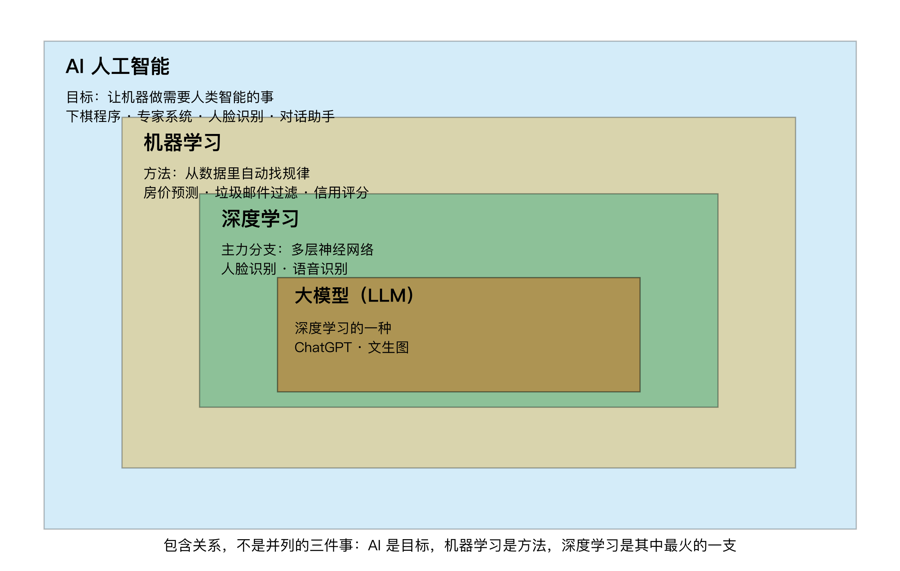
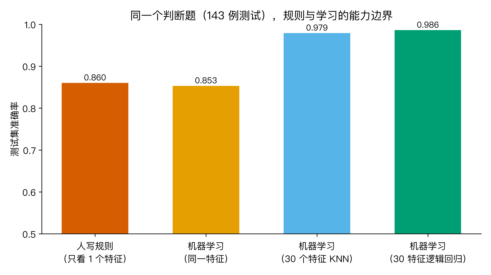
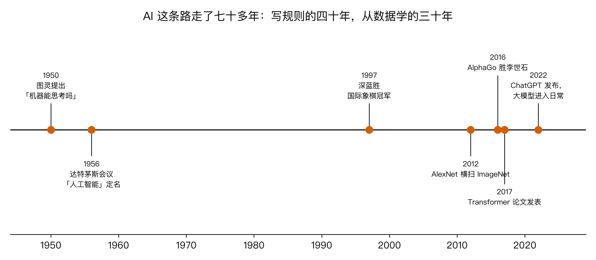

# 天天听 AI、机器学习、深度学习，到底谁包着谁？

家族群里，我妈把所有 AI 都叫"机器人"；公司周报里，"机器学习模型"出现在每一页；朋友圈里，ChatGPT 一会儿被叫 AI，一会儿被叫大模型，一会儿又被叫深度学习。

这三个词到底是什么关系？我观察了很久，发现大多数人（包括很多天天做 AI 产品的人）其实说不清。有人说它们是一回事，有人说是三件事，还有人画出了完全相反的关系图。

我要回答的大问题是：机器学习在 AI 里到底占什么位置？为什么今天几乎每一个 AI 产品背后都是它？

这个问题值得认真答一次，因为它决定了你后面看任何一个 AI 新闻时，能不能判断"这跟我有什么关系"。围绕它我拆成 4 个子问题。

## Q1：AI 是什么时候出生的，最初想干什么？

1950 年，图灵在一篇论文里问了一个问题："机器能思考吗？"六年后的 1956 年，美国达特茅斯会议把这个研究方向正式定名为 artificial intelligence，人工智能。目标很朴素：让机器做那些需要人类智能才能做的事，比如认字、下棋、看病、翻译。

最早的实现思路很直白：把智能写成规则。医生怎么判断感染？把教科书里的判断条件写成 if-else；下棋怎么赢？把"如果对手走这步，我就走那步"穷举出来。上世纪七八十年代的专家系统就是这条路，斯坦福开发的 MYCIN 能根据症状和化验结果建议抗生素用量，是当时的明星。

写规则这条路的命门在 1990 年代暴露了：世界不是 if-else。一个肿瘤的形态有几十个测量指标，指标之间的组合是天文数字；一张人脸的光照、角度、表情各不相同，谁能写完"左边眉毛上扬三毫米且逆光"这种规则？规则永远比世界少一种情况，程序一遇到没写到的情况就错得离谱。AI 也随之进入了几次寒冬。

这个困境逼出了一个完全不同的思路，也就是今天的主角。

## Q2：机器学习在 AI 里的哪个位置？

先给结论（fig1）：AI、机器学习、深度学习是包含关系，不是并列的三件事。AI 是最大的圈，目标是"让机器做需要智能的事"；机器学习是里面的一个圈，是实现这个目标的主流方法；深度学习又是机器学习里的一个圈，是其中最火的一支；你天天听的大模型，就长在深度学习这个圈里。



机器学习的定义可以一句话说清：不把规则写死，让程序从数据里自己找规律，再用找到的规律去处理没见过的情况。

对比一下两种思路。写规则：人观察世界，把规律总结成代码，世界变了人就得改代码。机器学习：人准备好数据和答案，机器自己找规律，数据变了重新学一遍就行。前者规律在人脑子里，后者规律在数据里。

这就是机器学习在 AI 里的地位：它是方法，而且是今天几乎所有实用 AI 的方法。你手机里的人脸识别、购物软件的推荐、银行的信用评分、邮箱的垃圾邮件过滤，背后都是机器学习模型，不是人写出来的规则。说 AI 是目标，机器学习是达成目标的发动机，这个比喻大体不差。

但"从数据找规律"这句话听起来像是给机器开了挂。它到底比你亲手划一条线强在哪？空口说不服人，我做了个实验。

## Q3："从数据学"到底强在哪？

实验用的是威斯康星乳腺癌诊断数据集（scikit-learn 内置，零下载）：569 个肿瘤样本，每个样本 30 个细胞核形态特征，比如半径、纹理、周长、光滑度，都是医生穿刺取样后测出来的真实数值，由威斯康星大学研究团队整理、UCI 机器学习仓库托管。任务是看这 30 个数，判断肿瘤是良性还是恶性。原始数据可以在 UCI 页面下载 CSV 自行核对（文末「怎么验证」有链接）。我留 143 例做测试集，只允许用剩下的 426 例做任何决策。

第一组实验，模拟"写规则"的老思路：只看一个特征，肿瘤平均半径，凭医学直觉"越大越恶性"划一条线。我在训练集上把恶性组和良性组的中位数取中点，得到阈值 14.73，然后拿去判那 143 例测试样本。准确率 0.860。

第二组实验，同一个特征，换成机器学习：K 近邻算法，让机器在训练集上自己学。测试准确率 0.853。

注意这个结果：同一个特征，机器学习跟人手划的线基本打平，甚至还低了半个百分点（fig2 前两根柱子）。这可能是本篇最反直觉的数字。如果你只看一个特征，机器没有魔法，你几十年练出来的判断力并不差。



真正的分水岭在第三组实验：把 30 个特征全部交给机器。K 近邻准确率到 0.979，逻辑回归到 0.986，比人写的单特征规则高出约 12 个百分点，143 例里多判对约 18 例。

差距来自哪？不是机器划线划得比人准，而是特征一多，人的写法就崩了。30 个特征，每个都要考虑"多少算大"、还要考虑两两组合（半径大且纹理粗糙呢？三个特征一起看呢？），组合数是指数爆炸的，人写到第 5 个特征就该放弃了。机器不怕这个，30 个、300 个、30 万个特征，它都是同一套流程：从数据里试出规律。写规则的能力上限是人的耐心，机器学习的上限是数据的量。

这一条就是"从数据学"对"写规则"的真正优势，也是机器学习能接管 AI 的原因：这个世界的复杂度，早就不允许人肉穷举了。

## Q4：深度学习和大模型凭什么最近才火？

既然"从数据学"这么好，为什么 AI 出生后的头几十年没爆发，偏偏是最近十几年？（fig3 是这条时间线。）



深度学习的核心结构神经网络并不新，1958 年心理学家罗森布拉特就造出了感知机，比达特茅斯会议只晚两年。它沉寂了几十年，缺的不是方法，是燃料。2012 年 AlexNet 在 ImageNet 图像识别比赛里把错误率从前一年的约 26% 拉到 15%，靠的是三样东西同时到位：互联网攒下的百万级图片数据、游戏显卡改造成的算力、还有一系列训练技巧。从那一年起，"数据多到喂得饱、算力贵到买得起、方法准到用得上"三件事第一次凑齐了，深度学习这个机器学习的分支接管了 AI 的主流。

后面的节点越走越快：2016 年 AlphaGo 下赢李世石，2017 年 Transformer 论文发表，2022 年 ChatGPT 把大模型带进普通人的日常。你今天听到的一切 AI 热点，都站在这条"从数据学"的线上。

那这个专栏要讲什么？讲发动机本身。我会从最简单的算法开始，线性回归、逻辑回归、决策树、随机森林、梯度提升、支持向量机、朴素贝叶斯、K 近邻、K 均值聚类、PCA 降维，讲到评估方法和神经网络，每一篇只讲一个算法，配一个你能亲手复现的真实数据集。大模型是这条链的远端，地基打完自然看懂。

## 三个值得记住的点

1. AI、机器学习、深度学习是包含关系，不是并列的三件事：AI 是目标，机器学习是今天实现它的主流方法，深度学习是机器学习里最火的一支，大模型长在深度学习里。
2. 机器学习的本质是"从数据里找规律"。只看一个特征，它划线不比你准；特征一多，组合规则人写不完，它能。它的上限是数据的量，不是人的耐心。
3. 深度学习火起来不是方法突然变神，神经网络 1958 年就有了，是数据、算力、方法三件事在 2012 年前后第一次凑齐。

## 怎么验证

```
🏃 跑一遍：cd AI观星记_M1_机器学习导论 && python3 code/ml_intro.py
数据集：sklearn 内置 load_breast_cancer（威斯康星乳腺癌诊断集，569 例 x 30 特征，零下载）
数据集来源（UCI 机器学习仓库，可下载原始 CSV 自行核对）：
https://archive.ics.uci.edu/dataset/17/breast+cancer+wisconsin+diagnostic
数据集文档（sklearn 官方，字段含义逐条可查）：
https://scikit-learn.org/stable/modules/generated/sklearn.datasets.load_breast_cancer.html
代码：code/ml_intro.py，含"人写规则 vs 机器学习"三组对照实验（规则只允许用训练集划阈值）、
      AI/机器学习/深度学习嵌套关系图、AI 大事时间线
输出：3 张图 figures/fig1..fig3；stats.json 汇总全部数字
依赖：numpy、scikit-learn、matplotlib
```

数字三处一致：脚本打印、stats.json、图内标注，都是同一组数。

## 最后想问你

你现在的工作里，一定还有靠人写规则撑着的环节：人工筛简历看关键词、人工审核内容靠一条条禁令、人工判断客户该不该跟进。挑一个你最有体感的，想两个问题：它的"特征"一共有几个？这些规则的组合，你写得完吗？

想完这两个问题，你就知道哪些活该交给机器学习了。这也是我们下一篇要开始认真干的事。
