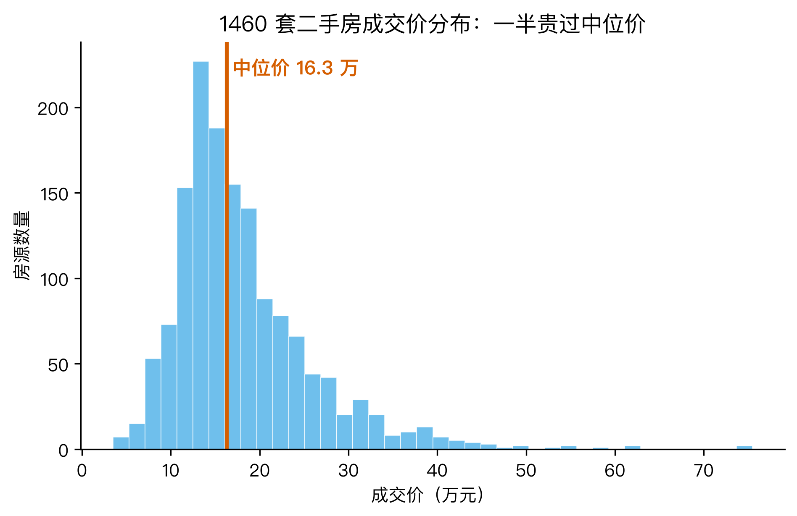
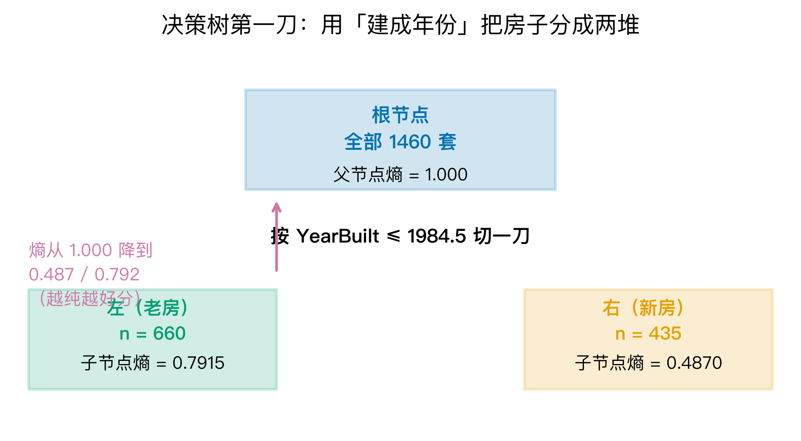
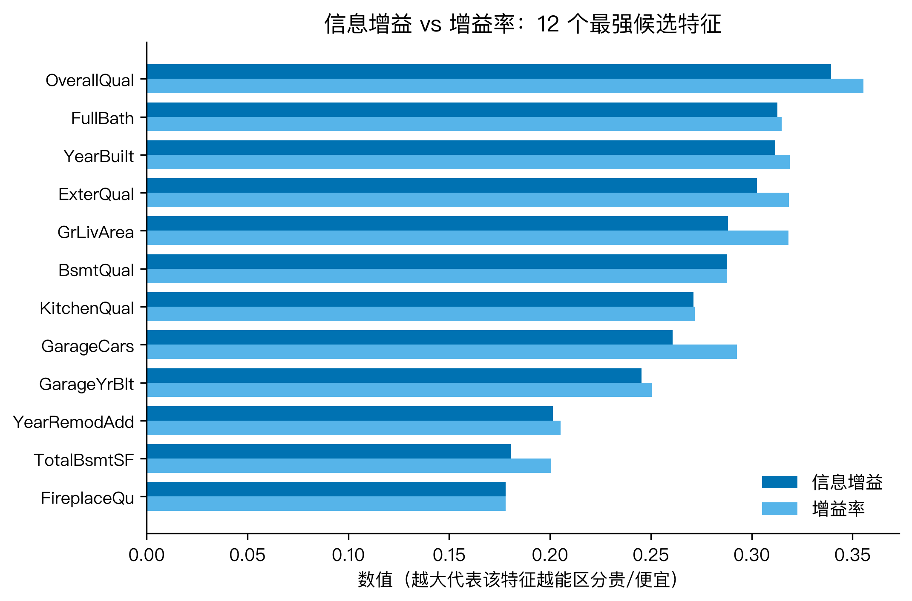
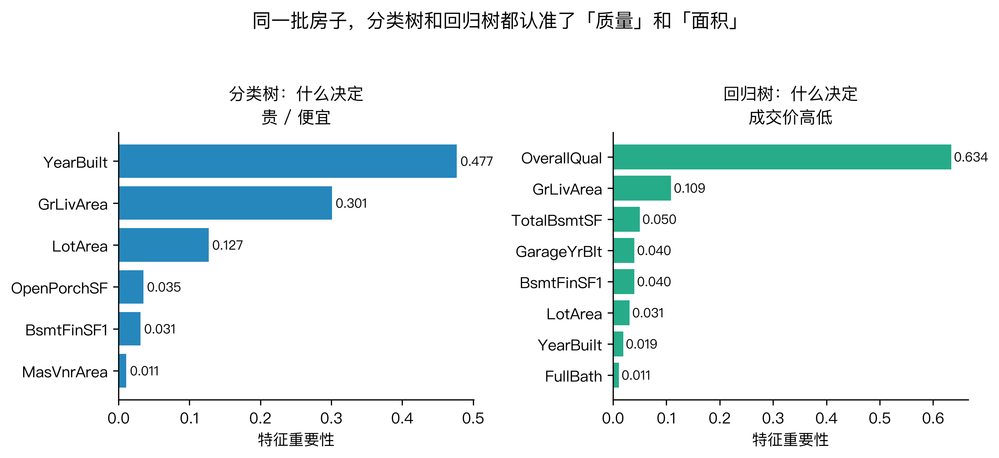
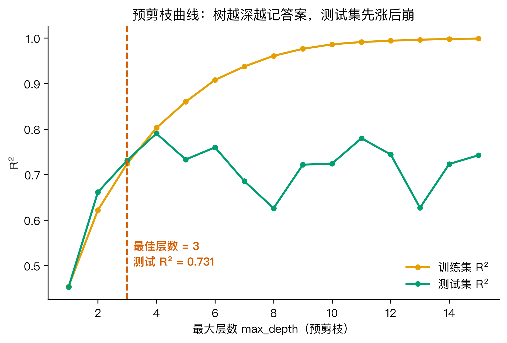
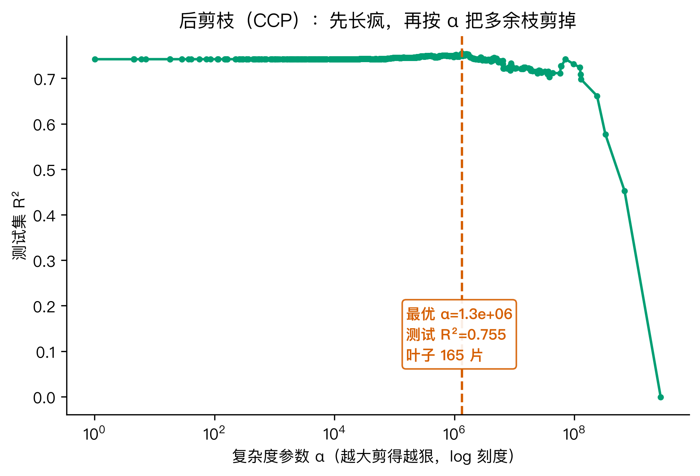
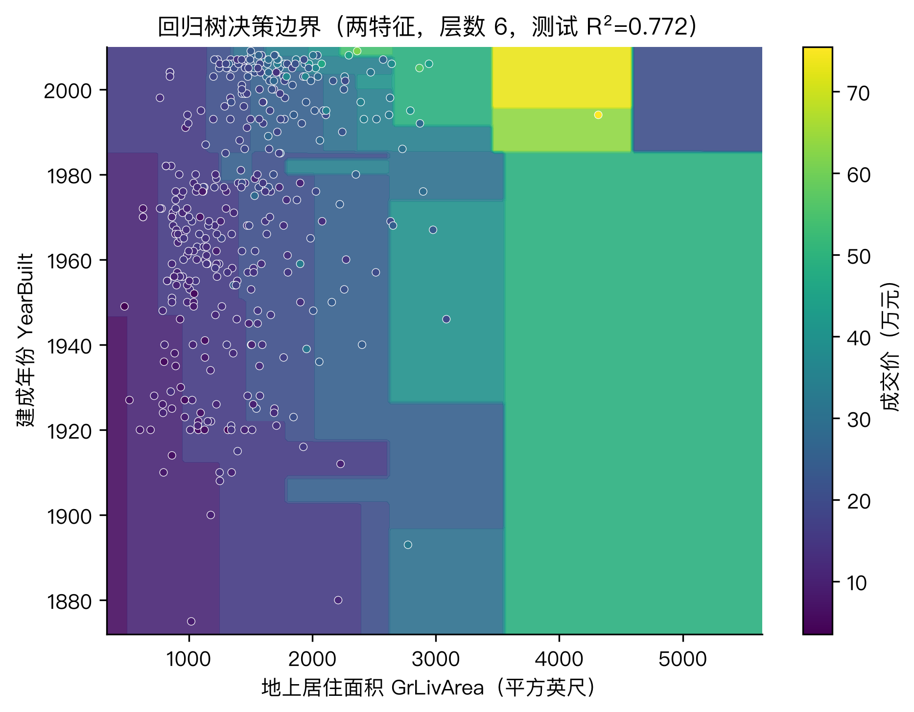

# 买房怕买贵？我把 1460 套真实成交价丢进决策树，看它到底按什么给房子定价

买房这件事，最让人心里没底的不是首付，是价格。同一栋楼，楼上比楼下贵八万；面积差不多的两套，一套挂 280 万，一套挂 350 万。中介讲得头头是道，可听完你还是不知道自己掏的钱到底值不值。

这种看不懂价格的焦虑，其实可以拆开来看。我手里有一份公开数据：美国艾姆斯（Ames）市的 1460 套二手房成交记录，80 个原始字段。它不是北京上海，但字段完整、来源干净，正好拿来做一次「决策树定价实验」。我想回答的大问题很简单：

> 如果让决策树来给房子定价，它会先看什么、后看什么？它又会犯什么错？

下面我把这个大问题拆成六个小问题，一个一个用数据和代码解决，最后再回到「值不值」这件事上。所有数字都来自同一份真实数据，文末附可复现脚本。

---

## 一、怎么把「贵不贵」变成决策树能学的问题？

决策树做的是分类或回归。想让它判断「贵不贵」，第一步得给一个明确的标签。

我把 1460 套房的成交价按中位数切成两半：高于 16.3 万（美元）的记为 1，低于或等于的记为 0。结果恰好是 728 套贵、732 套便宜，几乎对半。这个标签就是我们要预测的目标。



为什么要用中位数而不是平均数？因为成交价是右偏分布，平均价被少数豪宅拉到 18.1 万，中位数 16.3 万更能代表「一半贵一半便宜」的分界线。如果按平均数切，「贵」的样本会偏多，树从一开始就有偏见。

标签有了，下一步是选特征。原始 80 个字段里，我把建成年份、居住面积、车库车位、浴室数量等数值特征保留，把 Exterior Quality、Kitchen Quality 等字母评级映射成 1 到 5 的整数，再把 Neighborhood（街区）做独热编码。最终得到 45 个特征。这些就是决策树做判断时能用到的「问题库」。

决策树学习的核心指标叫熵。熵描述一个节点有多「混」：如果节点里贵贱各占一半，熵最大，为 1；如果全是贵的或全是便宜的，熵为 0。我们的根节点就是熵等于 1 的状态，决策树要找一个特征和阈值，把样本分成两堆，让两堆的熵都尽量低。

熵的公式长这样，看一眼就行：

$$
H(S) = -p_1 \log_2 p_1 - p_0 \log_2 p_0
$$

其中 $p_1$ 是「贵」的比例，$p_0$ 是「便宜」的比例。这个公式在后面的分裂中会反复出现，但不用背。我们只关注它背后的含义：熵越低，这堆房子越容易说清楚是贵还是便宜。

---

## 二、第一刀切哪里？信息增益怎么量化「纯度提升」？

决策树从根节点开始，每次挑一个特征和阈值，把样本切成左右两个子节点。挑的标准是：切完之后，两堆的加权平均熵下降最多。这个下降量就叫信息增益。

我用 sklearn 的 `DecisionTreeClassifier(criterion="entropy", max_depth=4)` 跑了一遍，树的根节点选择的是建成年份 `YearBuilt <= 1984.5`。切完之后，左子节点 660 套（老房）熵为 0.7915，右子节点 435 套（新房）熵为 0.4870。



根节点的熵是 1.000，切完之后的加权熵大约是 0.666，所以信息增益大约是 0.334。这意味着：单就这一刀而言，「建成年份」把混乱程度降低了三分之一。

为了验证这不是 sklearn 的「黑箱」，我单独写了一个递归 CART，只给两个特征：OverallQual（整体质量）和 GrLivArea（地上居住面积），最大层数为 3。根节点选的是 `OverallQual <= 6.5`，信息增益 0.3393，增益率 0.3554。第二层再按 `GrLivArea <= 1381.8` 切，增益 0.1876。

这说明一件事：不管给不给街区信息，决策树都会先把「房子质量」和「居住面积」拿出来当主要问题。换成全特征集后，根节点变成建成年份，是因为年份本身和质量、面积高度相关，且更容易一刀切开。

---

## 三、信息增益会偏爱「多选项」特征吗？增益率和 Gini 怎么修正？

信息增益有一个老毛病：它偏爱取值特别多的特征。比如「房屋编号」这种每个样本都不同的字段，总能找到一个切点把某一套房单独分出来，信息增益看起来很高，但其实没有任何泛化能力。

为了解决这个问题，C4.5 算法提出了增益率（Gain Ratio）。它在信息增益的基础上除以「分裂信息」（Split Information），惩罚那些把样本切得极不均衡的特征。分裂信息越大，说明这个切法本身越「细碎」，增益率就越低。

我算出了 12 个候选特征的信息增益和增益率，画在一起对比：



可以看到，OverallQual、YearBuilt、GrLivArea 这几个关键特征在两个指标下都排在前面。它们的取值数量分别是 10、112、861，但没有一个是 ID 式的字段，所以增益率并没有把它们打下去。换句话说，增益率在这里起到了「守门」作用：如果数据里混进了高基数噪声特征，它会被压低；而这些真正有用的连续特征或有序特征，依然能排到前面。

除了增益率，sklearn 还默认支持基尼指数（Gini Index）。我同时跑了 entropy 和 gini 两个分类树（都限制 max_depth=4），结果很有意思：

- entropy 树：训练准确率 89.2%，测试准确率 87.1%
- gini 树：训练准确率 91.1%，测试准确率 86.8%

gini 在训练集上更激进一点，但泛化到测试集反而略低。这个差距很小，说明在房价这个任务上，两个指标给出的结论基本一致。gini 的计算量比熵小一些，sklearn 默认用它，很大程度上是为了省时间。

到这里可以小结一下三种经典决策树的分工：ID3 用信息增益，C4.5 用增益率，CART 用基尼指数并且同时支持分类和回归。我们今天这套实验把三个概念都覆盖到了。

---

## 四、价格连续时，决策树怎么切？

前面讨论的是「贵不贵」这种二分类问题。但真实场景里我们更关心「具体多少钱」。这就需要回归树。

回归树的切法和分类树几乎一样，只是不再用熵，而是用平方误差（Mean Squared Error）。每次切分时，它会让左右两个子节点的目标值（成交价）尽量接近各自子节点的均值。切完之后，叶子节点的预测值就是这片区域内样本成交价的真实平均值。

我用 `DecisionTreeRegressor` 跑了两棵树：一棵不限制层数，一棵限制层数为 3。

- 不限制层数的树：训练集 R² 达到 1.000，测试集 R² 只有 0.742，叶子节点 1056 片。也就是说，它几乎把训练集里的每一套房都背了下来，但到新数据上立刻露馅。
- 层数限制为 3 的树：训练集 R² 0.724，测试集 R² 0.731。训练集表现下降了，但测试集反而更稳。

这是一个教科书级别的过拟合案例。深层回归树的第一层切的是 `OverallQual <= 7.5`，特征重要性高达 0.634；第二名 GrLivArea 只有 0.109。这说明：在预测具体价格时，「整体质量」是压倒性的第一指标，比房龄、街区都更关键。



分类树更在意 YearBuilt，回归树更在意 OverallQual。这个差异很有价值：如果你只想判断一套房是不是比中位数贵，房龄是个很有效的问题；但如果你想预测具体价格，房子的整体质量才是定价锚点。

---

## 五、树越深越好吗？预剪枝、后剪枝到底在剪什么？

深层树在训练集上表现完美，但测试集崩了，这就是过拟合。解决办法有两种：预剪枝和后剪枝。

### 预剪枝：直接限制树的生长

预剪枝最直白的做法就是限制 `max_depth`。我把层数从 1 扫到 15，看训练集和测试集的 R² 怎么变：



训练集 R² 随着层数增加一路逼近 1.0，但测试集 R² 在层数 3 时达到峰值 0.731，之后上下波动，再也没超过。所以在这个数据集上，预剪枝的最佳层数就是 3。继续往下长，模型只是在死记硬背训练样本，对未知房源没有任何帮助。

### 后剪枝：先长疯，再修剪

后剪枝的策略相反：先让树长得尽可能大，然后再根据一个复杂度参数 α，把「性价比」低的枝叶剪掉。sklearn 用的是 Cost-Complexity Pruning（CCP）。

我先让树无限制生长到 1056 片叶子，然后沿着 CCP 路径扫一遍 α。结果发现：当 α = 1.3e+06（约 1.3×10⁶）时，叶子数从 1056 片压到 165 片，测试集 R² 反而从 0.742 提升到了 0.755。



这是一个反直觉但很重要的结论：剪枝不是在破坏模型，而是在帮模型扔掉那些只记住了训练集噪音的枝叶。预剪枝和后剪枝殊途同归：它们都在告诉树，「不要试图记住每一套房，而要记住房价变化的真正规律」。

---

## 六、如果只看两个特征，决策边界长什么样？

为了更直观地理解回归树的行为，我挑了两个最能解释价格的特征：GrLivArea（地上居住面积）和 YearBuilt（建成年份），训练了一棵层数为 6 的回归树，然后画出它的决策边界。



图里的背景色代表模型预测的成交价，一个个白圈是真实的测试样本。最显眼的是决策树特有的「横平竖直」边界：它会先按某个面积值切一刀，再在某个年份区间切一刀，把平面分成一个个矩形。每个矩形内部的价格是恒定的。这种边界很符合直觉：「2000 年以后、面积大于 3500 平方英尺」的房子被归到最贵的一档；而「老、小」的房子则被压到低价区。

只用两个特征，测试集 R² 就能达到 0.772，比全特征层数 3 的 0.731 还高。这说明面积和年份本身已经承载了房价的大部分信息，剩下那些特征更多是在做细节修正。

---

## 七、把问题收回来：决策树到底按什么给房子定价？

现在可以回答开头的大问题了。

决策树给房子定价的逻辑，本质上是把市场按几个关键维度切成一块块矩形，然后给每块定一个平均价。在这份真实数据里，它问问题的顺序大致是：

1. 整体质量（OverallQual）和建成年份（YearBuilt）是第一层筛子，决定这套房属于哪个大档次。
2. 地上居住面积（GrLivArea）和地下室面积（TotalBsmtSF）进一步把大档次里的房子按大小分开。
3. 车库、浴室、装修年份等特征再做细节修正。

但这不是一套「万能公式」。决策树只能复现历史数据里的相关关系：新房、大面积、高质量通常更贵，但它不知道学区政策、地铁规划、利率变化这些外部变量。把它当成一个「结构化常识」的工具比较准确，当成预测水晶球就过了。

回到最开始那个痛点：一套房子到底值不值。数据给我们的启发是：

- 如果只问「便宜还是贵」，房龄是个很锋利的切分点：老房子更容易落在便宜区。
- 但要看具体价格，质量比房龄更有话语权。一套维护很好的老房子，完全可以比质量差的新房贵。
- 面积始终排在前列。小面积的新房，价格上限往往被锁死。

所以再有人拿「老」「破」「小」这三个字给你压价或者抬价，你可以把它们拆开看。年份老不一定便宜，维护质量差才便宜，面积小会明显压价。这三件事的相对分量，就是这棵树给你的答案。

---

## 三个值得记住的点

1. 决策树定价先看「质量」和「年份」，再看「面积」。分类树用年份把房子切成贵贱两堆，回归树用质量把价格锚定到具体档次，两个视角合起来更完整。
2. 信息增益不是越高越好。增益率会惩罚那些把样本切得极碎的特征，Gini 则计算更快；ID3、C4.5、CART 三种树的区别，说到底就是「怎么选切分点」。
3. 树不是越深越好，修剪才是正经事。预剪枝把层数限制在 3 时测试 R² 达到 0.731；后剪枝 CCP 把 1056 片叶子压到 165 片，测试 R² 反而从 0.742 涨到 0.755。过拟合不是模型太聪明，而是它把噪音也背了下来。

---

## 互动钩子

你最近看房时，中介最常说的三个词是什么？是「学区」「地铁」还是「南北通透」？留言里告诉我，我可以对照这份数据看看，哪些词是决策树也会认的硬指标，哪些更像是话术包装。

---

## 复现说明

代码、数据、配图都在 GitHub 仓库 `beverlyLee/ai-guanxingji` 的 `M10/` 目录下：

https://github.com/beverlyLee/ai-guanxingji/tree/main/M10

```bash
pip install -r requirements.txt
python code/experiment.py    # 拉数据 + 跑全部实验 → stats.json
python code/figures.py       # 从 stats.json 重生 7 张配图
python code/qc_article.py    # 校验文章数字与 stats.json 一致
```

`experiment.py` 在本地找不到原始快照时会自动从 OpenML 拉取，不需要任何凭证。随机种子固定为 42，重跑 `stats.json` 可逐字段复现。

依赖：`numpy 2.5.1`、`pandas 3.0.5`、`scikit-learn 1.9.0`、`matplotlib 3.11.1`。
