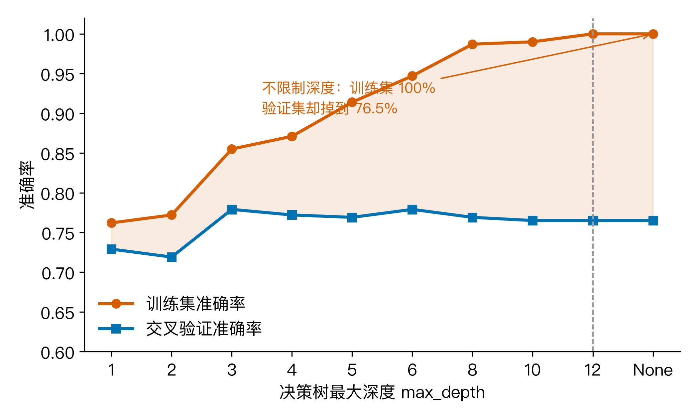
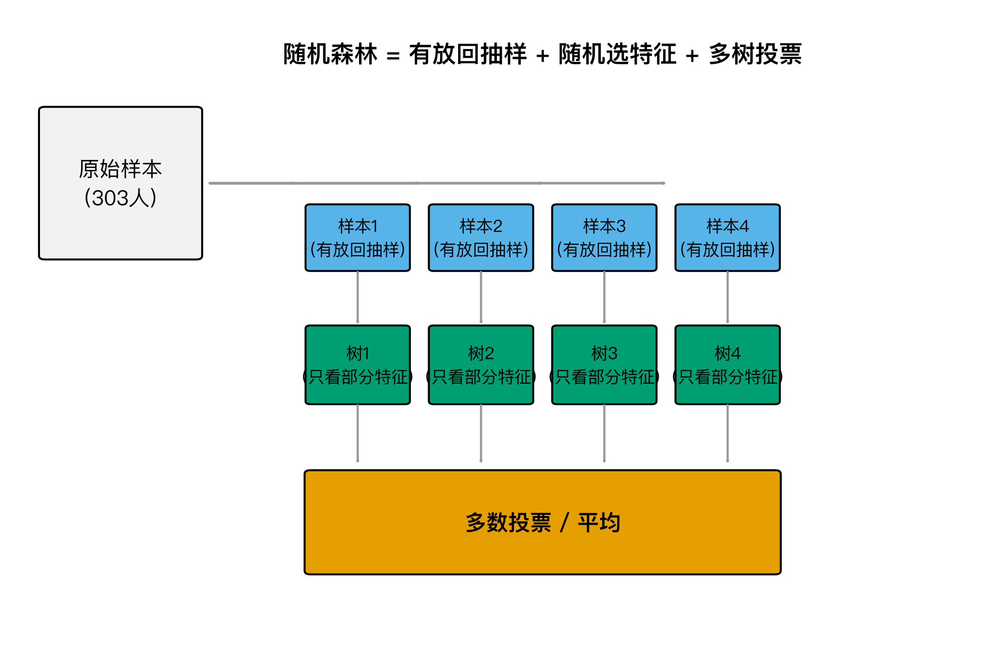
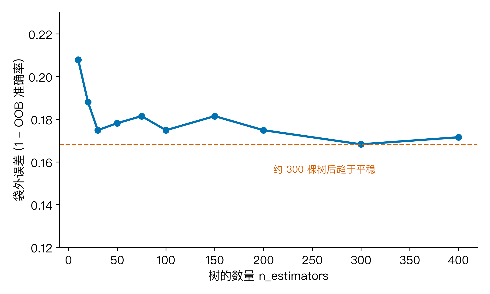
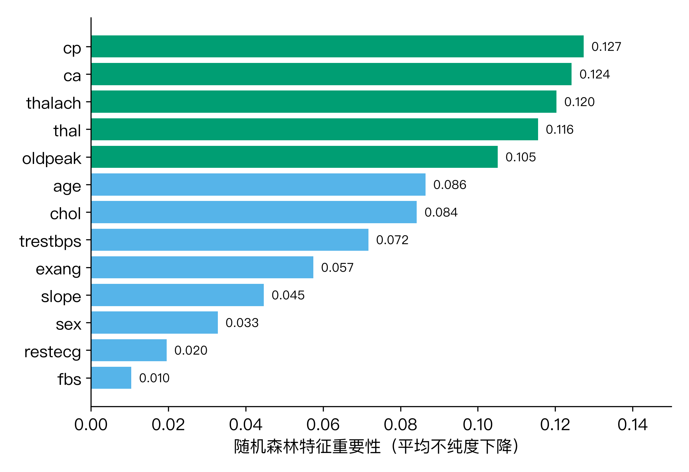
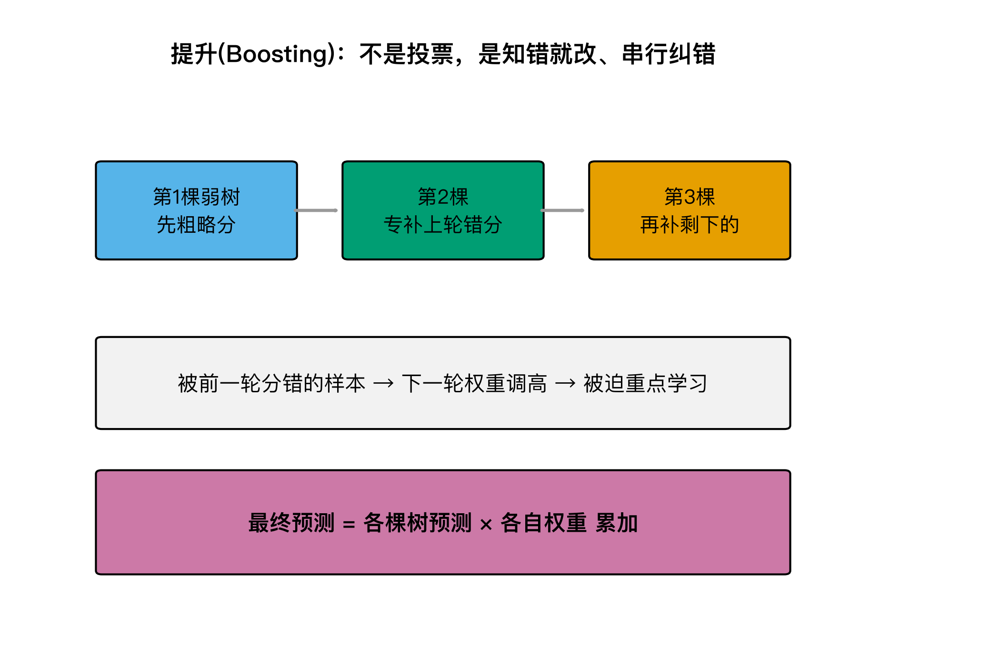
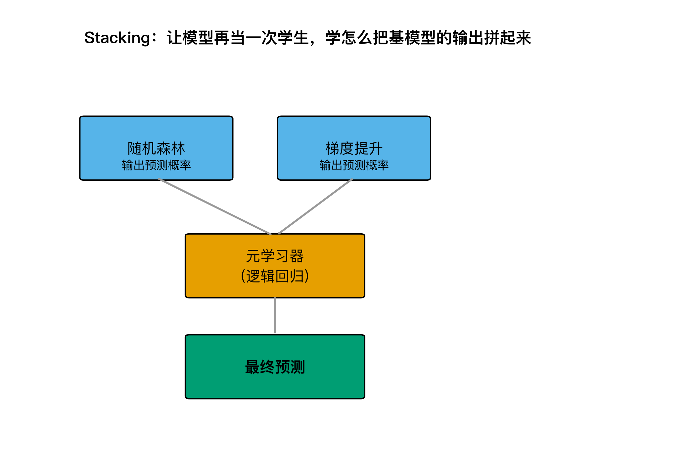
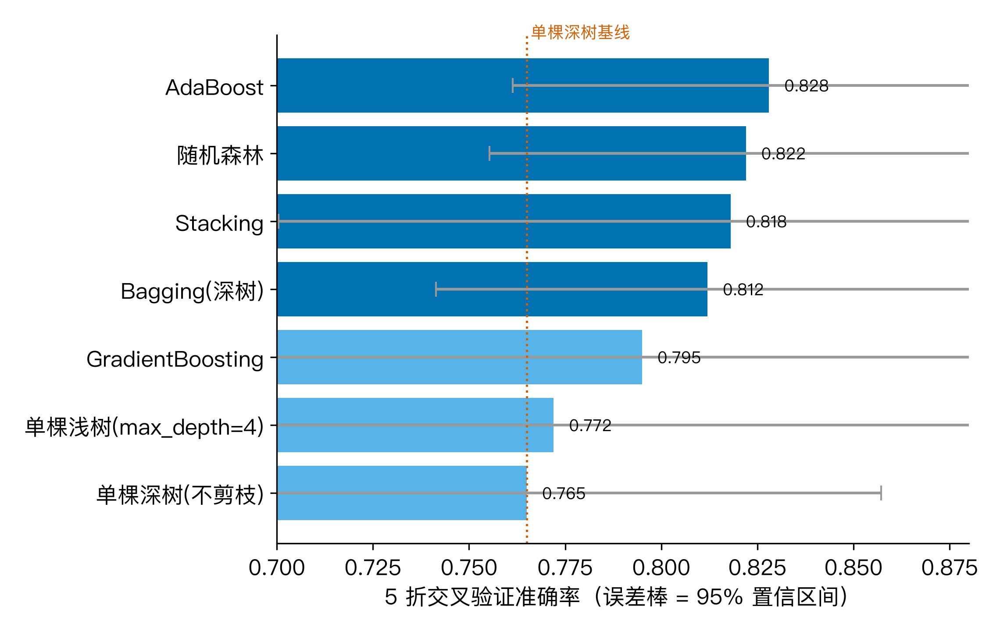

# 体检报告上一堆箭头看不懂？背后的逻辑就是随机森林：一群树投票，比一棵树靠谱

上个月陪朋友去体检，报告出来满纸红色向上箭头，胆固醇、甘油三酯、心率全飘红。他抓着报告问我：AI 不是挺会读影像的吗？怎么不把这套系统普及到体检报告解读上？

我说，单看几个箭头就下结论，模型很容易被骗。体检数据里面有些信号强，有些信号弱，关键是让一群人一起看、一起投票，而不是听一棵树拍板。这个思路就是随机森林。这也是 M11 我想回答的问题：怎么让模型既稳又准，换一批样本也不至于翻案？

我用的数据是 UCI 克利夫兰心脏病数据集，OpenML 上叫 cleveland v1，303 位病人，13 项临床指标，目标是把有无心脏病二分类。数据里有 6 处缺失，集中在冠脉造影血管数 ca（4 处）和地中海贫血 thal（2 处），我用众数做了填补。患病比例 45.9%，样本不大，正好拿来演示小数据上的过拟合与集成学习。

## 01 一棵决策树为什么靠不住

上篇 M10 我用决策树预测房价，结论是决策树好懂，但单棵树太自由就会过拟合。放到 Cleveland 数据上，这个现象更明显。

我让决策树无限生长，max_depth 不设上限。结果它在训练集上准确率直接冲到 100%，但 5 折交叉验证只有 76.5%。也就是说，这棵树把训练集的细节和噪声一起背了下来，换一批病人就掉链子。



图 1 里两条线分叉得很清楚：橙色训练集一路爬到 1.00，蓝色验证集在 0.765 附近横盘。这个 23.5 个百分点的差距，就是过拟合的签名。想让它稳一点，要么提前剪枝，要么把很多棵这样的树绑在一起，让它们互相制衡。

## 02 随机森林怎么造出“一群不一样的树”

随机森林的核心就一句话：一群不一样的树投票，结果比一棵树靠谱。问题是，怎么保证它们真的不一样？如果只是把同一批数据重复训练 300 次，每棵树都长一个样，投票就失去意义。

sklearn 里的 RandomForestClassifier 做了两重随机：

第一重是 Bootstrap 抽样。每次从 303 个样本里有放回地抽 303 个，平均大约有 63.2% 的样本被抽到，剩下约 36.8% 落在袋外（OOB）。每棵树看的是一个略有不同的训练子集。

第二重是特征随机。每次分裂节点时，只从 13 个特征里随机挑一部分来比较。13 个特征大概每次只让树看 3 到 4 个，逼着不同树关注不同的信号组合。



这两重随机让森林里的树彼此独立。独立之后取平均，方差就会降下来。直观上，如果一棵树的误差方差是 σ²，B 棵独立树的平均误差方差就是 σ²/B。树越多，整体波动越小。

## 03 一群人怎么投票、怎么降方差

图 1 里那棵过拟合的深树，交叉验证准确率 76.5%。我把它作为基学习器，套上 Bagging（只 Bootstrap 抽样，不限制特征），交叉验证立刻升到 81.2%，标准差从 4.7% 降到 3.6%。这就是方差削减的直接证据。

再把第二重随机加进去，变成随机森林。300 棵树的 OOB 准确率是 83.2%，5 折交叉验证准确率 82.2%，标准差 3.4%。Bagging 已经比单棵树好了，随机森林又往前小迈一步。

OOB 还有一个额外好处。因为每棵树天然有 36.8% 的样本没参与训练，我可以用这些袋外样本直接算误差，不用单独划验证集。图 3 画的是 RF 的袋外误差随树数量变化：50 棵树之后就基本稳在 17% 到 18% 之间，300 棵树没有继续明显下降。



这说明 n_estimators 主要影响收敛，而不是最终精度。实际做项目时，先跑 100 到 200 棵树看 OOB 平台，再决定是否继续加，比盲目堆树更理性。

## 04 特征重要性：森林比单棵树更可信

随机森林另一个好处是能给特征重要性。单棵树的特征重要性受根节点选择影响很大，森林把几百棵树的“不纯度下降”贡献平均掉，排名就稳定多了。

我在 Cleveland 数据上跑出来的前五位是：

- cp（胸痛类型）：12.7%
- ca（冠脉造影主要血管数）：12.4%
- thalach（运动最大心率）：12.0%
- thal（地中海贫血类型）：11.6%
- oldpeak（运动相对休息的 ST 段压低）：10.5%



为了验证这个排名不是某种算法巧合，我又算了排列重要性（permutation importance）。它打乱某个特征的值再看准确率下降多少。排列重要性的前三位是 ca、cp、thal，和基于不纯度的重要性基本指向同一批指标。两个独立方法对 top 特征集群的看法一致，说明这些信号确实稳定。

医学上也说得通：胸痛类型、冠脉堵塞血管数、运动耐量、地中海贫血指标，本来就是心内科评估的常规项。但要注意，重要性高只说明这些特征和患病标签统计相关，不等于它们直接导致心脏病。AI 可以帮你划重点，诊断权仍要交给医生。

## 05 提升算法：不是投票，是“知错就改”

随机森林属于 Bagging 家族，思路是并行造一堆树然后平均。Boosting 是另一个流派：串行训练，每一棵新树专门去补前一棵树的短板。

AdaBoost 的做法是给分错的样本加权重。第一轮弱分类器把某些人分错，第二轮就盯着这些人多看几眼。GradientBoosting 更直接，它让下一棵树去拟合前一轮的残差，像梯度下降一样一步步修正预测。两种方法都不再强调“树要独立”，而是强调“后面的树要知道前面错在哪”。



在 Cleveland 数据上，AdaBoost 的 5 折交叉验证准确率达到 82.8%，略高于随机森林的 82.2%。GradientBoosting 却只有 79.5%，标准差 5.3%，反而不如 RF 稳。

这里有个值得记住的点：Boosting 理论上能逼近更低偏差，但它对数据量更敏感。303 个样本里，GBM 这种贪婪拟合残差的策略容易把噪声也学进去。小数据上，随机森林的平均主义有时更可靠。

## 06 Stacking：让模型再当一次学生

Bagging 和 Boosting 是在同一个模型族里做集成。Stacking 更进一步：它让不同种类的模型先各自预测，再用一个元学习器把它们的预测结果当成新特征，学一次二次组合。

我用随机森林和梯度提升作为第一层，逻辑回归作为第二层元模型。逻辑回归只接收两个概率值，学怎么给它们加权。最终 Stacking 的 5 折交叉验证准确率是 81.8%，和随机森林、AdaBoost 处于同一区间。



Stacking 的代价是多了一层模型，也多了一层过拟合风险。在这 303 人的小数据集上，收益并不明显，有时甚至因为基模型之间高度相关而被抵消。它的真正战场是 Kaggle 那种上万样本、多模型差异大的场景。

## 07 回到体检报告：谁更靠谱

把上面所有模型放在一起比较，结论很清晰：

| 模型 | 5 折 CV 准确率 | 标准差 |
|------|---------------|--------|
| 单棵浅树（max_depth=4） | 77.2% | 7.1% |
| 单棵深树（不剪枝） | 76.5% | 4.7% |
| Bagging（深树） | 81.2% | 3.6% |
| 随机森林 | 82.2% | 3.4% |
| AdaBoost | 82.8% | 3.4% |
| GradientBoosting | 79.5% | 5.3% |
| Stacking | 81.8% | 6.0% |



单棵树在 76.5% 到 77.2% 之间，而 RF、AdaBoost、Stacking 都聚集在 81.2% 到 83.2% 这一带。提升幅度大约 5 到 6 个百分点，不算惊天动地，但交叉验证的标准差明显更小，说明预测更稳定。

更值得看的是它们之间的差距都在一个标准差之内。也就是说，在这个 303 人的数据集上，随机森林、AdaBoost、Stacking 没有谁碾压谁。它们共同证明了一件事：把多个相对较弱但不一样的判断者组合起来，比押宝一个天才更准确。

回到开头的问题：体检报告上一堆箭头，AI 能不能看懂？我的答案是，AI 能做的是把历史数据里的统计规律稳定地提取出来，告诉你哪些指标组合更值得警惕。随机森林给出的特征重要性可以帮你把注意力优先放在胸痛类型、冠脉血管数、最大心率这些关键项上。但它不是医生，也不能替代问诊和检查。

## 08 三个值得记住的点

1. 单棵决策树容易过拟合。训练集准确率冲到 100% 不代表它真会看病，换一批样本可能掉到 76.5%。

2. 随机森林靠 Bootstrap 抽样 + 随机特征 + 多数投票，把很多棵不稳定树的方差压下来，同时还能给出稳定的特征重要性排名。

3. Boosting 和 Stacking 更复杂，但在小数据上未必更好。Cleveland 数据上它们和随机森林落在同一区间。先做稳一个随机森林，再考虑要不要叠更重的模型。

## 09 留一个互动

你体检报告上有没有哪个箭头让你最紧张？把它打在评论区，我帮你查一下它在随机森林特征重要性里排第几。我们只聊统计排名，不诊断，具体结论还是要听医生的。

## 复现

代码、数据和全部配图已经推到 GitHub 仓库 beverlyLee/ai-guanxingji 的 M11 目录。你也可以本地跑：

```bash
python code/experiment.py   # 生成 stats.json 与处理后的数据
python code/figures.py      # 从 stats.json 重生 7 张配图
python code/qc_article.py   # 校验文章风格
```

环境要求：Python 3.10+，依赖见 requirements.txt。随机种子固定为 42，结果可复现。
