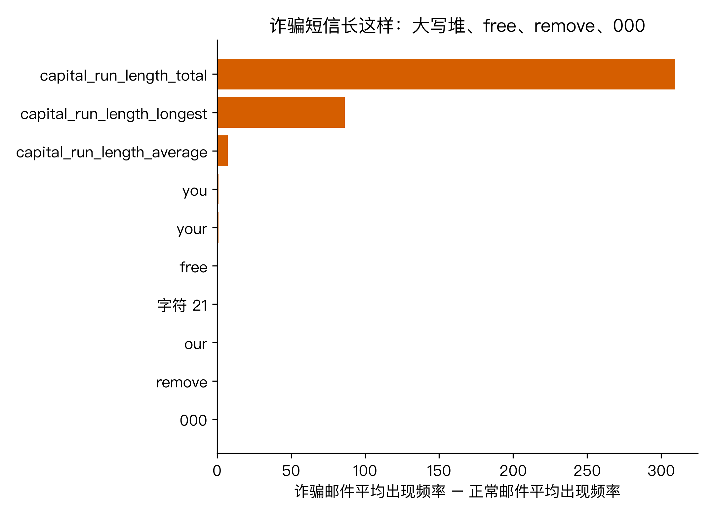
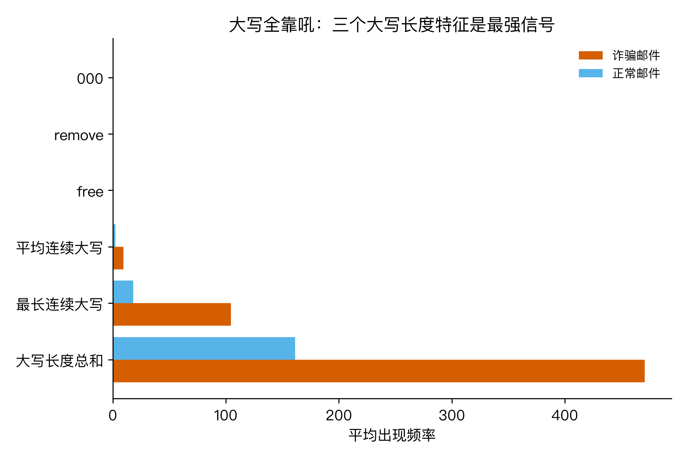
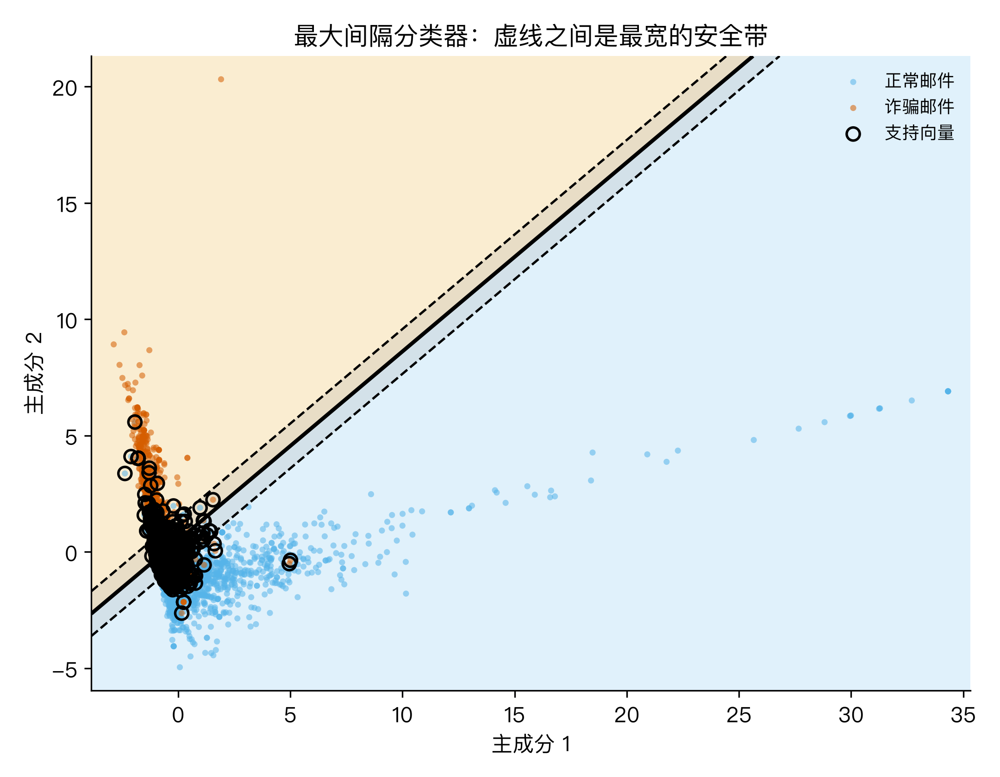
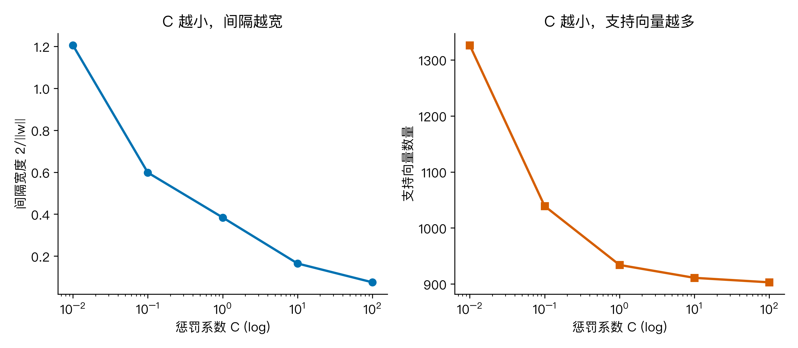
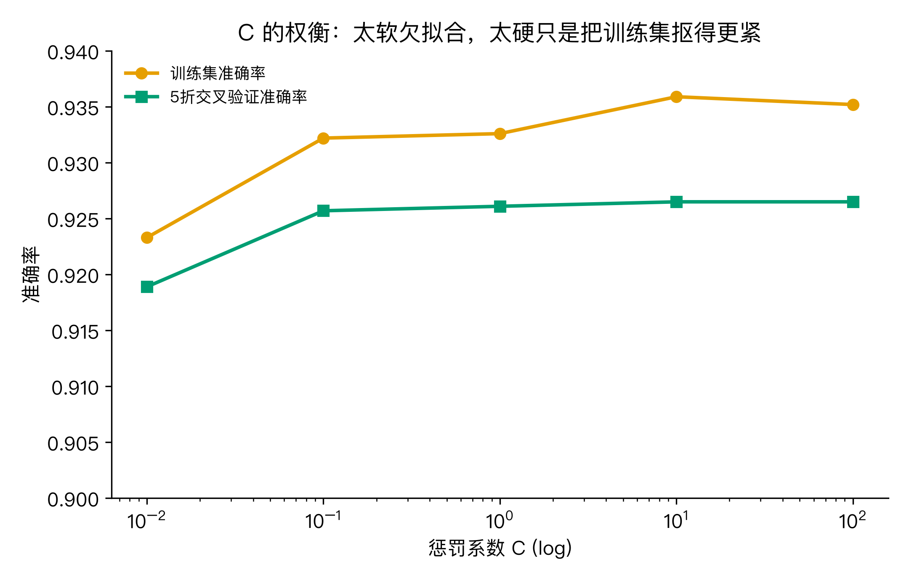
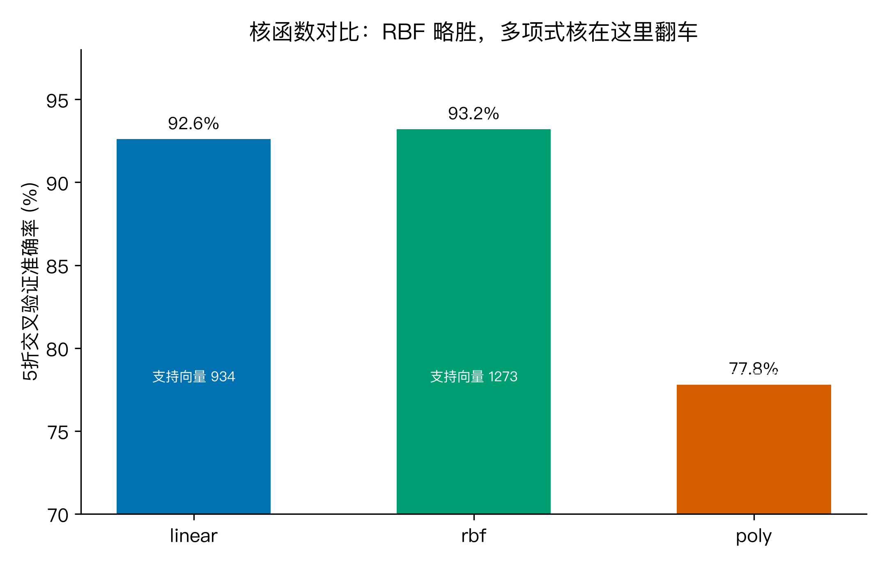
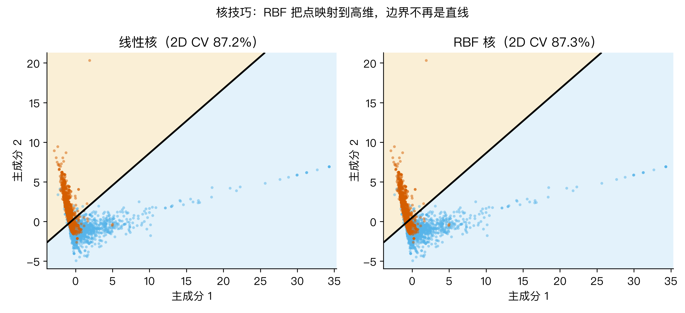

# 诈骗短信刚发来就被拦截？支持向量机靠的是最宽的那条分界线

上周我同事的手机连收 5 条短信，从"您中奖了"到"医保账户异常"一应俱全。他发现这些短信并没有挤进收件箱顶部，而是安静躺在"垃圾短信"文件夹里。这让我好奇：手机里的反诈模型到底是按什么规则把邮件分成两堆的？

最朴素的想法是"关键词黑名单"：看到"免费""中奖""限时"就直接丢进垃圾箱。但真实邮件没那么听话："免费"也出现在咖啡券里，"中奖"也可能真的是公司年会。于是机器学习里有一派的做法不一样，它不背关键词，而是画一条分界线，并且坚持这条分界线两边要留出最宽的安全带。这个流派就是支持向量机（Support Vector Machine，SVM）。

## 一、先搞清楚：4601 条邮件数据长什么样

要讲清楚 SVM 的分界线，得先看数据。我用的公开数据集叫 Spambase，来自 UCI 机器学习仓库，也在 OpenML 上可以直接下载。它收集了 4601 封电子邮件，每封都被人工标注为正常邮件或诈骗邮件。数量分布是：正常邮件 2788 封，诈骗邮件 1813 封，诈骗比例大约 39.4%。

这 4601 封邮件不是把原文塞进模型，而是被人工提取成了 57 个数值特征。它们可以分成三类：

1. 词频特征 48 个：例如 word_freq_free、word_freq_your、word_freq_remove，取值是这个词在这封邮件里出现的频率百分比；
2. 字符频率 6 个：例如 char_freq_!、char_freq_$，统计感叹号、美元符号等字符出现的频率；
3. 大写连续长度统计 3 个：capital_run_length_average、capital_run_length_longest、capital_run_length_total，记录邮件中大写字母连续出现的长度均值、最大值和总和。

我先把诈骗邮件和正常邮件分别求了这 57 个特征的平均值，再算"诈骗均值 − 正常均值"，看哪些特征最能区分两类。排名靠前的三个全是大写长度指标：capital_run_length_total 的均值差距是 309.1，capital_run_length_longest 的差距是 86.2，capital_run_length_average 的差距是 7.1。换句话说，诈骗邮件最爱全大写吼叫。词频里区分度最高的是 you、your、free、remove、000、email 这些词。

数据准备好后，我把所有特征做了标准化，因为 SVM 对特征尺度很敏感，不能让"大写长度总和"这种取值几百的特征把"百分比词频"压住。

## 二、SVM 要解决的不是"分开"，而是"最宽地分开"

如果把每封邮件看成 57 维空间里的一个点，二分类问题就变成：能不能找到一个超平面，把诈骗点和正常点分到两边？

很多模型都能做到这件事。但 SVM 多提了一个要求：这条分界线不仅要分开两类，还要让两类之间的"安全通道"最宽。为什么？因为训练数据只是过去见过的邮件，未来还会有新骗术。分界线两边留得越宽，新邮件稍微偏离一点也不至于立刻被分错。SVM 的核心思想就是"最大间隔"（Maximum Margin）。

我把这 57 维数据降到 2 维画出来，就得到下面的图。黑色实线是决策边界，两条黑色虚线叫间隔边界，它们之间的灰色地带就是最大间隔。落在虚线上的点叫支持向量，只有它们决定了这条线的位置。

这幅图来自 2 维主成分投影，损失了大部分信息，用来示意没问题。真实的分界线是在 57 维空间里算的。

## 三、点到超平面的距离：SVM 的数学起点

假设超平面方程写成

$$w^T x + b = 0$$

其中 $x$ 是邮件的特征向量，$w$ 是法向量，$b$ 是偏置。对于空间中任意一点 $x_i$，它到超平面的距离是

$$d = \frac{|w^T x_i + b|}{\|w\|}.$$

为了让两类分得开，我们要求正常邮件满足 $w^T x_i + b \geq 1$，诈骗邮件满足 $w^T x_i + b \leq -1$。统一写成

$$y_i (w^T x_i + b) \geq 1,$$

其中 $y_i \in \{+1, -1\}$ 是类别标签。

两条间隔边界分别是 $w^T x + b = 1$ 和 $w^T x + b = -1$，它们之间的几何距离就是

$$\text{margin} = \frac{2}{\|w\|}.$$

所以"最大化间隔"等价于"最小化 $\|w\|$"，也就是最小化 $\|w\|^2$ 的一半。于是得到 SVM 的原始优化问题：

$$\min_{w,b} \frac{1}{2} \|w\|^2, \quad \text{s.t. } y_i(w^T x_i + b) \geq 1 \text{ 对所有 } i.$$

## 四、拉格朗日乘子法：把约束吸进目标函数

有约束的优化问题处理起来不方便。拉格朗日乘子法的做法是把不等式约束乘上系数 $\alpha_i \geq 0$，然后加到目标函数里：

$$L(w,b,\alpha) = \frac{1}{2} \|w\|^2 - \sum_{i=1}^n \alpha_i \left[ y_i(w^T x_i + b) - 1 \right].$$

接下来分别对 $w$ 和 $b$ 求偏导并令其为零：

$$\frac{\partial L}{\partial w} = w - \sum_i \alpha_i y_i x_i = 0 \Rightarrow w = \sum_i \alpha_i y_i x_i,$$

$$\frac{\partial L}{\partial b} = -\sum_i \alpha_i y_i = 0 \Rightarrow \sum_i \alpha_i y_i = 0.$$

把这两个结果代回 $L$，消去 $w$ 和 $b$，就得到对偶问题：

$$\max_\alpha \sum_i \alpha_i - \frac{1}{2} \sum_i \sum_j \alpha_i \alpha_j y_i y_j (x_i^T x_j),$$

$$\text{s.t. } \alpha_i \geq 0, \quad \sum_i \alpha_i y_i = 0.$$

这个对偶问题只和内积 $x_i^T x_j$ 有关，大多数 $\alpha_i$ 会等于 0，只有支持向量对应的 $\alpha_i$ 大于 0。这正是 SVM 名字里"支持向量"的来源：整条边界其实只由少数几个关键样本撑起来。

在 Spambase 上，线性核 C=1 时支持向量有 934 个，占总样本的 20.3%。也就是说，模型靠 4601 封邮件里的 934 封就定下了分界线。

## 五、软间隔：现实数据不可能完全分开

上面的推导假设两类能被一条超平面完美分开，这叫"硬间隔"。但真实邮件里总有一些刺头：一封诈骗邮件用词特别克制，或者一封正常邮件标题全大写。硬间隔会为了迎合这些点，把边界扭得很窄，反而在新数据上表现差。

软间隔的做法是给每个样本引入松弛变量 $\xi_i \geq 0$，允许少量样本越过边界。约束变成

$$y_i(w^T x_i + b) \geq 1 - \xi_i,$$

目标函数则加上惩罚项：

$$\min_{w,b,\xi} \frac{1}{2} \|w\|^2 + C \sum_i \xi_i.$$

$C$ 是正则化参数。$C$ 越大，对分类错误的惩罚越重，模型越接近硬间隔，间隔越窄；$C$ 越小，模型越宽容，间隔越宽。

我在 Spambase 上做了 C 扫描，结果如下：

当 C 从 0.01 增加到 100 时，间隔宽度从 1.205 降到 0.075，支持向量数从 1326 降到 903。这说明 C 越小，模型越依赖更多样本共同决定边界；C 越大，边界被少数"硬骨头"样本紧紧拉住。

再看准确率：

C=0.01 时交叉验证准确率 91.9%，C=1 时 92.6%，C=100 时 92.7%。准确率提升很有限，但边界宽度从 1.205 被压到 0.075，只剩原来的几十分之一。所以 C 的选择不是看训练集有多贴合，而是看模型愿意为新邮件留多少容错空间。

## 六、核函数：分界线不一定非是直线

前面的推导都假设边界是线性的。但有些问题里，两类在原始空间里搅成一团，直线怎么画都不理想。核函数的作用是把数据映射到更高维的空间，让原本不可分的问题在新空间里变得线性可分。

数学上，对偶问题里的内积 $x_i^T x_j$ 可以替换成核函数 $K(x_i, x_j)$。最常见的几种是：

- 线性核：$K(x_i, x_j) = x_i^T x_j$，也就是不调高维度；
- RBF 核：$K(x_i, x_j) = \exp(-\gamma \|x_i - x_j\|^2)$，也叫高斯核，把点映射到无穷维；
- 多项式核：$K(x_i, x_j) = (x_i^T x_j + r)^d$。

在 Spambase 上，我用 5 折交叉验证比较了三种核：

线性核准确率 92.6%，支持向量 934 个；RBF 核 93.2%，支持向量 1273 个；多项式核只有 77.8%，支持向量暴涨到 2557 个，明显过拟合了。这说明 Spambase 里诈骗邮件和正常邮件的 57 维分布大致是线性可分的，复杂的核反而把噪声也学了进去。

我把数据降到 2 维，分别用线性核和 RBF 核画决策边界，能看出 RBF 的边界更弯曲：

不过这里要注意，2 维 PCA 只解释了 17.3% 的方差，所以 2 维边界只是示意，真实结论还是要回到 57 维空间的交叉验证。

## 七、回到大问题：为什么这能拦住诈骗短信

诈骗短信拦截器不是背关键词列表，而是做了一件更稳的事：在历史邮件里找一条最宽的分界线，让正常邮件和诈骗邮件之间的"灰色地带"尽可能宽。这条分界线由少数支持向量决定，遇到新短信时，只需计算它落在分界线的哪一侧，以及离边界有多远。

SVM 的优雅之处在于，它把分类问题转化成了一个几何问题，也就是最大化间隔；又把几何问题转化成了优化问题，也就是最小化 $\|w\|^2$；再通过拉格朗日乘子法得到对偶问题，发现真正起作用的只有支持向量；最后通过核函数把这个框架推广到非线性边界。软间隔 C 则给了模型容错空间，不让几个异常样本把边界拉变形。

在 Spambase 上，线性 SVM 的 5 折交叉验证准确率达到 92.6%，RBF 核略升到 93.2%。更值得关注的是支持向量的比例：即使在 4601 封邮件中，模型也只需要约 20% 的关键样本就能确定规则。这意味着 SVM 不仅分对了多数邮件，还把自己学到的规则压缩成了一小份"记忆"。

当然，现代反诈系统早就不只用一个 SVM 了。但它背后的思想，也就是最大化间隔、抓关键样本、留足安全余量，仍然是很多分类器的设计底色。理解了 SVM，再看手机里的垃圾短信过滤，你就知道它为什么能在毫秒之间做出判断：因为它早就画好了那条最宽的分界线。

你手机里最近一次被拦截的短信是什么内容？把它和我列出的 top 特征对比一下，看看它是不是也在用"大写吼叫"或者"免费""remove"这些高频信号。
