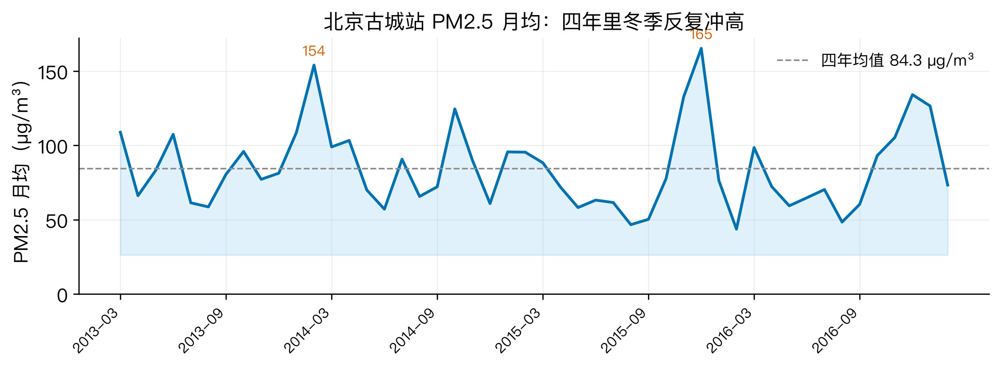
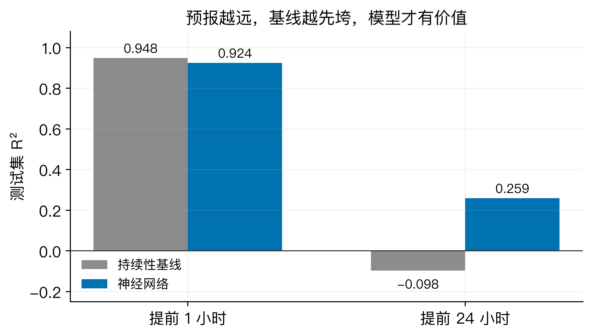
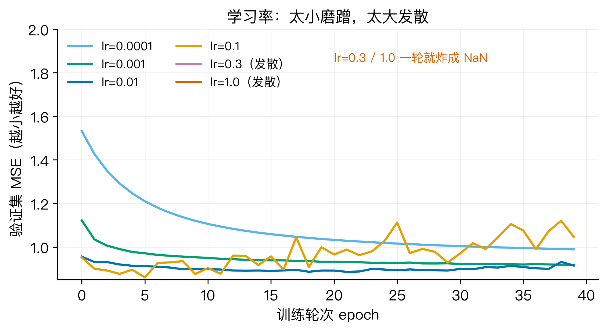
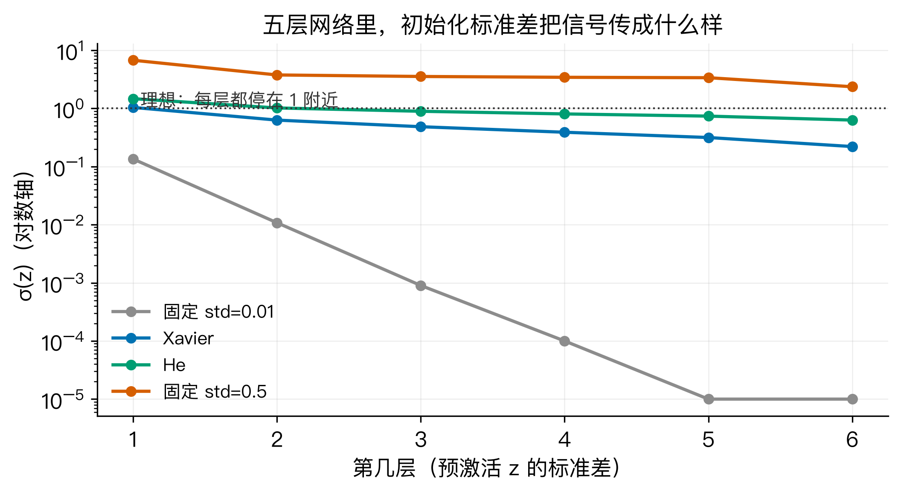
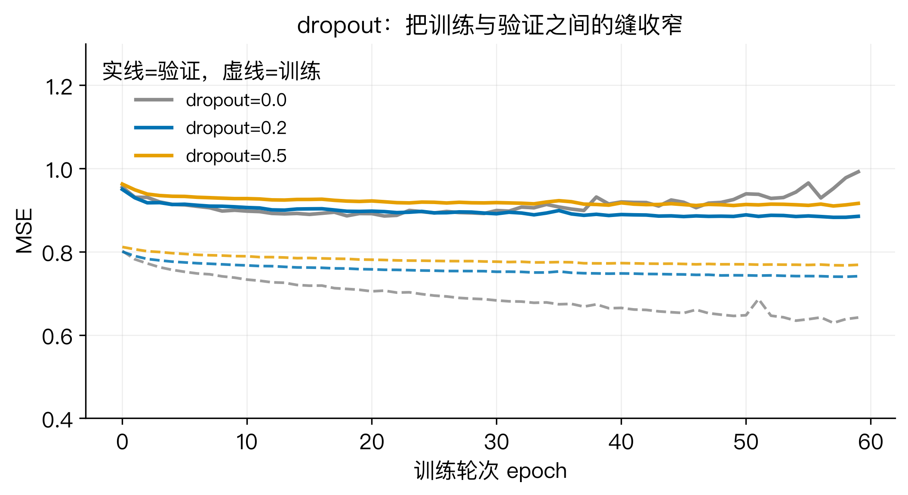
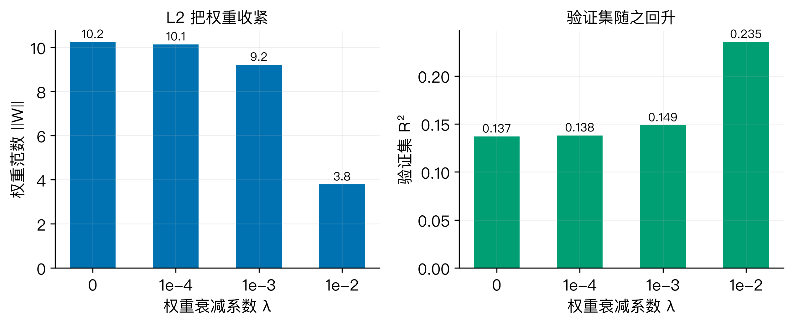
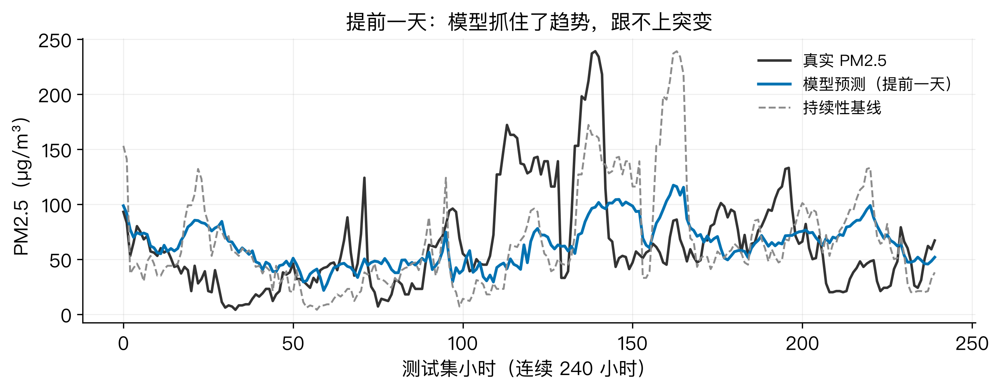

# 提前一天预报雾霾：手搓神经网络，讲清学习率、初始化、正则

九月中旬，天刚转凉，我早上出门前习惯性点开空气质量 App，看到一行小字：明天 PM2.5 轻度污染，建议减少户外活动。我盯着这行字看了一会儿，脑子里冒出两个问题。它凭什么知道明天？它说的准吗？

这不是抬杠。空气质量和每个人的呼吸直接相关，供暖季一到，朋友圈里咳嗽的人肉眼可见地变多，口罩又成了出门标配。预报能早一天，就能早一天决定要不要开窗、要不要洗车、要不要把周末的公园计划往后挪。于是问题变得很具体：能不能只用过去一天的气象数据，去猜出明天这个时刻的 PM2.5？

我打算用一台从零搭起来的小神经网络来做这件事。理由有两层。一层是，这种预测本质上是在拟合一个从气象到污染的映射，正对神经网络的路子。另一层是，搭网络的过程里会碰到几个绕不开的旋钮，学习率、初始化、dropout、正则，它们常被当成玄学来调，其实每一个背后都有一条能写出公式的道理。把道理讲清楚，比只报一个准确率有用。

数据用的是公开数据集。UCI 的北京空气质量数据（Beijing Multi-Site Air-Quality Data，编号 501），我挑了古城站一个站点，时间从 2013 年 3 月 1 日到 2017 年 2 月 28 日，逐小时，一共 35064 条。选它是因为干净、免费、不用登录就能下，任何人拿到同一份数据都能复现下面的每一个数字。这个站点四年里的 PM2.5 均值是 84.2 微克每立方米，标准差 78.8，波动大得惊人。

先把四年里 PM2.5 的月度走势画出来看一眼：



规律很直白。每年的 11 月到次年 3 月，曲线反复冲高，2015 年 12 月和 2016 年 12 月都摸到了 160 附近；到了夏天，数字又会掉到 40 上下。冬天取暖、静稳天气、逆温层，污染物散不出去，这是常识。对建模的人来说，这条季节性曲线就是一记提醒：如果一台模型只会背下每天的平均值，它看起来也会像模像样。所以要判断模型是不是真学到了东西，得找一个足够笨的对手来比。

## 先说结论

我把过程跑完，得到三个结论，先摆在这里，后面逐个说清楚。

第一，预测能提前多久，直接决定这个问题值不值得用模型做。提前一小时，最笨的办法就能赢；提前一天，最笨的办法彻底失效。

第二，几个旋钮各有明确的数学含义。学习率管步子迈多大，初始化标准差管信号能不能顺畅传下去，dropout 管别把训练数据背得太死，权重衰减管别让权重长得太肥。

第三，这台网络提前一天预报的测试集 R² 是 0.2587，比持续性基线的负值强很多，但它也只能抓住趋势，抓不住突发的污染过程。这个成绩不漂亮，却诚实。

## 第一个问题：提前一天，比提前一小时难多少

动手之前，我先问自己一个问题：预报提前量不同，难度差多少？这决定了实验值不值得做。

要回答它，得先定一个参照物，也就是最笨的预测办法。我选的是持续性预测：要猜明天这个点的 PM2.5，就直接拿今天这个点的数字顶上。它不需要任何模型，一行代码就能写出来，是名副其实的下限。

我把模型和这个下限放在两个时距上对比。提前一小时，持续性预测的测试集 R² 是 0.9482，均方根误差 22.74 微克每立方米；同一时距下，我的神经网络 R² 是 0.9241，均方根误差 27.53。模型反而输了。

原因是 PM2.5 这种小时级数据自相关极强，上一个小时和这一个小时几乎贴着走，直接抄上一个数就已经很准。图看得很清楚：



把时距拉到提前一天，局面翻转。持续性预测的 R² 掉到负的 0.0984，也就是说它还不如直接报一个固定平均值；均方根误差冲到 104.72。而神经网络把 R² 拉回到 0.2587，均方根误差 86.02，平均绝对误差 57.09。

第一个问题到此有了答案：提前一天这件事，才真的需要一台模型。一小时级的预报，聪明劲儿用错了地方。所以我后面的所有实验，输入都是过去 24 小时的数据，输出都是 24 小时之后的 PM2.5。

## 第二个问题：网络怎么从气象里读出明天的污染

确定了目标，接下来要把数据和网络搭起来。这一步是整套流程的骨架，做错一步后面全白搭。

先说数据怎么加载和预处理。原始表里有 PM2.5、PM10、二氧化硫、二氧化氮、一氧化碳、臭氧、气温、气压、露点、降雨、风速、风向。我挑了七个数值列作为输入：PM2.5、PM10、气温、气压、露点、风速、降雨。风向是文字，比如 NW、SE，直接塞给网络没法算，这次先舍掉，留作后面能改进的点。

原始数据有 1.8% 的缺失值，用前向填充补上，也就是拿它前面最近一个有效值顶替。缺口不大，这样处理不会引入太多偏差。

然后是构造样本。我做的是一件事：把过去 24 小时里这七个变量排成一个长条，压平成一个长度为 24 乘 7 等于 168 的向量，作为输入；把 24 小时后的 PM2.5 作为答案。每往后挪一个小时就取一条，35064 个小时最后能造出三万多个这样的样本。

归一化放在切分之后。七个变量的量纲差得远，PM2.5 是几十上百，气压是四位数，气温有正有负。我按训练集的均值和标准差把所有特征拉成同一尺度，这里有个容易踩的坑：均值和标准差只能从训练集算，验证集和测试集要用训练集的同一套参数去变换，否则就是把未来信息漏进了训练。

切分按时间顺序来，前 70% 训练，中间 15% 验证，后 15% 测试，绝不打乱。时间序列一旦打乱，模型就会用未来预测过去，成绩虚高得离谱。最后得到训练 24497 条、验证 5260 条、测试 5260 条。

网络本身很小，两层隐藏层，结构是 168 进、64 进 32 进 1 出，隐藏层用 tanh 激活，输出层是线性的。为什么是 tanh 而不是 ReLU，我后面讲初始化的时候会说到，它和方差传播的推导有关。

一台这样的网络，前向传播就是把输入乘上权重、加上偏置、过一下激活函数，一层层往前推。用公式写出来，一层里做的事是：

```
z = W·a + b
a_next = tanh(z)
```

第一层的输入 a 就是那个 168 维向量，最后一层输出的 z 就是预测的 PM2.5。

损失函数用均方误差，衡量预测和真实差多少：

```
L = (1/n) · Σ (ŷ - y)²
```

训练就是让 L 变小。我用的是最朴素的批量梯度下降，每一步把权重朝着让损失下降的方向挪一点：

```
w ← w - η · ∂L/∂w
```

这里 η 就是学习率。网络里的几万个权重，全靠上面这一行反复更新，一点点逼近正确答案。反向传播做的事情，就是高效地把 ∂L/∂w 算出来，从输出层往回一层层传，每一层只需要用后一层的梯度和自己的输入就能算出本层的梯度。我全程用 NumPy 手写，没有用现成的框架，就是想让你能贴着公式看代码。

## 第三个问题：四个旋钮，各自管什么

网络搭好了，能跑，但跑得怎么样，取决于四个旋钮。我把每一个单独调一遍，看清它管什么。

### 学习率：步子迈多大

学习率 η 决定每次更新权重迈多大一步。它是最先要调的参数，也是后果最严重的。

我把它从小到大扫了一遍，其它条件固定，跑 40 轮，看验证集损失：



- 1e-4：损失慢悠悠降到 0.9891，还在半山腰，明显没收敛
- 1e-3：降到 0.9179
- 1e-2：降到 0.9147，是这几档里最好的
- 1e-1：在 1.05 附近来回晃，已经开始不稳
- 0.3 和 1.0：第一轮就炸成 NaN，权重直接飞出去了

为什么会这样，用一个简单的二次函数就能想明白。假设损失是一元的抛物线 L(w) = a·w²，那么梯度下降的更新是 w ← w - η·2a·w，也就是 w ← (1 - 2aη)·w。只要 |1 - 2aη| 大于 1，每一步都会把 w 推得更远，指数级放大，几步就爆掉。解出来，发散的临界是 η 大于 1/a。学习率一旦超过这个门槛，无论数据多好都会炸。

真实网络的损失不是简单抛物线，但道理一样：损失曲面在某个方向上的弯曲程度决定了这个方向能承受多大的步子。步子小了，收敛慢，几十轮还在挪；步子大了，不是震荡就是发散。这就是为什么学习率常常要试好几个数量级，也是为什么 1e-2 在这张图上成了甜点。

### 初始化标准差：信号能不能传下去

网络一开始的权重是随机生成的。随机到什么程度，会决定它能不能训得起来。我把这件事单独拎出来，因为它藏着一个最容易被忽略的失败模式。

先看一个五层网络，把每层求和前的值（预激活 z）的标准差记录下，看不同初始化方式下它逐层怎么变：



结论很清晰。固定标准差 0.01 时，第一层的 z 标准差只有 0.13，往后每层掉一个数量级，到第五、第六层已经接近零，信号传着传着就没了，网络等于在空转。固定标准差 0.5 时，第一层就冲到 6.7，tanh 早就饱和，梯度接近零，也学不动。Xavier 和 He 这两种经典初始化，则能把每一层的标准差稳稳压在 1 附近，信号不衰减也不爆炸。

为什么标准差这么关键，推导只要一行。一层里 z 等于权重乘输入再求和，假设输入各维近似独立、均值为零，那么输出的方差等于输入维度乘权重方差再乘输入方差：

```
Var(z) ≈ fan_in · σ_w² · Var(a)
```

换成标准差就是 σ_z 约等于根号 fan_in 乘 σ_w 再乘 σ_a。输入是 168 维时，根号 168 约等于 13。如果 σ_w 取 0.01，σ_z 就是 0.13，正好对上图里那条贴底的线；取 0.5，σ_z 冲到 6.7 附近，也对上了。

看到这个公式，Xavier 初始化为什么取 1 除以根号 fan_in 就一目了然：代入之后 σ_z 约等于 σ_a，每层输出方差和输入方差一样，信号原封不动传下去。He 初始化取根号 2 除以根号 fan_in，是给 ReLU 用的，因为 ReLU 会砍掉一半输出，需要把方差放大两倍补回来。我用 tanh，对应的是 Xavier。

顺带解释了前面那个问题：为什么不用 ReLU。不是 ReLU 不好，而是 tanh 和这套方差推导贴得更紧，第一层的计算也更直观，适合把原理讲清楚。真实工程里两个都会用。

我把标准差单独扫了一遍，看最终验证损失：0.01 是 0.8877，0.05 是 0.8848，0.1 是 0.9006，0.5 是 0.9739。有意思的地方在这里。太小的 0.01 在这张浅层网上并没有输，因为它只是让信号变弱，还没弱到消失；真正受伤的是太大的 0.5，因为 tanh 饱和，梯度被压扁。这也说明，初始化的问题在浅层网上不致命，层数一多就原形毕露，前面那张五层图才是它的真面目。

### dropout：别把训练数据背得太死

第三个旋钮是 dropout。它在训练时随机把一部分神经元的输出置零，逼网络不能依赖某几个特定神经元。

效果得用训练损失和验证损失之间的缝来看。缝越宽，说明模型在训练集上背得越熟、在没见过的数据上越差，也就是过拟合。我跑了三档：



- 不用 dropout：训练和验证的损失差 0.3502，验证集 R² 只有 0.137，过拟合明显
- dropout 0.2：差距收窄到 0.1439，验证集 R² 升到 0.2301
- dropout 0.5：差距 0.1476，验证集 R² 0.2031，比 0.2 略差

0.2 这一档把缝几乎砍掉一半，验证成绩也跟着涨。0.5 关得太狠，反而丢了一点信息。

dropout 的数学关键在于，训练时它会缩放。假设保留概率是 p，我在训练时把保留下来的神经元输出除以 p，测试时不做任何处理。这样做的结果是，训练和测试时的输出期望完全一致：

```
E[dropout(a)] = p · (a / p) + (1-p) · 0 = a
```

期望不变，所以测试的时候可以直接用全部神经元，不必也随机丢。这一手叫 inverted dropout，是现在框架里的默认做法。早期还有人反过来，在测试时乘 p，两者等价，但除以 p 的写法让测试阶段更干净。

### 权重衰减：别让权重长得太肥

最后一个旋钮是正则，我用的是 L2，也叫权重衰减。它直接在损失里给大权重记一笔账：

```
L = 均方误差 + λ · Σ w²
```

λ 是惩罚强度。损失里多了这一项，反向传播时权重的梯度就多出一块：

```
∂L/∂w = 原来的梯度 + 2λ·w
```

多出来的 2λw 和权重本身成正比，所以每次更新，权重都会被额外往回拉一点，这也是权重衰减这个名字的来历。权重越大，被拉得越狠，最后网络的权重就长不肥，模型更平滑，更不容易过拟合。

数据也印证了这一点：



λ 从 0 加到 1e-2，权重范数从 10.24 掉到 3.79，验证集 R² 从 0.137 升到 0.2354。惩罚越强，权重越紧，验证成绩越好。不过这里要留个心，λ 不是越大越好，加到某个点之后，模型会被压得学不动，训练损失都降不下来，那就是欠拟合了。λ 和学习率一样，是要试出来的。

## 第四个问题：拧完之后，它预报得怎么样

四个旋钮都摸过一遍，我把它们组合起来：学习率 1e-2，Xavier 初始化，dropout 0.2，权重衰减 1e-4，训练 200 轮。

最后在测试集上的成绩是，均方根误差 86.02 微克每立方米，平均绝对误差 57.09，R² 0.2587。训练集损失 0.7003，验证集 0.8673，两者很接近，说明没有明显过拟合。

把预测曲线和真实曲线叠在一起看，故事就更完整了：



模型那条蓝线，稳稳地跟着真实值的整体走势走，日变化、缓慢的累积过程都能跟上一部分。但真实值那些突然竖起来的尖峰，它基本抓不住。原因不难理解，突发污染往往来自短时的气象突变或区域传输，过去 24 小时的数据里没有足够的信息去预警它。这不是模型没用，而是它能力的边界就在这里。

所以第四个问题的答案是：它能提前一天给出一个有意义的估计，比什么都不做和直接抄上一天强得多，但它不是水晶球。R² 0.2587 这个成绩放在比赛里拿不出手，放在理解一套方法的完整流程里，够了。

## 回到开头那个问题

现在再回头看空气质量 App 那行小字。它背后大概率是一台比我这个更复杂、喂了更多数据、做了更多特征工程的模型，但原理是相通的：用过去推未来，用数据拟合一张映射表。

我这台小网络给出的结论是，提前一天预报 PM2.5 是可行的，但上限不高。它能告诉你明天大致是干净还是浑，能给你一个趋势，但它给不了你对某个具体尖峰的保证。理解了这一点，你看那行预报小字的时候，心态会不一样。它不是承诺，是一个带着不确定性的估计。

而在搭建它的过程中，那四个旋钮其实都不神秘。每一个背后，要么是一条方差公式，要么是一次梯度推导。调参看着像试错，本质上是在和这些数学约束打交道。

## 三个值得记住的干货点

一，别急着上模型，先找一个笨基线。持续性预测在提前一小时的场景里 R² 有 0.9482，直接击败了我的神经网络；但提前一天就崩到负值。先跑基线，你才知道模型到底有没有带来价值，也才知道这个问题值不值得做。

二，初始化标准差的本质是方差传播，公式是 Var(z) 约等于 fan_in 乘 σ_w² 乘 Var(a)。Xavier 取 1 除以根号 fan_in，就是让每层输出方差等于输入方差，信号不衰减也不爆炸。层数越多，这个约束越要命。

三，学习率、dropout、权重衰减各有各的数学依据。学习率的上限由损失曲面的弯曲程度决定，超过就发散；dropout 靠除以保留概率让训练和测试的期望一致；权重衰减则是在梯度里多加一项 2λw，把大权重往回拽。想通这三条，调参就不全靠运气了。

## 想自己跑一遍

数据和代码都在 GitHub 仓库 beverlyLee/ai-guanxingji 的 M13 目录里。🏃

- data/ 放原始数据，脚本会自动从 UCI 地址下载
- experiment.py 跑全部实验，输出 stats.json，文章里每个数字都来自它
- figures.py 从 stats.json 和 CSV 重画全部配图
- qc_article.py 做字数、黑名单词、公式占比等自检

按顺序执行 experiment.py 和 figures.py，大约一分钟，你就能在自己机器上复现上面所有的数字和图。依赖只有 NumPy 和 Matplotlib。

最后留个问题给你：如果让你给这套预报再加一个输入，你会加什么？是隔壁站点的实时数据、卫星云图，还是风向的完整编码？评论区说说你的想法，我挑几个可行的，下一篇实测给你看。
