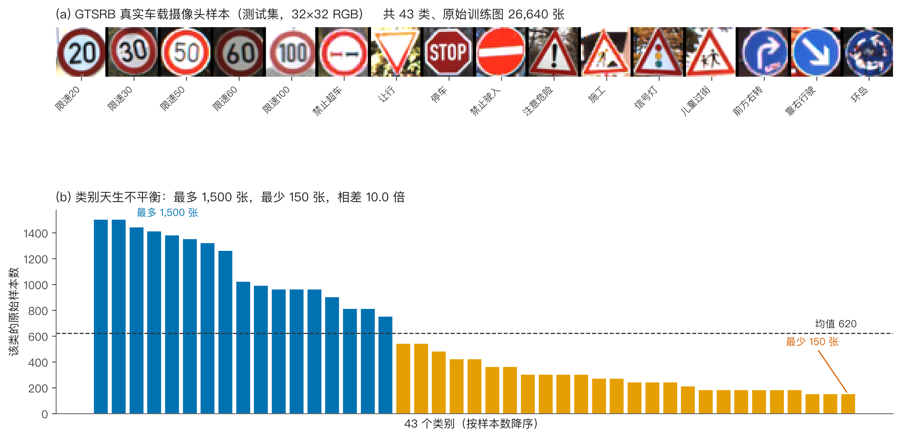
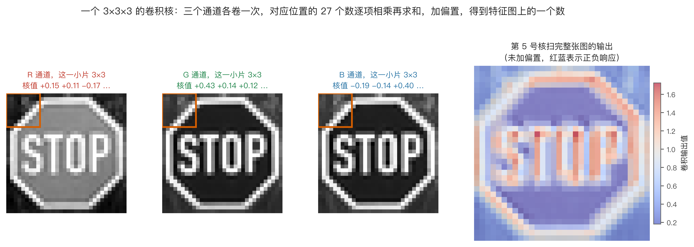
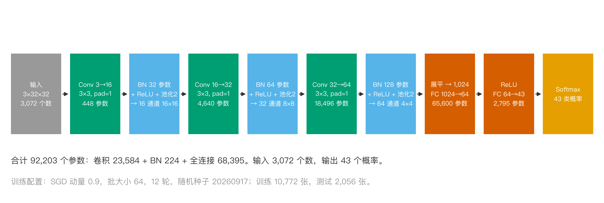
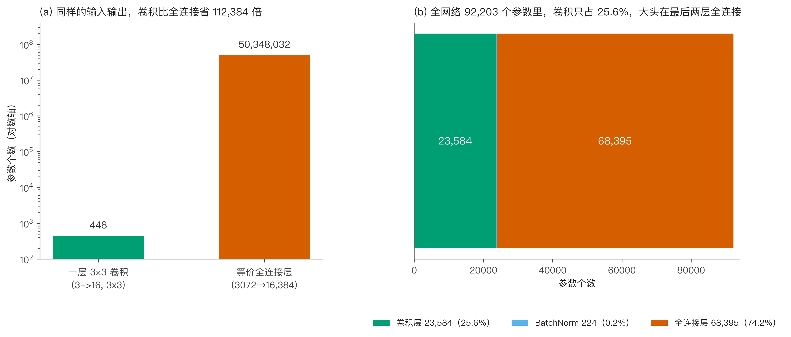
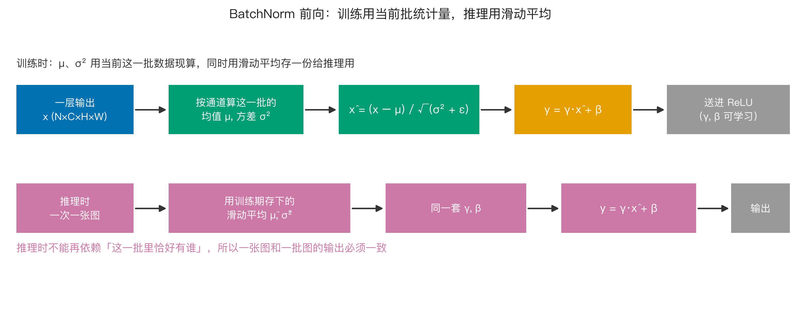
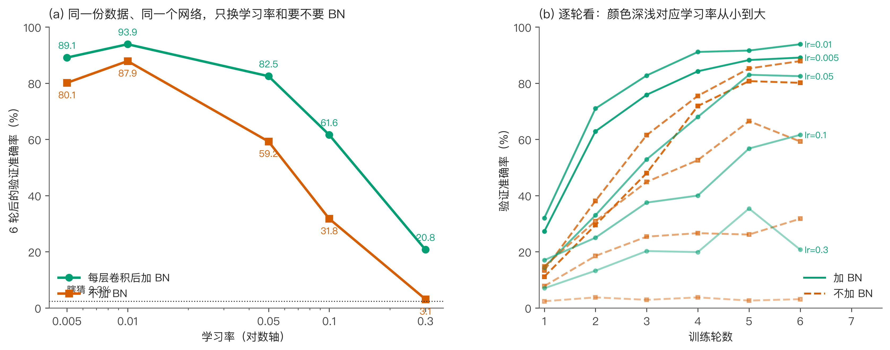
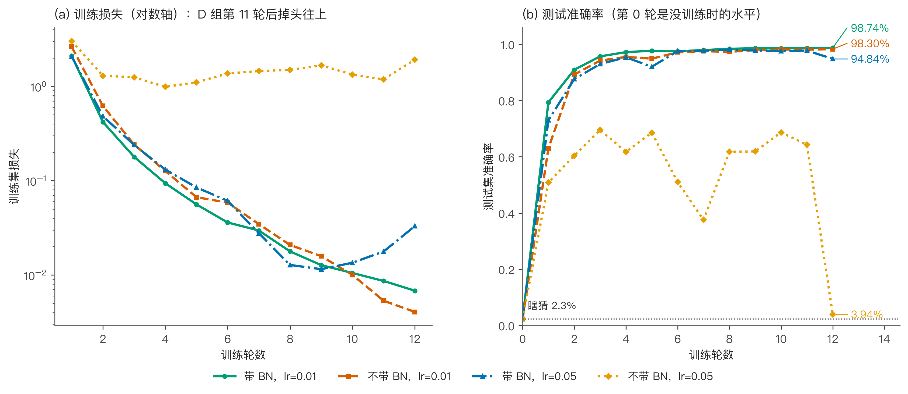
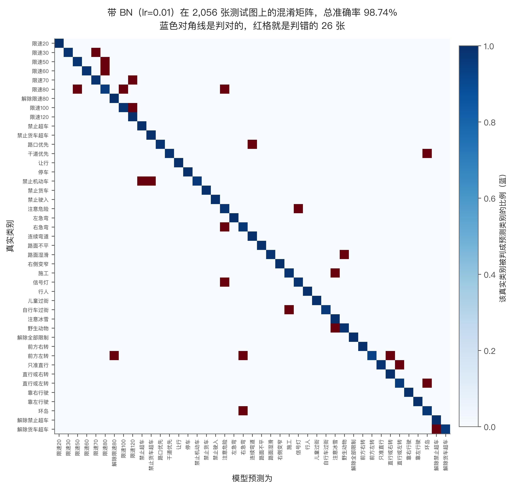
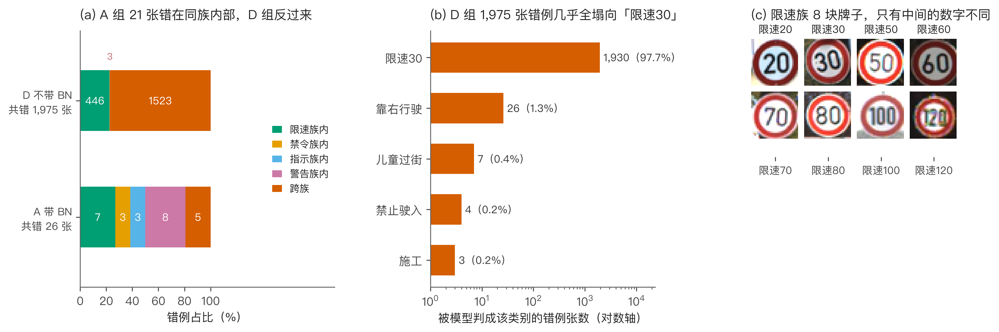

# 限速 30 和限速 80 只差一个数字，卷积网络凭什么分得清？

上个月我把行车记录仪里的视频导出来重看了一遍。同一条路，白天路过拍到一块「限速 80」的牌子，傍晚逆光再路过，同一块牌子在画面里几乎看不出轮廓，只有中间那个数字还算清楚。

这件事让我想起一个我一直想动手算清楚的问题。

限速 30、限速 50、限速 80，这些牌子长得一样：红圈、白底、黑字，唯一的区别就是中间那个数。人扫一眼就知道是几，因为我们的眼睛读完数字，脑子直接给出答案。可对手里只有像素的模型来说，它看到的不是「80」这个概念，而是一块 32×32 的彩色方块。

那它凭什么分得清？

这篇文章我不用现成框架，用 numpy 从零手写一个卷积网络，让它去认德国交通标志数据集 GTSRB 里的 43 类标志。整个过程中我最在意的是一笔账：要认出这些牌子，模型到底需要多少参数，这些参数该长成什么样子，又该怎么把它们训出来。

## 一张 32×32 的图，在程序眼里就是 3072 个数

先说我用的数据。GTSRB 全称 German Traffic Sign Recognition Benchmark，2011 年 IJCNN 竞赛发布，德国人工智能研究中心和柏林工业大学团队用真实车载摄像头在德国路上采集，覆盖不同天气、光照和拍摄角度。下载地址和文件校验值我都写在仓库里了。

我下的是官方包 `GTSRB-Training_fixed.zip`，187490228 字节，md5 是 `513f3c79a4c5141765e10e952eaa2478`。解压之后有个 Readme，里面写得很坦白：这个包是当年在线竞赛用的训练子集，完整训练集要等竞赛结束才放出来。所以我拿到的不是全部数据，一共 43 类、26640 张。

每张图配一行 CSV，字段是这样：

```text
Filename;Width;Height;Roi.X1;Roi.Y1;Roi.X2;Roi.Y2;ClassId
00000_00000.ppm;27;28;5;5;22;23;0
```

Filename 是文件名，Width 和 Height 是原图尺寸，中间四个 Roi 是标志在画面里的矩形位置，ClassId 是类别号。车载摄像头拍到的原始画面里，标志只占一小块，周围全是路和树。所以我按 Roi 把标志裁出来，再缩到 32×32，这样一张图就变成 32×32×3 = 3072 个数。

类别分布很不均匀，这也是真实世界的常态。最多的类有 1500 张，最少的只有 150 张，差 10 倍。为了把训练时间压在能接受的范围里，我给每类的取用量设了上限：训练每类最多 300 张，测试每类最多 60 张。这样一来，切分完的训练集里每类实际是 128 到 300 张，不平衡从 10 倍缩到 2.34 倍。这一点后面讲误判的时候还会回来找它。

路径按 85% 和 15% 分层切开之后，训练集 10772 张，测试集 2056 张。测试集全程不参与训练，只在最后用来回答「它到底学会了没有」。



现在换个角度想。如果你不知道卷积层是什么，接到这个任务，最直接的做法是什么？

最直接的做法是让每个输出都和所有输入连起来。3072 个输入数，43 个输出类别，中间加一层隐藏层。这个做法在数学上没问题，我们算一下它要多少参数。

## 卷积层到底在算什么

先说卷积核在干什么，我尽量说得能上手。

取一个 3×3×3 的核。这个「3×3×3」不是三个 3，而是宽 3、高 3、通道 3。第三个 3 对的是输入图的通道数，也就是 R、G、B 三个通道。

计算的时候，把核放在图上某个位置，三个通道各取一个 3×3 的 patch，对应位置的数两两相乘，27 个乘积加起来，再加一个偏置，得到结果图上的一个数。这个数就是「这个位置和这个核有多像」。



从左到右移动这个核，整张图扫完，就得到一张新的图，叫特征图。同一层里我用 16 个不同的核，就得到 16 张特征图。

这里有两个参数要定。第一个是 padding，我在图的外圈补一圈 0，这样 3×3 的核扫完边缘之后，输出还是 32×32，不会越扫越小。第二个是池化，紧跟卷积之后，把每个 2×2 的小块压成一个数，只留最大的那个，图一下子从 32×32 变成 16×16。

输出尺寸有个式子可以算：H_out = (H + 2 × padding − 核大小) ÷ 步长 + 1。我的设置是 H=32、padding=1、核大小=3、步长=1，代进去等于 (32 + 2 − 3) ÷ 1 + 1 = 32，尺寸没变。池化的核是 2、步长是 2，代进去是 (32 − 2) ÷ 2 + 1 = 16，正好减半。后面每过一段卷积加池化，图就减半一次，通道数翻倍一次。

网络整体长这样，三段卷积，最后接两层全连接：



讲到这里有个工程细节值得说。真按滑动窗口写四层循环，纯 Python 跑一遍要等到天亮。我把卷积换了个写法，叫 im2col：把每个滑动位置上的 patch 摊平成一列，所有位置拼成一个大矩阵，然后一次矩阵乘法算完。代码是这样：

🏃 代码在 `code/train_cnn.py`，这一段是卷积的前向。

```python
def im2col(x, k, pad):
    """(N,C,H,W) -> (N, C*k*k, H*W)，索引顺序 (i*k+j)*C+c"""
    N, C, H, W = x.shape
    xp = np.pad(x, ((0, 0), (0, 0), (pad, pad), (pad, pad))) if pad else x
    cols = np.empty((N, C * k * k, H * W), dtype=x.dtype)
    idx = 0
    for i in range(k):
        for j in range(k):
            cols[:, idx * C:(idx + 1) * C, :] = xp[:, :, i:i + H, j:j + W].reshape(N, C, H * W)
            idx += 1
    return cols


class Conv2:
    def forward(self, x):
        self.shape = x.shape
        self.cols = im2col(x, self.k, self.pad)
        Wf = self.W.reshape(self.cout, -1)          # (cout, cin*k*k)
        out = np.matmul(Wf, self.cols)              # 一次矩阵乘法
        out += self.b[None, :, None]
        return out.reshape(x.shape[0], self.cout, x.shape[2], x.shape[3])
```

注意 `im2col` 里那个 `idx` 的排法是 `(i*k+j)*C+c`，先走核的宽高位置，再走通道。这个顺序必须和权重的摊平顺序一致，否则它会把 R 通道的数和 G 通道的权重乘在一起，算出来的东西看着像收敛，其实全错。我第一版就是这里错了，loss 一直在 0.5 附近晃，怎么调学习率都没用。

还有个更隐蔽的坑。我拿到的数据是 NHWC 排布（张、高、宽、通道），而上面这个实现按 NCHW 写。直接喂进去，程序不会报错，它会以为这张图有 32 个通道、每个通道 3×3，然后在矩阵乘法那一步才崩掉，报一个 `size 288 vs 27` 这种看不出所以然的错。加一句转置就好：

```python
Xtr = np.transpose(Xtr_u8.astype(np.float32) / 255.0, (0, 3, 1, 2))
```

## 参数账本：448 对 5034 万

现在来算那笔账，这是我最想算清楚的部分。

第一层卷积是 3 个通道进、16 个通道出，核 3×3。参数怎么数：3×3 的核在单通道上有 9 个权重，乘上输入通道数 3，是 27 个权重。16 个输出通道各有一套自己的核，27×16 = 432 个权重。每个输出通道再配一个偏置，加 16，合计 448 个参数。

这 448 个参数产出了多少个输出数？16 张 32×32 的特征图，也就是 16×32×32 = 16384 个数。

那么如果不用卷积，换成全连接层，要产出同样这 16384 个数，需要多少参数？全连接的定义是每个输出都连到全部输入，所以每个输出要 3072 个权重加 1 个偏置，3073 个。16384 个输出乘上去：

3073 × 16384 = 50348032

448 对 50348032，差多少倍：

50348032 ÷ 448 = 112384

11 万倍。这个数字我第一次算出来的时候盯着看了半天。

但这个 11 万倍不是天上掉的，它来自两个可以分开的机制，拆开看更有意思。

第一是局部连接。全连接里每个输出要看全部 3072 个输入，卷积里每个输出只看它那 3×3×3 = 27 个输入。这一项省下 3073 ÷ 28 = 109.75 倍。

第二是权重共享。那 27 个权重不是只在一个位置用一次，它在 1024 个滑动位置上反复用。这一项再省 16384 ÷ 16 = 1024 倍。

两个机制叠起来：109.75 × 1024 = 112384。正好对上。



省下来的代价是，每个输出只看得到局部。单看一个卷积输出，它不知道图的另一边有什么。补这个短板靠堆叠。

感受野可以一层层递推。第一层每个输出看原图的 3×3，所以第一层感受野是 3。第二层每个输出看第一层的 3×3，而第一层那 3×3 各自又覆盖原图 3×3，于是第二层感受到的是 5×5。再叠一层是 7×7。写成式子就是：r_out = r_in + (核大小 − 1) × 到这一层为止的累积步长。

这个递推解释了为什么卷积网络要一层层往上堆而不是只堆一层宽的。每加一层，感受野只多 2，但参数只多几百个，代价很小。等你把三段卷积做完，第三层的每个输出已经能看到原图 7×7 的区域，而它手里始终只有 27 个权重。

不过 7×7 对于一张 32×32 的图来说，其实还只是很小的一块。所以卷积层负责提取局部结构，真正把整张图的信息汇总起来，还得靠后面那两层全连接。这也是为什么我的网络里全连接层吃掉了 74.2% 的参数：这一部分它省不掉。

我整个网络的账是这样的：三层卷积加起来 23584 个参数，BatchNorm 224 个，最后两层全连接 68395 个，合计 92203。卷积占 25.6%，全连接占 74.2%。

参数定下来了，接下来得让它学。最后一层的输出是 43 个原始分数，先过 softmax 变成 43 个加起来等于 1 的概率，再用交叉熵算损失，也就是看正确答案那一项的概率有多少，取负对数：

损失 = − log(正确答案的那个概率)

概率越接近 1，损失越接近 0；概率越接近 0，损失涨得越快。这两步连起来算梯度，会得到一个很干净的结果：梯度等于「预测概率减去正确标签的独热编码」。43 维里，正确的那一维减 1，其余保持不变。这个式子不是我凑的，是 softmax 和交叉熵的导数互相约掉中间项之后剩下的。代码里就是两行：

```python
p = np.exp(z) / np.exp(z).sum(axis=1, keepdims=True)
d = p; d[np.arange(n), y] -= 1.0; d /= n
```

顺带一个容易忽略的地方。算 softmax 之前要先给每个分数减去这一行的最大值，也就是代码里的 `z = logits - logits.max(...)`。这不改变数学结果，因为分子分母同乘一个常数会约掉，但它能防止 `np.exp` 在大分数上溢出成 inf。

到这里我停了一下。参数是省下来了，可省下来不等于能训好。真正跑起来会发生什么，得试。

## 第一次实验，我没跑出差别

第一版网络我搭得很浅：两层卷积（3→16、16→32），后面接两层全连接。

结果是带 BN 和不带 BN 几乎打平，差距在小数点后一位。这个结果让我有点尴尬，因为我是奔着证明 BN 有用去的。那一版脚本后来被我重写掉了，所以仓库里找不到它，这里只当成一次没跑出结论的尝试记着。

我把原因归到网络太浅上。两层卷积的网络，输入到输出之间的路径太短，梯度还没衰减到出问题的程度。于是我把网络改成三层卷积，通道数从 16、32 到 64，同时把训练数据缩到 4000 张，先做一轮快速扫描。

顺带说一句我在这个过程里踩的坑。改完结构之后我跑的第一版梯度校验，各层相对误差在 0.5% 左右，看起来像全部失败。查了半天才发现是我用 float32 做数值差分，差分本身就有精度噪声。换成 float64 重算，误差掉到 2.2e-6 到 5.8e-6 之间，全过。测梯度这种事，精度不够会把你带到沟里去。

梯度校验里还有个插曲。第一层卷积的偏置项，我算出来的解析梯度全是 0，一开始以为反向传播写错了。后来才想明白：这个偏置后面紧跟 BatchNorm，而 BN 会把整个通道平移到均值 0，偏置加多少都会被减掉，所以它对最终输出真的没有任何影响，梯度本来就该是 0。这不是 bug，是 BN 的后果。

## BN 到底做了什么

先讲为什么需要它。

网络里每一层的输入，都是上一层的输出。训练的时候，上一层的权重一直在变，于是这一层看到的输入分布也跟着一直变。这一层好不容易适应了某种输入分布，下一批数据的分布又变了。这就是训练不稳的一个根源。

BatchNorm 的想法很直接：在每一层后面，把数据按通道拉回到均值 0、方差 1。

具体做法是，一批数据送进某一层，输出是 N×C×H×W 的四维张量。对每个通道 c，把这一批里所有样本、所有空间位置上的数收集起来，算两个统计量：均值 μ 和方差 σ²。

然后标准化：

x̂ = (x − μ) ÷ √(σ² + ε)

ε 是个很小的数，防止方差为 0 时除零。

到这一步数据被强行拉成均值 0、方差 1。但这个「强行」有问题：如果这一层本来就需要输出有偏的分布，把它拉回均值 0 反而破坏了学到的表示。所以 BN 又加了一步：

y = γ · x̂ + β

γ 和 β 是可学习的参数，初始值是 γ=1、β=0，也就是一开始先做恒等映射。如果网络觉得标准化之后的信息不好，它可以自己学出一个 γ 和 β 把原来的分布还原回去。这一步很关键，它让 BN 变成「默认帮忙、需要的话可以撤」而不是「强制扁平化」。

平移到哪一步靠滑动平均。训练时 μ 和 σ² 用当前这一批现算，同时用滑动平均存一份；推理的时候，来的可能只有一张图，样本量根本不够算统计量，所以一律用存下来的那份。这一条必须守住，否则同一张图单独送进去和混在一批里送进去，会得到两种不同的结果。

还有一处位置上的分歧值得提一下。BN 的原始论文把它放在卷积之后、ReLU 之前。但我这篇把它放在同一位置，也就是卷积之后、ReLU 之前。为什么不放 ReLU 之后？因为 ReLU 会把负半轴全部压成 0，输出的分布被砍掉了一半，你再去标准化这个被削过的分布，统计量本身就是畸形的：一批里如果有一半神经元输出全是 0，那这个通道的方差会算得极小，除下去会把噪声放大。放在 ReLU 前面，标准化的是一个完整的线性输出，统计量才有意义。



反向传播这里我推了很久。y = γ·x̂ + β，而 x̂ 又依赖 μ 和 σ²，而 μ 和 σ² 本身是这一批数据的函数，所以求导要穿过这两条路。推完的闭式解是这样：

🏃 这一段的完整实现在 `code/train_cnn.py` 的 `BatchNorm.backward`。

```python
def backward(self, d):
    """y = g*xhat + b；xhat = (x-mu)/std
    dxh = d*g；dx = (dxh - E[dxh] - xhat*E[dxh*xhat]) / std"""
    axes = (0,) + tuple(range(2, self.x.ndim))
    self.dg[...] = (d * self.xhat).sum(axis=axes)
    self.db[...] = d.sum(axis=axes)
    dxh = d * self.g.reshape(self._shape(self.x.ndim))
    return (dxh
            - dxh.mean(axis=axes, keepdims=True)
            - self.xhat * (dxh * self.xhat).mean(axis=axes, keepdims=True)
            ) / self.std
```

写成人话就是三项之和。第一项 dxh 是直接路径。第二项减去 dxh 的均值，因为 μ 是这一批的均值，任何一个样本变大都会把 μ 推大，从而影响其他所有样本的输出，这一项补的就是这条漏出去的路。第三项减去 x̂ 乘 dxh·x̂ 的均值，同理来自方差 σ² 对全批的耦合。少了任何一项，反向传播都会偏，而且不会立刻显形，只会让训练效率变低。

## 学习率扫描：5 档学习率，两个配置

BN 的参数代价极其便宜，整个网络只多 224 个参数，占 0.24%。所以真正的取舍不在参数多少，而在它换来了什么。

最常被提到的说法是「BN 让你能用更大的学习率」。我把学习率从 0.005 一路扫到 0.3，每个组合跑 6 轮，训练子样本 4000 张，验证子样本 800 张。结果是：

| 学习率 | 加 BN 验证准确率 | 不加 BN 验证准确率 | 差距 |
|---|---|---|---|
| 0.005 | 89.1% | 80.1% | +9.0 |
| 0.01 | 93.9% | 87.9% | +6.0 |
| 0.05 | 82.5% | 59.2% | +23.3 |
| 0.1 | 61.6% | 31.8% | +29.8 |
| 0.3 | 20.8% | 3.1% | +17.7 |



这张表里最值得看的不是「BN 更高」，而是差距随学习率变化的趋势。

学习率 0.01 那一档，两边只差 6 个百分点。那时候训练本来就稳，BN 的作用不明显，这也解释了为什么我第一次用两层网络跑的时候，带 BN 和不带 BN 几乎打平。

学习率往上走，情况就变了。0.05 那一档差 23.3 个百分点，0.1 那一档差 29.8 个百分点。不加 BN 的版本从 87.9% 一路掉到 59.2%、31.8%，几乎是断崖；BN 版本是 93.9%、82.5%、61.6%，坡度缓得多。所以 BN 真正带来的东西不是「把准确率抬高几个点」，而是把学习率这个旋钮的可调范围拉开了：没有它，你只敢待在 0.01 附近，稍微动一下就掉；有它，在 0.05 甚至 0.1 上还能继续训练。

我也得说清楚它的边界。到了 0.3，BN 版本自己也只剩 20.8%，比瞎猜的 2.3% 好，但完全没有实用价值。BN 不是「多大学习率都能跑」，它是把上限往上推了一档，同时让超过这一档之后的崩坏慢一些。

还有个容易忽略的细节。我的优化器带 0.9 的动量，动量会把梯度按历史方向累加，等效步长大致是学习率的十倍左右。所以这里 0.05 的实际步长，跟不带动量的 0.5 差不多。

我特意没用 Adam。Adam 会给每个参数算一个自适应步长，等于在背后又替你调了一次学习率，那「学习率」这个变量就不纯了。这一轮我想看的恰恰是 BN 和学习率之间的关系，所以选了最朴素的带动量 SGD，让学习率是唯一的自变量。

## 全量数据上的 2×2 对照

扫描用的是 4000 张小样本，样本少结论可能是偶然。所以我用全量 10772 张训练图、批大小 64、动量 0.9、跑 12 轮，做了四组，排成 2×2。四组串行跑完，在我这台笔记本上花了 1295 秒，纯 numpy，没有用显卡：

| 配置 | 学习率 | 测试集准确率 |
|---|---|---|
| A 带 BN | 0.01 | 98.74% |
| B 不带 BN | 0.01 | 98.30% |
| C 带 BN | 0.05 | 94.84% |
| D 不带 BN | 0.05 | 3.94% |



A 和 B 之间只差一个 BN，别的都一样。这个差值就是 BN 单独的贡献。

先看第一列。A 和 B 只差 0.44 个百分点。12 轮训练、一万多张图，0.44 个百分点算不上差距，更像随机波动。如果我只跑这一组对照，结论会是「BN 也就那样」。

把 13 个轮次的曲线拆开，差别才浮出来。A 组第一轮就跑到 79.4%，B 组只有 63.0%，差 16.3 个百分点。后面每一档都是 A 先到：

| 准确率首次达到 | A 带 BN | B 不带 BN |
|---|---|---|
| 90% | 第 2 轮 | 第 3 轮 |
| 95% | 第 3 轮 | 第 4 轮 |
| 97% | 第 4 轮 | 第 6 轮 |
| 98% | 第 8 轮 | 第 10 轮 |

最直白的对比：A 组在第 8 轮摸到了 98.39%，B 组一直跑到第 12 轮才 98.30%。也就是说 A 组用 8 轮做到的事，B 组用 12 轮还没追上。两边的参数量只差 224 个，训练成本差了三分之一。BN 在这里买到的不是准确率，是时间。

第二列才是真正难看的地方。

C 组带 BN、学习率 0.05，最后停在 94.84%。它中间第 8 轮摸到过 98.15%，之后开始来回晃，最后一轮又掉回去。曲线不单调，说明 0.05 对它来说已经偏大了，但还没到失控的程度。

D 组不带 BN、同样 0.05，从头到尾没有一轮超过 70%。第 11 轮还有 64.3%，第 12 轮直接掉到 3.9%，训练损失从 1.19 涨到 1.93。这不是「收敛得慢」，这是训练到一半发散了。

同一个学习率，带 BN 的还能交出一个能用的模型，不带的把自己练崩了。前面扫描表里那条「差距随学习率扩大」的趋势，在全量数据上又演了一遍：学习率越大，BN 越是删不掉的那一项。

## 43 类里，它认错了哪些

准确率是一个数，看不出模型是怎么错的。所以我把它在 2056 张测试图上的每一个预测都记下来，画成混淆矩阵。横向是模型预测的类，纵向是真实类，对角线上的格子是判对的，对角线外面就是错。



先看 A 组。2056 张测试图错 26 张，占 1.3%。这 26 张散在 21 个真实类别上，没有哪一类被特别针对，错得最多的「限速 80」也只错了 3 张。

我把 43 类按语义归成四个家族：限速族（限速 20 到 120，外加解除限速）、禁令族（禁止超车、禁行、让行、停车）、指示族（必须直行、左转、右转、靠左右、环岛）、警告族（注意危险、急弯、湿滑、施工、行人这些）。然后看这 26 张错在了哪：

| 错在哪里 | 张数 |
|---|---|
| 警告族内部 | 8 |
| 限速族内部 | 7 |
| 禁令族内部 | 3 |
| 指示族内部 | 3 |
| 跨家族 | 5 |

21 张是「同族的两个标志搞混了」，跨家族的只有 5 张。限速族那 7 张的配对全部是数字看错：限速 30 被判成限速 70，限速 50 被判成限速 80，限速 60 被判成限速 80，限速 70 被判成限速 120，限速 80 被判成限速 50，限速 80 被判成限速 100，限速 100 被判成限速 120。跨家族的 5 张里，有三张是「指示牌看成了警告牌或限速牌」，比如前方左转被判成右急弯。

规律一眼就能看出来，错的都是「同一个红圈、白底、黑字，只是数字不同」的组合。32×32 像素下，一块限速牌的直径大概只占 30 个像素，中间那个数字实际只有十几个像素宽。数字 3 和 7 在这十几个像素里长成什么样，你可以自己想象一下。

再看 D 组。它错 1975 张，占测试集的 96.1%。这 1975 张里有 1930 张被判成了同一个类别，也就是限速 30，占它全部错例的 97.7%。跨家族的误判有 1523 张，占 77%。

更说明问题的是它一共只对了多少张。2056 张里它只答对 81 张，其中 59 张来自「限速 30」这一类本身（这一类 60 张，它对了 59 张）。剩下 42 个类里，有 38 个类一张都没答对。另外几个类的好成绩也就是个位数：施工对 9 张，路面不平对 6 张，禁止驶入对 5 张，直行或左转对 2 张。

这已经不是「学得不好」，是网络塌成了一个常数函数：不管送进来哪张图，它都喊限速 30。3.94% 的准确率也不是它学到了什么，只是「限速 30」这一类恰好占了测试集的 2.9%，它靠押注单一类别捡到了一点运气。

所以这两个网络的差别不在准确率差几个点。差别是：一个还在分辨，另一个已经放弃分辨了。



回到数据那头。原始数据的类别不平衡是 10 倍，但我切分时把训练上限压到每类 300 张，实际训练集里的不平衡只剩 2.34 倍，而且是按类别分层切的，没有做任何重采样。在这个前提下，A 组那 26 张错例里，没有一张落在样本最少的类上，样本最少的「直行或左转」（22 张测试图）只错了 1 张。所以我更倾向于认为，主要的原因不是样本量，而是信息本身：限速类的图像，绝大部分像素是完全一样的，真正决定类别的信息只集中在中间那一小块数字上。样本再多，也不会让那一小块数字变得更清楚。

## 回到标题那个问题

现在可以回答开头了。

限速 30 和限速 80 只差一个数字，卷积网络分得清，靠的是三件事凑在一起。

第一，卷积把「看局部」变成学习的前提。每层只看 3×3 的一小块，就能用几百个参数处理 3072 个输入的图，把参数从 5034 万压到 448。

第二，层数把这些局部拼成整体。第一层找边缘和色块，第二层把边缘拼成圆弧和线段，第三层再拼成「红圈里有数字」这样的结构。等到全连接层接手时，它面对的不是 3072 个像素，而是 1024 个已经有含义的特征。

第三，BN 把训练过程稳住。它只花 224 个参数，换来的是同一份数据上少跑三分之一的轮数，以及在更大学习率上不至于立刻崩掉的空间。

但它仍然会错，而且错得有规律。26 张错例里 21 张是同族之间认混，其中限速牌之间的混淆最典型：限速 30 认成限速 70、限速 50 认成限速 80，都是一个红圈里数字看错。这不是模型偷懒，是那几张图在 32×32 的分辨率下，数字部分真的糊成了一团。

## 三个干货点

一、卷积省参数是两个机制相乘，不是一个。局部连接让每个输出只看 27 个输入（省 109.75 倍），权重共享让同一组权重在 1024 个位置复用（再省 1024 倍），乘起来 112384 倍。只记住「卷积省参数」不够用，因为这两个机制失效的场景完全不同：局部连接怕的是需要全局信息的任务，权重共享怕的是同一模式出现位置本身有含义的任务。

二、BatchNorm 的参数开销几乎可以忽略，整个网络只多 224 个。它的作用是把每层输入拉回稳定的分布，γ 和 β 保证网络需要时能把分布还原。用它的时候有一个必须守住的细节：训练用批统计量，推理用滑动平均，两边的口径不一致会让线上结果和验证结果对不上。

三、学习率不是越大越好，BN 也不是万能。实测里 BN 的甜区在 0.01（验证准确率 93.9%），到 0.05 退到 82.5%，0.3 只剩 20.8%。更值得记住的是差距的走向：学习率 0.01 时 BN 只领先 6 个百分点，到 0.1 时领先 29.8 个百分点。所以 BN 最该被用在「你想把学习率往大开」的场景，而不是「准确率上不去」的场景。另外，如果你的优化器带动量，记着等效步长大致是学习率的十倍，调参要按这个换算。

## 想自己跑一遍

数据和代码都在仓库 `github.com/beverlyLee/ai-guanxingji` 的 `M15_CNN_交通标志` 目录下，依赖只有 numpy、matplotlib 和 pillow。文章里出现的每一个数字都来自 `data/stats.json` 和 `data/error_analysis.json`，配图全部由 `code/make_figures.py` 从这些数字重画，没有手改过任何一个数：

```bash
python code/prepare_data.py     # 下载 GTSRB，按 ROI 裁切缩放到 32x32，分层切分
python code/gradcheck.py        # 验证反向传播（float64 下各层相对误差 2.2e-6 ~ 5.8e-6）
python code/train_cnn.py        # 学习率扫描 + 2x2 对照，产出 stats.json
python code/analyze_errors.py   # 错例归族分析，产出 error_analysis.json
python code/make_figures.py     # 生成全部 9 张配图
python code/qc_article.py       # 校验本文的字数、数字一致性等
```

纯 numpy 手写，没有 torch 和 tensorflow，一台笔记本就能跑完。想改结构就改 `train_cnn.py` 里的 `CHANNELS`，想换数据集就换 `prepare_data.py` 的下载地址和解析逻辑，其余代码不用动。

最后我想问一个问题。我自己开车的时候遇到过好几次导航把限速牌认错，一次是把「限速 100」读成「限速 120」，还有一次是把匝道口的牌子当成了主路限速。你在什么场景下见过识别出错的交通标志？是逆光、雨雪，还是被别的车挡住？评论区说说，如果某类场景出现得多，我下篇专门做一版错例图集，把模型在那些场景下的特征图也一起画出来看。
