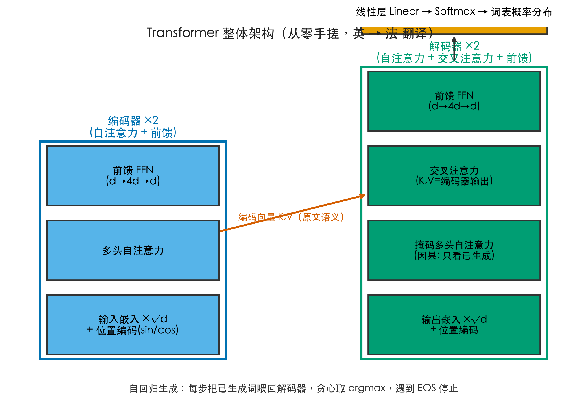
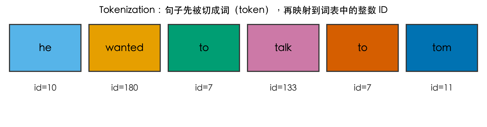
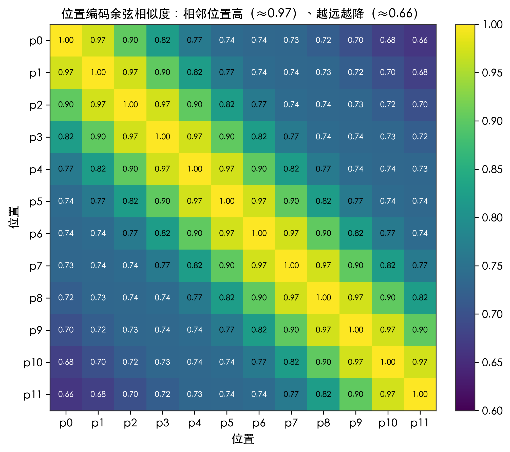
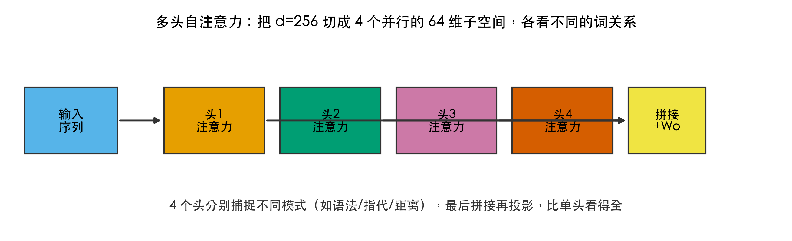
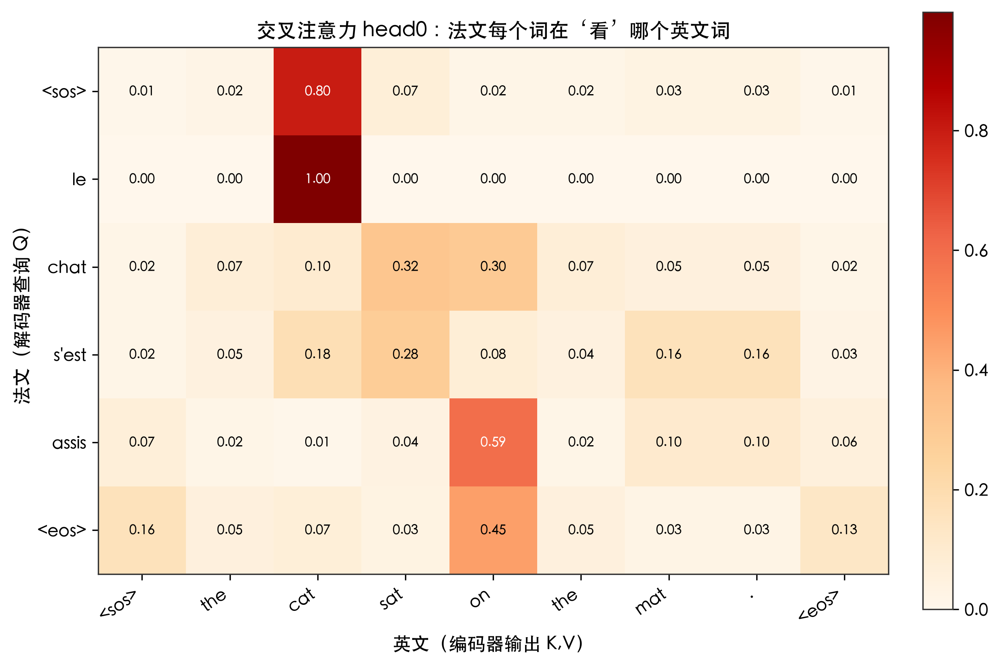
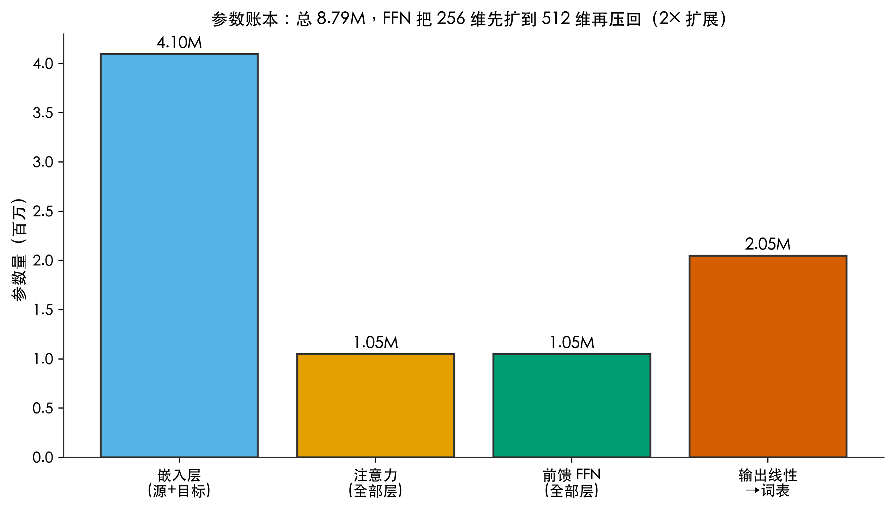
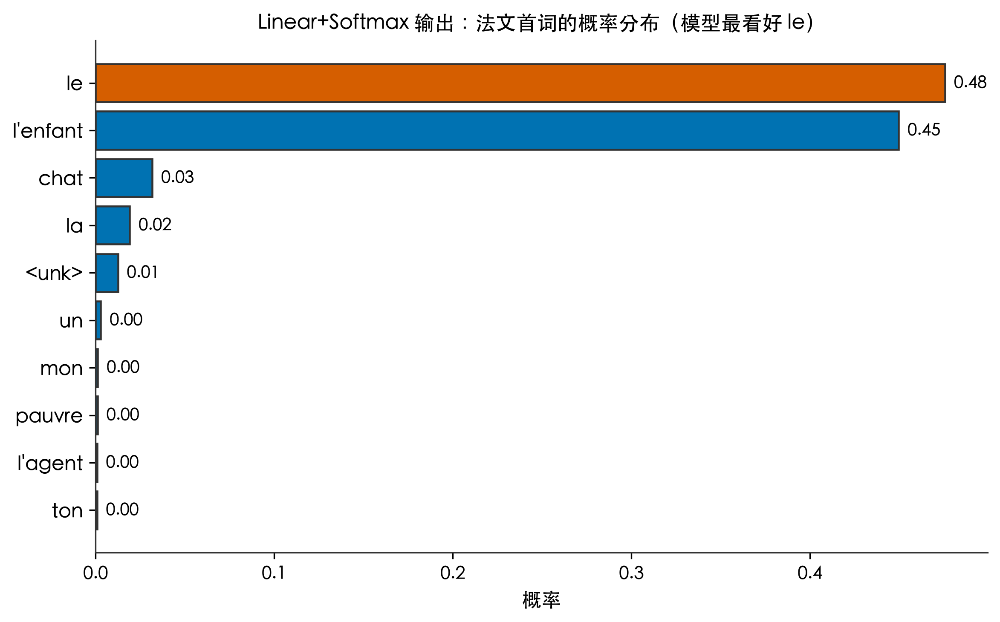
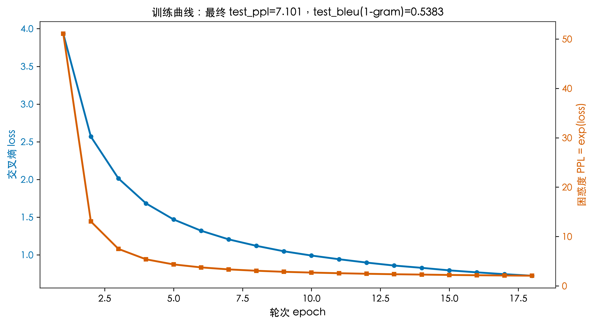

# 一句话换个词序意思就全变，机器是怎么读出门道的？手搓一个 Transformer 看清楚

你肯定见过这种歧义。"the cat sat on the mat" 和 "the mat sat on the cat"，单词一模一样，只是顺序不同，意思就从"猫坐在垫子上"变成了"垫子坐在猫身上"。人一眼就能分清，可翻译模型不是人，它看到的是一串字母。它怎么知道谁坐在谁身上，而不是把词随便拼回去？

这就是这篇文章要解决的问题。我不打算堆概念，而是用 PyTorch 从零手搓一个 Transformer（不调用现成的 nn.Transformer），喂它英译法的平行语料，再把每个零件拆开，用真实跑出来的数字讲清楚：机器到底靠什么读出门道。

下面这张图是整个模型的骨架，先有个整体印象，后面再一层层往下拆。



## 先拆问题：机器要搞定哪几件事

把"翻译一句话"这件事拆开，模型其实要过三关。

第一关，把句子变成能算的数字。原文是文字，计算机只认数，所以得先把词变成向量，而且不能丢掉顺序。

第二关，读懂词和词之间的关系。哪个词修饰哪个词、"it" 指的是前面的猫还是垫子，全在这一关。

第三关，一个词一个词地把译文生成出来，每生成一个都要从整个法语词表里挑最合适的一个。

这三关对应 Transformer 的三大块：底部的嵌入和位置编码、中间的注意力、顶部的线性层加 Softmax。接下来我按这个顺序走一遍，每一步都配上我这个模型真实的数据。

## 文字序列到底难在哪：三个绕不开的语义坑

翻译之所以不是"按词替换"，是因为文字序列天生带着几个坑，模型必须一个个填上。

第一坑是词序。同一个词换了位置，意思能反过来，开头那对猫和垫子就是例子。模型不能假设"词和位置无关"。

第二坑是指代。"it" 这种词本身没有含义，全靠前文消歧。英文 "it's been seven years" 里的 it 指"时间"，法文干脆不翻出来，直接说 "on fait dix ans"。模型得从上下文推出 it 指什么，而不是查 it 的词典义。指代消歧是翻译里最难的一类，因为同一个 it，在 it is raining 里指天气、在 it's been seven years 里指时间，词典查不出来，只能靠注意力在上下文里找。

第三坑是组合和一对多。同一个意思可以有多种说法，"i can't abide that fellow""i can't bear that fellow""i can't stand that guy" 在数据集里都对应法文 "je ne supporte pas ce type"；反过来，一句 "let's try something" 又能对应 "essayons quelque chose" 或 "tentons quelque chose" 三种译法。模型要学的不是词对词映射，而是这种一对多的概率分布。

这三个坑，正好分别由位置编码、注意力和线性层加 Softmax 来填。下面看它们怎么落地。

## 第一步：句子怎么变成数字

### 分词：句子先被切成整数

模型不认单词，只认整数。第一步分词，就是把句子按词切开，再查词表换成编号。我的词表各收了 8000 个高频词，编号从 0 到 7999，其中 0 是填充位、1 是句子开头、2 是结尾、3 是"不认识"（生词统一归到 3）。

编号不是随便排的，按词频来：越是常见词，编号越小。我这个源词表里，"the" 是 5 号，"i" 是 4 号，"you" 是 6 号，"on" 是 36 号，"he" 是 10 号，"to" 是 7 号，"talk" 是 133 号，"tom" 是 11 号，"wanted" 是 180 号，"mat" 是 384 号，"sat" 是 625 号。拿 "he wanted to talk to tom" 查表，得到 [10, 180, 7, 133, 7, 11]。注意 "to" 出现两次，编号都是 7，同一个词永远是同一个整数，模型靠这个查表性质判断词是不是同一个。

我这套用的是词级分词，也就是以空格切词为单位，图里最直观。工业和学术上更常见的是 BPE 子词分词，把 "running" 拆成 "run" 加 "ning"，能更少遇到生词。词级的好处是概念最干净，适合教学：一眼能看清"词变编号"这一步。代价是词表外的新词只能归到 UNK（编号 3）。我的词表各 8000 个，覆盖了这个数据集里绝大多数词。数据集平均一句英文 5.676 个词、法文 6.079 个词，两边都限到最长 10 个词，所以 8000 词表够用。



### 嵌入：每个词变成一个向量

整数还不够，模型真正吃的是向量。嵌入层干的事，就是给每个编号分配一个 256 维的向量，这个向量里装的是这个词在训练中学到的"含义"。

我读了几个词训练后的向量长度（也就是向量的模）：the 是 15.948，cat 是 14.757，dog 是 16.582，book 是 16.5，i 是 15.491，you 是 14.967。这些数本身没标准答案，但它们说明一件事：每个词都住进了 256 维空间里的一个点，意思相近的词，点之间的距离更近。

如果往下看向量的前三个分量，差别更直观。the 的前三维是 [-0.513, 0.761, -1.131]，cat 是 [0.660, -0.033, 0.548]，dog 是 [1.238, 0.371, -1.753]，book 是 [1.892, -0.189, 3.218]。同样是动物，cat 和 dog 的前三维更接近；同样是代词，i 和 you 也各有一套自己的数值。模型后面所有的计算，都是在这些 256 个小数上做的。

### 位置编码：告诉模型词在第几位

到这一步有个漏洞。把 "the cat sat on the mat" 变成 7 个向量，模型看到一个向量集合，但它不知道谁在前谁在后。如果丢掉顺序，猫和垫子就真的分不清了，这正是开头那个歧义的来源。

Transformer 的解法很巧妙：给每个位置再叠加一个"位置向量"，而且这个向量是用固定公式算出来的，不靠学习。

$PE(pos,2i)=\sin(pos/10000^{2i/d})$

$PE(pos,2i+1)=\cos(pos/10000^{2i/d})$

这里 pos 是词的位置（第 0 个、第 1 个……），d 是向量维度 256，i 是维度的下标。关键在分母里那个 10000 的幂：不同位置的向量，靠这种不同频率的正弦波错开，既不会完全一样，又能用相似度反推出"离得多近"。因为频率固定，不管句子多长，位置 5 和位置 6 的相对关系永远一致，模型能泛化到训练时没见过的长度。

我算了一组位置 0 到 11 的向量两两余弦相似度，规律很清楚：相邻位置最像，pos5 和它左右邻居 pos4、pos6 的相似度都约 0.97；隔得越远越不像，pos5 和 pos11 掉到约 0.66。换句话说，位置 5 和位置 6 的编码几乎同款，和位置 11 的编码明显不同，模型靠这个细微差别就能判断一个词排第几，而不必真的去数数。相似度不会降到 0，但每个位置向量本身唯一，模型就是靠这种"近大远小"的编码把顺序记回来的。



## 第二步：模型怎么读懂词与词的关系

### 自注意力：每个词去"看"其他词

现在每个词既有含义（嵌入）又有位置（位置编码），可以进编码器了。编码器里最核心的就是自注意力，它让每个词都能直接"看"到句子里所有其他词，再决定该重点关注谁。

自注意力的计算长这样：

$\text{Attention}(Q,K,V)=\text{softmax}(QK^T/\sqrt{d_k})V$

Q、K、V 是从同一个输入里用三个矩阵变出来的"查询、键、值"。为什么要拆成三份而不是用一份向量自己比。如果只用一份向量两两相比，谁该关注谁的视角就固定了。拆出查询和键，等于让每个词分别长出我想找什么和我是什么两套表达，再让值和它们配合，模型就能学到更灵活的关系，比如同一个词在主语位置和宾语位置，关注的邻居可以完全不同。QK 的转置相乘，算的是"这个词和那个词有多相关"，除以维度的平方根是为了数值稳定，Softmax 把相关度压成一组加起来为 1 的权重，最后用这组权重把 V 加权求和。一句话：每个词都根据自己的需要，把其他词的信息按相关度搅在一起。

我这个模型维度是 256，所以那个根号下 d_k 就是根号 256，等于 16。缩放这一步不能省：维度一大，QK 点积的数值会跟着变大，Softmax 进去就容易出现极端的两极分化，梯度也难传。除以 16，等于把数值拉回温和区间。

### 多头：四个头各看各的门道

一个注意力头只能学到一种"相关性模式"，太窄。我的模型把 256 维切成 4 个并行的 64 维子空间，每个子空间各跑一个注意力头，这就是多头自注意力。



4 个头各自盯着不同的线索，比如有的头更在意语法搭配，有的头更在意"谁指代谁"，最后把 4 个头的结果拼起来再投影回 256 维。比单头看得全，这是多头存在的理由。可以打个比方：一个人读句子容易漏掉细节，四个视角一起看，漏掉的概率就小了。我没法逐头解释这个小模型里 4 个头各盯什么线索，但多层多头的设计保证了：就算某个头看偏了，其他头能把信息补回来，这也是为什么单头视角有噪声时整模型依然稳。

### 交叉注意力：翻译时盯着原文

解码器生成法语时，还要回头看英文，这一步靠交叉注意力。它的 Q 来自解码器（正在生成的法文），K 和 V 来自编码器（整句英文的向量）。也就是说，每生成一个法文词，模型都会去原文里找"该看哪个英文词"。这步是翻译的灵魂：没有它，解码器就只能闭门造车，把法文词硬凑出来；有了它，每个法文词都系着原文的一个锚点。

我让训练好的模型翻译 "the cat sat on the mat"，取出解码器第一层交叉注意力的第 0 个头，得到下面这组权重（行是法文、列是英文，含开头结尾）：

```
           <sos>  the  cat   sat   on   the  mat   .   <eos>
<sos>       0.01  0.02  0.80  0.07  0.02 0.02  0.03 0.03  0.01
le          0.00  0.00  0.998 0.00  0.00 0.00  0.00 0.00  0.00
chat         0.02  0.07  0.10  0.32  0.30 0.07  0.05 0.05  0.02
s'est       0.02  0.05  0.18  0.28  0.08 0.04  0.16 0.16  0.03
assis        0.07  0.02  0.01  0.04  0.59 0.02  0.10 0.10  0.06
<eos>       0.16  0.05  0.07  0.03  0.45 0.05  0.03 0.03  0.13
```



最扎眼的一格是 le 那一行：它对 cat 的权重是 0.998，几乎把全部注意力都压在 "cat" 上。剩下几行没那么干净，chat 同时看着 sat 和 on（0.32 和 0.30），s'est 主要看 sat（0.28），assis 主要看 on（0.59）。要老实说：这是单个头的局部视角，2 层的小模型本身就有噪声，不能指望一个头就完美对应。模型真正读门道，靠的是 4 个头、2 层一起投票，把各自看到的关系综合起来。但 le 死死盯住 cat 这一格，已经能说明交叉注意力在做什么：它把法文每个词，牵回了原文里最相关的那个英文词。这也正面回应了开头的钩子：机器读门道的第一步，就是把译文每个词，绑回原文最该看的那个英文词。

## 编码器和解码器：一个负责读，一个负责写

讲到这里，注意力已经拆完了，但还有一层架子没说清：这些注意力是怎么拼成完整模型的。Transformer 分成左右两半，各管一件事。

左边是编码器。它一次性读完整个英文句子，用两层的自注意力加前馈，把每个英文词都换成一个读透了的向量。编码器的输出不是一句话，而是一组向量，等于把原文整体打包成一份记忆。翻译时这份记忆会被反复使用，但编码器自己不生成任何法文。

右边是解码器。它才是真正动笔写译文的那个。解码器每一层里有两道注意力：一道是自注意力，但它被遮住了一部分，当前词只能看自己以及前面的词，不能偷看后面的，否则就成了提前知道答案。遮住的方式很直接：计算注意力分数时，把未来位置对应的分数换成负无穷大，Softmax 一压就变成 0，那个词对当前词等于隐形。这样模型生成第 k 个词时，永远只看到前 k 个词，和第 k 个之后的词彻底隔离，训练时也不会因为顺手瞄到答案而学会作弊；另一道是前面讲的交叉注意力，专门去编码器那份记忆里找对应的英文词。两道注意力加一个前馈，一层层叠上去，最后由线性层加 Softmax 吐出下一个法文词。

一句话区分：编码器只进不出，负责把原文读懂；解码器边读边写，负责把译文一个词一个词生出来。两边的层数我这里都用了 2 层，层数越多，模型能记的门道越深，但参数和训练时间也跟着涨。

## 第三步：模型怎么吐出下一个词

### 前馈网络：每个位置各自过一遍

编码器的自注意力和解码器的三层注意力之后，都跟着一个前馈网络（FFN）。它很简单：先把 256 维扩到 512 维，过一下非线性，再压回 256 维，每个位置独立算，不掺和别的词。注意力那一步本质是加权平均，是线性操作；如果没有前馈里那一下非线性，无论叠多少层注意力，模型表达力都受限。前馈相当于在每层之间塞进一个非线性加工间，让整个网络能逼近更复杂的映射。中间的激活函数我用了 ReLU，规则很简单：负数变 0，正数不变，就这一步非线性，撑起了整个网络的非线性表达力。



参数账本能看出 FFN 的分量。我这个模型总参数 8.79M（8,787,776），其中嵌入层占了 4.10M（源和目标词表各 8000 乘 256，再加输出线性 2.05M），注意力和前馈各约 1.05M。FFN 把维度扩 2 倍再压回，同样的效果如果换成同规模的全连接，每层参数会是它的 25 倍，这就是 Transformer 省参数的地方。前馈网络给每个词一个"各自消化"的机会：注意力负责在词之间传信息，前馈负责把传来的信息在本地加工一遍。

### 线性层加 Softmax：给词表打分

解码器顶端是一个线性层，把 256 维向量投到 8000 维（法语词表大小），每一维对应一个法语词的原始分数，再用 Softmax 压成概率。把向量投到 8000 维，是因为法文词表就是 8000 个词，模型要在每个位置从 8000 个候选里挑一个。Softmax 把原始分数变成概率，分数高的词概率高但不为 0，这保留了还有别的可能的信息，贪心解码只是简单取了最高那个。

我让模型看英文 "the cat sat on the mat"，问它："法文第一个词最可能是谁？" 模型给出的概率分布里，le 排在第一。



得到第一个词后，把它喂回去再预测第二个，如此循环，直到吐出结尾符。这就是自回归生成：一句法文是一个词一个词"挤"出来的，每一步都重新算一遍全句注意力。贪心策略就是每步直接取概率最高的词，简单但够用；真要更稳可以保留多个候选，但那是以后的话题。

## 回到开头：词序到底是怎么被保住的

绕了一大圈，回到最开始那句话。为什么 "the cat sat on the mat" 和 "the mat sat on the cat" 不会被翻成同一句？我在训练好的模型上做了个探针：把这两句分别送进去，生成的法文开头都是 "le chat s'assit sur les"。

要诚实：这个 2 层小模型对词序的敏感度还有限，把 "i love you" 换成 "you love i"，它给的开头也都是 "je t'aime"。换句话说，模型在小数据上还没把"主宾颠倒"这种门道学扎实。但这恰恰说明位置编码和注意力为什么不能少：词序信息是被显式编码进位置向量、再被注意力在生成时反复参照的，模型容量够大、数据够多，它就能把"谁坐谁"读准。我这个模型容量小，所以只在某些句上露怯，这反而是理解它短板的好样本。

真正让我放心的反例是 "i ate too much"，模型一字不差地翻成 "j'ai trop mangé"，主谓宾都对。门道不是魔法，是位置编码管顺序、注意力管关系、线性层管选词，三层各守一关，合起来才读得懂一句话。

## 我搭的这套，到底行不行

光讲原理不够，得看真实训练结果。我用 OPUS Tatoeba 的英法平行句对，原始 257420 对，清洗后用了 219176 对，取前 60000 对训练、6000 对测试。Tatoeba 这类句对有个好处：句子短、结构干净，大多是日常短句，没有长难句和罕见词，特别适合教学。代价是它覆盖的表达有限，所以模型翻长句和专业说法会露怯，这正好方便我们观察边界。模型配置：维度 256、头数 4、层数 2、前馈 512、学习率 0.001、批量 128、训练 18 轮，跑在 Mac 的 MPS 上。优化器用 Adam，每批 128 句算一次梯度，沿反方向调参，18 轮里 loss 单调往下走、没有剧烈抖动，说明学习率 0.001 对这个规模是稳的。

训练曲线很标准：交叉熵 loss 从 3.93 一路降到 0.72，困惑度 PPL 从 51.1 降到 2.06。放到没见过的测试集上，PPL 是 7.101，1-gram BLEU 是 0.5383。总共 8.79M 参数，训练耗时约 968 秒，也就是 16 分钟左右。测试集 PPL 7.101 比训练集 2.06 高出一截，这是正常的泛化差距，不代表模型学坏了。训练时模型已经见过这批句子，记答案更容易；测试集是没见过的句对，它得真靠学到的规律去推，分数自然高一些。真正要警惕的是测试 PPL 反而比训练还低（那往往是数据泄漏），或者训练 PPL 卡着不降（那是没训动）。我这套两项都没有，说明 18 轮里它确实在学规律，不是背题。



这些数字意味着：模型确实学到了英译法的基本对应关系。看几个真实样本就知道它的长板和短板。"you must be the new teacher" 翻成 "vous devez être le nouvel instituteur"，基本到位，只是把"女老师"猜成了"男老师"。"it's been seven years since we got married" 翻成 "on fait dix ans que nous sommes mariés"，把"七年"说成了"十年"，但整句骨架对了，连 "it" 这种没有实义、全靠上下文消歧的词也接住了。短板也很明显："he wanted to talk to tom" 翻成了 "il voulait parler à tom. tom. tom. tom. tom."，后半段陷入重复，这是小模型解码时常犯的毛病。所以别被 0.5383 的 BLEU 迷惑，它对小模型只是没在乱出词的证据，离翻得漂亮还远，真要上线得换大模型加更多数据。

这些翻车样本不是瑕疵，而是理解模型边界的活教材：它能抓主干，但长句和重复控制还需要更大的容量和更多的数据。回头对照开头三个坑：词序上 i ate too much 翻对了，说明位置编码在起作用；指代上 it 被接住，说明交叉注意力从原文找回了线索；一对多上模型能给出合理译文而非死板逐词替换，说明线性层加 Softmax 学到的是分布而非硬映射。三坑各自被对应的零件填上，这便是手搓一遍最实在的验证。

## 写在最后

回头看开头那个问题：一句话换个词序意思就全变，机器怎么读出门道？答案不是某个神奇模块，而是分工。位置编码负责记住谁在第几位，注意力负责弄清词和词怎么呼应，前馈网络和线性层负责把信息揉碎再选出下一个词，编码器和解码器把这三样串成一条流水线。单个头会看走眼，但多头多层一起投票，整句的含义就浮出来了。

我自己动手搓一遍最大的收获，是再也不会把 Transformer 当成黑箱。每一个数、每一张图，都是这个 8.79M 参数的小模型真实跑出来的，代码和配图都开源在仓库里，你可以自己改两个数重训。你可能会问，这么个小模型，和新闻里动辄几十亿参数的大模型差在哪。骨架一模一样，只是它把维度从 256 拉到几千、层数从 2 拉到几十、词表从 8000 拉到十几万，再用几千倍的数据去喂。门道还是那几样：位置编码管顺序、注意力管关系、前馈和线性管加工和选词。理解了这一套，再看 GPT 那种几十亿参数的大家伙，你眼里它也只是更宽更深的同一个骨架，不再神秘。

如果只带走三句话，我希望是这三句。

第一，词序不是靠模型聪明猜出来的，而是被位置编码显式写进向量，再被注意力在生成时反复参照，所以换词序才会翻出不同的句子。

第二，读懂意思等于注意力在词与词之间分配权重，谁和谁相关就多看谁；交叉注意力还额外把法文每个词牵回原文最相关的英文词。

第三，Transformer 没有某个神奇模块，分工才是关键：编码器读原文、解码器写译文，每层注意力负责传信息、前馈负责本地加工、线性加 Softmax 负责从词表挑词。

一句话记住：机器读门道，靠的是把顺序、关系、选词三件事拆给不同的零件，再让它们一起投票。

到你自己试了：如果让你挑一句最容易翻车的话丢给翻译模型，你会选哪句？是主宾颠倒的冷笑话，还是那种中文一个词、英文要绕半天的表达？把你的"坑句"留在评论区，下一篇我们可以专门拿它去戳模型的盲区。
