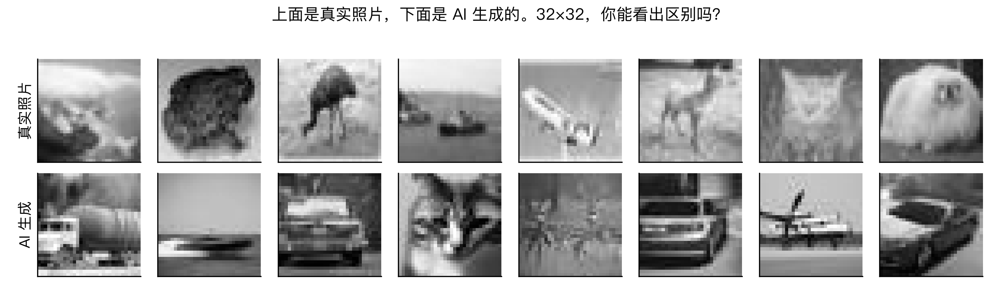
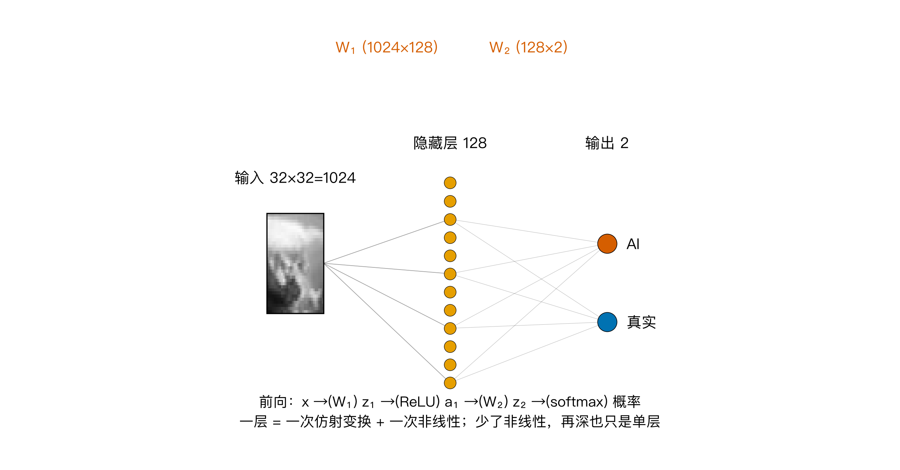
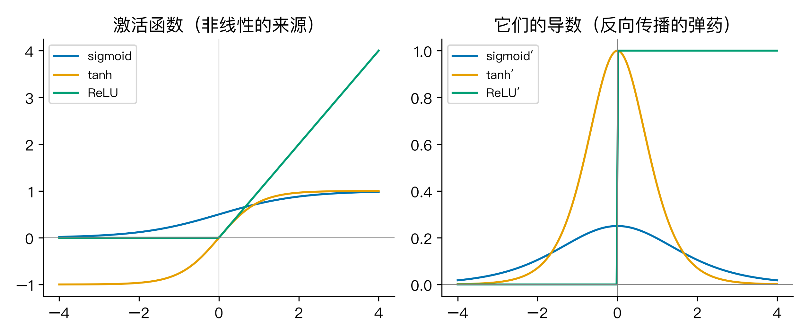
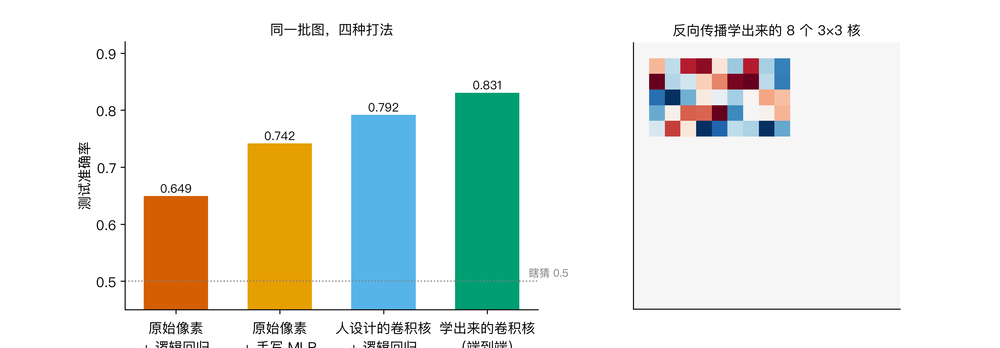
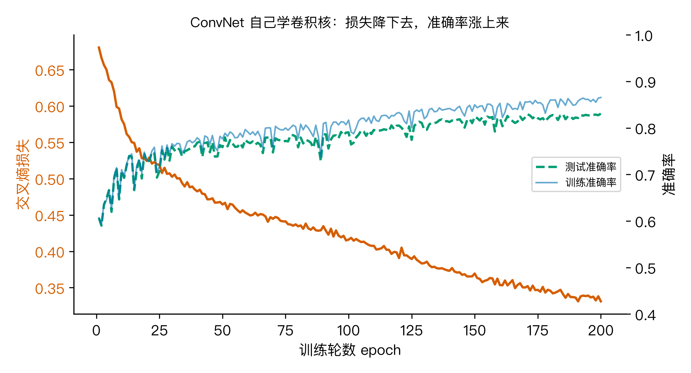
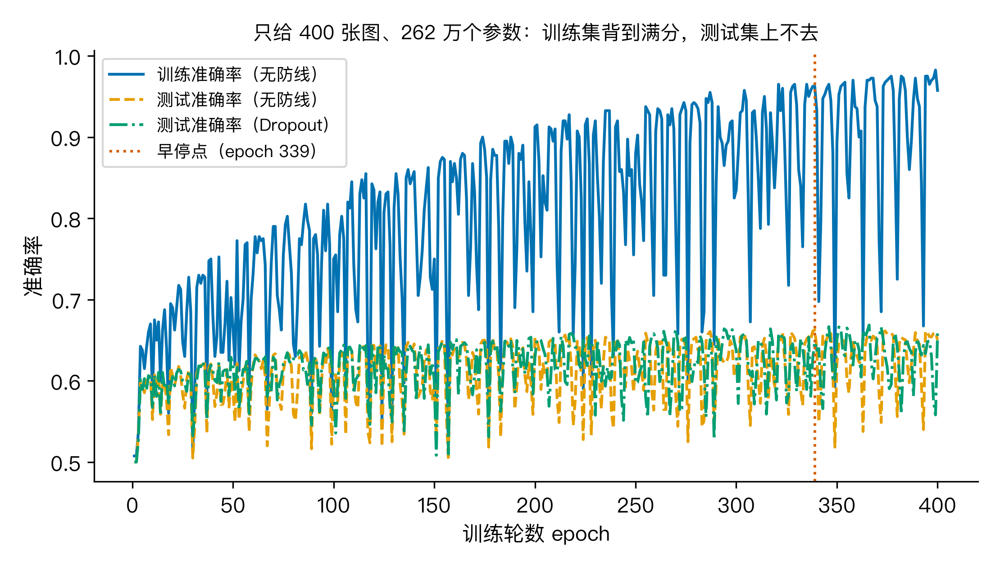

# 9月1日 AI 图要标了，机器怎么一眼认出哪张是 AI 画的？

9月1日开始，国内生成式 AI 内容要显式标注了。朋友圈里有人调侃：以前靠肉眼找 AI 图的破绽，现在得靠机器先替我们筛一遍。问题来了，机器自己没有眼睛，它凭什么能分辨一张图是相机拍的还是模型生成的？

我拿一个公开数据集做了实验，结论有点意思：机器认 AI 图，靠的不是理解，而是从几万对样本里学出了一套像素层面的判别规律。下面把这件事拆成四个小问题讲清楚。

我要回答的大问题是：神经网络为什么比一层模型更会认图？

## Q1：一层模型卡在哪？

先说清楚一层是什么。逻辑回归这类模型，本质就一个动作：把输入加权求和再加偏置，写成矩阵是 z = Wx + b。它能画的决策边界是一条直线，在多维里是一个超平面。

我把 CIFAKE 数据集里的图直接摊平喂给它。CIFAKE 是个 2024 年发布的公开数据集（Bird 与 Lotfi，IEEE Access），里面一半是相机实拍照片（来自 CIFAR-10），一半是用 Stable Diffusion v1.4 生成的图，真假成对，一共 6 万张 32×32 的彩色小图。我做实验时取了每类 6000 张训练、1500 张测试，转成灰度，每张图是 1024 个像素值。任务就是看这 1024 个数，判断它来自真实相机还是 AI。

把原始像素直接丢给逻辑回归，测试准确率只有 0.6493。这个数字说明白一件事：真实照片和 AI 生成图，在像素空间里根本不是一条直线能切开的。不管喂多少数据，逻辑回归能画的边界永远是直的，而真假图的差异藏在边缘、纹理、噪声这些组合结构里，直边界切不进去。一层模型到这里基本就到头了。

下面这张是数据集里各抽的 8 张真实照和 8 张 AI 生成图，肉眼看都挺像，机器要找的正是像素尺度上那些说不清的差别。



## Q2：多加一层，凭什么就变强？

变强的钥匙叫激活函数。在每一层加权求和之后，套一个非线性函数再往下传，网络才有资格谈层数。

我不用任何框架，纯 numpy 手写了一个两层网络（fig2）：1024 个像素进一个 128 个神经元的隐藏层，再过 ReLU，最后到 2 个输出节点，对应真和假。



没有非线性会怎样？你把 z₂ = W₂z₁ + b₂ 里的 z₁ 用第一式代进去，得到 z₂ = W₂(W₁x + b₁) + b₂ = (W₂W₁)x + (W₂b₁ + b₂)。乘出来的还是一个大矩阵，加出来的还是一个偏置。叠一百层线性变换，代数上等价于一层。这就是第一件值得记的事：没有非线性，再多层也只是一层。

激活函数选 ReLU 是有原因的（fig3 画了几个常用的和它们的导数）。sigmoid 导数最大只有 0.25，反向传播每层至少缩到四分之一，十层之后梯度几乎归零，这叫梯度消失。ReLU 正数原样通过、负数归零，导数在正区间恒为 1，梯度传多少层都不衰减，这是深层网络能真正训起来的关键一步。



这个两层网络训练 200 轮，测试准确率达到 0.7417，比逻辑回归的 0.6493 高出约 9 个百分点（3000 张测试图里多认对约 277 张）。作为对照，同样任务 sklearn 自带的 MLP 是 0.7213，差距在优化器细节，不在结构。

诚实地说，0.7417 还不算高。原因很清楚：原始像素里那些更有判别力的结构，边缘、角点、纹理，还没被提出来。一层非线性把分数拉上来了，但原料还是那 1024 个裸像素。

## Q3：机器是怎么自己学会看纹理的？

这一步才是神经网络真正厉害的地方：与其让我手工设计特征，不如让网络从数据里自己学。

我做了两条路的对照（fig4 是四种打法的准确率条形，右图是网络自己学出的 8 个卷积核）。



第一条路，人手工设计 4 个 3×3 核（Sobel 提边缘、Laplace 提角点、几个 blob 提局部纹理），用它们把图卷一遍提出特征，再交给逻辑回归，测试准确率 0.7917。人把自己对图像该看什么的理解硬编码了进去。

第二条路，让网络自己学。我搭了一个小卷积网络：8 个 3×3 卷积核在图上滑动扫描，同一个核在每个位置重复使用，这叫权值共享；扫描出来的特征再接一层分类。卷积核一开始是随机数，不用我告诉它边缘长什么样，反向传播会自己把它教出来。这条路的测试准确率是 0.8307。

机器自己学的核，比人设计的核还高 4 个百分点。这件事值得停下来想一下：我作为人，并不知道判别真假图的最优核长什么样，但让数据自己说话，网络找到的 8 个核比我拍脑袋设计的更管用。

权值共享的威力可以算出来：这 8 个 3×3 核一共只有 72 个参数；如果不用共享、用全连接覆盖同样的扫描范围，需要 7372800 个参数，差了 102400 倍。共享还自带平移不变性：一个学过横边缘的核，横在左上角和右下角都能认。

它是怎么学会的？靠反向传播，本质就是链式法则（引 H1 的导数，不重推）。网络先随机猜，第一轮损失是 0.6804，接近二分类随机猜的理论值；然后前向算概率、反向把损失对卷积核的梯度沿每层矩阵乘一路乘回去，每个核分到自己那份该怎么调，再用梯度下降挪一小步。fig5 画了这个过程：损失从 0.6804 一路降到 0.3312，准确率同步爬到 0.8307，证明机器确实在学自己的核，不是黑箱。



softmax 配交叉熵时有个漂亮的性质：损失对输出层的梯度恰好是预测概率减真实标签，预测越离谱，被纠正得越狠。这部分代码二十来行，建议亲自跑一遍。

## Q4：网络越大越厉害吗？

把网络加宽、参数堆到 26 万，只给它 400 张训练图，事情会变成这样（fig6）：训练准确率一路冲到 0.9575，一张不差全背下来；测试准确率却只有 0.6503。



这就是过拟合：网络把训练集背下来了，没学到能推广的规律。26 万参数对 400 个样本，背题是最省力的解。

治它的办法有三道防线。第一道 L2 正则，在损失里加一项与权重大小成正比的惩罚，权重想长大就要付代价。第二道 Dropout，训练时随机关掉一半隐藏神经元，逼网络不依赖任何单个神经元。第三道早停，盯着验证集到最高点就停。

但这组实验里有个扎心的结果：早停在 339 轮停下，测试 0.6627；加 L2 是 0.6603；加 Dropout 是 0.6583。三道防线都只把测试拉到 66% 附近，救不动。

原因不复杂：400 张图就是 400 张图。数据不够时，正则化救不了，这是很多人学调参时最先碰的壁。防线治的是数据够而网络太大的场景；数据本身就不够时，任何架构都变不出没见过的样本。模型的上限，经常是数据定的。

## 三个值得记住的点

1. 没有非线性激活，再多层也只是一层。叠一百层线性变换，代数上等价于一层。神经网络的全部威力，都建立在这个看似不起眼的前提上。
2. 反向传播不是黑箱，就是链式法则。让人手设计特征不如让网络从数据里自己学，卷积核自己学出来的，反而比人设计的更管用（本实验高 4 个百分点）。
3. 网络越大越易过拟合，L2 正则、Dropout、早停是三道防线，但它们治的是数据够而网络太大；数据本身不够时，防线也拉不动，模型上限经常是数据定的。

## 怎么验证

```
🏃 跑一遍：cd AI观星记_M2_神经网络 && python3 code/model_nn.py
数据集：CIFAKE（真实照片 vs Stable Diffusion 生成图，Kaggle birdy654）
        取子集每类 6000 训练 / 1500 测试（共 12000 训练 / 3000 测试），转灰度 32×32
        原始数据需从 Kaggle 下载 cifake.zip 解压到 data/（约 105MB），脚本自动转子集
代码：code/model_nn.py，含 numpy 手写两层 MLP（前向+反向逐行对应链式法则）、
      人设计 4 核 + 逻辑回归基线、可训练卷积网络（端到端学卷积核）、过拟合与三道防线对照
输出：figures/ 下 6 张图（fig1_samples / fig2_arch / fig3_activations /
      fig4_compare / fig5_overfit / fig6_convnet_curve）；stats.json 汇总全部数字
数据集来源（Kaggle，可下载原始核对）：
https://www.kaggle.com/datasets/birdy654/cifake-real-and-ai-generated-synthetic-images
论文（Bird & Lotfi, IEEE Access 2024, DOI 10.1109/ACCESS.2024.3356122）
依赖：numpy、scikit-learn、matplotlib
```

选这个数据集的原因：9月1日生成式 AI 内容标注新规落地，怎么认出 AI 图是当下真实的公共关切，用真实公开数据回答它，比教科书里的手写数字更有代入感，也更能让人觉得这件事跟自己有关。

数字三处一致：脚本打印、stats.json、图内标注，都是同一组数。

## 最后想问你

你手机里现在就有不少 AI 生成的图。挑一张你觉得一眼假的和一张以假乱真的，想想机器认它们靠的是哪类线索，是颜色、边缘，还是某种你叫不出名字的纹理噪点？

想清楚这个，你就明白为什么标注新规里那行小字，背后站着的其实是几万对样本喂出来的一个神经网络。
