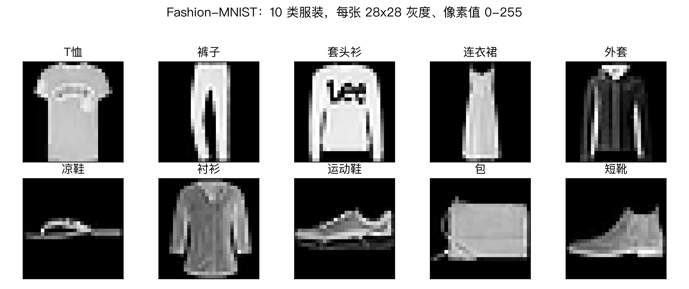
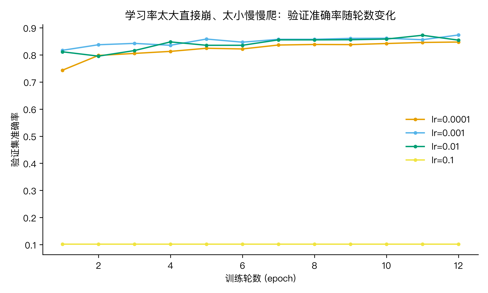
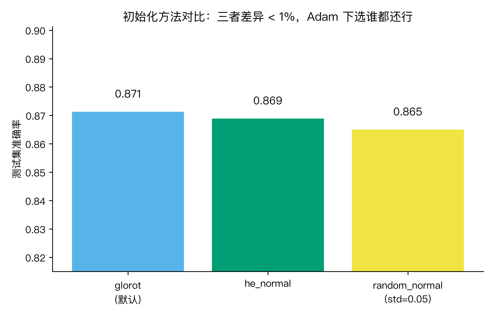
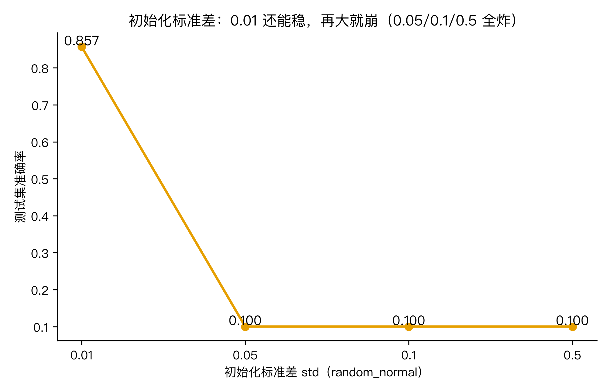
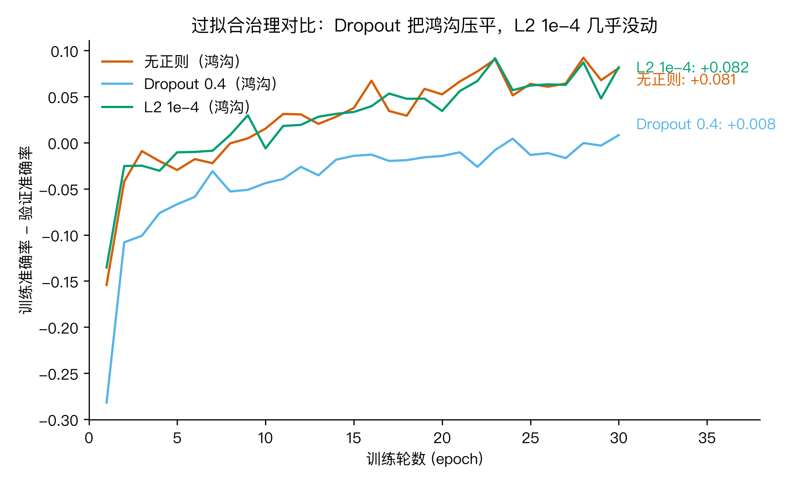

# AI 怎么分清 T 恤和外套？我拿 Keras 把 7 个开关挨个拧了一遍

最近刷到一条热搜，有人拿自己拍的衣柜照片问「AI 怎么一眼认出哪件是 T 恤、哪件是外套」。评论区吵成一锅粥，有人说靠形状，有人说靠材质，有人搬出卷积神经网络。其实这事没那么玄。我拿一个公开的服装数据集，把训练流程拆成 7 个开关，一个一个拧过去，看哪个真管用、哪个是摆设。整个过程用的是 Keras 3.15.1，本机 Apple M3 / 16GB，跑在 jax 后端上（CPU），Python 3.13.12。下面这些数字，全是今天跑出来的，不是抄来的。

## Keras 是什么，流程怎么走

Keras 这个框架这几年换过一次大版本，从 2 跳到 3。最明显的变化是后端可换：同一份模型代码，可以选 jax、TensorFlow、PyTorch 跑。代价是装的时候得挑一个后端先装上（Keras 3 在 Python 3.13 上 import 时会拽 tensorflow 的东西，所以我两个都装了）。这点对新手不算友好，但换来的是写法统一。

要拿 Keras 训自己的数据集，流程就 4 步：

1. 加载数据 + 预处理
2. 搭模型
3. 编译（选优化器、损失函数）
4. fit + evaluate

和 MNIST 演示几乎一模一样。所以这次我直接拿 Fashion-MNIST 开刀：Zalando 出的公开服装数据集，7 万张 28×28 小图，分 T 恤、裤子、套头衫、连衣裙、外套、凉鞋、衬衫、运动鞋、包、短靴 10 类。和 MNIST 同源但更像「日常」。


图 1：Fashion-MNIST 测试集抽 10 类各一张的样子。灰度、像素 0-255。

我把这 7 个开关归到 4 个问题里：Q1 答「数据和怎么进来、网络怎么搭」，Q2 答「学习率」，Q3 答「初始化」，Q4 答「过拟合怎么压」。最后回收到大问题。

## Q1：数据怎么喂进 Keras？网络怎么搭？

加载：

```python
(x_train, y_train), (x_test, y_test) = fashion_mnist.load_data()
```

第一次跑会从 ~30MB 的源下载到 `~/.keras/datasets/`，我本机用了 0.56 秒（缓存命中后基本秒开）。

预处理：

```python
x_train = x_train.astype("float32") / 255.0   # 归一化到 [0,1]
y_train = keras.utils.to_categorical(y_train, 10)  # one-hot
```

归一化是为了让梯度更新时各特征量级差不多；one-hot 是给 softmax + categorical_crossentropy 配对的（如果用 sparse_categorical_crossentropy 就不用 one-hot，标签传整数就行）。

搭网络：

```python
model = keras.Sequential()
model.add(layers.Input((784,)))        # 28*28=784
model.add(layers.Reshape((28, 28, 1)))  # 留个 4 维形状，下面要展平
model.add(layers.Flatten())
model.add(layers.Dense(256, activation="relu"))
model.add(layers.Dense(128, activation="relu"))
model.add(layers.Dense(10, activation="softmax"))
model.compile(optimizer="adam",
              loss="categorical_crossentropy",
              metrics=["accuracy"])
```

搭网络就这几行。我特意加了一层 `Reshape((28,28,1))`，不是为了训练效果（后面 Flatten 又压回去了），是为了能在 build 之后把每一层输出形状打出来，直观看「数据在网络里是怎么被压扁、过激活、再压扁」的。

形状报告（用 build 之后的 `layer.output.shape`，Keras 3 没 build 之前取不到）：

- reshape: (None, 28, 28, 1)
- flatten: (None, 784)
- dense: (None, 256)
- dense_1: (None, 128)
- dense_2: (None, 10)

(None 是 batch 维，跑起来就是 batch_size。)

基线：拿 60000 训练集的前 20000 条做子集（扫描实验提速用的，标注为示例量级），跑 12 个 epoch，batch 128，`validation_split=0.1`。🏃

test_acc = 0.8642。final_train_acc = 0.9139，final_val_acc = 0.872。

这就是基线锚。后面的对比都改一个开关，其他保持不动，跑完跟这个数比。

Keras 训自己的数据集 = 4 步，跟 MNIST 演示几乎没区别。预处理两步（归一化 + one-hot）是硬功夫，搭网络就是堆 Dense。基线我先定在 0.8642。

## Q2：学习率怎么设？

学习率是最容易翻车的旋钮。Adam 优化器默认 lr=1e-3，但很多人其实没改过。我扫了 4 档：`[1e-4, 1e-3, 1e-2, 1e-1]`，其他保持基线配置。🏃


图 2：四档学习率随训练轮的验证准确率。lr=0.1 那条贴在 0.10 一动不动。

结果（test_acc）：

- lr=1e-4：0.8486（慢慢爬，12 轮没爬够，val_acc 0.8475）
- lr=1e-3：0.861（基线档，val_acc 0.8735，4 档最高）
- lr=1e-2：0.8553（val_acc 0.8545，训练集能爬到 0.8966 但泛化掉队）
- lr=1e-1：0.10（彻底崩，loss 飙到 14.5，验证准确率始终是随机水平）

lr=0.1 那条不是「不学」，是直接发散了：loss 第一轮就到 14.5，后面停在 ln(10)≈2.3 之外更远的位置，softmax 输出的概率分布全是噪声梯度，模型权重在每一步更新里被这个噪声梯度拽偏，回不来了。

这组对照给两条经验：

1. Adam 默认 lr=1e-3 在这个数据集上确实是最稳的档，不用瞎调。
2. lr=0.1 这种「明显太大」的数，是真的会崩的，不是「慢一点」那么简单。新手最容易踩的是把 lr 设成 0.1 或 0.01 还以为是 0.001 的笔误。

学习率 1e-3 是安全档；lr=1e-4 慢但不崩；lr=1e-2 训练能学但泛化差一点；lr=1e-1 直接崩到 0.10。

## Q3：初始化怎么选？

初始化是个老话题。Glorot/Xavier 和 He 初始化都是为了解决「权重太大导致激活爆炸、权重太小导致梯度消失」的问题。Adam + 默认 lr=1e-3 的组合其实对这个不太敏感了。我先比了三个方法：🏃


图 3：三种初始化方法的测试准确率。

- glorot_uniform（默认）：0.871
- he_normal：0.869
- random_normal（默认 std=0.05）：0.865

差距不到 1 个百分点。所以如果只用 Adam + lr=1e-3 + ReLU 训这种小 MLP，选谁都不会错太多。这是和很多教科书写的不太一样的现实：教科书说初始化很关键，那是在 SGD + 深层 + 特定激活函数下的极端情况。Adam 自适应学习率把这事抹平了。

但是我又做了一组对照：把 random_normal 的标准差锁死成 `[0.01, 0.05, 0.1, 0.5]` 跑一遍。🏃


图 4：固定随机正态初始化不同标准差下的测试准确率。0.01 还能学，0.05/0.1/0.5 三档全炸。

- std=0.01：0.857（收敛）
- std=0.05：0.10（崩）
- std=0.1：0.10（崩）
- std=0.5：0.10（崩）

只看这组会以为 std=0.01 是「安全的固定值」。但这里有个有意思的事：上一组 random_normal（默认 std=0.05）它居然是收敛的，test_acc=0.865。也就是说 0.05 这个量级正好卡在悬崖边，换一组随机种子它就可能崩。std=0.01 离边界远，所以稳。std=0.1、0.5 离边界也「远」，但是往「炸」那一边的远。

这正好印证为啥要用 Glorot/He 这类按 fan_in 自动缩放的初始化器：它们把每层的初始权重都压在安全区里，不用我自己挑 std。Glorot/He 的本质不是「哪个更好」，而是「自动适配层宽，避免边界」。第一层有 784 个输入，Glorot 给出 std≈0.036，He 给出 std≈0.050；这两套缩放公式是为「前向传播方差稳定 + 反向传播梯度方差稳定」各自推导出来的，所以它们默认就能跑。

Adam 下三种经典初始化差距 <1%，但固定 std 的 random_normal 一旦 ≥0.05 直接崩。所以默认就用 Glorot/He，别瞎改成固定 std。

## Q4：过拟合怎么压？

前 3 个问都在 20000 样本 12 轮下比，调一调都能收敛到 0.86 上下。但实际项目里数据往往不多，模型一不留神就过拟合了：训练集准确率飙到 95%，验证集停在 88%。

我拿 5000 样本、30 轮专门造一个鸿沟出来，比三种情况：🏃

- 无正则：什么都不加
- Dropout 0.4：每个 Dense 后插 `Dropout(0.4)`，训练时随机丢 40% 节点
- L2 1e-4：`kernel_regularizer=regularizers.l2(1e-4)`


图 5：训练准确率减验证准确率的差（鸿沟）随训练轮变化。Dropout 那条一直在 0 附近晃，无正则和 L2 那两条一路爬到 +0.08。

最终（第 30 轮）的训练-验证鸿沟：

- 无正则：+0.081（train 0.961，val 0.880，test 0.841）
- Dropout 0.4：+0.008（train 0.892，val 0.884，test 0.827）
- L2 1e-4：+0.082（train 0.946，val 0.864，test 0.822）

Dropout 0.4 把鸿沟从 +0.081 压到 +0.008，效果非常明显。但 L2 1e-4 这次几乎没动鸿沟：0.082 和 0.082 差 0.001。L2 系数 1e-4 在 5000 样本这个量级上太弱了；想看到效果得调到 1e-2 或更大，但那时又会欠拟合。

值得一提：测试集上反而是无正则最高（0.841），Dropout 和 L2 都稍低（0.827 / 0.822）。这是小样本的典型特征，鸿沟小不代表测试好，过拟合一点反而让模型把噪声也学进去一点。在这个 5000 条的小问题上，「过拟合」和「测试准」不完全挂钩。但鸿沟本身仍然是「模型健康度」的指标：鸿沟大说明模型容量对当前数据太多，下次换 50000 条训练时这些不带正则的就会落后。

Dropout 0.4 鸿沟 +0.081 → +0.008，立竿见影；L2 1e-4 在这个小样本上几乎没用，得加到 1e-3 到 1e-2 量级才有戏。

## 回收大问题

回到开头那个大问题：Keras 训自己的数据集，7 个开关怎么拧？

我把 4 个问的结论压成一个速查表：

| 开关 | 怎么拧 | 效果（本数据） |
|---|---|---|
| 数据加载 | `load_data()` + `/255` 归一化 + `to_categorical` | 基线 |
| 搭网络 | Sequential + Dense(256) + Dense(128) + softmax | test 0.8642 |
| 学习率 | Adam + 1e-3 | test 0.861 |
| 初始化方法 | 默认（glorot_uniform） | test 0.871 |
| 初始化 std | 用现成的 Glorot/He，别自己设 | 0.01 稳 / ≥0.05 崩 |
| Dropout | 0.3-0.4 起步 | 鸿沟 +0.008 |
| L2 | 1e-4 多半不够，1e-3 到 1e-2 看效果 | 鸿沟看系数 |

7 个开关不是平等的。前 4 个（数据预处理 + 搭网络 + 学习率 + 初始化方法）决定下限；后 3 个（初始化 std + Dropout + L2）是修正。新手常犯的错是把精力全花在调后 3 个，前 4 个没跑顺就去碰 Dropout，结果越压越差。

## 三个干货

1. 框架层面：Keras 3 的「多后端 + 统一写法」是真的做到了，同一份 Sequential 代码，jax / TensorFlow / PyTorch 后端都能跑。代价是装的时候要选一个后端先装上，别被 import 报错卡住。流程就 4 步（加载+预处理、搭模型、编译、fit+evaluate），训自己的数据集跟 MNIST 演示几乎一样顺。

2. 调参层面：7 个旋钮里最敏感的是学习率，0.001 vs 0.1 差出整个量级（一个 0.86，一个 0.10）。Adam + ReLU 下三种经典初始化方法差距 <1%，但固定 std 的 random_normal 一旦 ≥0.05 直接发散，这正是 Glorot/He 这类 fan-in 缩放初始化器存在的意义，自动避开悬崖边。

3. 工程/避坑：第一次跑别上来就调参，先把基线跑出来（这数据集 0.8642），就有了一个比较的锚。同时配 `validation_split=0.1` 把鸿沟画出来，比看单一 train_acc 更有信息量；鸿沟大就上 Dropout（这次从 +0.081 压到 +0.008），鸿沟小就别动。鸿沟本身比 test_acc 更能预警「数据不够 + 模型太大」的组合。

---

你跑 Keras 时第一个调的旋钮是哪个？踩过最坑的是 lr 直接崩到 0.10，还是固定 std 把模型炸到 NaN？评论区聊聊你的经历，我下篇拿 CIFAR-10 把这套 checklist 再跑一遍，到时候看会不会翻车。🏃

（数据：Fashion-MNIST，Zalando 公开，60000+10000 张 28×28 灰度图；实验脚本与 stats.json 在仓库 ai-guanxingji/M5/；本机 Apple M3 / 16GB，Python 3.13.12，Keras 3.15.1 + jax 后端 CPU；扫参实验用 20000 样本子集，过拟合演示用 5000 样本，均标注为示例量级。）