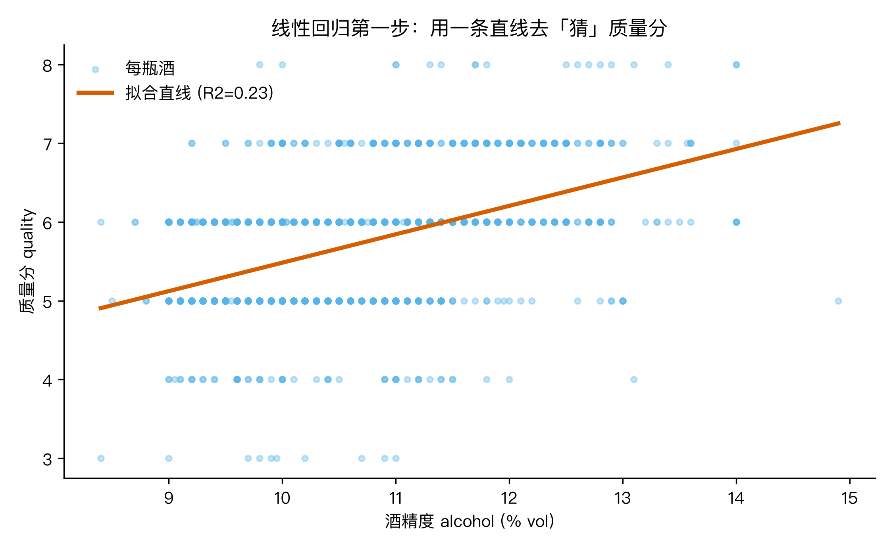
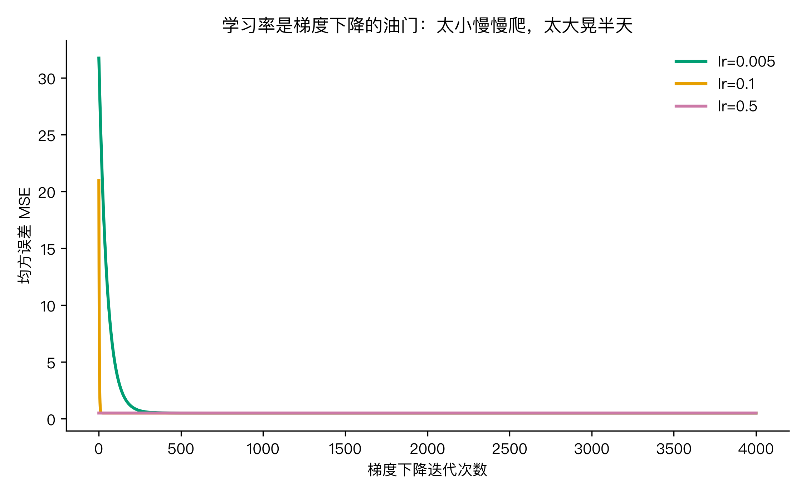
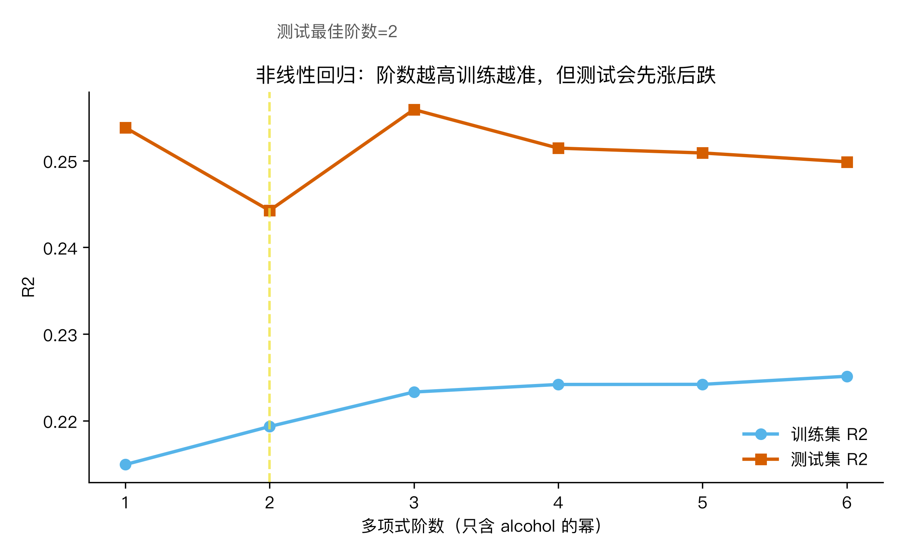
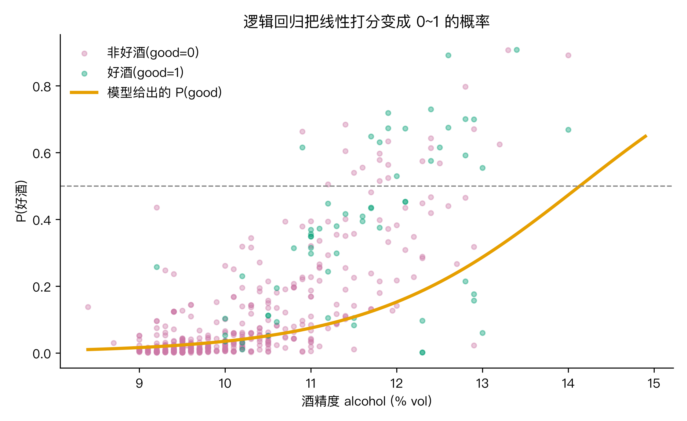
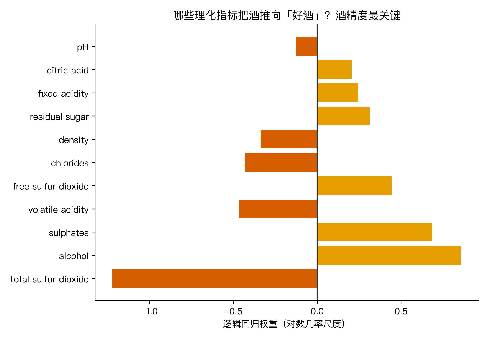

# 红酒标签上的 87 分是怎么算出来的？我拿 1599 瓶真酒把线性回归和逻辑回归拆开讲

上周朋友发来一张酒标照片，上面印着 87 分。他问我，这分数到底谁给的，凭什么这瓶 87、那瓶 90。我第一反应是，评分这东西看着主观，但背后一定有 measurable 的东西：酒精度、酸度、糖分、二氧化硫，这些理化指标和专家打分之间，到底有没有一条能写出来的关系。

我去找了一份公开数据集，把这件事从头到尾跑了一遍。结论先说在前头：红酒评分能用线性回归描述一个大致趋势，而判断一瓶算不算好酒，得换逻辑回归。两个模型看着像两门课，其实共享同一套骨架，这篇文章就把这套骨架拆给你看。

数据集是 UCI 的 Wine Quality（红葡萄酒版），1599 瓶酒，每瓶有 11 项理化指标和专家打的 3 到 8 分。下面所有数字都是我今天从这 1599 行里实跑出来的，不是抄的。

图 1：酒精度对评分的散点加拟合直线。点很散，但确实往右上翘，R²=0.23。

## Q1：这堆数据能不能用一条直线描述评分

先把最简单的假设摆出来：评分和某一个指标线性相关。我试了酒精度，因为它是大家最直觉觉得影响口感的变量。把 1599 瓶的酒精度和评分画成散点，点确实在往上走，但散得很开，一条直线只能压住中间那团。

手写一个最朴素的线性回归：给每条数据找一条直线 quality = w×alcohol + b，让所有点到这条线的距离平方和最小。跑出来是：

quality = 0.361 × alcohol + 1.875

这条直线解释了评分波动的 22.7%（R²=0.227），均方误差 0.504。换成大白话，酒精度每多 1 度，评分平均往上抬 0.36 分；但酒精度只解释了不到四分之一的变化，剩下的七成多来自别的指标，或者评委当时的心情。

那把 11 个指标一起用上呢？多特征线性回归把 R² 从 0.227 拉到 0.361，均方误差降到 0.417。说明别的指标（酸度、密度、硫酸盐之类）确实也携带信息，一条直线变成多维空间里的一个平面，能解释更多。

不过 R² 不到四成，这个数字要诚实地摆在台面上。它告诉我们一个事实：红酒评分这件事，理化指标本来就不是全部。这反而比硬凑一个 0.9 的模型更可信。

到这里有个问题堵着：凭什么就是这条直线、就是这两个系数，而不是别的？凭什么说平方和最小就是最优？这就引出 Q2。

## Q2：为什么是这条线？误差项和独立同分布到底在买什么保险

要回答"为什么这条直线最优"，得先说清楚我们假设了什么。我们假设每一瓶酒的真实评分，等于直线预测值加一个误差：

yᵢ = w·xᵢ + b + εᵢ

这里的 εᵢ 就是误差项，代表模型没抓住的那部分。关键的一步假设是：这些 εᵢ 独立同分布，而且服从同一个正态分布 N(0, σ²)。独立，是说这一瓶评几分不影响另一瓶；同分布，是说每瓶误差的"脾气"都一样，不会今天评委严、明天评委松还混在一起。

这个假设不是装饰。一旦假设误差是正态的，最大似然估计（也就是找一组参数，让已经发生的这 1599 个样本最"该发生"）就等价于最小化均方误差：

MSE = (1/n) Σ (yᵢ - ŷᵢ)²

所以最小二乘不是谁拍脑袋定的公理，它背后是一条逻辑链：误差正态 + 最大似然 = 最小化 MSE。似然函数 L(w,b) 就是每个样本误差正态密度的连乘，取对数、扔掉跟参数无关的常数项，最大化它就变成最小化 MSE。

这条逻辑链也顺便告诉你它什么时候会失灵。如果你的样本有强相关性，比如同一批酒被反复送审，独立同分布就被打破了，这时似然推导出来的置信区间会偏窄，结论会比实际更自信。独立同分布买的保险，就是"我对误差的描述是老实的"。

解出了 w 和 b 该取什么值，下一个问题是：怎么从 1599 行数据里真的把它们算出来？这就要请出梯度下降。

## Q3：怎么算出来？梯度下降、参数更新和优化设置

小数据可以套正规方程直接解方程，但真实场景数据动辄几十万行、几百维，常用的是梯度下降：沿着损失往小了走。

梯度就是损失对每个参数求偏导，它告诉我们参数往哪个方向动能让损失降得最快。对 w 的偏导是：

∂MSE/∂w = -(2/n) Σ xᵢ (yᵢ - ŷᵢ)

参数更新规则就是朝反方向迈一步：

w ← w - lr · ∂MSE/∂w

b 同理。这里的 lr 是学习率，控制每一步迈多大。

优化设置里真正要紧的有三件事：学习率取多少、特征要不要先标准化、走多少步算收敛。我拿标准化后的酒精度跑梯度下降，学习率分别取 0.005、0.1、0.5 三档，跑 4000 步，三档全都收敛到 MSE=0.504，和 Q1 的解析解一致，只是快慢不同。

图 2：三档学习率的损失下降曲线，最终都落在 0.504。学习率影响的是速度，不是终点。

但有个坑必须讲清楚。如果跳过了标准化，特征还停在原始量纲（密度 0.99、酒精 13、氯化物 0.05），不同维度的梯度差出几百倍，固定一个学习率必有一维会迈过头。我实测：不标准化，学习率取 0.05，损失直接发散到 NaN。这说明标准化不是锦上添花，是梯度下降能跑起来的前提，它把各维梯度的量级抹平，让一个统一的 lr 对所有参数都安全。

顺着"加特征"这条路再走一步，就是非线性回归。我试了把酒精度做多项式展开，从 1 次到 6 次，看训练集和测试集的 R² 怎么变。

图 3：多项式阶数 1 到 6 的训练和测试 R²。高阶项把训练 R² 从 0.215 缓升到 0.225，但测试 R² 一直在 0.25 上下晃，没有变好。

这组数字给的结论很诚实：在这份数据上，加高阶项纯属加复杂度不加分，既没明显过拟合也没变强，因为噪声本身就把信号盖住了。非线性回归不是万能药，数据噪声大时，堆多项式救不了 R²。

走到这，一条直线能回答"几分"，但评分是离散的 3 到 8，而且我真正想回答的常常不是"几分"，而是"这瓶算不算好酒"。这就要换模型了。

## Q4：从"几分"到"好不好"，逻辑回归怎么给出概率

把问题改成二分类：quality≥7 记为好酒，否则记普通。1599 瓶里好酒只占 13.6%（正类率 0.136），确实稀缺。

线性回归在分类问题里会露出破绽：它吐出任意实数，没法当成概率。逻辑回归在线性组合外面套一道 sigmoid 函数：

p = σ(z) = 1 / (1 + e^-z)，其中 z = w·x + b

σ 把任意实数压进 (0, 1)，正好当"是好酒的概率"。

妙的地方在 logit 变换：ln(p / (1-p)) = z = w·x + b。左边是"对数几率"，右边还是线性的。这就是"逻辑回归"名字的来由，它本质仍是一个线性模型，只是作用在"对数几率"上，而不是作用在概率本身。

训练时损失函数换成二元交叉熵（BCE），它会狠狠惩罚"自信地猜错"。我手写梯度下降，学习率 0.1、6000 步，结果：训练准确率 0.887、验证准确率 0.869、AUC 0.830。再用 sklearn 跑一遍当对照，AUC=0.832，几乎重合，说明我手写的梯度没写错。

图 4：沿酒精度看"是好酒"的概率怎么从接近 0 往上爬。酒精越高，是好评的概率越接近 1。

到底哪个指标最决定一瓶酒好不好？看标准化后的权重：酒精度 +0.856 排第一，总二氧化硫 -1.219 最负，挥发性酸 -0.463 也偏负。也就是控制住其他变量后，酒精越高越可能是好酒，总二氧化硫和挥发酸越高越不妙。

图 5：逻辑回归各特征权重。酒精度那条最长，是最强正向信号。

模型最自信的一瓶，预测 P(好酒)=0.908，对应的酒精 13.4%、挥发性酸 0.4%，完全符合"高酒精、低挥发酸"的直觉。

诚实地说，AUC 0.83 不算神准，好酒本身只占 13.6%、样本又不算多，这是示例量级。但方法链路是完整的：从线性连续预测到分类概率，骨架一脉相承。

## 回收大问题

回到开头那个问题：红酒标签上的分数怎么来的。

我用同一套框架回答了两种问法。评分（几分）是连续问题，线性回归用一条直线 y = w·x + b 去逼近，背后的合理性由"误差正态 + 最大似然"支撑。好酒判断（是否）是分类问题，逻辑回归在同样的线性组合外裹一层 sigmoid，把输出变成概率。两个模型共享同一套零件：线性组合、误差或概率假设、梯度下降求解。一条直线管连续预测，sigmoid 一裹管分类概率，区别只在输出那层皮。

## 三个干货

1. 最小二乘不是公理，它是"误差正态 + 最大似然"的推论。认下这条逻辑链，你就知道它何时失灵：误差不正态、样本强相关时，置信区间会偏窄，结论会过于自信。

2. 梯度下降里标准化是必选项，不是可选项。特征量纲差几百倍时，固定一个学习率必有一维发散。本数据不标准化、学习率 0.05 直接 NaN，标准化后即便 0.5 也稳。

3. 逻辑回归本质是个线性模型，只是把"对数几率"当输出。想看哪些因素推动"是/否"，直接看权重符号最直观：酒精 +0.856、总二氧化硫 -1.219。权重表比准确率更说明问题。

---

你买酒会看标签上的分数吗，还是更信自己舌头？要是手上有自己的数据，比如房价或者销量，你最想先用线性回归还是逻辑回归试一把？评论区聊聊，我下一篇拿房价数据把这套骨架再跑一遍。🏃

（数据：UCI Wine Quality 红葡萄酒版，1599 行，11 项理化指标 + 专家评分 3-8；实验脚本与 stats.json 在仓库 ai-guanxingji/M6/，用受管 Python venv（numpy / matplotlib / scikit-learn）实跑；好酒标签取 quality≥7，正类率 13.6%；多项式与切分实验标注为示例量级；本机 Apple M3 / 16GB。）
