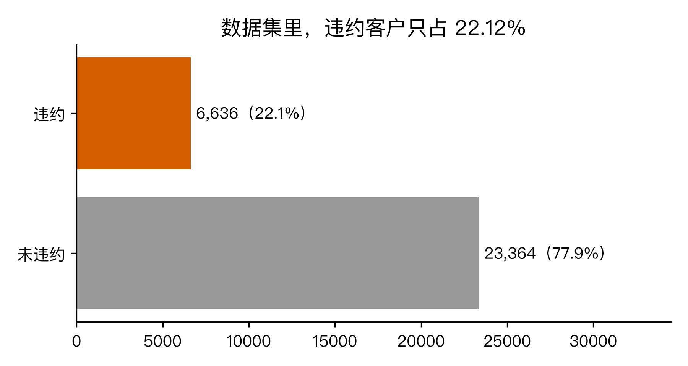
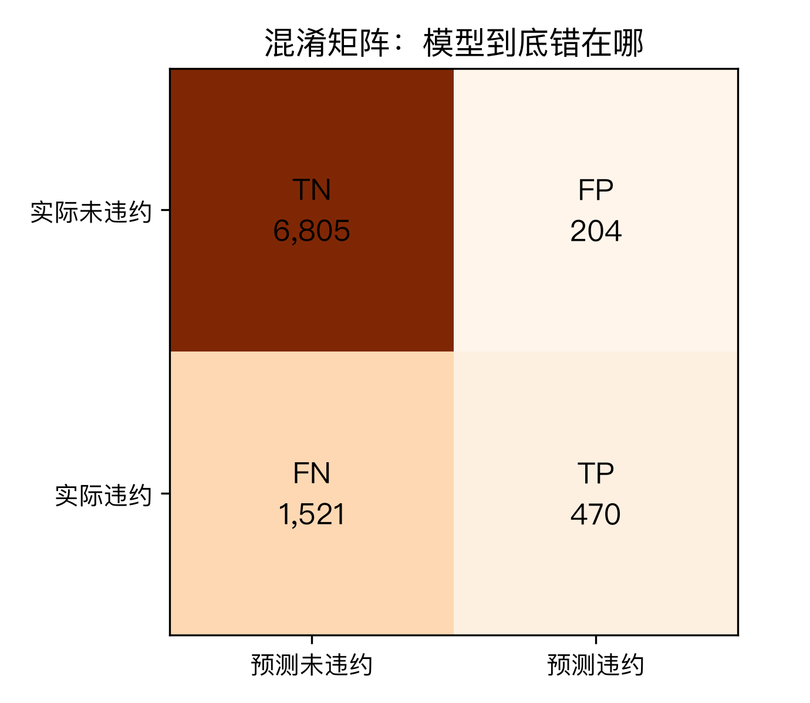
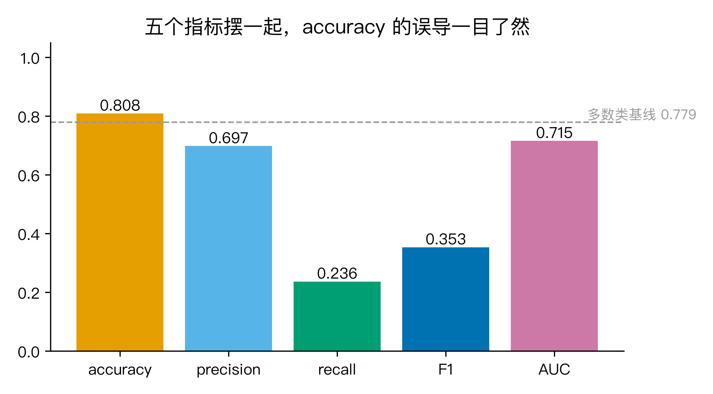
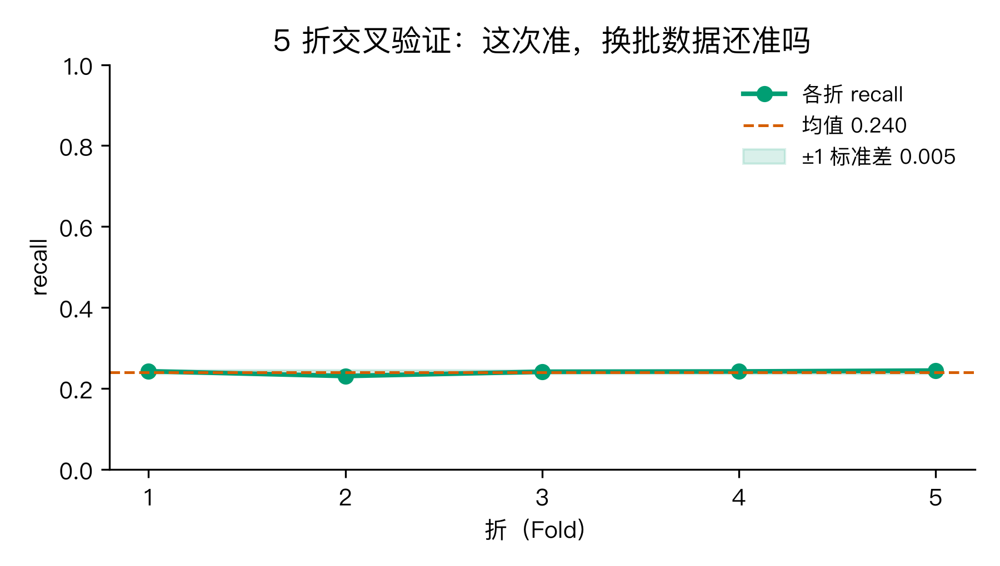
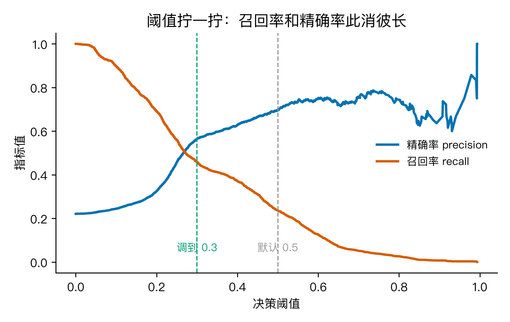
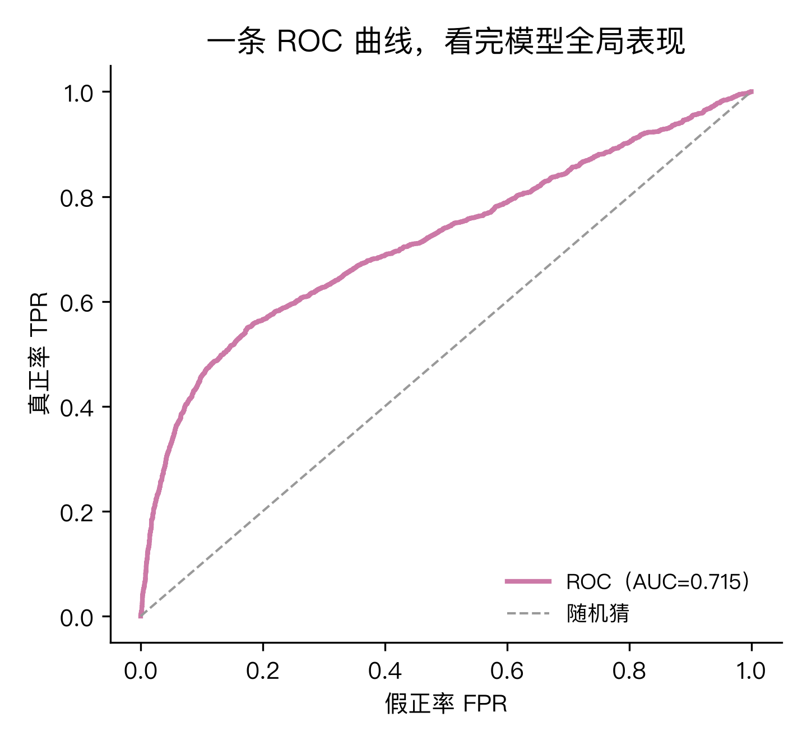

# 风控模型说自己 80% 准，却漏掉了 76% 该拦的人：一次把模型评估讲透

最近刷手机，谁没收到过几条「您的话费即将欠费，点击链接充值」或者「快递丢件，扫码理赔」之类的短信。我每次都顺手删掉，然后心里嘀咕一句：反诈模型不是号称识别率 90% 多吗，怎么我这一条还能漏到收件箱。

带着这个嘀咕，我换了个能跑的版本：用一份真实公开的「信用卡违约」数据搭一个风控模型，看它到底是怎么被评估的。数据集是 UCI 公开的 Default of Credit Card Clients（3 万条客户记录，22.12% 的人会违约），地址是 https://archive.ics.uci.edu/dataset/350 。这是个标准的二分类风控任务，模型要回答「这位客户下个月会不会违约」。

训练完一跑，测试集上准确率 80.83%。听起来还行？我接着让它去抓真正的违约客户，结果只抓住了 23.61%。剩下 76.39% 的违约者，它都「自信地」放过去了。

这件事就是我今天想聊的：模型评估里那些被忽略的数。

我把这个问题拆成五步, 每一步都解决前一步留下来的疑问，回头再把开头的嘀咕一起收口：

1. 先弄清 80% 准确率到底骗了谁;
2. 那该看哪个数（precision/recall/F1/AUC）;
3. 这次准, 换批数据还准吗（交叉验证）;
4. 阈值拧到哪最划算（precision 与 recall 的取舍）;
5. 有没有一条线把全局看完（ROC 曲线）。

我用的工具是 scikit-learn 1.9，整套代码在文末，跑出来的 stats.json、6 张配图都在仓库的 M7 目录下。代码段落我标了 🏃 标记，意思是你可以直接复制下去跑一遍。

## Q1：80% 准确率到底骗了谁

先看这张图（图1）。3 万条客户里，2.3 万没违约，0.66 万违约。少数类只占 22.12%。



面对这种数据，有个最偷懒的「模型」：永远预测「不会违约」。它啥也没学，但准确率是多少？是 1 减去 22.12%，等于 77.88%。也就是说，一个啥也没学的模型，躺着就能拿 77.88% 的准确率。这就是不平衡数据里准确率陷阱的第一层含义：基线本身就很高，你模型的 80% 没看起来那么光彩。

那真实模型到底错在哪儿？看混淆矩阵（图2）：



测试集 9000 条里：
- 真没违约且模型也说没违约（TN）= 6805
- 真没违约但模型说违约（FP）= 204
- 真违约但模型说没违约（FN）= 1521
- 真违约且模型说违约（TP）= 470

模型抓住了 470 个违约者，但放走了 1521 个。后面这个 1521，是银行真正在亏的钱。准确率 80% 把这 1521 个错误「稀释」在了 6805 个正确预测里，看起来没那么扎眼。

🏃 怎么用 sklearn 算混淆矩阵:

```python
from sklearn.metrics import confusion_matrix
tn, fp, fn, tp = confusion_matrix(y_true, y_pred).ravel()
```

到这里，第一个疑问回答完：80% 准确率骗人的核心是「它把两类错误混在一颗分数里，而不平衡数据里多数类的正确预测会盖住少数类的错误」。要真正评估一个模型，必须把不同种类的错分开看。

## Q2：那到底该看哪个数

既然一颗准确率不够，那就得再拿出几颗数。我把测试集上五个指标算了一遍画在一起（图3）：



| 指标 | 含义 | 这个模型的值 |
| --- | --- | --- |
| accuracy | 整体答对的比例 | 0.8083 |
| precision | 模型说「违约」的人里真违约的比例 | 0.6973 |
| recall | 真违约的人里被模型抓住的比例 | 0.2361 |
| F1 | precision 和 recall 的调和平均 | 0.3527 |
| AUC | 模型把违约者排在非违约者前面的能力 | 0.7150 |

可以看到，accuracy 看着 80%，recall 只有 23.61%。模型的「找坏人能力」远不如它的「整体及格率」。这就是为什么这一节要专门拎出 recall：风控场景下，漏掉一个违约者的代价（坏账）远高于误拦一个好人（少赚一笔利息）。当我把决策重心放在「少漏」时，accuracy 几乎帮不上忙，recall 才是正餐。

这里有几个容易混淆的地方顺手理一下：
- precision 高意味着「模型说违约的，几乎是真违约」，但它不告诉你漏了多少；
- recall 高意味着「真违约的几乎都被抓住了」，但它不告诉你误拦了多少；
- F1 是这两者的调和平均, 适合「两者都重要」的场景;
- AUC 衡量的是「模型给违约者打的分整体上是不是比给非违约者高」, 跟具体阈值无关, 这一节先记个名字, Q5 再细聊。

到这儿, 第二个疑问回答完: 在不平衡数据里, accuracy 必须跟 precision/recall/F1 一起看, 尤其要盯住 recall 这一颗。少这一颗, 模型的实际业务价值会差出几个数量级。

## Q3：这次准, 换批数据还准吗

光看一次测试集的数字, 还有一个隐藏的风险: 这 0.2361 的 recall 会不会只是因为「这次抽到的测试集特别好预测」?

我换一种切法: 5 折分层交叉验证 (StratifiedKFold)。不平衡数据下, 一定要用分层, 否则某些折里可能根本没几个违约者, 那 recall 算出来就没意义。

每一折都在剩下的 80% 数据上训练, 在 20% 上看 recall, 五折跑完得到五个数字:

| 折 | 1 | 2 | 3 | 4 | 5 |
| --- | --- | --- | --- | --- | --- |
| recall | 0.2425 | 0.2306 | 0.2411 | 0.2419 | 0.2442 |

均值 0.2401, 标准差 0.0048（图4）。



5 折之间波动很小, 标准差只有 0.0048, 这说明: 这个 0.24 左右的 recall 不是某一次抽样的运气, 是模型在「违约预测」这件事上真实的能力上限。如果你看到一次跑的 recall 是 0.5, 而 5 折 CV 的均值只有 0.2, 那 0.5 几乎可以肯定是过拟合或数据泄漏。这是交叉验证给我们的最大礼物: 把「一次准」跟「次次准」分开。

🏃 关键三行:

```python
from sklearn.model_selection import cross_val_score, StratifiedKFold
skf = StratifiedKFold(n_splits=5, shuffle=True, random_state=42)
scores = cross_val_score(pipe, X, y, cv=skf, scoring="recall")
```

到这儿, 第三个疑问回答完: 评估模型别只信一次跑出来的数, 用分层 K 折交叉验证, 看均值和标准差, 才能判断这个数靠不靠谱。

## Q4：阈值拧到哪最划算

前面所有指标都是在「阈值 0.5」下算的。但 0.5 是个默认值, 不是天条。模型真正输出的是「违约概率」, 我可以自己决定几分才算「该拦」。

把 precision 和 recall 随阈值的变化画出来（图5）:



可以清楚看到两条曲线此消彼长: 阈值越低, 召回率越高 (抓得越多), 精确率越低 (误拦越多); 阈值越高, 反过来。

我顺手把阈值从 0.5 拧到 0.3 试了一组:

| 阈值 | precision | recall | 抓到的 TP | 放走的 FN | 误拦的 FP |
| --- | --- | --- | --- | --- | --- |
| 0.5（默认） | 0.697 | 0.236 | 470 | 1521 | 204 |
| 0.3（拧低） | 0.565 | 0.458 | 912 | 1079 | 703 |

阈值拧到 0.3 之后, 召回率从 0.236 跳到 0.458, 几乎多抓了一倍的违约者; 代价是 precision 从 0.697 掉到 0.565, 误拦的 FP 从 204 涨到 703。

这一段才是模型评估最贴近业务的地方: 「阈值」不是一个超参数, 它是一个业务旋钮。风控场景下, 漏掉一单坏账的损失通常远大于误拦一笔好交易的损失, 所以业界普遍会把阈值拧得比 0.5 低。反过来, 在「垃圾短信识别」这种误拦一封重要邮件代价很大的场景, 阈值就会往高拧。

到这里, 第四个疑问回答完: 阈值是 precision 和 recall 的交易手柄, 拧到哪一档, 取决于漏报和误报哪个代价大。这也是为什么单看一个数字永远不够, 必须看一组数字随阈值怎么变。

## Q5：有没有一条线把全局看完

问题走到这里, 脑子里会冒出一个新需求: 我想要一个「不挑阈值」的总评分, 能告诉我「这个模型在所有可能的工作点上, 整体上比随机好多少」。

这就是 ROC 曲线和它下面的面积 AUC（图6）:



横轴是「假正率 FPR」, 也就是「好人里被误拦的比例」; 纵轴是「真正率 TPR」, 也就是「坏人里被抓住的比例」, 它跟 recall 是一回事。每个阈值对应曲线上的一个点, 把所有阈值连起来, 就是这条 ROC 曲线。

- 曲线越往左上角拱, 模型越强;
- 曲线贴着对角线, 跟「随机猜」差不多;
- 曲线下面积 AUC, 就是「模型给违约者打的分, 整体上比给非违约者高」的概率。

我这个模型的 AUC 是 0.715, 比 0.5 的随机猜强不少, 但离 1.0 的完美分类还远。换句话说, 这个模型在「排个先后」这件事上有用, 但离「一刀切准」还差得远。

到这里, 第五个疑问回答完: ROC + AUC 是不依赖具体阈值的总评分, 用来横向比较不同模型, 或者在调参前看「模型整体上还有多少提升空间」, 非常好用。

## 回到开头的那个嘀咕

走完这五步, 再回头看那句「反诈模型 90% 多准, 怎么还漏」, 就有底气回答了:

- 90% 多数是 accuracy, 在诈骗这种极度不平衡的数据上 (绝大多数短信是正常的), 准确率天然就高;
- 模型在「抓坏人」这件事上的真实能力, 要看 recall, 业界很多风控/反诈系统的实际 recall 在 30%–60% 区间, 80%+ 已经算很强;
- 阈值是业务旋钮, 调高就少误拦但多漏, 调低就反着来, 没有「两全」;
- ROC 曲线下的 AUC, 比单个数字更能反映模型的整体能力。

所以下次看到「AI 识别率 99%」这类宣传, 你可以多问一句: 这个 99% 是 accuracy, 还是 precision/recall? 在多少不平衡的数据上跑出来的? 阈值设在哪一档? 一问就基本能判断水分。

## 三个值得记住的

1. 不平衡数据里, accuracy 是最容易骗人的那一颗数。永远把它跟 precision/recall 一起看, 而且在漏报代价高的场景, recall 才是主角。
2. 别信一次跑出来的指标, 跑 5 折分层交叉验证。StratifiedKFold 加 scoring="recall", 看均值和标准差, 比任何单次数字都更能反映模型的真实能力。
3. 阈值是个业务旋钮, 不是超参数默认值。precision 和 recall 的此消彼长是结构性的, 看清这条曲线, 才能跟业务方讲清楚「少漏」和「少误拦」之间的真实代价。

## 互动一下 + 复现

你在你做过的项目里, 见过哪些「数字好看但实际翻车」的评估场景? 是在漏报代价高, 还是在误报代价高的业务里? 评论区聊聊, 我挑几个典型案例在下一篇展开。

🏃 想自己跑一遍的, 下面是入口:

- 脚本: `M7/code/experiment.py`
- 数据: `M7/data/default_cc.xls`（同目录下, UCI 下载）
- 跑法: `python code/experiment.py`, 会自动生成 `stats.json` 和 6 张配图
- 关键依赖: `pandas xlrd scikit-learn matplotlib numpy`, 都在常规数据栈里

数据集我换成了 UCI 的信用卡违约, 不是 Kaggle 上那个更出名但要登录的 ULB 信用卡欺诈集。两者在「二分类风控 + 不平衡 + 真实公开」上等价, 但 UCI 这份 3 万条、22.12% 不平衡度, 跑得快、装得上, 演示效果也一样扎实。来源: https://archive.ics.uci.edu/dataset/350 。

---

我自己跑完之后, 一个老问题又浮上来: 我在 Q4 故意把阈值拧到 0.3, 多抓了 442 个违约者, 多误拦了 499 个好人。这个「多抓」和「多误拦」之间的差值, 到底对应多少坏账、多少损失, 多少利息, 才是真正能拿给业务方拍板的数。下次可以拿这个接着聊。
