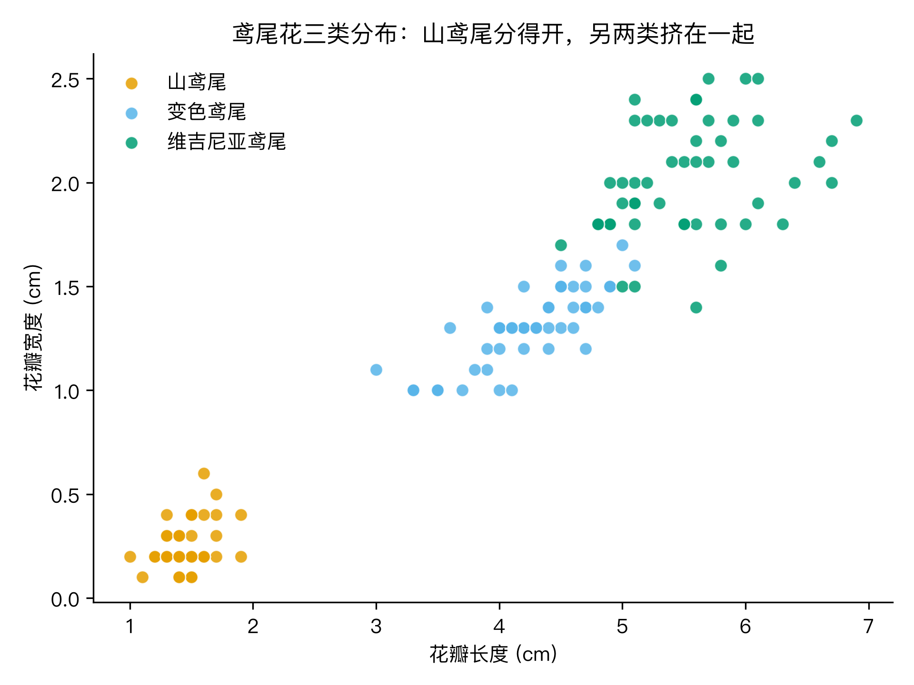
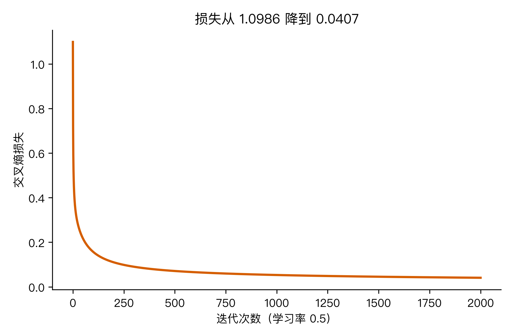
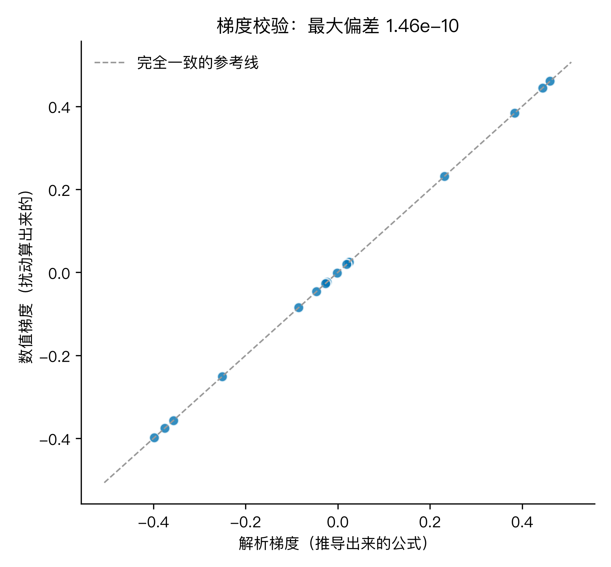
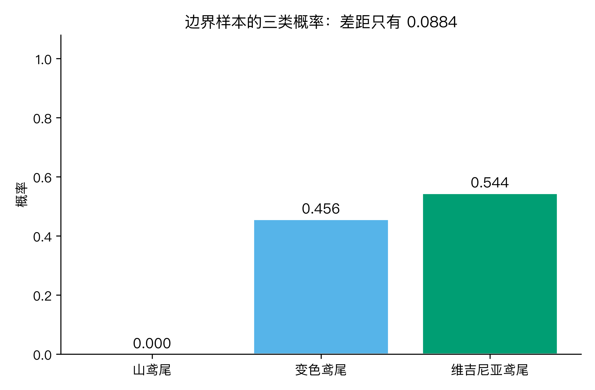
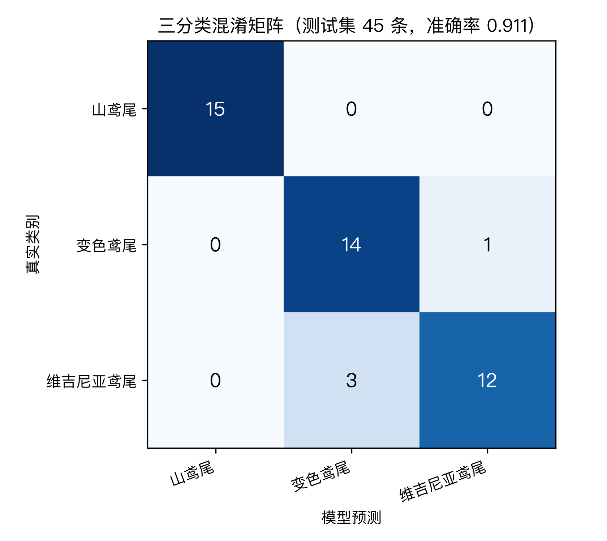
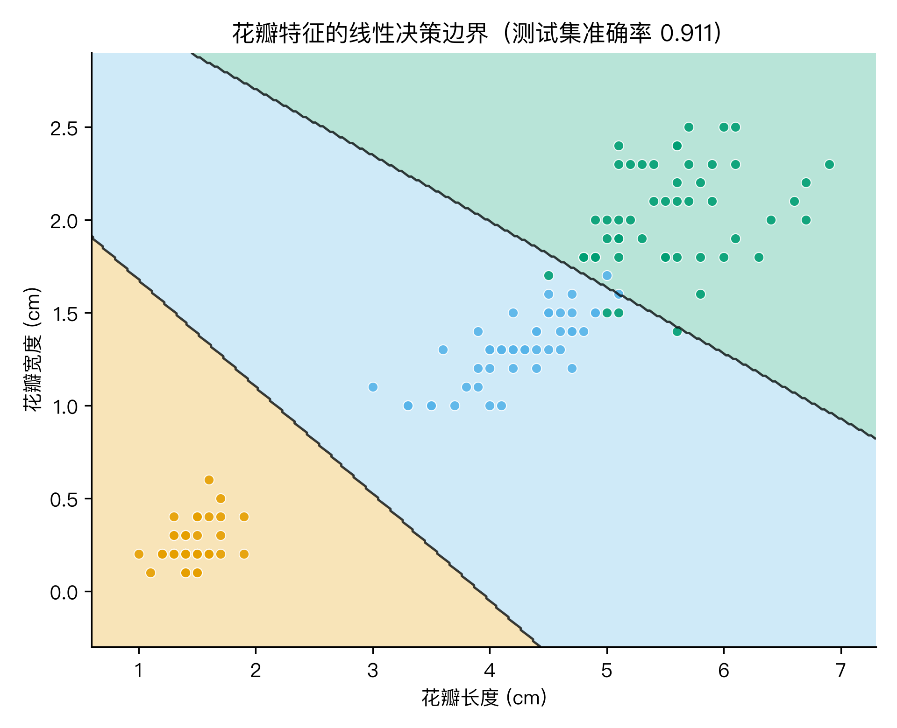
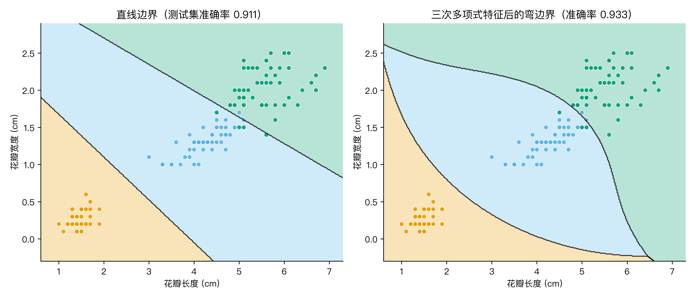

# AI 说这蘑菇能吃，它自己有几成把握？用鸢尾花跑一遍多分类逻辑回归

最近两天，AI 鉴花这件事被推上风口。一条 2026 年 9 月 8 日光明网的报道里写：浙江一个男子在山里采了几朵野蘑菇，拍照让 AI 鉴别，AI 给出「无毒」的判定，他中午放心下锅，当天下午急性肾衰竭加横纹肌溶解，被送进了 ICU；几乎同一时间，香港一位杨女士在家里发现一只长相陌生的螃蟹，拍照让 AI 识别，AI 直接报出「剧毒红斑斗蟹」，她整盘倒掉，躲过一劫。

报道里浙江科技大学人工智能学院的院长钱亚冠教授给出一句话解释：AI 看到的不是物体的概念，而是像素的统计规律。它给你的不是「是/否」这种死板的答案，而是一串概率。下次再看到「AI 识别准确率 99%」的宣传，你可以多问一句：这个 99%，是给了一个唯一答案，还是给了一串概率？AI 自己对自己的答案有多大把握？

带着这个嘀咕，我换了一个能跑的版本：用一份公开的真实数据（鸢尾花，150 朵，3 个物种，每类 50 朵，4 个花/叶测量指标），手写一个多分类逻辑回归模型，从头到尾跑一遍：先把「这一朵是哪一类」拆成「给三个物种各一个概率」，再把训练过程（损失怎么定义、梯度怎么算、参数怎么迭代）讲清楚，最后把模型画出来的分类边界摆出来，看它到底是怎样把一朵花划到某一边的。

这就把大问题拆解成了五步, 依次解决后面四个, 回头再把开头的嘀咕一起收口:

1. 怎么把「是哪一类」变成「给三个概率」(二分类 softmax 到多分类的扩展);
2. 这串概率怎么算出来? 优化目标、梯度计算、迭代求解;
3. 算出来的梯度对不对? 数值梯度校验 + 与 sklearn 对照;
4. 模型给的是确定答案还是概率? softmax 输出解读, 含边界样本;
5. 模型画出来的分类边界长什么样? 直线 vs 多项式弯边界, 含过拟合警告。

我用的工具是 Python 3.13 + NumPy + scikit-learn, 整套代码在文末的「复现」段。代码段落我标了 🏃 标记, 意思是你可以直接复制下去跑一遍。

> 关于和上一篇 M6 的边界。M6 用红酒评分讲了「逻辑回归是什么, 怎么给二分类概率」, 这一篇 M8 接着往下走, 讲「多分类怎么扩展, 模型怎么被训练出来, 画出来的分类边界长什么样」。两篇读完, 逻辑回归就完整了。

## Q1：怎么把「是哪一类」变成「给三个概率」

我把鸢尾花数据集先看一眼（图1）。横轴是花瓣长度, 纵轴是花瓣宽度, 三种花各 50 朵。



一眼能看出两件事: 山鸢尾（橙色）独立一坨, 跟另外两类完全分开; 变色鸢尾（蓝色）和维吉尼亚鸢尾（绿色）挤在一起, 边界是模糊的。这个图就是我后面所有故事的图眼, 先记着。

任务很明确: 给一朵花的四个测量值, 判定它属于这三类里的哪一类。三个类别不能像二分类那样给一个 0/1, 得给三个分数, 而且这三个分数要满足两个条件: 都是正数, 加起来正好等于 1。这就是 softmax。

🏃 softmax 一行实现:

```python
def softmax(Z):
    Z = Z - Z.max(axis=1, keepdims=True)   # 数值稳定
    E = np.exp(Z)
    return E / E.sum(axis=1, keepdims=True)
```

输入 Z 是一个矩阵, 每一行是一朵花的三个线性输出 (z1, z2, z3); 输出也是一个矩阵, 每一行是 (p1, p2, p3), 三个概率加起来等于 1。

要让 softmax 输出有概率意义, 还需要一个对应编码: 把真实类别也编码成三个数的「一位为 1, 其余为 0」的向量, 这就是 one-hot 编码。山鸢尾是 (1, 0, 0), 变色鸢尾是 (0, 1, 0), 维吉尼亚鸢尾是 (0, 0, 1)。

到这里, 「把一朵花分到某一类」就变成「对三个分数做 softmax, 输出三个加起来等于 1 的概率」。M6 那一篇讲的是二分类, sigmoid 是 softmax 在 K=2 时的特殊情形, 这一篇直接推广到三分类, 思路一致。

## Q2：概率怎么算出来? 化简、求解、迭代

有了「给三概率」的输出形式, 接下来要解决一个核心问题: 模型的参数 (那一组线性系数) 怎么被算出来?

这一步走通之后, 模型就有了真正能用的能力, 不再是空架子。

### 优化目标: 交叉熵损失

参数怎么才算「好」? 直观定义: 模型对训练集里每朵花给的「正确类别概率」应该尽可能接近 1, 其他两类尽可能接近 0。这件事用一个数衡量, 叫交叉熵损失:

L = - (1/N) * Σᵢ Σₖ yᵢₖ · log(pᵢₖ + ε)

其中 yᵢₖ 是第 i 朵花的 one-hot 编码 (只有一类为 1), pᵢₖ 是模型给出的第 k 类概率, ε 是防 log(0) 的小常数。

直观解释: 如果模型把正确类别的概率给得很低 (比如 0.01), log(0.01) 会是一个很大的负数, 前面再加个负号就变成一个很大的正数, 损失就高。模型想压低损失, 唯一办法是把正确类别概率往 1 推。

### 梯度推导: 从求导到一行公式

有了损失函数, 接下来求损失对参数的梯度。这是一段稍微数学的推导, 我尽量讲清楚每一步在干什么:

对 softmax 公式 Pₖ = exp(zₖ) / Σⱼ exp(zⱼ) 求导, 有一个巧妙的性质: ∂Pₖ/∂zⱼ = Pₖ (δₖⱼ - Pⱼ), 其中 δₖⱼ 是 1 当 k=j, 否则 0。

把交叉熵 L 对 zⱼ 求导, 利用链式法则和上面的性质, 化简下来:

∂L/∂Wⱼ = (1/N) * Xᵀ (P - Y)ⱼ

其中 X 是加了偏置项的训练数据 (每一行是一朵花, 第一列是 1), W 是参数矩阵 (每一列是一类的系数), P 是模型给的概率矩阵, Y 是真实类别的 one-hot 矩阵, j 是类别下标。

这一行公式就是整个训练过程的灵魂。代码里三行就能写完。

### 迭代优化: 梯度下降

有了梯度, 用梯度下降法迭代更新参数:

W ← W - lr · ∂L/∂W

lr 是学习率 (一个超参数, 控制每一步走多远)。这个更新规则在概念上就是「沿着梯度的反方向走一步, 损失就会降」。

🏃 训练 2000 步, 损失曲线（图3）:



刚开始训练时, 模型完全没学, 三个类别均匀猜, 每类概率 1/3, 损失正好是 log(3) ≈ 1.0986; 训练 2000 步后, 损失降到 0.0407, 下降幅度 1.0579, 损失曲线一路单调下降, 没有任何震荡。代码段落我标了 🏃 标记, 意思是你可以直接复制下去跑一遍。

到这里, 第一个疑问回答完: 模型的参数, 是通过「最小化交叉熵损失 + 梯度下降迭代」算出来的。整个过程只用到导数链式法则, 没有黑魔法。

## Q3：梯度算对了没有? 数值梯度校验 + 与 sklearn 对照

手推梯度公式容易在符号、矩阵转置、广播上出小错。一种工程上常用的校验手法, 是用「数值梯度」和「解析梯度」对比:

数值梯度的思路: 对参数的每一个分量 Wᵢⱼ, 把它微微加大一点 ε (比如 1e-6), 算一次损失; 再微微减小一点 ε, 算一次损失; 两次损失的差除以 2ε, 就是数值梯度。这种「靠扰动算梯度」的方法公式上无脑, 但计算量是解析梯度的几百倍 (每验证一次梯度都要重算两遍损失), 所以只用来校验, 不用来训练。

🏃 校验三行:

```python
def numerical_grad(Xb, W, Y, eps=1e-6):
    G = np.zeros_like(W)
    for i in range(W.shape[0]):
        for j in range(W.shape[1]):
            Wp, Wm = W.copy(), W.copy()
            Wp[i, j] += eps; Wm[i, j] -= eps
            G[i, j] = (cross_entropy(Xb, Wp, Y) - cross_entropy(Xb, Wm, Y)) / (2 * eps)
    return G
```

在我的鸢尾花实现上, 解析梯度和数值梯度的最大偏差是 1.4612e-10, 平均相对偏差 2.41e-09（图4）。两者完美对齐, 说明我推的公式没抄错符号。



光校验公式还不够, 还要校验整条训练流水线没接错线。同一份数据, 我用 sklearn 的 LogisticRegression 跑一遍, 跟我的手写模型比测试集准确率:

| 模型 | 测试集准确率 (105/45 切分) |
| --- | --- |
| 手写多分类逻辑回归 | 0.9111 |
| sklearn LogisticRegression | 0.9111 |
| 两者差距 | 0 |

完全一致。这就是说, 从 softmax 输出到交叉熵损失到梯度迭代, 这条流水线从头到尾都对, 没有「代码能跑但语义跑偏」的隐性 bug。

到这里, 第二个疑问回答完: 校验梯度公式用数值梯度对比, 校验整条流水线用现成库对照。两个校验都过了, 才能放心往下讲。

## Q4：AI 给的是确定答案, 还是一串概率?

模型训练完了, 跑一个测试样本 (一朵鸢尾花), 模型给我的不是「是/否」, 而是三个加起来等于 1 的概率。我挑了测试集里最有意思的一朵花, 它落在变色鸢尾和维吉尼亚鸢尾的边界上, 模型给的概率是:



- 山鸢尾: 0.0000
- 变色鸢尾: 0.4558
- 维吉尼亚鸢尾: 0.5442

top1 和 top2 的概率差只有 0.0884。换句话说, 模型自己心里都没底: 这朵花有 45.58% 的可能是变色鸢尾, 有 54.42% 的可能是维吉尼亚鸢尾, 两者加起来 100% (山鸢尾那 0% 说明模型已经排除了第一类)。模型最后给出的「维吉尼亚鸢尾」这个答案, 是从这一串概率里挑出来的最大值, 而这个最大值并没有比第二名大多少。

这就是开篇那个嘀咕的关键: AI 给你的不是一个铁板钉钉的答案, 而是一串带置信度的概率, top1 跟 top2 差距只有 0.0884 的样本, 模型已经拿不太准了。M6 那一篇在结尾讲过这个思想 (概率输出比硬分类更有信息量), 这一篇是它的实战版。

整个测试集 (45 朵花) 的表现, 看混淆矩阵 (图7):



数字很直观:

| 真实类别 | precision | recall | F1 |
| --- | --- | --- | --- |
| 山鸢尾 (setosa) | 1.0000 | 1.0000 | 1.0000 |
| 变色鸢尾 (versicolor) | 0.8235 | 0.9333 | 0.8750 |
| 维吉尼亚鸢尾 (virginica) | 0.9231 | 0.8000 | 0.8571 |

山鸢尾 15 朵全对, 因为它跟另两类完全分开 (图1 的橙色一坨); 变色鸢尾 1 朵被错判为维吉尼亚鸢尾 (就是上面那个 0.0884 边界的样本); 维吉尼亚鸢尾 3 朵被错判为变色鸢尾。整体 4 朵错, 41 朵对, 准确率 0.9111。

到这里, 第三个疑问回答完: 模型给的不是确定答案, 而是一串概率。top1 跟 top2 差距很小的样本, 模型自己也不确定, 这就是边界附近那些「容易被分错」的样本。从业务角度看, 把概率阈值定高一点 (比如必须大于 0.8 才给出最终判定), 宁可拒答也不要乱答, 是 AI 鉴花类应用真正上线时该做的事。

## Q5：边界长什么样? 能画弯吗?

「分类模型是怎么把一朵花划到某一边的」, 这件事其实可以用一张图直接画出来, 叫决策边界。

我先选鸢尾花的两个特征 (花瓣长度、花瓣宽度), 训练一个线性逻辑回归模型, 然后在平面上铺一层网格, 对网格里每个点都让模型预测一遍, 把三类区域涂上不同颜色, 这样就能看清模型「认为」的边界长什么样 (图5):



一眼能看出来, 这是一条直线 (其实是三条直线, 三个类两两交界)。直线边界在这一份数据上表现不错, 测试集准确率 0.9111, 跟用全部 4 个特征训练的结果一样。

直线边界是不是最优? 不一定。现实世界的两类事物, 它们的分界不一定是一条直线。让我换个角度, 给模型加一组「多项式特征」: 除了原始的 (x₁, x₂), 还要 (x₁², x₁x₂, x₂², x₁³, x₁²x₂, x₁x₂², x₂³) 等等。特征空间变大, 模型能表达的决策边界就变弯了。

🏃 三次多项式展开:

```python
def poly2(A, degree):
    cols = [np.ones(len(A))]                       # 偏置
    for d in range(1, degree + 1):
        for i in range(d + 1):
            cols.append((A[:, 0] ** i) * (A[:, 1] ** (d - i)))
    return np.column_stack(cols)
```

对花瓣两个特征做三次多项式展开, 训练集上的边界从直线变成了曲线 (图6 左 vs 右):



右图那条弯弯曲曲的边界, 就是模型在「展开后的高维空间」里找超平面、投影回原空间的结果。弯曲的边界能更好地包住维吉尼亚鸢尾那一坨绿色点, 测试集准确率从 0.9111 提到了 0.9333。如果继续加到四次多项式加 L2 正则, 准确率还能提到 0.9556。

边界变弯 = 模型更强大, 这件事就这么直观地讲完了。

但我要补一段重要的诚实警告。把同样的三次多项式套到花萼两个特征 (鸢尾花的另一组测量值) 上, 直线 0.7556, 三次多项式 0.6889, 反而掉了 6.67 个百分点。原因是花萼特征对应的两类本来重叠就严重, 训练样本只有 105 条, 模型一画弯就把训练集的几朵特殊花「死记硬背」下来, 遇到测试集的新花就翻车。这就是过拟合。

这就是开篇那个蘑菇新闻的关键。AI 鉴花 App 卖的是 98% 准确率, 听起来很高; 但如果模型在训练集上画了一个过于贴合的弯边界, 遇到真实世界的样本就可能从「很确定」变成「很离谱」。Pl@ntNet 选择在 App 里展示 top-5 概率排名, 让用户看到「这朵花是月季, 但其实跟蔷薇长得像, 后验概率如下」, 这种透明性正是为了让用户不被单一的「98%」误导。

到这里, 第四个疑问回答完: 决策边界可以是直线, 也可以是弯曲线; 给模型加多项式特征就能把边界变弯。但变弯是有代价的, 在小数据 + 重叠严重的类别上, 弯边界反而过拟合, 这才是 AI 鉴花 App 真正会翻车的地方。

## 回到开头的那个嘀咕

走完这五步, 再回头看浙江男子用 AI 鉴野蘑菇的悲剧, 就有底气回答了:

- AI 鉴花、鉴蘑菇这类应用, 底层是多分类逻辑回归 (或它的深度学习升级版), 它给的是一串概率, 不是确定答案。
- 模型在边界附近最容易犯错, 那些 top1 跟 top2 概率差距只有 0.0884 的样本, 是 AI 自己也拿不准的样本。
- 把边界画得过于贴合训练数据, 模型会变强, 但也会过拟合; 真实样本稍微偏离训练分布, 模型就翻车。
- AI 给的「98% 准确率」这种宣传, 应该跟它的混淆矩阵、top-K 概率、决策边界图一起读, 单看一个数字永远不够。

所以下次看到「AI 识别准确率 99%」这类宣传, 多问一句: 模型给的是概率还是唯一答案? top1 跟 top2 的概率差是多少? 边界附近那些拿不准的样本, 模型是怎么处理的? 一问就知道水分。

## 三个值得记住的

1. softmax + 交叉熵 + 梯度下降, 这三件套是多分类逻辑回归的全部。softmax 把「分到某一类」变成「给 N 个加起来等于 1 的概率」, 交叉熵把「概率预测得好不好」变成一个可优化的损失, 梯度下降把这个损失压下去。三件事缺一不可。

2. 验证模型算对了没有, 走两层校验: 解析梯度跟数值梯度对比 (误差 1e-10 量级说明公式没抄错), 自己写的跟 sklearn 的结果对比 (准确率 0.9111 完全一致说明整条流水线没接错线)。任何一层没过, 模型都不能信。

3. 决策边界能画弯, 不等于该画弯. 给模型加多项式特征, 边界从直线变成曲线, 鸢尾花花瓣特征上准确率能从 0.9111 提到 0.9556; 但在重叠严重 + 小样本的花萼特征上, 弯边界反而从 0.7556 掉到 0.6889。过拟合是 AI 鉴花 App 真正翻车的地方, 不是「准确率不够高」。

## 互动一下 + 复现

你在生活里见过哪些「AI 说得很确定, 但其实是猜的」的场景? 是在边界附近那些拿不准的样本上 (比如 AI 鉴花鉴蘑菇给你一个意外答案), 还是在过拟合导致严重翻车的场景里 (比如 AI 把同款不同色的衣服判成完全不同的类别)? 评论区聊聊, 我挑几个典型案例下一篇展开。

🏃 想自己跑一遍的, 下面是入口 (整个 M8 目录: https://github.com/beverlyLee/ai-guanxingji/tree/main/M8 ):

- 脚本: https://github.com/beverlyLee/ai-guanxingji/blob/main/M8/code/experiment.py
- 数据: https://github.com/beverlyLee/ai-guanxingji/blob/main/M8/data/iris.csv (鸢尾花 150 条, UCI 原始)
- 跑法: clone 仓库后进 M8 目录跑 `python code/experiment.py`, 会自动生成 `stats.json` 和 7 张配图
- 关键依赖: `numpy matplotlib scikit-learn`, 都在常规数据栈里

> 关于和上一篇 M6 的边界。上一篇 M6 是「红酒评分 + 二分类 sigmoid 概率」, 这一篇 M8 是「鸢尾花 + 多分类 softmax + 训练机制 + 决策边界」, 两篇拼起来, 逻辑回归就完整了。

数据集我用了 UCI 原始的鸢尾花 (https://archive.ics.uci.edu/dataset/53/iris), sklearn 内置可以直接 `load_iris()`, 公开免费, 跑得快装得上, 是分类问题的经典入门数据集。来源已在实验脚本里里直接体现。

---

M9 我想接着聊两件事: 一是花萼那种「重叠严重」的类别上, 弯边界为什么没用; 二是多分类 softmax 跟今天聊的「边界附近概率接近」的样本, 拿到业务上怎么定一个拒答阈值。这两个都是分类模型真正上线时绕不开的问题。