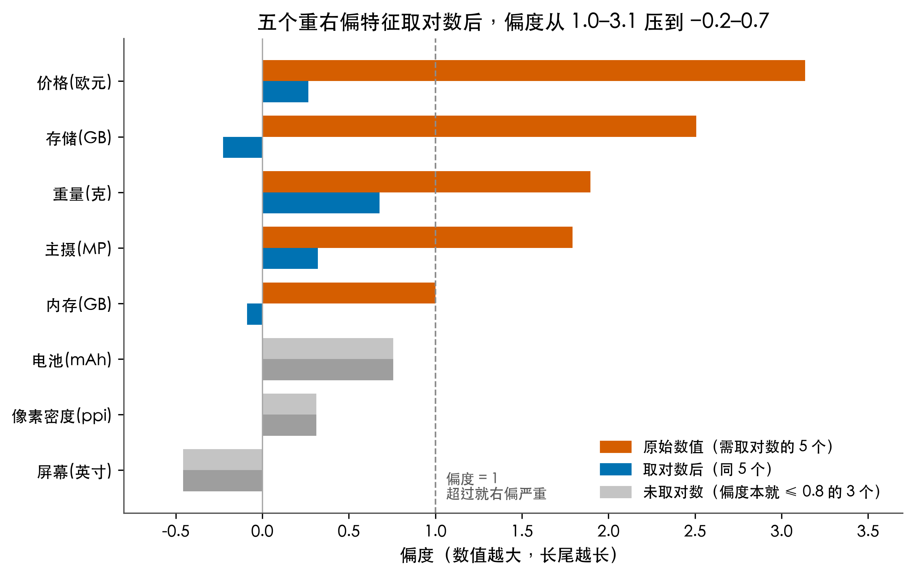
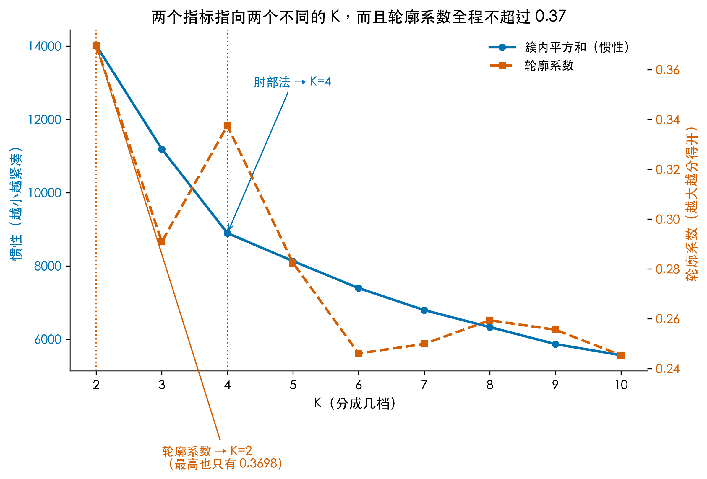
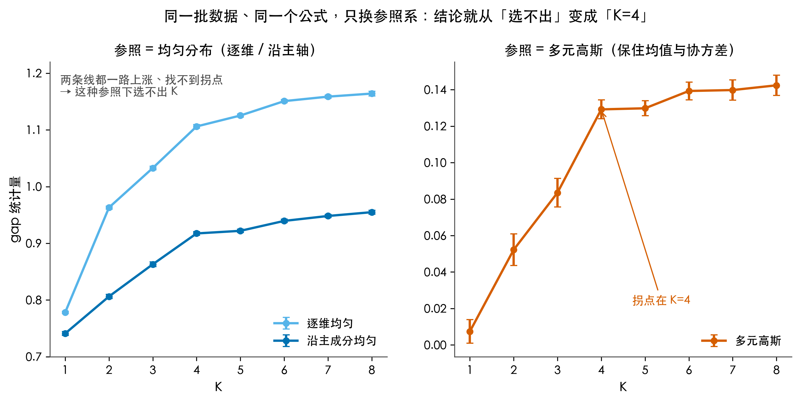
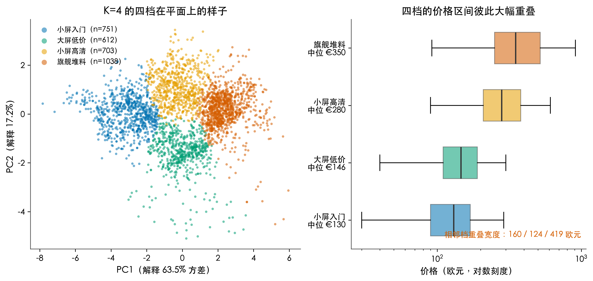
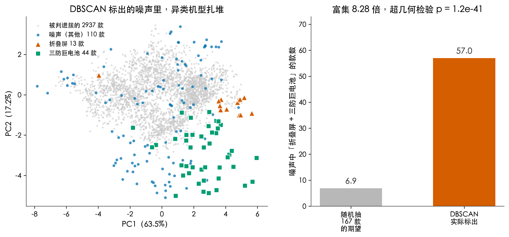

# 苹果刚发布 iPhone Duo，可 3104 款手机一聚类，参数分了档，价格却不认

苹果前两天发布了 iPhone Duo，它家第一款折叠屏，一万六起步。折叠屏看着像手机里的异类，这让我好奇一件事：抛开品牌和价格标签，单看参数，几千款手机到底能不能自己聚成几档？

参数页上一款是 6.1 英寸屏、8GB 内存、4500mAh 电池、5000 万像素主摄，往下翻十款数字长得几乎一样，可价格从 1299 挂到 6299，差出五倍。于是问题来了：参数分出来的档，和价格分出来的档，是同一回事吗？

这问题听着像厂商定义好的，千元机、中端机、旗舰机，渠道里天天这么叫。但那是人的说法。我把标签全部拿掉，只给算法一堆机型参数，看它会不会把同一批手机归成同样几堆。这正是无监督学习要回答的事。

我拿 3104 款真机规格做了一遍，用了 KMeans 和 DBSCAN 两个算法。过程里踩了几个坑，也翻出一个没料到的结果：参数确实能聚出四档，可价格却不太认这四档。

## 数据从哪来，以及为什么它一开始不能用

数据来自 GSMArena 的公开快照，一个公开数据集仓库里存的完整抓取结果，11936 行、50 个字段，覆盖到 2022 年。字段包括品牌、型号、发布年份、屏幕尺寸、重量、电池容量、内存、存储、主摄像素、像素密度、价格等。

原始文件读进来第一眼就不对劲。品牌字段里混着换行和统计尾巴，像这样：

```
Samsung\n1348 devices
```

价格字段是一句话，不是数字：

```
About 200 EUR
```

我第一版解析脚本用找欧元符号的办法抽数字，跑完发现有九成价格是空的。原因很朴素，九成记录写的是 `About 200 EUR` 这种文字形式，压根没有 € 符号。改成先用正则抓数字、再按币种换算，价格覆盖率才从 5.7% 拉到 66.8%。

还有一类混进来的东西：平板。iPad mini 7.9 英寸、Galaxy Tab Active3 重 426 克，这些是平板不是手机，混在样本里会把「大屏」这一档整个带偏。我按屏幕上限和重量上限把它们剔掉。

清完剩 3104 款（2015 到 2022 年发布），八个数值特征零缺失：价格、屏幕、重量、电池、像素密度、存储、内存、主摄。

这八个特征不能直接扔进算法，得先做两件事。

第一件是取对数。价格、存储、内存的偏度分别是 3.14、2.51、1.00。偏度衡量分布往一边拖多长，数值越大长尾越长，价格偏度 3.14 意味着绝大多数手机挤在便宜那端，少数旗舰拖出极长的尾巴。

这条尾巴对聚类是坏事。KMeans 靠距离算远近，一台 2300 欧元的折叠屏混在一堆 200 欧元的机器里，会把距离尺度整个撑开，几千台便宜机器之间的差异被压成一条线。

取对数把乘法关系压成加法关系，长尾收回来。那五个重右偏特征的偏度从 1.0 到 3.1 落到了负 0.2 到 0.7。



第二件是标准化。价格是欧元，电池是毫安时，量级差着好几个数量级，谁数值大谁就在距离里说话，聚类会退化成按电池容量分堆。做法是每个特征减去均值再除以标准差：

```
z = (x − μ) / σ
```

这样八个特征在距离里等权。

## 第一个问题：KMeans 到底在干什么

KMeans 的思路简单到可以手画。

先在坐标里随手插 K 面小旗，每面旗代表一个中心。把每个点连到离它最近的那面旗，就算归它管。接着每面旗挪到自己管辖那群点的正中间，再回头重新连一次。插旗、连线、移旗，循环到旗不再动。


有个细节容易被忽略：K 是你自己给的。你给它 4，它就交给你 4 堆，哪怕这批数据根本没有 4 堆的天然结构。「该分几档」这个问题，KMeans 自己不回答。

🏃 这一步的全部代码在 `code/experiment.py`，从载入数据到打印结果可以直接跑：

```bash
python code/prepare_data.py
python code/experiment.py
```

## 第二个问题：K 取几，两个常识方法打了起来

判断该分几档，教科书里有两条最常用的路。


一条看惯性，也就是每个点到它所属中心的距离平方和。K 越大中心越多，惯性只会越来越小。但它有个拐点：前几档每加一个 K 都能让惯性掉一大截，加过某个位置后，再多的 K 也换不来多少紧凑度改善。下降率明显放缓的那一点就是要的 K。这叫肘部法，曲线拐起来像手肘。

另一条看轮廓系数。对每个点算两个量：它到自己那堆其他点的平均距离 a，到最近那堆点的平均距离 b。定义为：

```
s = (b − a) / max(a, b)
```

值在负 1 到 1 之间。接近 1 说明离自己人近、离外人远，分得干脆；接近 0 说明它站在两堆交界上；负数说明分错了堆。所有点的平均值越大，这一档越好。

两条路在这批数据上给出了两个不同的答案。



肘部法指到 K=4。轮廓系数最高的是 K=2，值 0.3698。

照理说选轮廓系数最高的就行。但那个 0.37 值得停下来看一眼。轮廓系数的常规判断标准里，0.5 以上算结构清晰，0.25 到 0.5 只能算结构偏弱，低于 0.25 基本可以认为没分出来。0.37 落在「偏弱」这一档，而且这是在十几个 K 里挑出来的最大值，其他 K 更低，K=10 的时候甚至是负的。

这个数字本身就在说一件事：这批手机参数里，没有特别干净的分档边界。人说的千元机、旗舰机之间是有断层的，但断层是市场策略造出来的，不是参数空间里的天然鸿沟。

到这里我没有马上接受这个结论。有可能是我的预处理做坏了，把结构洗掉了。得先证伪自己。

## 第三个问题：拿参照系去逼问数据

要严谨地回答「到底有没有天然档位」，得换一种思路。不能只看「分完有多紧凑」，得问「分完比不分紧凑多少」。

gap 统计量的逻辑是：把真实数据的簇内紧凑度，和同样大小的随机数据比。如果真实数据分完并不比随机数据更紧凑，那这个结构在噪声里也能凑出来，不值得当回事。

做法是：对每个 K，算真实数据的簇内距离和 W_k，再生成 B 组参照数据各算一遍 W 取平均，两者相减：

```
Gap(K) = E[log W_k*] − log W_k
```

gap 越大，越有资格叫结构。选 K 的规则是找最小的 K，使后一档的 gap 减它已不超过随机波动范围。如果 K=1 就满足，等于说「不聚类也一样」，那就说明数据没有结构。

关键在于「随机数据」怎么造。这一造，结论就分岔了。



三种参照系，三种答案。

用逐维均匀分布当参照，gap 从 K=1 开始一路上涨到 K=8，全程找不到拐点，这条规则失效，选不出 K。

换成沿主成分的均匀分布，结果一样，还是单调上升，选不出。

换成多元高斯，也就是保住原数据的均值和协方差的那种参照，拐点出现了，在 K=4。

前两种参照失败的原因在于它们把真实数据「本来就更紧凑」误算成了结构。真实手机参数不是八个独立维度上均匀撒开的点，它们是高度相关的：屏幕大的往往重、贵的往往内存大。这种相关性本身就压缩了点云体积，均匀参照不理解这一点，于是任何 K 都比均匀分布紧凑，gap 就一路虚高了。

多元高斯参照保住了均值和协方差，也就保住了这团相关云的形状，对比才公平。

所以这个实验的结论不是「K=4」这么简单。真正的结论是：这批数据的自然档位数量，取决于你用什么参照系提问。均匀参照下它根本不承认有档位，高斯参照下它给出 4。同一批数据，同一个公式，差别只在你认为「随机」应该长什么样。

我把这件事在四种预处理组合里又各跑了一遍，轮廓系数峰值始终落在 K=2 到 K=5 之间，没有任何一种预处理能把它推到 0.5 以上。结构偏弱这个判断，换几种清洗方式都不翻。

## 第四个问题：那四档长什么样，价格认不认

既然高斯参照和肘部法都指向 4，就按 K=4 分，看看这四堆到底是什么货色。

下面是四档的画像，数值都是各档的中位数。

| 档位 | 机型数 | 价格(€) | 屏幕(in) | 重量(g) | 电池(mAh) | 内存(GB) | 存储(GB) | 主摄(MP) | ppi | OLED 占比 | 5G 占比 |
| --- | --- | --- | --- | --- | --- | --- | --- | --- | --- | --- | --- |
| 小屏入门 | 751 | 130 | 5.13 | 149 | 2611 | 1.83 | 20 | 9.6 | 270 | 6% | 0% |
| 大屏低价 | 612 | 146 | 6.42 | 203 | 4726 | 4.03 | 77 | 19.3 | 275 | 3% | 7% |
| 小屏高清 | 703 | 280 | 5.70 | 167 | 3331 | 4.41 | 87 | 14.8 | 429 | 34% | 4% |
| 旗舰堆料 | 1038 | 350 | 6.59 | 199 | 4615 | 9.11 | 261 | 55.2 | 407 | 65% | 63% |

四堆的性格其实挺好认。

小屏入门是小而轻的便宜货，屏幕 5.13 英寸、149 克，内存不到 2GB、存储 20GB，几乎全是 LCD 屏，一个 5G 都没有。

大屏低价是另一路，屏幕拉到 6.42 英寸、电池 4726mAh，看着像大屏机，但内存 4GB、存储 77GB，价格还是 146 欧元。这一档存在的意义是「把屏幕和电池做大」这条最容易被消费者感知的产品线，厂商靠它走量。

小屏高清是四档里最有意思的一堆。屏幕只有 5.7 英寸，比大屏低价那档还小，但像素密度 429ppi，是四档里最高的。价格 280 欧元，中间档。这一档是小屏高分辨率机型，索尼、早期三星的紧凑旗舰都落在这里。

旗舰堆料不用多说，内存 9GB、存储 261GB、主摄 55MP、5G 占比 63%、OLED 占比 65%，价格中位 350 欧元。

注意最后一档的价格中位数只有 350 欧元。这是 2015 到 2022 年的均价，那几年旗舰起售价还没涨到今天的水平，早期旗舰被大量便宜机型拉下来，样本里中位数就是这个数。



现在回答标题里的那一半问题：价格认不认这四档。

左边那张图把 3104 款机型投影到前两个主成分上，四个颜色是四档，肉眼能看到簇，但边界是糊的，颜色之间大片交叠。

右边是四档的价格箱线图，答案更直接：四档的价格区间大幅重叠。

我算了一下相邻两档的重叠宽度。小屏入门和大屏低价之间重叠 160 欧元，大屏低价和小屏高清之间重叠 125 欧元，小屏高清和旗舰堆料之间重叠 419 欧元。第三组最夸张，小屏高清那档的 95 分位价格是 589 欧元，而旗舰堆料档的 5 分位价格只要 170 欧元。也就是说，有一批「小屏高清」比一批「旗舰堆料」还贵。

四档的价格中位数是 130、146、280、350 欧元，看着在往上走，但每一档内部的离散程度都盖过了档与档之间的差距。

所以参数聚类分出来的四堆，不是价格的四档。规格和价格之间是相关关系，不是分层关系。同样花 300 欧元，你可能买到一台小屏高分辨率机，也可能买到一台大屏大电池机，还可能是上一代旗舰。算法把它们按参数分到了不同的堆里，但价格没有跟着分开。

## 第五个问题：谁在破坏规矩

刚才的 KMeans 有个前提，就是把每个点都塞进某一堆，它不接受「这个点谁也不像」。如果你把 K 定成 4，它就会把 3104 款机型全都分进 4 个堆，哪怕某些机器本身就不属于任何一档。

这就漏掉了一类东西：真正的异类。

要揪出它们，换一个算法。DBSCAN 不管你要分几堆，它只认一件事：一个点周围有多密。

规则是：某个点周围一定半径内至少有 m 个邻居，它算核心点，从它出发把所有密度可达的点连成一片，就是一堆。邻居不够但落在某个核心点半径里的，算边界点，跟着进那堆。两边都不沾的算噪声，扔掉。


DBSCAN 有两个参数：半径 eps，和核心点要求的邻居数 min_samples。eps 用 k-距离曲线来找，把每个点到它第 m 个近邻的距离排序画出来，曲线会先平缓后陡峭，膝盖那个位置就是合适的 eps。

这里有个坑我必须交代。我一开始直接在八维标准化空间里做 DBSCAN，结果 70.4% 的点被判成了噪声，2186 款手机被打成异类，这显然不对。

原因是维度稀释了密度。维度一高，点与点的平均距离被拉大，同样半径内的邻居数急剧减少，密度这个概念就失去判别力。这不是我的实现问题，是 DBSCAN 在高维的固有毛病。

所以我把数据先降到前三个主成分再跑。前三个主成分累计解释 87% 的方差，密度在三维里还有意义。三个主成分还做了白化，也就是除以各自标准差让它们等权，否则第一主成分占 63.5% 的方差，距离会被一个方向主导。

跑完的结果是 4 个簇、167 个噪声点，占 5.4%。

八个空间组合我扫了一遍，四种空间、各自参数下的噪声率都稳定在 5% 附近，说明结论对参数不敏感。



真正让我意外的是这 167 个噪声点里面装了什么。

我在建模前标记了两类特殊机型：折叠屏，和主打三防超长续航的巨电池机。前者屏幕 7.3 到 8 英寸、重量 255 到 317 克，后者电池 10000 到 12000mAh、重量 340 到 405 克。这两类在普通手机里天然离群。

被标成噪声的 167 款里，折叠屏占了 13 款，而样本里折叠屏总共只有 27 款。三防巨电池机占了 44 款，样本里总共 101 款。两类加起来 57 款，占了全部噪声的三分之一。

这不是巧合。如果随机抽 167 款手机，按这两类在样本里的占比，期望只能命中 6.9 款。实际命中 57 款，富集 8.28 倍。用超几何检验算一下这个偏离有多罕见，p 值是 1.2 乘 10 的负 41 次方。

超几何检验问的是：不放回抽 n 个样品，抽出 k 个指定类别的概率有多大。这里就是问「随机抽 167 款、抽出 57 款异类机型」的概率。小到可以忽略，所以噪声和异类不是巧合。

换其他几种空间设定再跑，富集倍数在 6.7 到 9.6 倍之间，超几何检验的 p 值都在 10 的负 28 次方以下。结论稳得住。

翻一下噪声里最贵的几款，华为 Mate X2 标价 2300 欧元、Mate X 2150 欧元、Mate Xs 1950 欧元、三星 Galaxy Fold 1750 欧元。全是折叠屏，一个不落。

这里就出现了 KMeans 和 DBSCAN 的关键差别。折叠屏在 KMeans 里被强行塞进了四个档之一，它的 8 英寸屏幕会被平均掉，占的权重和一台 6 英寸机一样，它独特的地方被稀释。而 DBSCAN 直接说「这个点周围不够密，它不算数」。同一个东西，一个算法把它抹平，另一个算法把它单独拎出来。


选哪种算法，取决于你要什么。要给人看的分档清单，KMeans 给你四堆齐整的东西。要找需要单独处理的对象，DBSCAN 会告诉你哪些机器根本不服从任何一条产品线。

## 三个干货点

第一，无监督学习里「该分几档」不是一个客观事实，而是一个依赖参照系的判断。同一批手机、同一个 gap 公式，用均匀分布当参照选不出 K，换成保住相关结构的高斯参照就得到 K=4。以后看到谁报出一个聚类数目，先问他的参照是什么、为什么这么选，这个数目才有意义。

第二，轮廓系数偏低的时候，别急着换算法。这批数据所有 K 下轮廓系数都不到 0.37，我一开始怀疑是预处理做坏了，在四种取对数与标准化组合里各跑一遍，峰值始终在 0.37 到 0.43 之间。结构弱是数据本身的性质，不是流程的失误。承认这一点比硬凑一个好数字有价值。

第三，DBSCAN 在高维空间会失效，这不是参数没调好，是密度概念在高维会退化。同一套 eps 和 min_samples，八维空间判出 70.4% 的噪声，降到三维是 5.4%。用 DBSCAN 之前先降维，而且降维后的主成分最好做白化，否则方差最大的那个方向会主导距离。

## 你可能也想问

我看到指标打架的那一刻是有点烦的，两个教科书方法给出两个答案，还都不理想。写这个实验最花时间的不是聚类本身，是去证伪「是不是我预处理做错了」这件事。最后发现数据就是没有强结构，反而踏实了。

你手头如果有别的规格数据，比如笔记本、相机、跑鞋，可以拿这份代码换个文件直接跑，看会不会也出现「指标打架 + 价格不认档」这套组合。如果有更干净的分档结构，欢迎告诉我怎么做的。

## 回到标题

回到开头那句话。苹果把 iPhone Duo 当成手机里的异类，一万六的折叠屏确实特殊。可当我把 3104 款手机的参数丢给算法，真正的结果不是「折叠屏是异类」这么简单。

参数确实能自己聚成四档。肘部法指 K=4，换成保住数据相关结构的多元高斯参照，gap 统计量也指向 K=4。这一档管屏幕大小，那一档管电池容量，机器按长相把自己分了堆。

但价格不认这四档。四档的中位价分别是 130、146、280、350 欧元，听着像台阶，可相邻两档的价格区间大幅重叠，重叠宽度有 160、125、419 欧。第三组最夸张，小屏高清档里贵的机器比旗舰档里便宜的机器还贵。也就是说，同一堆参数长相的手机，身价能差出好几倍。

所以标题那句话是这么来的。算法能替手机分档，分的是它长什么样；可它值多少钱是另一套逻辑，参数归的档解释不了。折叠屏被算法当成噪声，那是参数空间里的离群；而价格不认档，是商业世界里另一件算法算不出的事。

## 复现与数据来源

这篇里的每个数字和每张图都从代码跑出来，不是我拍脑袋定的。整套工程已经开源在 GitHub，目录在这里：https://github.com/beverlyLee/ai-guanxingji/tree/main/M9 。

复现只要四步，依赖写在 requirements.txt 里。

```bash
pip install -r requirements.txt
python code/prepare_data.py   # 清洗 → data/phone_clean.csv（3104 款，零缺失）
python code/experiment.py     # 聚类 → stats.json + data/phone_clustered.csv
python code/make_figures.py   # 出图 → figures/（5 张）
python code/qc_article.py     # 校验文章数字与 stats.json 是否一致
```

`prepare_data.py` 在本地找不到原始快照时会自动从公开仓库下载，不用任何凭证。

数据来自 GSMArena 的公开抓取快照（2023-01-04），原始仓库是 `AlbertHunduza/Smartphone-Project`，直链是 https://raw.githubusercontent.com/AlbertHunduza/Smartphone-Project/main/GSMArena.csv 。原始 11936 行 50 列，清洗后留下 3104 款（2015 到 2022，八个数值特征零缺失）。本仓库的 `data/gsmarena_raw.csv` 也存了一份同样的原始快照，断网也能跑。

所有带随机性的步骤都固定了种子（RNG = 42），从零重跑 stats.json 能逐字段对上。
